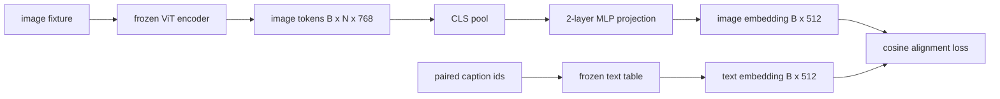

# मोडालिटी एलायनिंग के लिए प्रोजेक्शन लेयर

> एक दृष्टि एन्कोडर छवि टोकन उत्पन्न करता है। एक पाठ डिकोडर पाठ टोकन का उपभोग करता है। दोनों अलग-अलग वेक्टर स्थानों में रहते हैं। एक छोटी दो-परत MLP पाठ एम्बेडिंग स्थान में छवि टोकन का प्रक्षेपण करती है, और एक जोड़ी कैप्शन के खिलाफ एक कॉसिन संरेखण हानि दोनों स्थानों को समझौते में खींचती है। यह प्रक्षेपण एक दृष्टि-भाषा मॉडल का सबसे छोटा टुकड़ा है और स्थानांतरण के लिए सबसे महत्वपूर्ण है।

**Type:** Build
**Languages:** Python
**Prerequisites:** Phase 19 lessons 30-37 (Track B foundations)
**Time:** ~90 minutes

## सीखने के लक्ष्य

- दो-परत MLP प्रक्षेपण का निर्माण करें जो पाठ एम्बेडिंग स्थान में छवि सुविधाओं का नक्शा बनाता है।
- एक नकली पाठ एम्बेडिंग तालिका का निर्माण करें (कोई पूर्व प्रशिक्षित टोकनराइज़र, कोई वास्तविक कॉर्पस नहीं) ।
- अनुमानित छवि टोकन और एक जोड़ी कैप्शन एम्बेडिंग के बीच कॉसिन संरेखण हानि की गणना करें।
- एक जमे हुए दृष्टि एन्कोडर और एक जमे हुए पाठ तालिका के साथ अकेले प्रक्षेपण को प्रशिक्षित करें।

## समस्या

आपके पास एक दृष्टि एन्कोडर (पाठ 58-59) है जो आयाम के टोकन का उत्पादन करता है।`vision_hidden = 768`आप एक पाठ डिकोडर है आप एम्बेडिंग आयाम के साथ ऊपर bolt करना चाहते हैं`text_hidden = 512`(किसी अन्य संख्या भी समान रूप से व्यवहार्य है) डिकोडर पाठ के आकार के टोकन की उम्मीद करता है। छवि टोकन पाठ के आकार के नहीं हैंः वे एक आधार में रहते हैं जो केवल दृष्टि-पूर्व प्रशिक्षण के दौरान सीखा गया था, डिकोडर के शब्द वेक्टरों से कोई संबंध नहीं है।

दो-परत MLP प्रक्षेपण (रेखीय, GELU, रैखिक) अंतर को पुल बनाता है। यह काफी छोटा है (लगभग `768 * 1024 + 1024 * 512 = 1.3M`यह एक ही GPU पर मिनटों में प्रशिक्षित करने के लिए है, और यह एकमात्र टुकड़ा है जो संरेखण चरण के दौरान सीखना है। दृष्टि एन्कोडर जमे रहता है। पाठ एम्बेडिंग टेबल जमे रहता है। केवल प्रोजेक्शन चलता है। यह 2023 में भेजे गए LLaVA नुस्खा है, जिसे BLIP-2 ने Q-Former के रूप में रीफ्रेम किया है, और जो कि हर ओपन-वेट VLM ने तब से किसी न किसी रूप में अपनाया है।

## अवधारणा



### प्रक्षेपण से पहले पूलिंग

विजन एन्कोडर 197 टोकन उत्सर्जित करता है। पाठ पक्ष में एक एकल कैप्शन-स्तर एम्बेडिंग है। उन्हें संरेखित करने के लिए आपको प्रति नमूना एक छवि-स्तर वेक्टर की आवश्यकता होती है। CLS पूलिंग सबसे सरल हैः एन्कोडर से पहला टोकन लें और इसे प्रोजेक्ट करें। सभी 197 टोकन पर औसत पूलिंग एक और विकल्प है और यह वही है जो SigLIP उपयोग करता है। या तो 197 वेक्टरों को एक तक कम करता है।

### क्यों दो परतें और एक नहीं

एक ही रैखिक प्रक्षेपण घूम सकता है और फिर से स्केल कर सकता है लेकिन आधार को ठीक नहीं कर सकता है यदि दो स्थानों में वक्रता असंगतता है। दो रैखिक परतों के बीच GELU प्रोजेक्शन को एक गैर-रेखीय झुकना देता है, जो कि CLIP शैली की विशेषताओं को भाषा मॉडल एम्बेडिंग के लिए संरेखित करने के लिए अनुभवजन्य रूप से पर्याप्त है। गहरे प्रक्षेपण (एलएलएवीए-नेक्स्ट ने जीएलयू का उपयोग किया; क्यूवेन-वीएल ने ध्यान परतों का एक ढेर का उपयोग किया) विस्तार हैं; दो परतों वाला एमएलपी कैनोनिक बेसलाइन है और यह है कि BLIP-2 के क्यू-फॉर्म प्रक्षेपण हेडशिप हुड के नीचे क्या है।

| Layer | Shape | Parameters |
|-------|-------|------------|
| fc1 | `(vision_hidden, projection_hidden)` | `768 * 1024 + 1024` |
| activation | GELU | 0 |
| fc2 | `(projection_hidden, text_hidden)` | `1024 * 512 + 512` |

 `768 -> 1024 -> 512`सिर.

### कॉसिन संरेखण हानि

संरेखित करने का अर्थ नहीं है `image_emb == text_emb`. संरेखण का अर्थ है`image_emb`उसी दिशा में बिंदु `text_emb`संयुक्त स्थान में. कॉसिन हानि है`1 - cos_sim(image, text)`पाठ 62 एक विपरीत बैच (InfoNCE) में सामान्यीकरण करता है जहां प्रत्येक छवि अपने स्वयं के कैप्शन के करीब होनी चाहिए, बैच में किसी भी अन्य कैप्शन की तुलना में; इस पाठ में प्रति जोड़ी संस्करण का उपयोग किया जाता है ताकि गतिशीलता दिखाई दे।

### ठंढ एन्कोडर है ट्रिक

दृष्टि एन्कोडर में 86M पैरामीटर हैं। पाठ तालिका में कुछ और मिलियन हैं। एक नकली कॉर्पस से उन सभी को प्रशिक्षित करना एक गैर-प्रारंभिक है। दोनों को ठंढने का मतलब है कि प्रक्षेपण के 1.3M पैरामीटर ही बदलते हैं, और सिंथेटिक जोड़े पर कुछ सौ कदम नुकसान को कम करने के लिए पर्याप्त है। यह हर एडाप्टर आधारित वीएलएम का परिचालन आकार है: भारी भागों को ठंढा रखा जाता है, हल्के पुल ट्रेनें।

```figure
ch-projection-bridge
```

## इसे बनाओ

`code/main.py`कार्य करता हैः

- `MLPProjector(in_dim, hidden_dim, out_dim)`, दो परतों रैखिक MLP GELU सक्रियण के साथ।
- `MockTextEmbedding(vocab_size, dim)`, एक बीज से निर्धारक init के साथ एक जमे हुए एम्बेडिंग तालिका।
- `make_pair(seed, vocab_size)`कैप्शन छोटे आईडी अनुक्रम हैं; कैप्शन एम्बेडिंग टोकन एम्बेडिंग पर औसत-पूल है।
- `cosine_alignment_loss(image_emb, text_emb)`, प्रति जोड़ी `1 - cos_sim`उद्देश्य।
- एक प्रशिक्षण लूप जो 32 सिंथेटिक जोड़े (चक्रबद्ध) पर 200 चरणों के लिए प्रोजेक्शन चलाता है, जिसमें दृष्टि एन्कोडर और पाठ तालिका जमे हुए हैं, और हर 25 चरणों में नुकसान प्रिंट करता है।

इसे चलाओः

```bash
python3 code/main.py
```

आउटपुटः प्रशिक्षण रिपोर्टें 200 चरणों के भीतर प्रारंभिक नुकसान से 1.07 के आसपास घटकर लगभग 0.80 तक गिरती हैं, जिससे यह पता चलता है कि अकेले प्रोजेक्शन पाठ स्थान की ओर छवि टोकन खींच सकता है। प्रति जोड़ी अंतिम कॉसिन समानता भी छपी जाती है।

## इसका प्रयोग करें

एक ही पैटर्न हर खुले वजन VLM में दिखाई देता हैः

- **LLaVA 1.5.**दो-परत GELU MLP प्रक्षेपण CLIP-ViT-L से छिपा हुआ LLaMA एम्बेडिंग मंद। जमे हुए दृष्टि एन्कोडर, जमे हुए LLM, केवल प्रक्षेपण को प्रशिक्षित करें (फिर चरण दो में LLM को अनफ्रीज करें) ।
- **BLIP-2.**Q-Former 32 सीखे गए क्वेरी टोकन को छवि टोकन के साथ क्रॉस-अटेंशन के माध्यम से लेता है, फिर LLM एम्बेडिंग डिम में प्रोजेक्ट करता है। Q-Former के अंत में प्रोजेक्शन हेड इस पाठ के MLP का एनालॉग है।
- **MiniGPT-4.**BLIP-2 Q-Former आउटपुट से विकुना एम्बेडिंग डिम तक एकल रैखिक प्रक्षेपण।
- **Qwen-VL.**कई परतों के साथ क्रॉस-अटेंशन एडाप्टर, लेकिन अंतिम टुकड़ा फिर से एलएम एम्बेडिंग मंद करने के लिए एक प्रक्षेपण है।

आकार भिन्न होता है लेकिन भूमिका समान होती हैः पूल छवि टोकन, प्रोजेक्ट टू टेक्स्ट एम्बेडिंग डिम, ट्रेन अकेले।

## परीक्षण

`code/test_main.py`कवरः

- प्रोजेक्टर आउटपुट आकार कॉन्फ़िगर से मेल खाता है `out_dim`
- ठंढ पाठ एम्बेडिंग तालिका शून्य है `requires_grad`पैरामीटर
- समान वेक्टरों पर कॉसिन हानि शून्य है और विरोधी समानांतर वेक्टरों पर 2 है
- एक पीछे की ओर जाने के बाद प्रोजेक्टर ग्रेडिएंट प्रवाह
- प्रशिक्षण लूप चरण 0 और चरण 200 के बीच हानि को कम करता है

उन्हें चलाओः

```bash
python3 -m unittest code/test_main.py
```

## व्यायाम

1. 196 पैच टोकन पर औसत पूलिंग के साथ CLS पूलिंग की जगह लें और 200 चरणों के बाद अंतिम हानि की तुलना करें। औसत पूलिंग आमतौर पर सिंथेटिक डेटा पर तेजी से चलता है; प्राकृतिक छवियों पर CLS अधिक नमूना-कुशल है।

2. कोसिन हानि में एक सीखा स्कालर तापमान जोड़ें (`cos / tau`) और देखें कि क्या होता है जब `tau`बहुत छोटा (ग्रेडिएंट शोर) या बहुत बड़ा (हानि उच्च पठार) है।

3. दो-परत MLP को एक ही रैखिक परत के लिए बदलें और हानि अंतर को मापें। गैर-रेखात्मकता प्राकृतिक छवि विशेषताओं पर अधिक मायने रखती है और सिंथेटिक पर कम मायने रखती है।

4. प्रोजेक्टर के वजन पर एक छोटा L2 दंड जोड़ें और देखें कि यह कॉसिन संरेखण के साथ कैसे बातचीत करता है (कोसिन पैमाने-अवस्थित है, इसलिए दंड ज्यादातर अप्रयुक्त दिशाओं को छोटा करता है) ।

5. प्रोजेक्टर वजन को बरकरार रखें, फिर रिलोड करें और बिना विजन एन्कोडर के पीछे पास किए अनुमान चलाएं ताकि यह सत्यापित किया जा सके कि तैनाती के समय केवल प्रोजेक्टर की आवश्यकता है।

## प्रमुख शर्तें

| Term | What it means |
|------|---------------|
| Modality alignment | The act of making image and text embeddings comparable in one shared space |
| Projection head | The small module that maps one space to another, usually a 2-layer MLP |
| Cosine similarity | Dot product divided by the product of L2 norms |
| Frozen encoder | The vision (or text) model has all parameters with `requires_grad=False` |
| Mock corpus | Synthetic pairs used so training has no dataset download dependency |

## आगे पढ़ना

- दो चरणों की ट्रेन के लिए LLaVA पेपर (प्रोजेक्ट, फिर एलएम डिफ्रॉज) ।
- Q-Former के लिए BLIP-2 पेपर एक सीखने योग्य प्रोजेक्शन विकल्प के रूप में।
- गहरे प्रक्षेपण हेड के रूप में क्रॉस-एटेंशन एडाप्टर के लिए Qwen-VL तकनीकी रिपोर्ट।
