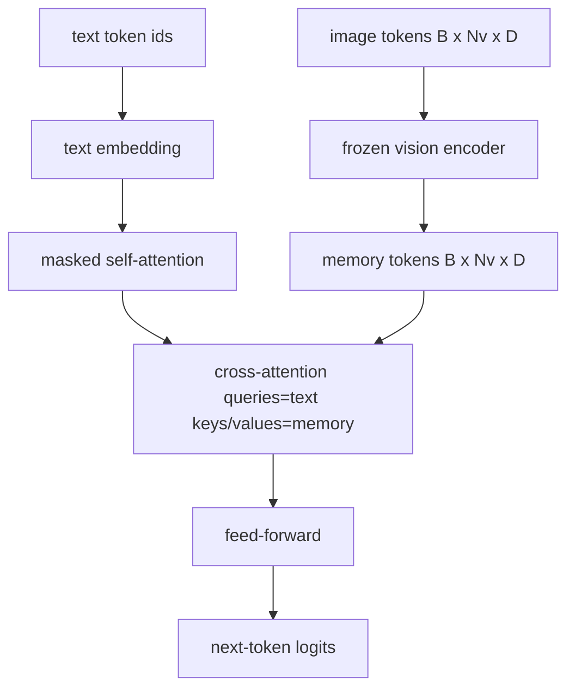
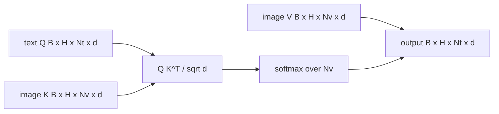

# क्रॉस-एटेंशन फ्यूजन

> प्रोजेक्शन परत एक छवि वेक्टर को एक कैप्शन वेक्टर के साथ संरेखित करती है। एक वास्तविक दृष्टि भाषा डिकोडर को प्रत्येक पैच टोकन को ध्यान में रखने के लिए प्रत्येक पाठ टोकन की आवश्यकता होती है, ताकि मॉडल एक क्षेत्र में प्रत्येक शब्द को ग्राउंड कर सके। क्रॉस-अटेंशन यह है कि कैसे यह जमीनीकरण होता है। पाठ प्रश्न; दृष्टि कुंजी और मूल्य उत्तर। यह पाठ क्रॉस-अटेंशन ब्लॉक, कारण पाठ आत्म-अटेंशन, और मास्क के आकारों को बनाता है जो दोनों को कानूनी बनाए रखते हैं।

**Type:** Build
**Languages:** Python
**Prerequisites:** Phase 19 lessons 30-37 (Track B foundations)
**Time:** ~90 minutes

## सीखने के लक्ष्य

- बहु-हेड क्रॉस-अटेंशन को लागू करें जहां क्वेरी स्ट्रीम टेक्स्ट है और कुंजी/मूल्य स्ट्रीम विजन है।
- एक डिकोडर ब्लॉक बनाएंः कारण स्व-विचार + पार-विचार + फ़ीड-फॉरवर्ड।
- मास्क के आकार को सही रखेंः स्व-विचार के लिए कारणात्मक मास्क, क्रॉस-विचार के लिए कोई मास्क नहीं।
- बैच पाठ टोकन और छवि टोकन के एक निश्चित पूल के साथ एक आगे पास चलाएं।

## समस्या

छवि टोकन और पाठ टोकन को एक अनुक्रम में जोड़ना एक संलयन विकल्प है (प्रारंभिक संलयन, मार्ग चमेलेन और ईएमयू 3 लेते हैं) । क्रॉस-अटेंशन दूसरा है (पिछले संलयन, मार्ग फ्लेमिंगो पेश किया गया है और जो बाद में प्रत्येक फ्लेमिंगो के आकार के डिकोडर ने कॉपी किया है) । देर से संलयन में, पाठ डिकोडर केवल पाठ टोकन पर चलता है और प्रत्येक परत पर क्रॉस-अटेंशन के माध्यम से छवि धारा में पहुंचता है।

देर से संलयन के दो फायदे हैं. पहला, पाठ धारा स्वच्छ रहती है और मॉडल केवल पाठ क्षमताओं को संरक्षित करता है। दूसरा, छवि धारा प्रति छवि एक बार गणना की जाती है और प्रत्येक डिकोडिंग चरण के लिए पुनः उपयोग की जाती है, इसलिए उत्पादन लंबे कैप्शन के लिए भी सस्ता है। लागत प्रति ब्लॉक एक अतिरिक्त ध्यान उप-परत है।

## अवधारणा





### मुखौटा के आकार

एक डिकोडर ब्लॉक के अंदर दो ध्यान अलग-अलग मास्क की आवश्यकता होती हैः

| Attention | Query length | Key length | Mask | Why |
|-----------|--------------|------------|------|-----|
| Self-attention | `Nt` (text) | `Nt` (text) | Causal: lower-triangular `(Nt, Nt)` | Text tokens may not look ahead during autoregression |
| Cross-attention | `Nt` (text) | `Nv` (vision) | No mask | The whole image is visible to every text position |

पाठ में एक आकार-मान्यीकरण समारोह शामिल है ताकि उन्हें मिश्रण की गलती सतहों के रूप में `ValueError`चुपचाप टूटने हानि वक्र के बजाय।

### क्यों नहीं पार ध्यान पर कोई मास्क

किसी भी पाठ उत्पन्न होने से पहले छवि पूरी तरह से अवलोकन किया जाता है।`t`कुछ फ्लेमिंगो संस्करणों में कई छवियों और पाठ खंडों को पार करते समय प्रति नमूना मास्किंग पैटर्न जोड़ने की अनुमति है, लेकिन एक छवि के साथ एक कैप्शन के लिए, क्रॉस-अटेंशन सब कुछ देखता है।

### कुंजी/मूल्य कैशिंग

छवि कुंजी और मानों को डिकोड की शुरुआत में एक बार गणना की जाती है और कैश में रखा जाता है। प्रत्येक नए टेक्स्ट टोकन कैश को बिना पुनः गणना के उपयोग करता है। यह क्या है जो उपशीर्षक को निष्कर्ष में तेजी से बनाता हैः भारी वीआईटी एक बार चलाता है; क्रॉस-अटेंशन हर चरण के लिए अपनी कुंजी और मानों का पुनः उपयोग करता है। पाठ कैश को उजागर करता है और कैश-हिट पथ का परीक्षण करता है।

### ब्लॉक संरचना

एक डिकोडर ब्लॉक चलाता हैः प्री-एलएन -> स्व-विचार -> अवशिष्ट -> प्री-एलएन -> क्रॉस-विचार -> अवशिष्ट -> प्री-एलएन -> फ़ीड-फॉरवर्ड -> अवशिष्ट। तीन उप-परत, प्रत्येक अपने स्वयं के लेयरनॉर्म के साथ। फ्लेमिंगो पेपर ने क्रॉस-विचार पर एक सीखा गेट जोड़ा ताकि मॉडल प्रशिक्षण समय स्थिरता लागत पर छवि पथ से बाहर निकल सके; कैनोनिक बेसलाइन (यहां उपयोग किया जाता है) में कोई गेट नहीं है।

```python
class DecoderBlock:
  def forward(self, text_tokens, image_tokens, text_mask, cross_mask):
      text_tokens = text_tokens + self.self_attn(self.ln1(text_tokens),
                                                 mask=text_mask)
      text_tokens = text_tokens + self.cross_attn(self.ln2(text_tokens),
                                                  image_tokens,
                                                  mask=cross_mask)
      text_tokens = text_tokens + self.ffn(self.ln3(text_tokens))
      return text_tokens
```

```figure
ch-crossattn-fan
```

## इसे बनाओ

`code/main.py`कार्य करता हैः

- `CrossAttention(hidden, heads)`, अलग से के साथ बहु-मुख्य क्रॉस-अटेंशन`q`और `kv`अनुमान।
- `CausalSelfAttention(hidden, heads)`, एक मानक डिकोडर से एक मास्क स्व-विचार.
- `DecoderBlock`, जो तीनों उप-परतों को पूर्व-एलएन अवशेषों से बनाती है।
- `VisionLanguageDecoder`, चार परतों का डेकोडर एक नकली दृष्टि एन्कोडर आउटपुट और एक छोटे पाठ एम्बेडिंग तालिका द्वारा संचालित किया जाता है।
- `causal_mask(length)`एक `(length, length)`निचले त्रिकोणीय बुलियन tensor.
- एक डेमो जो लंबाई 10 के दो पाठ अनुक्रमों के एक बैच को लंबाई 197 की छवि स्मृति के साथ खिलाता है और प्रति स्थिति आउटपुट आकार, स्व-ध्यान मुखौटा आकार, और क्रॉस-अंतर्वतन आउटपुट मानदंड प्रिंट करता है।

इसे चलाओः

```bash
python3 code/main.py
```

आउटपुटः डेकोडर एक `(2, 10, text_vocab)`लॉजिट Tensor. मुखौटा आकार है`(10, 10)`. KV-कैश पुनः उपयोग जांच कैश और अनकैश पथ के बीच समान लॉगिंग की पुष्टि करती है।

## इसका प्रयोग करें

क्रॉस-अटेंशन दो उत्पादन परिवारों में दिखाई देता हैः

- **Flamingo and IDEFICS.**प्रत्येक K भाषा मॉडल ब्लॉक में एक क्रॉस-अटेंशन सब-लेयर डालें, जिसमें एक जमे हुए LM हो। दृष्टि-भाषा एडाप्टर क्रॉस-अटेंशन ब्लॉक प्लस इसका गेट होता है।
- **BLIP-2.**Q-Former छवि सुविधाओं में 32 क्वेरी टोकन के एक निश्चित सेट से क्रॉस-अटेंशन का उपयोग करता है, फिर LM एम्बेडिंग स्पेस में क्वेरी को प्रोजेक्ट करता है।

इस पाठ में ब्लॉक का आकार दोनों पर सीधे मैप करता है। मास्क अनुशासन (स्वयं पर कारण, क्रॉस पर कोई नहीं) एक ही है।

## परीक्षण

`code/test_main.py`कवरः

- कारण मुखौटा निचले त्रिकोण है और अपेक्षित बुलियन आकार से मेल खाता है
- क्रॉस-अटेंशन आउटपुट आकार `(B, Nt, hidden)`कुंजी लंबाई के बावजूद
- KV-कैश पथ फ्लोट टॉलरेंस के लिए अनकैश पथ से मेल खाता है
- पाठ और छवि धाराओं के बीच आकार असंगतता स्पष्टता पैदा करता है `ValueError`
- एक पूर्ण डिकोडर आगे पास सही बैच और अनुक्रम आकार पैदा करता है

उन्हें चलाओः

```bash
python3 -m unittest code/test_main.py
```

## व्यायाम

1. क्रॉस-एटेंशन रेसिड्यूल (फ्लैमिंगो ट्रिक) में एक सीखे हुए टैन गेट जोड़ें और एक लगभग शून्य प्रारंभिक गेट से प्रशिक्षण अभिसरण की पुष्टि करें। गेट 0 से शुरू होता है; मॉडल छवि स्ट्रीम को मिश्रित करने से पहले केवल पाठ व्यवहार को पुनर्प्राप्त करता है।

2. एक ही डिकोडर कई छवियों और कई पाठ खंडों को खपत करते हुए इंटरलेव्ड ध्यान लागू करें। प्रति नमूना क्रॉस-अटेंशन मास्क बनाएं जो पाठ खंड 2 को छवि 1 में शामिल होने से रोकता है।

3. पार ध्यान बनाम स्व-ध्यान परत पर प्रोफाइल `Nt=64, Nv=576`(एक 24x24 ग्रिड उच्च संकल्प पर) क्रॉस-अटेंशन लागत है `Nt * Nv`और उच्च छवि संकल्प पर हावी है।

4. क्रॉस-अटेंशन मानचित्र पर क्वेरी-साइड ड्रॉपआउट जोड़ें और डेमो पर कैप्शन विविधता को मापें (क्रॉस-मैप में ड्रॉपआउट के साथ कैप्शन नमूना भिन्नता बढ़ जाती है) ।

5. Q-Former शैली के ध्यान ब्लॉक के लिए क्रॉस-अटेंशन लेयर को स्विच करें जहां प्रति लेयर एक बार एक फिक्स्ड 32-टोकन क्वेरी पूल छवि सुविधाओं का ध्यान रखता है।

## प्रमुख शर्तें

| Term | What it means |
|------|---------------|
| Late fusion | Text and vision stay in separate streams; cross-attention bridges them at every block |
| Cross-attention | Q comes from one stream, K and V from another |
| Causal mask | Lower-triangular boolean mask that prevents looking ahead during autoregression |
| KV cache | Image keys and values stored once and reused for every decode step |
| Memory tokens | The frozen image tokens that the decoder reaches into |

## आगे पढ़ना

- गॉट क्रॉस-एटेंशन के साथ कैनोनिक लेट-फ्यूजन डिजाइन के लिए फ्लेमिंगो (2022)
- Q-Former के लिए BLIP-2 (2023) जो एक सीखे गए क्वेरी पूल के रूप में पहने हुए क्रॉस-अटेंशन ब्लॉक है।
- फ्लेमिंगो नुस्खा के खुले वजन में पुनरुत्पादन के लिए आईडीएफआईसीएस (2023) ।
