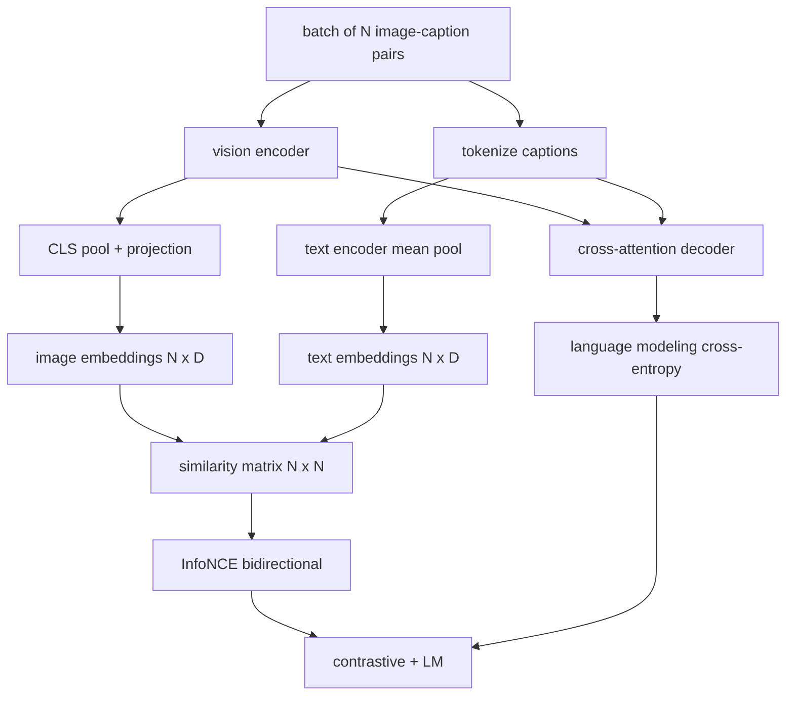

# दृष्टि भाषा का प्रशिक्षण

> अब इन दोनों को एक साथ प्रशिक्षित करें। दो उद्देश्य सीखने को बढ़ावा देते हैंः एक विपरीत छवि-पाठ हानि (InfoNCE) जो संयुक्त एम्बेडिंग स्थान में मिलान जोड़ों को एक साथ खींचता है, और एक भाषा मॉडलिंग हानि जो डिकोडर से प्रत्येक छवि के कैप्शन को पूछती है। संयुक्त रूप से, वे नेटवर्क को एक कैप्शन के लिए सही छवि खोजने और छवि के लिए कैप्शन लिखने के लिए दोनों को सिखाते हैं।

**Type:** Build
**Languages:** Python
**Prerequisites:** Phase 19 lessons 30-37 (Track B foundations)
**Time:** ~90 minutes

## सीखने के लक्ष्य

- छवि-कैप्शन जोड़े के बैच में InfoNCE कंट्रास्टिव हानि लागू करें।
- ऑटोरेग्रेसिव भाषा मॉडलिंग हानि के साथ विपरीत हानि को मिलाएं।
- वास्तविक डेटासेट डाउनलोड के बिना 200 जोड़े का नकली छवि कैप्शन कॉर्पस संश्लेषित करें।
- 50 चरणों का डेमो प्रशिक्षण लूप चलाएं और दोनों नुकसान कम हो रहे हैं।

## समस्या

एक दृष्टि भाषा मॉडल को दो कौशल की आवश्यकता होती है। इसे क्रमबद्ध करना चाहिएः एक कैप्शन दिया गया है, कई के बीच सही छवि ढूंढें। इसे उत्पन्न करना चाहिएः एक छवि दी गई है, एक कैप्शन लिखें। एक कौशल पर मॉडल को पूर्व-प्रशिक्षण आपको आधा सिस्टम देता है। CLIP नेल रैंकिंग लेकिन कैप्शन नहीं कर सकता है। GPT-4V कैप्शन कर सकता है लेकिन रैंकिंग के लिए एक अलग पुनर्प्राप्ति सिर का उपयोग करता है। बहु-उद्देश्यीय पूर्व-प्रशिक्षण एक पास में दोनों प्राप्त करता है।

InfoNCE रैंकिंग आधा संभालता है। N जोड़े के बैच के लिए, मॉडल N जोड़े के साथ मेल खाती सकारात्मक और `N^2 - N`नकारात्मक के रूप में असंगत जोड़े, तो परिणाम पर एक क्रॉस-एंट्रोपी हानि चलाता है `(N, N)`समानता मैट्रिक्स। LM हानि पीढ़ी के आधे को संभालती हैः छवि पर स्थित मानक अगले टोकन भविष्यवाणी। दोनों नुकसान अंतर योग्य हैं और एन्कोडर, प्रोजेक्टर और डिकोडर वजन साझा कर सकते हैं।

## अवधारणा



### एक पैराग्राफ में InfoNCE

N छवि एम्बेडिंग को पंक्तियों के रूप में और N पाठ एम्बेडिंग को पंक्तियों के रूप में ढेर करें। L2- दोनों को सामान्य बनाएं। `N x N`मैट्रिक्स `S = I T^T / tau`कहाँ`tau`एक सीखा तापमान है। विकर्ण प्रविष्टियाँ मिलान जोड़े हैं; विकर्ण से बाहर प्रविष्टियाँ नकारात्मक हैं। लक्ष्य के साथ क्रॉस-एंट्रोपी लागू करें `argmax`अनुदैर्ध्य में चल रहा हैः पंक्ति `i`स्तंभ में अपनी उच्चतम प्रविष्टि होनी चाहिए `i`. . . . . . . . . . . . . . . . . . . . . . . . . . . . . . . . . . . . . . . . . . . . . . . . . . . . . . . . . . . . . . . . . . . . . . . . . . . . . . . . . . . . . . . . . . . . . . . . . . . . . . . . . . . . . . . . . . . . . . . . . . . . . . . . . . . . . . . . . . . . . . . . . . . . . . . . . . . . . . . . . . . . . . . . . . . . . . . . . . . . . . . . . . . . . . . . . . . . . . . . . . . . . . . . . . . . . . . . . . . . . . . . . . . . . . . . . . . . . . . . . . . . . . . . . . . . . . . . . . . . . . . . . . . . . . . . . . . . . . . . . . . . . . . . . . . . . . . . . . . . . . . . . . . . . . . . . . . . . . . . . . . . . . . . . . . . . . . . . . . . . . . . . . . . . . . . . . . . . . . . . . . . . . . . . . . . . . . . . . . . . . . . . . . . . . . . . . . . . . . . . . . . . . . . . . . . . . . . . . . . . . . . . . . . . . . . . . . . . . . . . . . . . . . . . . . . . . . . . . . . . . . . . . . . . . . . . . . . . . . . . . . . . . . . . . . . . . . . . . . . . . . . . . . . . .

### तापमान की बात

तापमान `tau`यह नियंत्रित करता है कि सॉफ्टमैक्स का पीक कितना है।`tau = 0.01`) और ग्रेडिएंट केवल सबसे कठिन नकारात्मक से आता है, प्रशिक्षण शोर है। बहुत बड़ा और सॉफ्टमैक्स फ्लैट करता है और ग्रेडिएंट गायब हो जाता है। CLIP सीखता है `tau`एक पैरामीटर के रूप में; यहाँ डेमो एक ही करता है।

### भाषा मॉडलिंग हानि

डिकोडर क्रॉस-अटेंशन के माध्यम से छवि मेमोरी टोकन का उपभोग करता है और प्रत्येक स्थिति में अगले पाठ टोकन की भविष्यवाणी करता है। हानि अगले स्थिति लक्ष्य के साथ मानक क्रॉस-एंट्रोपी है। पैडिंग स्थितियों को नुकसान से छिपाया जाता है।

### घाटे को जोड़ना

`total = contrastive + lm_weight * lm`कहाँ`lm_weight`यह एक स्केलर (अक्सर 1.0) है। दो नुकसान एन्कोडर और प्रोजेक्शन में ग्रेडिएंट साझा करते हैं; केवल डिकोडर को एलएम-लॉस ग्रेडिएंट प्राप्त होता है। यह बहु-कार्य नुस्खा है जिसका उपयोग कोका, बीएलआईपी और सिगलिप शैली के मॉडल सभी करते हैं, विभिन्न वजन के साथ।

| Component | Loss surface | Affects |
|-----------|--------------|---------|
| InfoNCE | Pair ranking in the joint space | Encoder + projection + text head |
| LM | Token prediction conditioned on image | Encoder + projection + decoder |
| Combined | Multi-task | Whole stack |

### डेमो के लिए 50 कदम क्यों पर्याप्त हैं

नकली कॉर्पस एक सिंथेटिक 200-pair सेट है जिसमें यादृच्छिक छवियां और यादृच्छिक कैप्शन आईडी हैं। बैच आकार 16 के साथ 50 एसजीडी चरणों के बाद, दोनों नुकसान दृश्यमान रूप से गिरते हैं भले ही निरपेक्ष मान वास्तविक डेटा मॉडल के ऊपर बने रहें। डेमो का उद्देश्य ग्रेडिएंट प्लंपिंग कामों को अंत से अंत तक पुष्टि करना है और कि एलएम हानि जोड़ने से विपरीत उद्देश्य अस्थिर नहीं होता है।

```figure
ch-infonce-diagonal
```

## इसे बनाओ

`code/main.py`कार्य करता हैः

- `MultimodalModel`, एक छोटे से ViT एन्कोडर, MLP प्रोजेक्टर, एक छोटे पाठ पक्ष एन्कोडर (एम्बेडेड आईडी पर औसत पूल) और पाठ 61 से क्रॉस-अटेंशन डिकोडर को जोड़कर।
- `info_nce_loss(image_emb, text_emb, temperature)`, द्विदिश CLIP शैली के विपरीत हानि।
- `lm_loss(logits, target_ids, padding_id)`, मास्क अगले टोकन क्रॉस-एंट्रोपी.
- `make_mock_corpus(seed, n_pairs)`, 200 निर्धारक (छवि, उपशीर्षक_आईडी) जोड़े लौटाता है।
- बैच आकार 16, एडम अनुकूलक, और एक सीखा लॉग-तापमान पैरामीटर के साथ 50 चरणों का प्रशिक्षण लूप। दोनों नुकसान हर 5 चरणों में प्रिंट किए जाते हैं।

इसे चलाओः

```bash
python3 code/main.py
```

आउटपुट: विपरीत हानि लगभग से घटती है `ln(16) = 2.77`2.4; LM हानि घटती है `ln(512) ≈ 6.24`4.7 के करीब दोनों घटने से पता चलता है कि ग्रेडिएंट सही तरीके से वायर्ड है। वास्तविक मॉडल लाखों चरणों के लिए ट्रेन करते हैं; गतिशीलता समान है।

## इसका प्रयोग करें

यह वही हानि नुस्खा है जो जहाज में भेजा गया थाः

- **CLIP (2021).**केवल छवि-पाठ विपरीत, एक अलग जमे हुए-एन्कोडर कैप्शन जांच के साथ।
- **CoCa (2022).**छवि-पाठ विपरीत प्लस छवि-सर्पात्मक एलएम हानि एक मॉडल में. इस पाठ का निर्माण सटीक पैटर्न.
- **BLIP (2022) and BLIP-2.**विपरीत और एलएम और छवि-पाठ मिलान सिर. तीन नुकसान संयुक्त.
- **SigLIP (2023).**सिग्मोइड जोड़ी हानि के लिए InfoNCE स्विच; एक ही विपरीत भूमिका, अलग कार्यात्मक रूप.
- **LLaVA family.**दो चरणों का प्रशिक्षण जहां चरण एक संरेखण है (मुस्कृत एलएम पर कोसिन) और चरण दो एक मुक्त एलएम के साथ एलएम हानि जोड़ता है। पाठ 60 चरण एक का नक्शा बनाता है; यह पाठ चरण दो का नक्शा करता है।

## परीक्षण

`code/test_main.py`कवरः

- InfoNCE हानि छवि/पाठ पंक्तियों के पार सममित है
- InfoNCE हानि 0 लौटाता है जब समानता मैट्रिक्स बड़ी सकारात्मक संख्याओं का एक सही विकर्ण है
- एलएम हानि सही ढंग से पैडिंग पदों को कवर करती है
- मॉडल फॉरवर्ड पास त्रुटि के बिना दोनों नुकसान पैदा करता है
- 5-चरण प्रशिक्षण लूप संयुक्त हानि को कम करता है

उन्हें चलाओः

```bash
python3 -m unittest code/test_main.py
```

## व्यायाम

1. InfoNCE को SigLIP शैली सिग्मोइड जोड़ी हानि से बदल दें और नकली कॉर्पस पर अभिसरण की तुलना करें।

2. एक हार्ड-नेगेटिव खनन चरण जोड़ेंः प्रत्येक दूसरे बैच में, पिछले बैच से सबसे कठिन अप-चौकनी जोड़ी का चयन करें और इसे जोड़ें। प्रशिक्षित करें और जांचें कि क्या विपरीत हानि तेजी से गिरती है।

3. एक तीसरा नुकसान के लिए संयुक्त एम्बेडिंग के ऊपर एक छवि-पाठ मेल खाने वाले द्विआधारी सिर जोड़ें (सच / झूठाः क्या ये मेल खाते हैं?

4. नक्कली कॉर्पस को मार्कोव श्रृंखला से खींची गई कैप्शन-आईडी अनुक्रमों के साथ बदलें जिसका संक्रमण मैट्रिक्स छवि हैश पर स्थित है। कैप्शन हानि को और कम होना चाहिए क्योंकि वास्तविक सीखने योग्य संकेत है।

5.  के साथ एक ही मॉडल को प्रशिक्षित करें`lm_weight = 0`और फिर से `lm_weight = 1`. विपरीत हानि की तुलना करें; एलएम हानि रैंकिंग लक्ष्य को पीछे नहीं हटानी चाहिए।

## प्रमुख शर्तें

| Term | What it means |
|------|---------------|
| InfoNCE | Noise contrastive estimation: cross-entropy on a similarity matrix |
| Temperature | Scalar that controls how peaked the contrastive softmax is |
| Hard negative | An off-diagonal pair the model finds confusing, useful for sampling |
| LM loss | Standard next-token cross-entropy on the captioning side |
| Joint embedding space | The shared space where image and text vectors live after projection |

## आगे पढ़ना

- मूल विपरीत नुस्खा के लिए क्लिप पेपर।
- एक मॉडल में विपरीत और उपशीर्षक के लिए CoCa कागज।
- सिग्मोइड जोड़ी हानि संस्करण के लिए सिग्लिप पेपर और यह बेहतर पैमाने क्यों है।
