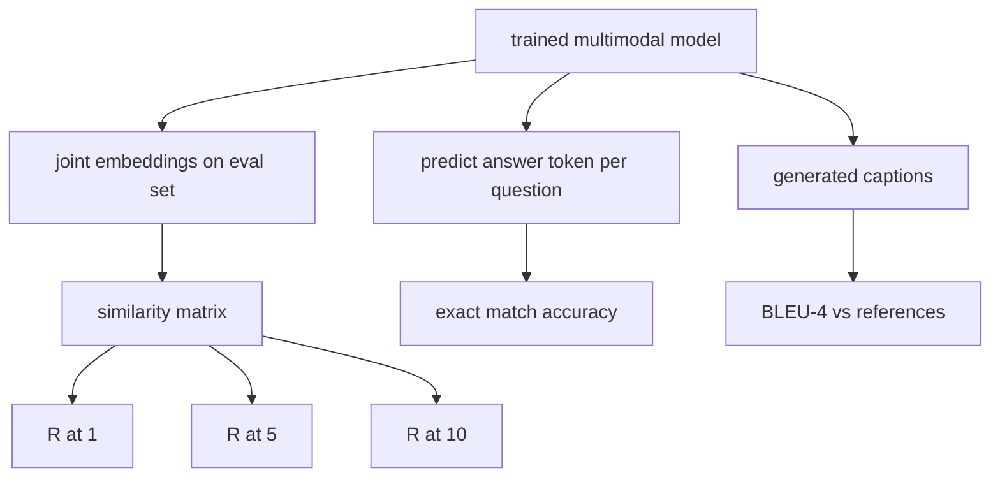

# बहुआयामी मूल्यांकन

> प्रशिक्षण आधा लूप है। दूसरा आधा माप है। यह पाठ आदिम से तीन मूल्यांकन सतहों का निर्माण करता हैः छवि-कैप्शन रिट्रीवल R@1, R@5, R@10 के रूप में रिपोर्ट किया गया; दृश्य प्रश्न उत्तर सटीक मैच सटीकता के रूप में रिपोर्ट किया गया; और छवि कैप्शनिंग BLEU-4 के रूप में रिपोर्ट किया गया। प्रत्येक मीट्रिक मॉडल के आउटपुट पर एक फ़ंक्शन है और एक सिंथेटिक मूल्यांकन सूट जो सेकंड में चलता है।

**Type:** Build
**Languages:** Python
**Prerequisites:** Phase 19 lessons 58-62 (Track E foundations: encoder, transformer, projection, cross-attention fusion, pretraining)
**Time:** ~90 minutes

## सीखने के लक्ष्य

- छवि और कैप्शन एम्बेडमेंट के बीच समानता मैट्रिक्स से Recall@K की गणना करें।
- एक मॉडल से सटीक-मिलान VQA सटीकता की गणना करें जो एक निश्चित उत्तर शब्दावली के लिए जोड़े (छवि, प्रश्न) का नक्शा बनाता है।
- बिना किसी बाहरी पुस्तकालय के उत्पन्न और संदर्भ टोकन अनुक्रमों से BLEU-4 की गणना करें।
- सब तीनों मूल्यांकनों को एक सिंथेटिक सूट के खिलाफ चलाएं जो पाठ 62 के प्रशिक्षित मॉडल के ऊपर बनाया गया था।

## समस्या

प्रशिक्षण हानि के उपाय प्रशिक्षण वितरण पर फिट बैठते हैं; यह माप नहीं करता है कि मॉडल एक लंबे समय तक चलने वाले बैच में जोड़े की श्रेणीबद्ध कर सकता है, एक प्रश्न का उत्तर दे सकता है, या एक व्यक्ति द्वारा स्वीकार किए जाने वाले कैप्शन लिख सकता है। तीन मूल्यांकन सतहें मानक हैंः

- **Retrieval (R@1, R@5, R@10).**क्वेरी कैप्शन के लिए संयुक्त एम्बेडिंग बनाएं; eval पूल में प्रत्येक छवि को कोसिन द्वारा रैंक करें; रिपोर्ट करें कि क्या मिलान छवि शीर्ष 1, शीर्ष 5, शीर्ष 10 में आती है। सममित (छवि-से-पाठ) फॉर्म एक ही तरह से चलता है।
- **Visual question answering (exact match).**दिए गए (छवि, प्रश्न) मॉडल एक उत्तर टोकन आउटपुट करता है। सटीक मैच प्रति नमूना एक बिट हैः क्या भविष्यवाणी उत्तर संदर्भ उत्तर के बराबर है? मूल्यांकन सेट पर औसत।
- **Captioning (BLEU-4).**एक कैप्शन उत्पन्न करें। संदर्भ कैप्शन के साथ संदर्भ कैप्शन के साथ 1-ग्राम से 4-ग्राम सटीकता के बीच ज्यामितीय औसत की गणना करें। बहु-संदर्भ मानक रूप है (एक छवि, कई संदर्भ कैप्शन) ।

प्रत्येक मीट्रिक एक पतला फ़ंक्शन है। पाठ उन्हें सभी कोड में बनाता है ताकि गणित ठोस हो और सतह आपके नियंत्रण में बनी रहे। वास्तविक बेंचमार्क सूट (एमएस-कोको, वीक्यूए वी 2, जीक्यूए, ओके-वीक्यूए) एक ही फ़ंक्शन के आकारों में प्लग करते हैं।

## अवधारणा



### एक समानता मैट्रिक्स से Recall@K

`(N, N)`छवि और कैप्शन एम्बेडमेंट के बीच कॉसिन समानता मैट्रिक्स। प्रत्येक पंक्ति के लिए, नीचे की समानता के आधार पर स्तंभों को क्रमबद्ध करें। Recall@K पंक्तियों का अंश है जहां विकर्ण स्तंभ सूचकांक शीर्ष K स्थानों के भीतर स्थित है। सममित Recall@K (शिलालेख-छवि) को ट्रांसपोस किए गए मैट्रिक्स पर गणना की जाती है। दोनों संख्याओं की सूचना दी गई है। N=100 eval के लिए, R@1 = 0.6 का अर्थ है कि 100 कैप्शन में से 60 ने शीर्ष मैच के रूप में अपनी सही छवि प्राप्त की।

### VQA सटीक मेल

प्रत्येक (छवि, प्रश्न, उत्तर) के लिए, छवि को एन्कोड करें, प्रश्न एम्बेड करें, डिकोडर के माध्यम से फ्यूज करें, और अगला टोकन पढ़ें। पूर्वानुमानित टोकन आईडी की तुलना संदर्भ आईडी से की जाती है; यदि बराबर है तो सही। मूल्यांकन सेट पर औसत। वास्तविक वीक्यूए डेटासेट प्रति प्रश्न में कई मानव-विवरणित उत्तरों के साथ जहाज और एक नरम-सटीकता सूत्र (1.0 यदि 10 में से कम से कम 3 विलेखक सहमत हैं, तो नीचे स्केल किया गया है) का उपयोग करते हैं; स्पष्टता के लिए पाठ एक-उत्तर सटीक मैच का उपयोग करता है।

### ब्लू-4

```text
BLEU-4 = BP * exp(mean(log p1, log p2, log p3, log p4))
```

कहाँ`p_n`संशोधित n-ग्राम सटीकता (किसी भी संदर्भ में दिखाई देने वाले उत्पन्न n-ग्राम की कटौती संख्या, कुल उत्पन्न n-ग्राम द्वारा विभाजित) है, और `BP`संक्षिप्तता दंड हैः

```text
BP = 1                if generated length > reference length
   = exp(1 - r/g)     otherwise, where r is reference length and g is generated
```

छोटे नमूनों के लिए चिकनाई की आवश्यकता होती है जहां कुछ `p_n`निष्पादन में चेन और चेरी "विधि 1" (किसी भी शून्य गणना के लिए संख्यात्मक और संज्ञात्मक में 1 जोड़ें) का उपयोग किया जाता है, जो कम संख्या वाले शासन के लिए सबसे सुरक्षित डिफ़ॉल्ट है।

### सिंथेटिक मूल्यांकन सूट

एक 50 नमूना मूल्यांकन सूट को स्मृति में पाठ 62 में उपयोग किए गए उसी नकली कॉर्पस पैटर्न से बनाया गया है, जिसमें एक धरा हुआ बीज है। तीन सूट सूट बनाते हैंः

- `pairs`: 50 (छवि, caption_ids) जोड़े पुनः प्राप्त करने के लिए।
- `vqa`: 50 (छवि, प्रश्न_आईडी, उत्तर_आईडी) तीन गुना।
- `caps`: 50 (छवि, [reference_caption_ids, ...]) प्रति छवि में 3 संदर्भ तक के प्रविष्टियाँ।

सूट बीज से निर्धारक है और प्रशिक्षण कॉर्पस से बाहर रखा गया है, इसलिए माप मॉडल ने कभी नहीं देखा डेटा पर गणना की जाती है। JSON पर सूट को बनाए रखना एक अभ्यास के रूप में छोड़ दिया जाता है (नीचे देखें) ।

| Metric | Range | Random baseline (N=50) |
|--------|-------|------------------------|
| R@1 | 0 to 1 | 0.02 (1 / N) |
| R@5 | 0 to 1 | 0.10 |
| R@10 | 0 to 1 | 0.20 |
| VQA EM | 0 to 1 | 1 / vocab |
| BLEU-4 | 0 to 1 | small but nonzero |

सिंथेटिक डेटा पर 50 चरणों में प्रशिक्षण के लिए, मीट्रिक उच्च होने की उम्मीद नहीं है; वे यादृच्छिक आधार रेखा से ऊपर होने की उम्मीद है, जो कि डेमो की जांच करता है।

```figure
ch-recall-window
```

## इसे बनाओ

`code/main.py`कार्य करता हैः

- `recall_at_k(sim_matrix, k)`, एक फ्लोट वापस करने के लिए `[0, 1]`दोनों दिशाओं में।
- `vqa_exact_match(predictions, references)`, औसत पर वापस `int`समानता।
- `bleu4(generated, references, smoothing=True)`, बहु-संदर्भ समर्थन के साथ।
- `build_eval_suite(seed, n_samples, vocab_size, max_len)`, तीन निर्धारात्मक मूल्यांकन सूची लौटाता है।
- `evaluate(model, suite)`, जो सभी तीन मैट्रिक्स चलाता है और एक लौटाता है `dict`संख्याओं के।
- एक डेमो जो पाठ 62 से एक ताजा-प्रारंभिक मल्टीमोडल मॉडल को लोड करता है, उसका मूल्यांकन करता है, फिर इसे 50 चरणों के लिए प्रशिक्षित करता है और फिर से मूल्यांकन करता है, पूर्व / बाद के माप को प्रिंट करता है।

इसे चलाओः

```bash
python3 code/main.py
```

आउटपुटः पूर्व/पश्चात मेट्रिक तालिका में मॉडल के सीखे सिग्नल की ओर लगभग यादृच्छिक से पुनर्प्राप्त करने में सुधार, यादृच्छिक से ऊपर VQA में सुधार और BLEU-4 में सुधार (संश्लेषण संरचना 4 ग्राम सटीक लिफ्ट के लिए पर्याप्त है) दिखाया गया है।

## इसका प्रयोग करें

प्रत्येक मीट्रिक सीधे उत्पादन बेंचमार्क पर मैप करता हैः

- **Retrieval.**MS-COCO 5K val, Flickr30K, ImageNet शून्य-शॉट सभी एक ही समानता मैट्रिक्स पर R @ K समस्याएं हैं। सिंथेटिक eval को वास्तविक फ़ाइलों के साथ बदलें और फ़ंक्शन हस्ताक्षर अपरिवर्तित है।
- **VQA.**VQA v2, GQA, OK-VQA एक ही सटीक मैच आकार का उपयोग करते हैं (VQA v2 के लिए एकल-उत्तर EM के बजाय सॉफ्ट-एसी के साथ) ।
- **BLEU-4.**MS-COCO कैप्शन, NoCaps, Flickr30K कैप्शन सभी BLEU-4 प्लस CIDEr और METEOR का उपयोग करते हैं। CIDEr जोड़ना एक और फ़ंक्शन है।

वास्तविक बेंचमार्क के लिए, स्वैप `build_eval_suite`गणित बेंचमार्क-अज्ञानी है.

## परीक्षण

`code/test_main.py`कवरः

- recall@k एक पूर्ण पहचान समानता मैट्रिक्स पर 1.0 और k < N के लिए एक पलटकर एक पर 0.0 देता है
- recall@k सम्मान `k <= N`ऊपरी सीमा
- bleu4 वापस 1.0 जब उत्पन्न एक संदर्भ के बराबर है
- ब्लू4 डिस्कॉन्ट शब्दावली पर 0.0 देता है
- vqa सटीक मैच बराबर बराबर जोड़े के अंश के बराबर है
- build_eval_suite जोड़े, vqa आइटम और कैप्शन प्रविष्टियों की अपेक्षित संख्या लौटाता है

उन्हें चलाओः

```bash
python3 -m unittest code/test_main.py
```

## व्यायाम

1. उपशीर्षक मेट्रिक्स में CIDEr जोड़ें। CIDEr n-ग्राम पर TF-IDF वजन का उपयोग करता है, जो सूचनात्मक टोकन को पुरस्कृत करता है।

2. नरम-सटीक VQA लागू करें: प्रति प्रश्न कई मानव उत्तर, सटीकता है `min(human_count / 3, 1)`यदि कोई मेल खाता है. VQA v2 प्रतिकृति.

3.  के एक NaN- सुरक्षित संस्करण जोड़ें`bleu4`जो बिना दुर्घटनाग्रस्त हुए खाली उत्पन्न अनुक्रमों को संभालता है।

4. R@K के साथ गणना औसत पारस्परिक रैंक (MRR) । MRR इस बात पर संवेदनशील है कि सही आइटम शीर्ष K से परे कहां उतरता है; R@K इस बात पर संवेदनशील है कि यह शीर्ष K में उतरता है या नहीं।

5. प्रशिक्षण के दौरान पांच चेकपॉइंट्स पर मॉडल पर मूल्यांकन करें (चरण 0, 10, 20, 30, 40, 50) और सीखने के वक्र का पता लगाएं। मीट्रिक पटरियों को नुकसान पटरियों का पता लगाएं।

## प्रमुख शर्तें

| Term | What it means |
|------|---------------|
| R@K | Fraction of queries where the correct match lands in the top K results |
| Exact match | The simplest VQA scoring: predicted answer equals reference |
| BLEU-4 | Geometric mean of 1- to 4-gram precisions, with brevity penalty |
| Multi-reference | A captioning metric accepts several reference captions per image |
| Held-out | The eval set is sampled from a seed disjoint from the training corpus |

## आगे पढ़ना

- मऊ सटीकता सूत्र और डेटासेट के लिए VQA v2 पेपर।
- TF-IDF-weighted n-gram captioning के लिए CIDER पेपर।
- चिकनाई के प्रकारों के लिए मूल ब्लू (Papineni et al., 2002) ।
- मानार्थ संदर्भ कार्यान्वयन के लिए MS-COCO कैप्शनिंग eval स्क्रिप्ट।
