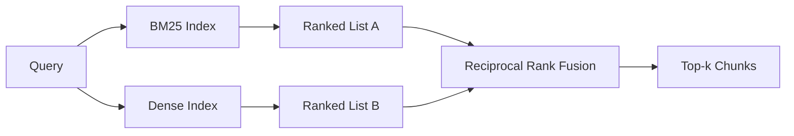

# BM25 और घने एम्बेडिंग के साथ हाइब्रिड रिट्रीवल

> विपरीत क्वेरी वितरण पर लेक्सिकल और सेमेटिक रिट्रीवल विफल रहता है। पारस्परिक रैंक संलयन के साथ हाइब्रिड रिट्रीवल इंटरपोलेट नहीं करता है, यह वोट करता है - और वोट हर क्वेरी वर्ग पर जीतता है।

**Type:** Build
**Languages:** Python
**Prerequisites:** Phase 11 lessons 04 (embeddings), 06 (RAG); Phase 19 Track B foundations (lessons 20-29); Phase 19 lesson 64 (chunking strategies)
**Time:** ~90 minutes

## सीखने के लक्ष्य
- रॉबर्टसन और स्पार्क जोन्स के सूत्र से BM25 को खरोंच से लागू करें, क्षेत्र वजन, दस्तावेज़ लंबाई सामान्यीकरण और ट्यून करने योग्य k1 और b के साथ।
- एक निर्धारात्मक नकली एम्बेडिंग के ऊपर एक घने रिट्रीवर का निर्माण करें ताकि लूप ऑफ़लाइन चल सके।
- पारस्परिक रैंक संलयन को लागू करें जैसे कि कॉर्माक, क्लार्क और ब्यूचर ने इसे 2009 में प्रकाशित किया था, और समझाएं कि यह स्कोर-वेटेड इंटरपोलेशन पर प्रभुत्व क्यों रखता है।
- आरआरएफ k निरंतर और प्रति-मोडलिटी वजन को ट्यून करें और एक छोटे से फिचर्स कॉर्पस पर ट्रेड-ऑफ पढ़ें।

## समस्या

लक्ज़िकल खोज तब जीतती है जब क्वेरी में शाब्दिक पहचानकर्ता होता है जिसमें कॉर्पस शाब्दिक होता है।`AbortMultipartOnFail`एक ही क्वेरी, एम्बेडेड, तीन समानता क्लस्टर की सीमा पर बैठता है और एक घने रिट्रीवर पहले गलत फ़ाइल को रैंक करता है।

घने खोज तब जीतती है जब क्वेरी को कॉर्पस के शाब्दिक टोकन से दूर पैराफ्रेस्ड किया जाता है। एक उपयोगकर्ता ने पूछा "हम रद्द किए गए अपलोड को कैसे संभालते हैं" कभी भी शब्द को रद्द या मल्टीपार्ट नहीं टाइप किया। BM25 "बड़ी फ़ाइलें अपलोड करना" पर दस्तावेज़ीकरण टुकड़ा लौटाता है क्योंकि उस पृष्ठ में शब्द अपलोड होता है। घने पुनर्प्राप्ति को रद्द करने का कार्य मिलता है जिसका सारांश रद्द करने का उल्लेख करता है।

दोनों के बीच चयन एक स्थिर नहीं है। क्वेरी वितरण चर है। एक उत्पादन आरएजी प्रणाली दोनों वर्गों को एक ही अंत बिंदु से संभालती है, इसलिए पुनर्प्राप्ति को एक ही समय में दोनों को संभालना पड़ता है। यह हाइब्रिड पुनर्प्राप्ति है। विलय चरण वह हिस्सा है जो सही होना चाहिए।

## अवधारणा



### एक पैराग्राफ में BM25

BM25 एक क्वेरी-डॉक्यूमेंट जोड़ी को क्वेरी शब्दों पर एक उलटा दस्तावेज़ आवृत्ति कारक को एक संतृप्ति अवधि-आवृत्ति कारक से गुणा करके जो लंबाई-सामान्यीकरण सुधार शामिल करता है, जोड़कर स्कोर करता है। दो बटन। `k1`शब्द-आवृत्ति संतृप्ति को नियंत्रित करता है; डिफ़ॉल्ट 1.5 प्रकाशित सिफारिश है और आपको इसे बेंचमार्क के बिना नहीं ले जाना चाहिए। `b`यह नियंत्रित करता है कि दस्तावेज़ की लंबाई कितनी मायने रखती है; डिफ़ॉल्ट 0.75 कहता है कि लंबे दस्तावेजों को दंडित किया जाता है, लेकिन रैखिक नहीं।

आईडीएफ सूत्र में रॉबर्टसन और स्पार्क जोन्स की परिभाषा का उपयोग किया जाता है, जो है `log((N - df + 0.5) / (df + 0.5) + 1)`. लॉग के अंदर प्लस-एक IDF सकारात्मक रखता है जब एक शब्द half से अधिक corpus में दिखाई देता है. यह छोटे corpus में मायने रखता है जहां स्टॉपवर्ड तकनीकी रूप से दुर्लभ हैं.

फील्ड वेटिंग आपको BM25 को बताता है कि प्रतीक नाम पर एक मैच शरीर में एक मैच से अधिक मायने रखता है। कार्यान्वयन सूचकांक के दौरान शब्द की गिनती पर गुणक है, स्कोरिंग समय पर नहीं। यह गणित को समान रखता है और प्रति क्षेत्र एक अलग स्कोर से बचाता है।

### एक पैराग्राफ में घने निकासी

प्रत्येक टुकड़े को एक एम्बेडिंग मॉडल के साथ एक निश्चित आयामी वेक्टर में एम्बेड करें। क्वेरी के समय, क्वेरी को एम्बेड करें, समानता के अनुसार प्रत्येक टुकड़े को कोसिन रैंक करें, और शीर्ष-के लौटाएं। मॉडल वह चर है जो गुणवत्ता का निर्णय लेता है। रिट्रीवल एल्गोरिदम स्वयं दो पंक्तियों हैः डॉट उत्पाद और क्रमबद्ध करें।

इस पाठ में एक निर्धारक हैश-आधारित एम्बेडिंग का उपयोग किया जाता है ताकि आप नेटवर्क कॉल के बिना संलयन गणित पढ़ सकें। हैश 96 आयामी वेक्टर में टोकन-की ऑफसेट का योग करता है और सामान्य बनाता है। कॉसिन रैंक रन के पार निर्धारक हैं, जो कि परीक्षण सूट की आवश्यकता है।

### पारस्परिक रैंक संलयन, प्रकाशित सूत्र

दो क्रमबद्ध सूचियों। प्रत्येक उम्मीदवार के लिए जो किसी भी सूची में दिखाई देता है, उसके पारस्परिक क्रमबद्ध योगदानों का योग करें। 2009 के पेपर में इस्तेमाल किया गया `1 / (k + rank)`के साथ 60 के बराबर है डिफ़ॉल्ट रूप से. कुल स्कोर के अनुसार क्रमबद्ध. यह पूरी एल्गोरिथ्म है.

प्रकाशित स्थिर k = 60 स्वैच्छिक नहीं है। k = 60 के साथ रैंक-1 योगदान 1 / 61 है और रैंक-10 योगदान 1 / 70 है। योगदान धीरे-धीरे गिराता है इसलिए गहरे उम्मीदवार अभी भी वोट करते हैं। छोटे k शीर्ष परिणामों को हावी बनाता है। बड़े k योगदान वक्र को सपाट करता है।

हमारे कार्यान्वयन में दो ट्यून करने योग्य बटन।`k`एक जोड़ी प्रति-मोडलिटी वजन ताकि आप BM25 या घने को बढ़ावा दे सकें जब आपके पास पहले सबूत हो तो एक आपके कॉर्पस पर बेहतर है। रैंक योगदान को वजन से गुणा करना सबसे सरल सिद्धांत आधारित कार्यान्वयन है; यह रैंक-विघटन आकार को संरक्षित करता है और पैमाने मुक्त रहता है।

### क्यों संलयन स्कोर-वेट इंटरपोलेशन से बेहतर है

बीएम25 स्कोर अनलिमिटेड और कॉर्पस-डिपेंडेंट हैं। कॉसिन समानताएं -1 से 1 तक सीमित हैं। एक रैखिक संयोजन `alpha * bm25 + (1 - alpha) * cosine`रैंक आधारित संलयन नहीं करता है। दो रैंक विभिन्न मोडलिटी में तुलनात्मक हैं। प्रकाशित आरआरएफ बेसलाइन 2010 से प्रत्येक सार्वजनिक टीआरईसी ट्रैक में स्कोर-इंटरपोलेशन से बेहतर है।

यह वही तर्क है जो आप वेस्पा और वेविएट दस्तावेज में रैंकफ्यूजन बनाम आरआरएफ के बारे में सुनते हैं। वे एक ही निष्कर्ष पर पहुंचेः रैंक-आधारित रहें जब तक आपके पास स्कोर को इंटरपोलेट करने के लिए बहुत मजबूत सबूत नहीं हैं।

```figure
rrf-fusion
```

## इसे बनाओ

`code/main.py`कार्य करता हैः

- `tokenize(text)`- एक तेजी से Regex टोकनराइज़र.
- `BM25Index`- क्षेत्र-वजनित, के साथ `add`और `search`और ट्यून करने योग्य k1, b.
- `mock_embed`,`DenseIndex`- पाठ 64 के समान निर्धारात्मक एम्बेडिंग इसलिए टुकड़े तुलनात्मक हैं।
- `rrf(rankings, k, weights)`- बहु-मॉडलता भारों के साथ प्रकाशित विलय।
- `HybridRetriever`- BM25 और घने को जोड़ता है।
- एक डेमो `main()`जो एक छोटे से फिचर कॉर्पस लोड करता है, तीन क्वेरी चलाता है जो प्रत्येक रिट्रीवर की ताकत और कमजोरियों को लक्षित करता है, और प्रत्येक मोडलिटी द्वारा उत्पादित रैंकिंग को प्रिंट करता है प्लस फ्यूज सूची।

इसे चलाओः

```bash
python3 code/main.py
```

डेमो आउटपुट को एक साथ पढ़ें। शाब्दिक पहचानकर्ता क्वेरी BM25 रैंक 1, घने रैंक 4, आरआरएफ रैंक 1 पर आती है। पैराफ्रेस्ड क्वेरी BM25 रैंक 6, घने रैंक 1, आरआरएफ रैंक 1 पर आती है। अस्पष्ट क्वेरी BM25 रैंक 3, घने रैंक 3, आरआरएफ रैंक 1 पर आती है। विलय एक टाई-ब्रेकर नहीं है; यह प्रणाली है जो प्रत्येक क्वेरी वर्ग पर जीतती है।

## बटनों को ट्यूनिंग

| Knob | Default | Move it up when | Move it down when |
|------|---------|----------------|------------------|
| BM25 k1 | 1.5 | Terms repeat in documents and you want frequency to matter more | Documents are short and term repetition is noise |
| BM25 b | 0.75 | Long documents really do say less per word | Document length is uncorrelated with topic |
| RRF k | 60 | Deep candidates should keep voting | The top-1 should dominate |
| BM25 weight | 1.0 | Your corpus contains literal identifiers and queries match them | Your queries are user-paraphrased |
| Dense weight | 1.0 | Queries are paraphrased | Queries are literal |

अपने लंबे समय तक रखा क्वेरी सेट पर पाठ 68 के मूल्यांकन हर्नर को फिर से चलाकर ट्यून, नहीं अंतर्ज्ञान द्वारा।

## विफलता मोड डेमो छिपा जाएगा

**Out-of-vocabulary tokens.**BM25 की IDF को corpus से गणना की जाती है, इसलिए केवल क्वेरी में शब्द शून्य योगदान करते हैं। घने एम्बेडेड उसी शब्द के लिए एक वेक्टर को भंग करते हैं। आउट-ऑफ-कोर्पस पहचानकर्ताओं पर घने मोडलिटी व्यवहार्य दिखने वाले लेकिन गलत पड़ोसियों को वापस लाती है। विलय इसे अवशोषित करता है क्योंकि BM25 कुछ भी नहीं लौटाता है और रैंक योगदान गिर जाता है, लेकिन केवल यदि आप दस्तावेज़ द्वारा डुप्लिकेट करते हैं, तो टुकड़े द्वारा नहीं।

**Stop-token domination.**BM25 शब्द "the" के खिलाफ corpus पर एक समान रैंकिंग उत्पन्न करता है। इंडेक्सर में स्टॉप टोकन को फ़िल्टर करें या स्वीकार करें कि उच्च-आईडीएफ शब्द स्वाभाविक रूप से हावी हैं।

**Identical content across modalities.**यदि आपका कॉर्पस इतना छोटा है कि BM25 का शीर्ष-1 घना का शीर्ष-1 भी है, तो RRF आपको समान पड़ोसियों के साथ एक ही शीर्ष-1 देता है। यह सही व्यवहार है, विफलता नहीं है, लेकिन यह संलयन को अदृश्य बना देता है। संलयन वास्तव में काम कर रहा है यह सत्यापित करने के लिए अपने मूल्यांकन में एक प्रतिकूल क्वेरी जोड़ी जोड़ें।

## इसका प्रयोग करें

उत्पादन के पैटर्नः

- प्रक्रिया में बीएम25 सूचकांक; बोतल गला शब्द-आवृत्ति शब्दकोश है, वेक्टर नहीं।
- एक अलग स्टोर में सूचकांक घने वेक्टर (इस सबक में हम एक सपाट सूची का उपयोग करते हैं; उत्पादन में आप HNSW का उपयोग करेंगे) ।
- दोनों प्रश्नों को समानांतर में चलाएं; संलयन संघ पर निरंतर समय विलय है।
- प्रत्येक प्राप्त हिट की मोडलिटी बरकरार रखें ताकि डाउनस्ट्रीम रीरेंकर देख सके कि किस मोडलिटी ने इसके लिए मतदान किया।

## इसे भेजें

पाठ 66 इस पाठ से फ्यूज्ड टॉप-के लेता है और एक क्रॉस-एन्कोडर के साथ रैंक करता है। पाठ 68 पूरी पाइपलाइन का सटीकता, रिकॉल, एमआरआर और एनडीसीजी के साथ मूल्यांकन करता है। इस पाठ में हाइब्रिड रिट्रीवर पाठ 69 में अंत-से-अंत प्रणाली का पहला चरण है।

## व्यायाम

1. प्रतिस्थापन`mock_embed`अपने प्रदाता से एक असली मॉडल के साथ. डेमो फिर से चलाएं और रिपोर्ट कैसे घने केवल रैंकिंग पर परिवर्तन करता है परफ्रेस्ड क्वेरी.
2. तीसरी पद्धति जोड़ेंः अलग से अनुक्रमित खंड सारांश और तीसरी श्रेणीबद्ध सूची के रूप में विलय। लाभ का माप करें।
3. 10, 30, 60, 100, 200 के पार RRF k को झाड़ें। पाठ 68 से recall@k वक्र को रेखांकित करें।
4. BM25F को ठीक से लागू करें (प्रति क्षेत्र लंबाई सामान्यीकरण गुणक चाल के बजाय) और एक कॉर्पस पर तुलना करें जहां प्रतीक मैच सबसे अधिक मायने रखते हैं।

## प्रमुख शर्तें

| Term | What people say | What it actually means |
|------|-----------------|------------------------|
| BM25 | "Lexical search" | Probabilistic ranking with idf x saturating tf x length normalization |
| RRF | "Rank fusion" | Sum of 1 / (k + rank) across ranked lists; k = 60 default |
| k1 | "TF saturation" | Controls how fast a repeated term stops adding more score |
| b | "Length penalty" | 0 means ignore document length, 1 means full normalization |
| Field weighting | "Symbol boost" | Repeat tokens during indexing to boost matches in that field |
| Rank-based vs score-based fusion | "Why RRF beats linear" | Ranks are comparable across modalities; scores are not |

## आगे पढ़ना

- कॉर्मेक, क्लार्क, बुटचर, "रिस्पोकल रैंक फ्यूजन कॉन्डोर्सेट और व्यक्तिगत रैंक सीखने के तरीकों से बेहतर प्रदर्शन करता है", SIGIR 2009
- रॉबर्टसन, वॉकर, ब्यूलीयू, गटफोर्ड, पेन, "ट्रेक-3 पर ओकापी" (मूल BM25 पेपर)
- [Vespa: Hybrid Retrieval with BM25 and Embeddings](https://docs.vespa.ai/en/tutorials/hybrid-search.html)
- [Weaviate: Hybrid Search](https://weaviate.io/developers/weaviate/search/hybrid)
- चरण 11 पाठ 06 - आरएजी मूल बातें
- चरण 19 पाठ 64 - chunkers जिसका उत्पादन यहाँ सूचकांकित किया गया है
- चरण 19 पाठ 66 - क्रॉस-एन्कोडर रीरेंकर जो फ्यूज्ड टॉप-के का उपभोग करता है
