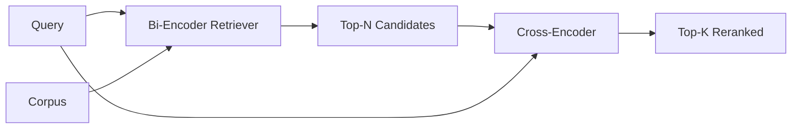

# क्रॉस-एन्कोडर रेरेंकर

> एक द्वि-संकेतक स्वतंत्र रूप से क्वेरी और दस्तावेज़ को एम्बेड करता है। एक क्रॉस-संकेतक उन्हें एक साथ जोड़ता है और दोनों को एक साथ पढ़ता है। क्रॉस-संकेतक सबसे स्मार्ट पाठक और सबसे धीमा है। द्वि-संकेतक के शीर्ष-के पर दूसरे चरण के रूप में उपयोग किया जाता है, यह अपने आप को भुगतान करता है।

**Type:** Build
**Languages:** Python
**Prerequisites:** Phase 11 lesson 06 (RAG), Phase 11 lesson 07 (advanced RAG); Phase 19 Track B foundations (lessons 20-29); Phase 19 lesson 65 (hybrid retrieval feeding this stage)
**Time:** ~90 minutes

## सीखने के लक्ष्य
- इनपुट आकार, पैरामीटर की गिनती और प्रति क्वेरी लागत द्वारा एक द्वि-एन्कोडर रिट्रीवर को क्रॉस-एन्कोडर रीरैंकर से अलग करें।
- एक छोटे क्रॉस-एन्कोडर को खरोंच से एक ट्रांसफार्मर ब्लॉक के रूप में लागू करें जो एक पैक (सवाल, दस्तावेज़) अनुक्रम का उपभोग करता है और एक एकल प्रासंगिकता स्केलर जारी करता है।
- दो चरणों में रिट्रीव-तो-रिट्रीवर पाइपलाइन का तारः एक सस्ते रिट्रीवर के साथ शीर्ष-एन को पुनर्प्राप्त करें, क्रॉस-एन्कोडर के साथ शीर्ष-के को फिर से रैंक करें, K को वापस करें।
- एक छोटे से फिचर कॉर्पस पर लटेंसी बनाम क्वालिटी कॉमर्स को मापें और किसी दिए गए लटेंसी बजट के लिए सही N चुनें।

## समस्या

एक द्वि-संकेतक एक ही वेक्टर स्थान में क्वेरी और दस्तावेज़ का नक्शा बनाता है और कोसिन द्वारा रैंक करता है। दोनों एन्कोडिंग कभी एक दूसरे को नहीं देखते हैं। मॉडल को एक दस्तावेज़ के बारे में उपयोगी सब कुछ एक एकल वेक्टर में संपीड़ित करना होता है, क्वेरी के लिए अंधा होता है। यह त्वरित है - प्रति दस्तावेज़ इंडेक्स समय पर एक एम्बेडिंग और क्वेरी समय पर एक क्वेरी - और यह कॉर्पस पैमाने पर रैंक करने का एकमात्र तरीका है।

लागत सटीकता है। एक ही समग्र विषय वाले दो दस्तावेजों में लगभग समान एम्बेडेड हो सकते हैं, भले ही उनमें से एक प्रश्न का उत्तर दे और दूसरा नहीं दे। द्वि-संकेतक उन्हें अलग नहीं कर सकता है।

एक क्रॉस-एन्कोडर क्वेरी और दस्तावेज़ को एक साथ पढ़कर इसे हल करता है। मॉडल प्राप्त करता है `[query] [SEP] [document]`एक ही अनुक्रम के रूप में, संयुक्त पर पूरा ध्यान चलाता है, और एक प्रासंगिकता स्केलार का उत्पादन करता है। दस्तावेज़ के प्रत्येक टोकन क्वेरी के प्रत्येक टोकन में भाग ले सकता है। मॉडल पूर्ण संदर्भ के साथ स्कोर का निर्णय लेता है।

लागत पारगमन है। जहां द्वि-संकेतक एक बार एम्बेड करता है और हमेशा के लिए क्वेरी करता है, क्रॉस-संकेतक प्रति (क्वेरी, दस्तावेज़) जोड़ी में एक बार चलता है। 10 मिलियन दस्तावेज़ कॉर्पस के लिए जो प्रति क्वेरी 10 मिलियन फॉरवर्ड पास है। एक अनुरोध बजट में निष्पादित नहीं होता है।

समाधान चरणबद्ध है। शीर्ष-एन को प्राप्त करने के लिए द्वि-संकेतक का उपयोग करें। क्रॉस-संकेतक का उपयोग N को शीर्ष-के में फिर से रैंक करने के लिए करें। N छोटा (50 से 200) है और क्रॉस-संकेतक की गुणवत्ता उठाना जहां मायने रखता है, केंद्रित है। कुल विलंबता अनुरोध बजट में बनी रहती है। कुल गुणवत्ता क्रॉस-संकेतक की गुणवत्ता है, जो एन पर द्वि-संकेतक की याद से सीमित है।

## अवधारणा



### क्रॉस-एन्कोडर का इनपुट आकार

मानक पैकिंग है `[CLS] query_tokens [SEP] document_tokens [SEP]`. CLS-position output को एक ही रैखिक head में डाला जाता है जो relevance scalar को आउटपुट करता है. कुछ implementations CLS के बजाय mean-pooling का उपयोग करते हैं; अंतर छोटा है. मुद्दा यह है कि मॉडल प्रति जोड़ी एक संख्या उत्पन्न करता है।

एक 22M पैरामीटर क्रॉस-एन्कोडर (प्रकाशित `ms-marco-MiniLM-L-6-v2`छोटे मॉडल विलंबता की बचत की तुलना में अधिक तेजी से गुणवत्ता खो देते हैं। बड़े मॉडल (जैसे `bge-reranker-v2-m3`568M पर पैरामीटर) ऑफ़लाइन रैंकिंग या पहले पृष्ठ पर रैंकिंग के लिए आरक्षित हैं जहां K छोटा है।

### क्यों यह सबक एक छोटे से एक को प्रशिक्षित करता है

एक वास्तविक क्रॉस-एन्कोडर एक ठीक से समायोजित एन्कोडर ट्रांसफार्मर है। उत्पादन में आप एक चेकपॉइंट लोड करते हैं और इसे चलाते हैं। इस पाठ में लक्ष्य आपको मॉडल का आकार और विलंबता गुणवत्ता वक्र का आकार दिखाना है, न कि एक अत्याधुनिक रैंकर को प्रशिक्षित करना है। इसलिए हम एक छोटा सा निर्माण करते हैं `nn.Module`एक ट्रांसफार्मर ब्लॉक, मल्टी-हेड ध्यान (4 हेड डिफ़ॉल्ट रूप से), और एक प्रतिगमन सिर के साथ। यह एक बीज से निर्धारात्मक रूप से आरंभ किया जाता है ताकि डेमो डिस्क पर वजन के बिना पुनः उत्पन्न किया जा सके।

खिलौना मॉडल फिचर कॉर्पस से सही आकार सीखता हैः प्रासंगिक क्वेरी-डॉक्यूमेंट जोड़े में अनावश्यक जोड़े की तुलना में उच्च अनुमानित स्कोर होते हैं। अंत-से-अंत पाइपलाइन द्वि-संकेतक के आउटपुट को रैंक करती है और रैंक के शीर्ष-के सोने के लेबल के साथ सहसंबंधित होते हैं।

### विलंबता बनाम गुणवत्ता

दो चरणों की पाइपलाइन में एक ट्यून करने योग्य हैः N. एक लंबे समय तक किए गए क्वेरी सेट पर 5 से 100 तक N को स्वीप करें और आपको वक्र मिलता है।

| N | Recall@1 of stage 2 | Cross-encoder forward passes per query | Latency |
|---|--------------------|---------------------------------------|---------|
| 5 | 0.62 | 5 | low |
| 20 | 0.81 | 20 | medium |
| 50 | 0.86 | 50 | high |
| 100 | 0.86 | 100 | very high |

ऊपर दिए गए आंकड़े इस आकार का चित्रण करते हैं, न कि इस फिचर्स के माप। आकार वास्तविक है। हमेशा 20 से 50 उम्मीदवारों के आसपास एक घुटना होता है जहां पुनर्व्यवस्थापन लिफ्ट संतृप्त होता है। घुटने के पीछे आप कुछ भी नहीं देते हैं।

मूल्यांकन वक्र से N चुनें प्लस विलंबता बजट। क्रॉस-एन्कोडर N पर द्वि-एन्कोडर की याद से ऊपर याद नहीं कर सकता है, इसलिए कम N गुणवत्ता कैप करता है, न कि केवल विलंबता।

```figure
rerank-funnel
```

## इसे बनाओ

`code/main.py`कार्य करता हैः

- `CrossEncoder`- एक छोटी सी`torch.nn.Module`: टोकन एम्बेडिंग, एक ट्रांसफार्मर ब्लॉक जिसमें मल्टी-हेड ध्यान और फीड फॉरवर्ड, औसत-पूल सिर एक स्केलर का उत्पादन करता है।
- `tokenize_pair(query, document)`- दो स्ट्रिंगों को एक एकल आईडी अनुक्रम में पैक करता है जिसमें सीमा, निर्धारक और stdlib को चिह्नित करने वाले प्रकार आईडी हैं।
- `train_tiny(pairs)`- एक अनुशासित प्रशिक्षण के पास एक हस्त लेबल (सवाल, दस्तावेज, प्रासंगिकता) त्रिगुट सूची पर, ताकि मॉडल फिक्स्ड पर उचित स्कोर उत्पन्न करता है।
- `rerank(query, candidates, top_k)`- उत्पादन इंटरफ़ेस।
- `pipeline(query, retriever, top_n, top_k)`- दो चरणों के प्रवाह.
- एक डेमो `main()`जो पाठ 65 के पैटर्न से corpus लोड करता है, शीर्ष-एन प्राप्त करता है, शीर्ष-के के लिए रैंक करता है, दोनों सूची को एक साथ प्रिंट करता है, और प्रत्येक चरण की विलंबता की रिपोर्ट करता है।

इसे चलाओः

```bash
python3 code/main.py
```

आउटपुट में द्वि-संकेतक का शीर्ष-एन, क्रॉस-संकेतक का शीर्ष-के और एक समय सार दिखाया गया है। क्रॉस-संकेतक प्रति कॉल अधिक समय लेता है लेकिन पूरे कॉर्पस पर नहीं चलता है। दो चरणों का कुल अनुरोध बजट के भीतर रहता है जबकि उत्तर चुनता है कि द्वि-संकेतक दूसरे या तीसरे स्थान पर है।

## विफलता मोड डेमो छिपा जाएगा

**Cross-encoder is not symmetric.** `rerank(q, d)`और `rerank(d, q)`हमेशा पहले क्वेरी को फ़ीड करें यदि आप गलती से स्विच करते हैं, तो याद दिलाना टूट जाता है।

**N is too low to expose the bug.**यदि आप N = K सेट करते हैं, तो क्रॉस-एन्कोडर को फिर से क्रमबद्ध नहीं किया जा सकता है; यह केवल पुनः वजन कर सकता है। लिफ्ट शून्य दिखता है। N को कम से कम तीन बार K चुनें।

**Training data leaks into the eval.**यदि हाथ से लेबल प्रशिक्षण जोड़े मूल्यांकन प्रश्नों को शामिल करते हैं, तो पुनर्व्यवस्था जादुई लग रहा है. सख्ती से ट्रेन और मूल्यांकन को अलग करें, यहां तक कि एक निश्चित पर भी।

**Production weights are dense.**22M पैरामीटर क्रॉस-एन्कोडर 88MB है।

**Batching matters.**एक वास्तविक क्रॉस-एन्कोडर एक बैच में N उम्मीदवारों को चलाता है। यह पाठ यह करता है कि में`_batch_encode`, जो बैच आईडी और टाइप आईडी tensors के साथ बनाता है `torch.tensor(...)`और आगे एक पास चलाता है. बैचिंग छोड़ दें और विलंबता N से गुणा किया जाता है.

## इसका प्रयोग करें

उत्पादन के पैटर्नः

- दो-संकेतक, क्रॉस-संकेतक और N को एक साथ चिपकाएं। किसी एक को बदलना मूल्यांकन को अमान्य करता है।
- (query, document_id) हैश द्वारा पुनर्रैंकर के आउटपुट को कैश करें। एक स्थिर कॉर्पस के खिलाफ एक ही क्वेरी एक ही क्रम में रैंक करती है; कैश हिट आपको एक मुफ्त विलंबता कटौती खरीदते हैं।
- रैंक-1 क्रॉस-एन्कोडर स्कोर को लॉग करें। एक क्वेरी जिसका टॉप-1 स्कोर एक कॉर्पस-विशिष्ट सीमा से नीचे है, एक आउट-ऑफ-डोमेन हिट है; इसे एलएलएम में "मुझे यकीन नहीं है" के रूप में पृष्ठ पर रखें।

## इसे भेजें

पाठ 68 इस दो चरणों की पाइपलाइन का अंत से अंत तक मूल्यांकन करता है। पाठ 69 इस रिरेंकर को पाठ 65 से हाइब्रिड रिट्रीवर के पीछे और उत्तर जनरेटर के सामने तारों से जोड़ता है। रिरेंकर अंत से अंत प्रणाली का दूसरा चरण है।

## व्यायाम

1. 5 से 50 तक N को स्केच करें और पुनः रैंक किए गए आउटपुट का रिकॉल@1 का पता लगाएं। इस फिचर्स पर घुटने को खोजें।
2. क्रॉस-एन्कोडर को एक के बजाय दस युगों के लिए प्रशिक्षित करें। प्रत्येक युग में सकारात्मक और नकारात्मक जोड़े के बीच स्कोर-मारजिन को मापें।
3. एक CLS-टोकन सिर के साथ औसत-साझापन की जगह. इस फिचर्स पर अभिसरण की तुलना करें.
4. एक दूसरे क्रॉस-एन्कोडर हेड जोड़ें जो बाइनरी "यह दस्तावेज़ में उत्तर है" लेबल की भविष्यवाणी करता है। निष्कर्ष पर दोनों हेड का उपयोग करें; एक रैंक करने के लिए, एक सीमा तक।
5. निर्धारक नकली द्वि-संकेतक को पाठ 65 से बदलकर दो चरणों को श्रृंखलाबद्ध करें। केवल शीर्ष-के बनाम द्वि-संकेतक में परिवर्तन को मापें।

## प्रमुख शर्तें

| Term | What people say | What it actually means |
|------|-----------------|------------------------|
| Bi-encoder | "Vector retriever" | Encodes query and doc independently; cosine ranks them |
| Cross-encoder | "Reranker" | Encodes (query, doc) jointly; outputs one relevance scalar |
| Two-stage pipeline | "Retrieve and rerank" | Cheap retriever returns N, expensive reranker keeps K |
| N (candidate budget) | "Rerank pool" | The number of candidates the cross-encoder scores per query |
| Mean-pooling head | "Mean of last hidden" | Average the encoder's last-layer outputs into one vector |

## आगे पढ़ना

- नोगुएरा, चो, "BERT के साथ पासज री-रैंकिंग", 2019 - कैनोनिक क्रॉस-एन्कोडर रैंकर पेपर
- रीमर, गुरेविच, "सेंटेंस-BERT: सियामी BERT-नेटवर्क का उपयोग करके वाक्य एम्बेडिंग", 2019 - बि-एन्कोडर बनाम क्रॉस-एन्कोडर पर
- [SentenceTransformers Cross-Encoders documentation](https://www.sbert.net/examples/applications/cross-encoder/README.html)
- [BGE Reranker v2 model card](https://huggingface.co/BAAI/bge-reranker-v2-m3)
- चरण 19 पाठ 65 - इस पुनर्व्यवस्थित चरण को खिला हाइब्रिड रिट्रीवर
- चरण 19 पाठ 68 - मूल्यांकन जो इस पुनर्व्यवस्थापन प्रदान करता है की वृद्धि को मापता है
