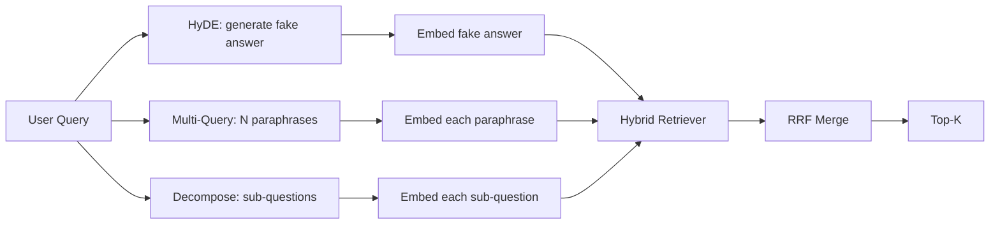

# क्वेरी रीराइटिंगः हाइडे, मल्टी-क्वेरी और डिस्कोम्पोशन

> उपयोगकर्ता द्वारा टाइप किया गया क्वेरी आपके रिट्रीवर की इच्छा का क्वेरी नहीं है। पुनर्लेखन रिट्रीवर से पहले अंतर को पुल करता है, इसलिए सूचकांक कुछ ऐसा देखता है जो उत्तर के करीब है।

**Type:** Build
**Languages:** Python
**Prerequisites:** Phase 11 lessons 04 (embeddings), 06 (RAG); Phase 19 Track B foundations (lessons 20-29); Phase 19 lessons 64 and 65
**Time:** ~90 minutes

## सीखने के लक्ष्य
- हाइपोथेटिक दस्तावेज़ एम्बेडिंग (HyDE) लागू करेंः एक नकली उत्तर उत्पन्न करें, इसे एम्बेड करें, क्वेरी वेक्टर के बजाय उस वेक्टर के खिलाफ पुनर्प्राप्त करें।
- बहु-प्रश्न विस्तार लागू करेंः N पैराफ्रेसेस में एक प्रश्न को फिर से लिखें, प्रत्येक के साथ प्राप्त करें, प्रतिपक्षीय रैंक संलयन द्वारा संघ को मिलाएं।
- क्वेरी विघटन लागू करेंः एक जटिल प्रश्न को उप-सवाल में विभाजित करें, प्रति उप-सवाल प्राप्त करें, विलय करें।
- एक निश्चित पर तीनों को एक दूसरे के सामने तुलना करें और बताएं कि प्रत्येक रणनीति कब जीतती है।
- एक नकली LLM तार जो निर्धारक, फिक्स्चर पर आउटपुट उत्पन्न करता है ताकि rewriter लूप ऑफ़लाइन चलाता है।

## समस्या

एक उपयोगकर्ता टाइप करता है "जब अपलोड विफल हो जाते हैं और बजट गायब हो जाता है तो हमारी टीम क्या करती है? " कॉर्पस में एक दस्तावेज़ है जो कहता है "AbortMultipartOnFail उड़ान में एक S3 मल्टीपार्ट अपलोड को समाप्त करता है और अपलोड विफल होने पर प्रति बाल्टी पुनः प्रयास बजट को कम करता है। प्रश्न और दस्तावेज़ में कोई संज्ञा नहीं है। BM25 चूक गया। द्वि-संकेतक दस्तावेज़ को तीसरे या चौथे स्थान पर रखता है क्योंकि क्वेरी वेक्टर एम्बेडिंग स्पेस के एक क्षेत्र में लैंड करता है जो रद्द किए गए कार्यों के बारे में डॉक को प्राथमिकता देता है, अपलोडों के बारे में डॉक नहीं। पाठ 66 से दो चरणों का पुनर्व्यवस्थापन उत्तर को बचा सकता है यदि यह शीर्ष-एन में बैठता है, लेकिन यदि यह शीर्ष-एन तक नहीं पहुंचता है, तो पुनर्व्यवस्थापक इसे कभी नहीं देखता है।

समाधान यह है कि यह रिट्रीवर को छूने से पहले क्वेरी को फिर से लिखना है। 2023 के पेपर "प्रासंगिकता लेबल के बिना सटीक शून्य-शॉट घने पुनर्प्राप्ति" (गाओ एट अल) ने हाइडे पेश कियाः एक एलएलएम से दस्तावेज़ लिखने के लिए कहें जो क्वेरी का जवाब देगा, उस परिकल्पनात्मक दस्तावेज़ को एम्बेड करेगा, और इसके एम्बेडिंग का उपयोग पुनर्प्राप्ति वेक्टर के रूप में करेगा। परिकल्पनात्मक दस्तावेज सम्मिलित स्थान के दाहिने भाग में स्थित है क्योंकि यह कॉर्पस की आवाज में लिखा गया है। क्वेरी वेक्टर नहीं किया।

HyDE के साथ दो चचेरे भाई तकनीक जोड़ी. मल्टी-क्वेरी एक्सटेंशन (माइक्रोसॉफ्ट के ग्राफ्राग शब्द का उपयोग किया जाता है) क्वेरी के N पैराफ्रेसेस उत्पन्न करता है और प्रत्येक के साथ प्राप्त करता है, फिर विलय करता है। विघटन (स्टैनफोर्ड डीएसपीई काम 2024 में "सब्क्वेरी विघटन" के रूप में लोकप्रिय) "जब अपलोड विफल हो जाते हैं और बजट गायब हो जाता है तो हमारी टीम क्या करती है" को दो सवालों में विभाजित करती हैः "जब अपलोड विफल होता है तो क्या होता है" और "जब पुनः प्रयास बजट गायब होता है तो क्या होता है"। दो खोजें, एक मिला परिणाम, दोनों उत्तर के टुकड़े उपलब्ध हैं।

यह सबक तीनों को लागू करता है और उन्हें एक ही फिचर्स कॉर्पस के खिलाफ चलाता है।

## अवधारणा



### HyDE विस्तार से

हाइडे उपयोगकर्ता के क्वेरी वेक्टर को LLM-लिखित परिकल्पनात्मक दस्तावेज़ वेक्टर से बदल देता है। प्रॉम्प्ट छोटा हैः

```
You are a domain expert. Write a one-paragraph passage that answers the question
below. Use the same vocabulary and phrasing the documentation in this domain would
use. Do not refuse. Do not say you do not know.

Question: {user_query}

Passage:
```

LLM का उत्तर तथ्यगत उत्तर के रूप में गलत है क्योंकि LLM आपके corpus को नहीं जानता है। यह ठीक है. रिट्रीवर को तथ्यात्मक सटीकता की परवाह नहीं है, केवल टोकन वितरण की परवाह है। परिकल्पनात्मक अंश में "बॉर्न", "मल्टि पार्ट", "बकेट", "बजट" शब्द होते हैं, क्योंकि इस विषय पर दस्तावेज में यही कहा जाता है। उस मार्ग को सम्मिलित करें। वेक्टर वास्तविक मार्ग के पास उतरता है।

उत्पादन में आप दो या तीन वाक्य में परिकल्पनात्मक दस्तावेज को सीमित करते हैं। लंबे परिकल्पनात्मक अधिक शोर एकत्र करते हैं। छोटे परिकल्पनात्मक संकेत HyDE की आवश्यकता है खो देते हैं।

### बहु-प्रश्न विस्तार विस्तार

उपयोगकर्ता के क्वेरी के N पैराफ्रेसेस उत्पन्न करें. सबसे सरल संकेतः

```
Rewrite the following question in {N} different ways. Each rewrite must preserve
the original intent. Number them 1 to {N}. Do not add explanations.
```

प्रत्येक पैराफ्रेज के लिए शीर्ष-के प्राप्त करें। एन रैंक की गई सूचियों को आरआरएफ (पाठ 65 से एक ही एल्गोरिथ्म) के साथ मिलाएं। सस्ता, समानांतर, निर्धारात्मक।

मल्टी-क्वेरी तब जीतती है जब उपयोगकर्ता का वाक्यांश प्रश्न पूछने के कई समान रूप से मान्य तरीकों में से एक है, और किसी भी रीराइट ने इसे बेहतर पूछा होगा। जब सभी रीराइट समान रूप से खराब होते हैं क्योंकि मूल उसी तरह से खराब था।

### विस्तार से विघटन

एक एकल रिट्रीव एक बहुआयामी प्रश्न को संतुष्ट नहीं कर सकता है। विघटन LLM से प्रश्न को उप-प्रश्न में विभाजित करने के लिए कहता है और प्रणाली प्रति उप-प्रश्न को प्राप्त करती है।

```
The following question may require information from multiple distinct topics.
Decompose it into a list of sub-questions. Each sub-question must be answerable
independently. If the question is already atomic, return it unchanged.

Question: {user_query}
```

प्रति उपप्रश्न पुनः प्राप्त करें. विलय करें. विघटन उन प्रश्नों के लिए सही उपकरण है जिनमें संयोजन, बहु-खंड तुलना या दो संबंधित विषय शामिल हैं। परमाणु प्रश्नों के लिए गलत उपकरण; विघटनकर्ता का काम एकल प्रश्न को वापस करना है और नकली उपप्रश्न का आविष्कार नहीं करना है।

### तीनों का अस्तित्व क्यों है

तीनों पूरक हैं। हाइडे क्वेरी-कॉर्पस टोकन अंतर को पूरा करता है। मल्टी क्वेरी पैराफ्रेस भिन्नता को कवर करती है। विघटन बहु-विषयक क्वेरी को कवर करता है। एक उत्पादन प्रणाली तीनों को चलाती है और क्वेरी प्रति रणनीति का चयन करती है (पाठ 69 की अंत-से-अंत प्रणाली चयनकर्ता को दिखाती है) ।

## नकली LLM

पाठ ऑफ़लाइन चलता है. नकली एलएलएम उपयोगकर्ता के क्वेरी पर कुंजीबद्ध एक छोटी खोज तालिका है, साथ ही उसने नहीं देखे गए क्वेरी के लिए एक बैकअप है। खोज तालिका में शामिल हैंः

- प्रत्येक फिक्स्चर क्वेरी के लिए: एक लिखित परिकल्पनात्मक अंश, तीन पैराफ्रेसेस, और एक विघटन।
- अज्ञात क्वेरी के लिएः एक निर्धारात्मक परिवर्तनः क्वेरी के सामग्री शब्दों को ले लो, उन्हें एक पर्यायवाची मानचित्र के माध्यम से विस्तारित करें, और परिणाम लौटाएं।

नकली का आकार ही मायने रखता है, डेटा नहीं. उत्पादन में आप नकली को वास्तविक मॉडल कॉल के लिए बदल देते हैं. रिट्रीवर नहीं बदलता है।

```figure
cd-hyde-vector
```

## इसे बनाओ

`code/main.py`कार्य करता हैः

- `MockLLM`- उपर्युक्त निर्धारक प्रतिस्थापन।
- `HyDERewriter`- एलएलएम को परिकल्पनात्मक दस्तावेज लिखने के लिए बुलाता है, फिर से लिखने वाले आउटपुट को वापस देता है `RewriteResult`परिकल्पनात्मक पाठ और क्वेरी रिट्रीवर का उपयोग करना चाहिए के साथ।
- `MultiQueryRewriter`- LLM को N पैराफ्रेसेस के लिए बुलाता है, प्रश्नों की सूची देता है।
- `DecomposeRewriter`- LLM को विघटित करने के लिए कहता है, उप-प्रश्न वापस करता है।
- `retrieve_with_rewriter`- एक रिवाइटर और एक रिट्रीवर लेता है, रीवाइट करता है, परिणामों को मिलाता है।
- एक डेमो जो एक फिक्स्चर पर तीनों रीराइटर्स को चलाता है और प्रिंट करता है कि कौन सी रणनीति पहले स्वर्ण उत्तर दस्तावेज लौटाता है।

रिट्रीवर आकार पाठ 65 (हाइब्रिड BM25 + घने) से पुनः उपयोग किया जाता है। विलय एक ही RRF है। एकमात्र नया आकार रिवाइटर इंटरफ़ेस है, जो छोटा है।

इसे चलाओः

```bash
python3 code/main.py
```

आउटपुट प्रति रणनीति रैंकिंग और एक अंतिम सारांश है। HyDE वाक्यांश-असंगत क्वेरी पर जीतता है। बहु-क्वेरी पैराफ्रेज-वैरिएंस क्वेरी पर जीतता है। विघटन बहु-विषयक क्वेरी पर जीतता है। फॉलबैक (कोई रीराइटर) कम से कम तीन में से एक पर हारता है।

## विफलता मोड डेमो छिपा जाएगा

**HyDE hallucinates corpus-specific identifiers wrong.**मॉडल एक फ़ंक्शन नाम का आविष्कार करता है। दाईं ओर डॉक पर परिकल्पनात्मक BM25 स्कोर गिर जाता है क्योंकि आविष्कारित नाम अब एक उच्च वजन वाला टोकन है जो सूचकांक में दिखाई नहीं देता है। संलयन में परिकल्पनात्मक की लंबाई और वजन BM25 को कम करें।

**Multi-query rewrites all converge.**एक कमजोर मॉडल तीन लगभग समान पैराफ्रेसेस का उत्पादन करता है। N रिट्रीवल एक ही शीर्ष-के को वापस करते हैं। RRF विलय एक एकल रिट्रीवल से बेहतर नहीं है। पुनः लेखन प्रॉम्प्ट में स्पष्ट विविधता निर्देश जोड़ें और जैकार्ड द्वारा डुप्लिकेट का पता लगाएं।

**Decomposition over-splits.**डिस्कोम्पोसर एक परमाणु प्रश्न को एक सूची में बदल देता है। सभी खोजें एक ही दस्तावेज़ को वापस करती हैं लेकिन कम रैंक के साथ। विलय मूल से बदतर है। फैन-आउट से पहले "क्या ये उप-प्रश्न पर्याप्त रूप से अलग हैं" पास के साथ इसका पता लगाएं।

**Latency multiplies.**HyDE एक LLM कॉल की लागत है। N पुनः लिखने के लिए एक LLM कॉल की लागत है, फिर N पुनर्प्राप्त करने के लिए। विघटन एक LLM कॉल को विघटित करने के लिए लागत है, फिर M पुनर्प्राप्त करने के लिए लागत है। पुनर्प्राप्त करने के लिए समानांतर चल रहे हैं; LLM कॉल मंजिल है।

## इसका प्रयोग करें

उत्पादन के पैटर्नः

- प्रति क्वेरी रणनीति चयन क्वेरी लंबाई के अनुसारः परमाणु लघु क्वेरी बहु-क्वेरी प्राप्त, जटिल बहु-खंड क्वेरी विघटन प्राप्त, जार्गोन भारी क्वेरी HyDE प्राप्त.
- क्वेरी हैश द्वारा पुनर्लेखन आउटपुट को कैश करें. कई क्वेरी दोहराएं।
- तीनों को समानांतर में चलाएं और तीन परिणाम सेट को आरआरएफ के साथ एक में मिलाएं। लागत तीन एलएलएम कॉल और एक विलय है; गुणवत्ता तीनों रणनीतियों की कवरेज का संघ है।

## इसे भेजें

पाठ 69 इस रीराइटर चरण को पाठ 65 से रिट्रीवर और पाठ 66 से रिरांकर से पहले तार करता है। पाठ 68 में रीराइटर ने रिट्रीवर को याद करने में जोड़ा गया लिफ्ट का मूल्यांकन किया गया है।

## व्यायाम

1. RAG-Fusion लागू करें (मल्टी-क्वेरी का 2024 संस्करण) जहां रिवाइटर के पैराफ्रेसेस जानबूझकर विविध हैं, फिर री रैंक चरण (पाठ 66) अंतिम सूची चुनता है।
2. एक चौथी रणनीति जोड़ेंः कदम पीछे की ओर प्रेरित करना (एलएलएम से अधिक सामान्य प्रश्न पूछें, उस पर वापस जाएं, फिर संकीर्ण करें) ।
3. "प्रश्न परमाणु है" शीर्षक जोड़कर परमाणु प्रश्नों को पहचानने के लिए डिस्कोम्पोसर को प्रशिक्षित करें। इससे पहले और बाद में अति-विभाजन दर को मापें।
4. एक असली मॉडल कॉल के साथ नकली LLM की जगह लें. अपने स्टैक पर प्रति रणनीति विलंबता मापें.
5. प्रति प्रतिपुनः लेखन एक विश्वास स्कोर जोड़ें। प्रतिपुनः लेखन को सीमा से नीचे छोड़ दें। याद करने पर प्रभाव मापें।

## प्रमुख शर्तें

| Term | What people say | What it actually means |
|------|-----------------|------------------------|
| HyDE | "Fake-document retrieval" | LLM writes the answer; embed and retrieve on that instead of the query |
| Multi-query | "Paraphrase expansion" | N rewrites of the query; retrieve N times, merge by RRF |
| Decomposition | "Subquery split" | Multi-topic queries split into sub-questions, retrieved separately |
| Atomic query | "Single-topic" | Cannot be decomposed without inventing fake sub-questions |
| Step-back | "Abstract the query" | Ask the more general question, retrieve, then narrow |

## आगे पढ़ना

- गाओ, मा, लिन, कैलान, "सटीक शून्य-शॉट घने पुनर्प्राप्ति प्रासंगिकता लेबल के बिना" (HyDE), 2023
- माइक्रोसॉफ्ट रिसर्च, "रिट्रीवल के लिए मल्टी-क्वेरी एक्सटेंशन"
- स्टैनफोर्ड डीएसपी, "मल्टी-हॉप क्यूए के लिए उप-प्रश्न विघटन"
- [LlamaIndex query transformations documentation](https://docs.llamaindex.ai/en/stable/optimizing/advanced_retrieval/query_transformations/)
- चरण 11 पाठ 07 - उन्नत आरएजी पैटर्न
- चरण 19 पाठ 65 - रिट्रीवर इस rewriter फीड
- चरण 19 पाठ 68 - मूल्यांकन जो रीराइटर लिफ्ट को मापता है
