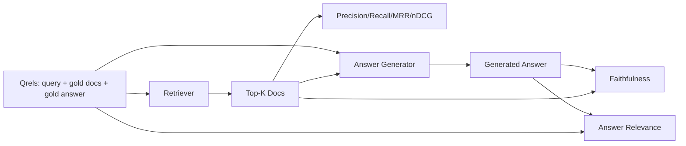

# आरएजी मूल्यांकनः सटीकता, याद दिलाना, एमआरआर, एनडीसीजी, निष्ठा, उत्तर प्रासंगिकता

> यदि आप एक ही समय में अपने रिट्रीवर और अपने उत्तर को ग्रेड नहीं कर सकते हैं, तो आप सिस्टम को भेज नहीं सकते। दोनों एक ही मीट्रिक नहीं हैं और एक ही प्रॉम्प्ट अलग-अलग अक्षों पर विफलता है।

**Type:** Build
**Languages:** Python
**Prerequisites:** Phase 11 lessons 06 (RAG), 10 (evaluation); Phase 19 Track B foundations (lessons 20-29); Phase 19 lessons 64, 65, 66, 67
**Time:** ~90 minutes

## सीखने के लक्ष्य
- सोने के qrels से चार निकासी मीट्रिक की गणना करें: precision@k, recall@k, MRR (मीडियाना रिपिरोक्ल रैंक), और nDCG@k।
- उत्तर ग्रेड के दो मापों की गणना करेंः निष्ठा (प्रत्येक दावे प्राप्त संदर्भ में आधारित) और उत्तर प्रासंगिकता (जवाब प्रश्न को संबोधित करता है) ।
- एक फिक्स्चर qrels फ़ाइल (सवाल, स्वर्ण दस्तावेज़ आईडी, स्वर्ण उत्तर पाठ) का निर्माण करें जो मूल्यांकन अंत से अंत तक पढ़ता है।
- पाइपलाइन विफलता का निदान करने के लिए मीट्रिक मान पढ़ेंः पुनर्प्राप्ति, रैंकिंग, पीढ़ी या जमीनीकरण।

## समस्या

एक आरएजी प्रणाली में कम से कम चार चल रहे भाग हैंः चंकर, रिट्रीवर, रीरेंकर, जनरेटर। उनमें से कोई भी गलत उत्तर का कारण हो सकता है। प्रत्येक चरण के माप के बिना आप अंधे उड़ रहे हैं।

एक उपयोगकर्ता एक गलत उत्तर की रिपोर्ट करता है। क्या यह इसलिए है क्योंकि चंकर ने उत्तर अवधि को कम कर दिया है? क्या यह इसलिए है क्योंकि रिट्रीवर ने शीर्ष-के में चंकर को शामिल नहीं किया है? क्या यह इसलिए है क्योंकि रीरेंकर ने सही चंकर को स्थिति 1 से आगे धकेल दिया है? क्या यह इसलिए है क्योंकि जनरेटर ने चंकर को अनदेखा कर कुछ बनाया है? आप अकेले उत्तर से नहीं बता सकते। आपको आवश्यकता हैः

- रिट्रीवर से बाहर आया था क्या रेटिंग के लिए पुनर्प्राप्ति मीट्रिक.
- सही टुकड़ा क्रम में बैठ गया था जहां ग्रेड करने के लिए माप क्रमबद्ध।
- यह दर्जा देने के लिए निष्ठा कि क्या जनरेटर पुनर्प्राप्त संदर्भ के भीतर रहा।
- उत्तर उत्तर के उत्तर से संबंधित प्रश्न का उत्तर मिलता है या नहीं, यह प्रश्न के उत्तर के लिए प्रासंगिकता है।

यह सबक एक फिक्स्चर qrels फ़ाइल के ऊपर बना है। मूल्यांकन ऑफ़लाइन और निर्धारात्मक है; उत्पादन में आप एक वास्तविक के लिए नकली LLM-जैसे-जिज के लिए आदान-प्रदान।

## अवधारणा



### Precision@k

यदि सोने में तीन दस्तावेज हैं और शीर्ष-3 में दो और एक गलत दस्तावेज हैं, तो सटीकता@3 2 / 3 है। जब एक अनावश्यक निकाले गए टुकड़े की लागत अधिक हो तो सटीकता का उपयोग करें (जनरेटर उस पर टोकन बर्बाद करता है, या टुकड़ा जवाब को जहर देता है) ।

### याद करना

यदि सोने में तीन दस्तावेज हैं और शीर्ष-5 में सभी तीन हैं, तो recall@5 1.0 है। जब एक चूक उत्तर की लागत अधिक हो तो याद करने का उपयोग करें (आप उत्तर भाग को पूरी तरह से याद करने की तुलना में एक अतिरिक्त गलत टुकड़ा देखना पसंद करेंगे) ।

उत्पादन में, रेग में, सामान्य तौर पर लोगों का उद्धरण याद@k है। पीढ़ी आसानी से अप्रासंगिक टुकड़े छोड़ सकती है; वह एक टुकड़े से जवाब नहीं बना सकती है जिसे उसने कभी नहीं देखा है।

### एमआरआर (मध्यम पारस्परिक रैंक)

प्रत्येक क्वेरी के लिए, रैंक की गई सूची में पहले प्रासंगिक दस्तावेज़ की स्थिति खोजें। पारस्परिक रैंक 1 / स्थिति है। क्वेरी सेट के माध्यम से औसत। एमआरआर एक एकल संख्या सारांश है कि रिट्रीवर शीर्ष पर सबसे अच्छा उत्तर कितना अच्छी तरह से रखता है।

MRR स्थिति-1 को भारी वजन देता है। एक क्वेरी जहां गोल्ड डॉक 1 पर है, 1.0 योगदान देता है। रैंक 2 योगदान देता है। रैंक 10 योगदान देता है 0.1. मेट्रिक सूची के शीर्ष पर हावी है।

### nDCG@k

सामान्यीकृत छूट संचयी लाभ। पूर्ण सूत्र प्रत्येक प्राप्त दस्तावेज़ (अक्सर प्रासंगिक के लिए 1, 0 के लिए नहीं) को लाभ, स्थिति के लॉग द्वारा छूट, योग और आदर्श डीसीजी (यदि आप सही रैंक करते तो आपके पास होगा) द्वारा विभाजित करता है। रेंज 0 से 1.

nDCG ग्रेड प्रासंगिकता समायोजित करता हैः सोने में कहा जा सकता है "doc A 3 है, doc B 2 है, doc C 1 है। MRR और recall@k सब कुछ द्विआधारी पर समतल करते हैं। nDCG का उपयोग करें जब कॉर्पस में प्रति क्वेरी कई आंशिक रूप से प्रासंगिक दस्तावेज होते हैं।

### वफादार

उत्पन्न उत्तर में प्रत्येक दावे के लिए, जांचें कि क्या दावा पुनर्प्राप्त संदर्भ द्वारा समर्थित है। मानक कार्यान्वयन में एक एलएलएम-जैसे-जिज प्रॉम्प्ट का उपयोग किया जाता है जो लेता है (अर्ज, संदर्भ) और हाँ या नहीं देता है। मीट्रिक उन दावों का अंश है जो पारित होते हैं।

ईमानदारी जनरेटर विफलता मोड को पकड़ती है जहां मॉडल सामग्री का आविष्कार करता है। भले ही रिट्रीवर सही टुकड़े लौटाता है, एक जनरेटर जो भ्रम पैदा करता है टूट जाता है। ईमानदारी को जमीनीकरण, समर्थन, श्रेय भी कहा जाता है।

इस सबक में एक निर्धारक नकली न्यायाधीश के साथ वफादारी को लागू किया जाता है जो जांचता है कि क्या प्रत्येक दावे के टोकन एक सीमा से प्राप्त संदर्भ को ओवरलैप करते हैं। उत्पादन में आप एक वास्तविक मॉडल कॉल के लिए स्विच करते हैं। मीट्रिक का आकार समान है।

### उत्तर प्रासंगिकता

क्या जवाब वास्तव में प्रश्न को संबोधित करता है? ईमानदारी पूछता है "क्या उत्तर संदर्भ में आधारित है?" जवाब प्रासंगिकता पूछता है "क्या उत्तर प्रश्न में आधारित है?" एक ईमानदार लेकिन विषय से बाहर उत्तर ईमानदारी पर उच्च और प्रासंगिकता पर कम अंक देता है। एक छोटा, विषय पर उत्तर जो संदर्भ को अनदेखा करता है प्रासंगिकता पर उच्च और ईमानदारी पर कम अंक देता है।

मानक कार्यान्वयन में एलएलएम-जैसे-जजः ले (प्रश्न, उत्तर) का भी उपयोग किया जाता है और पूछा जाता है कि क्या उत्तर प्रश्न को संबोधित करता है। इस पाठ में एक टोकन ओवरलैप-प्लस-जज स्टैंड-इन लागू होता है।

## पट्टा

```python
{
  "qid": "q1",
  "query": "what is the abort threshold for multipart uploads",
  "gold_doc_ids": ["d1", "d3"],
  "gold_answer_substring": "three failed parts",
  "graded_relevance": {"d1": 3, "d3": 2},
}
```

प्रत्येक क्वेरी में निम्नलिखित शामिल हैंः
- क्वेरी स्ट्रिंग,
- सोने के डॉक्यूमेंट आईडी का एक सेट (सटीकता / याद करने / एमआरआर के लिए),
- एक ग्रेड प्रासंगिकता दीक्षा (nDCG के लिए),
- सुनहरे उत्तर सबस्ट्रिंग (प्रत्येक qrel पर संदर्भ मेटाडेटा के रूप में रखा जाता है; इस पाठ में निष्ठा का गणना निकाले गए संदर्भ के आधार पर निकाले गए दावों का न्याय करके की जाती है, इस सबस्ट्रिंग के खिलाफ नहीं) ।

उत्पादन में आप इन को लेबल करते हैं। यह पाठ एक हाथ से निर्मित फिटिंग भेजता है ताकि मूल्यांकन बॉक्स से बाहर चला जाता है।

```figure
ci-rag-metric-ladder
```

## इसे बनाओ

`code/main.py`कार्य करता हैः

- `precision_at_k(retrieved, gold, k)`- शाब्दिक परिभाषा।
- `recall_at_k(retrieved, gold, k)`- शाब्दिक परिभाषा।
- `mean_reciprocal_rank(retrieved_list_of_lists, gold_list)`- प्रश्नों के बारे में औसत।
- `ndcg_at_k(retrieved, graded_relevance, k)`- बाइनरी या ग्रेड लाभ के साथ डीसीजी/आईडीसीजी।
- `extract_claims(answer)`- जवाब को वाक्य के रूप में दावा में विभाजित करता है।
- `faithfulness(claims, context_texts, judge)`- समर्थित होने के लिए माना जाने वाले दावों का अंश।
- `answer_relevance(question, answer, judge)`- यह निर्णय लें कि क्या उत्तर प्रश्न को संबोधित करता है।
- `MockJudge`- निर्धारक टोकन ओवरलैप न्यायाधीश तो मूल्यांकन ऑफ़लाइन चलाता है.
- `evaluate_pipeline(pipeline_fn, qrels, ks)`- ऑर्केस्ट्रेटर जो हर मीट्रिक चलाता है.
- एक डेमो जो तीन पाइपलाइन संस्करणों (चंकर बेसलाइन, हाइब्रिड रिट्रीवल, हाइब्रिड + री रैंक) को qrels के खिलाफ चलाता है और एक मेट्रिक्स तालिका प्रिंट करता है।

इसे चलाओः

```bash
python3 code/main.py
```

आउटपुट एक एकल मीट्रिक तालिका में प्रत्येक संस्करण के लिए सटीकता@k, recall@k, MRR, nDCG@k, वफादारी और उत्तर प्रासंगिकता दिखाता है। हाइब्रिड रिकवरी पंक्ति रिकॉल पर चंकर बेसलाइन से बेहतर है; रीरैंक पंक्ति MRR पर हाइब्रिड से बेहतर है।

## विफलताओं का निदान करने के लिए माप पढ़ने

| Symptom | Likely cause | What to fix |
|---------|-------------|-------------|
| Low recall@k, low precision@k | Chunker cut the answer or retriever cannot find it | Chunker boundaries (lesson 64) or retriever modality (lesson 65) |
| Decent recall@k, low MRR | Right chunk is in top-k but not at position 1 | Reranker (lesson 66) |
| High MRR, low faithfulness | Generator invents content despite right context | Generation prompt; force-cite-or-refuse |
| High faithfulness, low relevance | Answer is grounded but off-topic | Query rewriter (lesson 67) or generation prompt |
| All four high, users still complain | Eval set is unrepresentative | Expand qrels with real user queries |

## विफलता मोड डेमो छिपा जाएगा

**LLM-as-judge bias.**एक मॉडल अपने स्वयं के आउटपुट को उनके मुकाबले अधिक वफादार मानता है।

**Qrels rot.**जनवरी 2024 में Q1 के लिए एक डॉक्यूमेंट जो Q1 के लिए सोना था, अब अक्टूबर 2024 में सही उत्तर नहीं है क्योंकि टीम ने फ़ंक्शन का नाम बदल दिया है। एक तिमाही Qrels समीक्षा निर्धारित करें।

**Faithfulness micro-checks miss macro-claims.**प्रति वाक्य निष्ठा तब भी हो सकती है जब समग्र उत्तर की संरचना भ्रामक हो। स्वचालित मेट्रिक के ऊपर नमूना स्तर की गुणात्मक समीक्षा जोड़ें।

**Recall@k masks per-query failures.**90% औसत यादगार एक क्वेरी वर्ग हमेशा याद कर सकते हैं छिपा. क्वेरी वर्ग (साहित्य, पैराफ्रेस्ड, बहु-विषयक) द्वारा क्वेरी वर्गों का स्लाइस करें और प्रति स्लाइस रिपोर्ट करें।

## इसका प्रयोग करें

उत्पादन के पैटर्नः

- प्रत्येक रिट्रीवर या जनरेटर परिवर्तन पर मूल्यांकन चलाएं। एक याद @ k प्रतिगमन परीक्षण विफलता के रूप में इलाज करें।
- जब कोई उपयोगकर्ता शिकायत करता है, तो उस qrels प्रविष्टि को देखें जो मेल खाती है और देखें कि क्या इसे पकड़ा गया होगा।
- Qrels को स्तरित करेंः 20 सवालों का एक धुआं सेट जो आईसी में चलता है; 200 का एक regression सेट जो रात में चलता है; 2000 का एक गहन सेट जो साप्ताहिक चलता है।

## इसे भेजें

पाठ 69 पूरी पाइपलाइन (चंकर, रिट्रीवर, रीरैंकर, जनरेटर) को तारों से जोड़ता है और यह मूल्यांकन अंत-से-अंत प्रणाली के खिलाफ चलाता है।

## व्यायाम

1. पांचवीं रिकवरी मेट्रिक जोड़ेंः hit-rate@k. इसे recall@k के साथ तुलना करें. जब वे भिन्न होते हैं तो समझाएं।
2. एक ग्रेड वफादारी लागू करेंः 0 (सहायता नहीं), 1 (आंशिक रूप से समर्थित), 2 (पूर्ण रूप से समर्थित) । तदनुसार मीट्रिक को अपडेट करें।
3. नकली न्यायाधीश को वास्तविक मॉडल कॉल से बदलें। फिक्स्ड पर नकली और वास्तविक न्यायाधीश के बीच असहमति को मापें।
4. क्वेरी क्लास स्लाइस ("साहित्यिक", "पाराफ्रेस्ड", "बहु-विषय") जोड़ें। प्रति स्लाइस मेट्रिक्स रिपोर्ट करें।
5. एक "उत्तर लंबाई" मीट्रिक जोड़ें और इसे निष्ठा के साथ सहसंबंधित करें। वक्र रेखांकित करें।

## प्रमुख शर्तें

| Term | What people say | What it actually means |
|------|-----------------|------------------------|
| Precision@k | "Hit rate over retrieved" | Fraction of top-k that are gold |
| Recall@k | "Hit rate over gold" | Fraction of gold in top-k |
| MRR | "First-hit position" | Mean of 1 / rank of first relevant document |
| nDCG@k | "Graded ranking quality" | DCG over the top-k divided by ideal DCG |
| Faithfulness | "Groundedness" | Fraction of answer claims supported by retrieved context |
| Answer relevance | "Did it address the question?" | Whether the answer matches the question's intent |
| Qrels | "Gold labels" | The labeled set of queries and their gold documents and answers |

## आगे पढ़ना

- बक्ले, वोरहीज, "मूल्यांकन उपाय स्थिरता का मूल्यांकन", SIGIR 2000 - रैंकिंग मीट्रिक पर कैनोनिक पेपर
- Jarvelin, Kekalainen, "एडवीटी तकनीक का संचित लाभ आधारित मूल्यांकन" - nDCG पेपर
- [Ragas: Automated Evaluation of RAG Pipelines](https://docs.ragas.io)
- [Anthropic, Evaluating RAG](https://www.anthropic.com/news/evaluating-rag)
- चरण 11 पाठ 10 - मूल्यांकन ढांचे की नींव
- चरण 19 पाठ 64-67 - यहां मूल्यांकन किए गए घटक
- चरण 19 पाठ 69 - अंत से अंत पाइपलाइन इस मूल्यांकन ग्रेड
