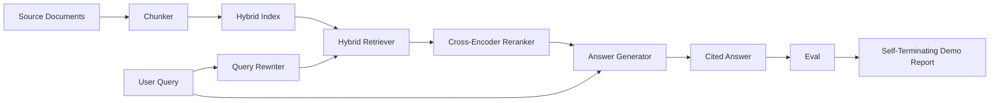

# अंत-से-अंत RAG प्रणाली

> छह घटक पाठ एक पाइपलाइन एक मूल्यांकन लूप एक आत्म-समाप्त डेमो यह प्रणाली आप भेज रहे हैं।

**Type:** Build
**Languages:** Python
**Prerequisites:** Phase 11 lessons 06 (RAG), 10 (evaluation); Phase 19 Track B foundations (lessons 20-29); Phase 19 lessons 64, 65, 66, 67, 68
**Time:** ~90 minutes

## सीखने के लक्ष्य
- एक एकल अंत-से-अंत पाइपलाइन में चंकर, हाइब्रिड रिट्रीवर, क्वेरी रीराइटर, क्रॉस-एन्कोडर रीरेंकर और उत्तर जनरेटर को मिलाएं।
- एक प्रतिक्रिया जनरेटर लागू करें जो अपने दावे को टुकड़े टुकड़े के आधार पर उद्धृत करता है, अपवर्तन के साथ अपवर्तन के साथ कम विश्वास।
- एक साथ गठित पाइपलाइन के खिलाफ पाठ 68 मूल्यांकन चलाएं और अलग से एक ही घटकों पर प्रत्येक मीट्रिक पर चरणबद्ध निर्माण जीत साबित करें।
- एक स्वयं समाप्त होने वाला CLI डेमो बनाएं जो एक फिक्स्चर कॉर्पस को निगलता है, एक फिक्स्ड क्वेरी सेट चलाता है, और एक सारांश रिपोर्ट के साथ शून्य से बाहर निकलता है।

## समस्या

छह अलग-अलग घटक कुछ भी साबित नहीं करते हैं। चंकर को कॉर्पस के खिलाफ रिकॉल@5 पर जीत हासिल हो सकती है और सिस्टम के रिकॉल@5 पर हार हो सकती है क्योंकि रिट्रीवर को यह नहीं पता कि चंकर क्या उत्सर्जित करता है। पुनर्व्यवस्थापक सिंथेटिक उम्मीदवार पूल पर एमआरआर उठा सकता है और वास्तविक द्वि-संकेतक उम्मीदवारों पर विफल हो सकता है क्योंकि पुनर्व्यवस्थापक बजट पर द्वि-संकेतक की वापसी बहुत कम है। क्वेरी रिवाइटर एक क्वेरी पर गोल्ड डॉक को बढ़ावा दे सकता है और अगले पर ब्रेक कर सकता है क्योंकि एलएलएम नकली एक विकृत परिकल्पना देता है।

एकीकरण परीक्षण एक ही फिस्टिंग qrels के खिलाफ पूरे पाइपलाइन को अंत से अंत तक चलाता है, एक ही मीट्रिक के साथ, एक ऑर्केस्ट्रेटर फ़ाइल के साथ जो सब कुछ एक साथ तार करता है। यह इस पाठ का निर्माण है। यदि एकीकृत पाइपलाइन पर मीट्रिक प्रत्येक चरण के अलग-अलग डेमो पर मीट्रिक से बेहतर है, तो आपने सिस्टम साबित कर दिया है।

## अवधारणा



### तारों के विकल्प

पाइपलाइन एक छोटा सा ग्राफ है. प्रत्येक चरण एक स्पष्ट हस्ताक्षर के साथ एक समारोह है.

| Stage | Input | Output |
|-------|-------|--------|
| Chunker | Document text | List of Chunk records |
| Retriever | Query string | Top-N Chunk records |
| Rewriter (optional) | Query string | List of rewrites + hypothetical |
| Reranker | Query, candidates | Top-K Chunk records with cross scores |
| Generator | Query, top-K Chunk records | Answer string with citations |

जब हर हस्ताक्षर स्थिर होता है तो रचना सरल होती है।`Pipeline`वर्ग पांच चरणों और एक `query`प्रत्येक चरण swappable हैः एक अलग chunker पारित, रिट्रीवर, rewriter, reranker, या जनरेटर और पाइपलाइन अभी भी चल रहा है।

### उद्धरणों के साथ उत्तर जनरेटर

जनरेटर अंतिम चरण है और तोड़ने के लिए सबसे आसान है। पाठ एक निर्धारक नकली जनरेटर जहाज है किः

1. शीर्ष-के रेटेड टुकड़े लेता है।
2. दो तक के टुकड़े चुनता है जिनमें पाठ में उच्चतम सामग्री-टोकन क्वेरी के साथ ओवरलैप होता है।
3. एक उत्तर देता है जो एक वाक्य-से-प्रत्येक-चुना हुआ-भाग का एक संयोजन है, प्रत्येक वाक्य के बाद एक `[doc_id:chunk_index]`लंगर।
4. यदि कोई टुकड़ा कचरे की सीमा से ऊपर नहीं है, तो बिना उद्धरण के "मुझे नहीं पता" जारी करता है।

उत्पादन में आप एक वास्तविक LLM कॉल के लिए नकली आदान-प्रदान शीघ्र टेम्पलेट के साथः

```
You are answering a question using only the snippets below.
Cite every claim with the anchor in parentheses.
If the snippets do not answer the question, say "I do not know".

Question: {query}

Snippets:
{enumerated chunks with anchors}

Answer:
```

रिजेक्ट-ऑन-लो-ट्रस्ट पथ क्रॉस-एन्कोडर रैंक-1 स्कोर को लॉग करने का पूरा कारण है। यदि यह कॉर्पस सीमा से नीचे है, तो जनरेटर इनकार करता है। यह है भ्रमपूर्ण उत्तरों के खिलाफ सुरक्षा वाल्व।

### आत्म-निष्पादन डेमो

डेमो सब कुछ अंत से अंत तक चलाता है। यह एक क्वेरी के एक चरण-दर-चरण विभाजन को प्रिंट करता है, चार फिक्स्चर qrels पर eval चलाता है, एक मेट्रिक्स तालिका प्रिंट करता है, और स्थिति शून्य के साथ बाहर निकलता है यदि सभी पाठ 68 मेट्रिक्स डेमो में निर्धारित सीमाओं को पूरा करते हैं। यदि कोई मेट्रिक सीमा से नीचे है, तो डेमो शून्य स्थिति और विफल मेट्रिक का नाम देने वाले संदेश के साथ बाहर निकलता है।

यह एक सीआई धुएं परीक्षण का आकार है. पाइपलाइन ऑफलाइन, तेजी से, निर्धारक चला जाता है. सीमाएं निश्चित पर जानबूझकर तंग हैं ताकि छह सबक में से किसी में एक regression डेमो विफल.

```figure
rag-pipeline-flow
```

## इसे बनाओ

`code/main.py`कार्य करता हैः

- `Chunk`- सभी चरणों में आयोजित रिकॉर्ड (चुक_इंडेक्स और स्रोत डॉक्यूमेंट_आईडी के साथ पाठ 64 के आकार का विस्तार) ।
- `Chunker`- पाठ 64 (पूर्वनिर्धारित पुनरावर्ती विभाजन) से एक रणनीति चुनता है।
- `HybridIndex`- BM25 + घने + RRF के बंडल पाठ 65 से।
- `Rewriter`(वैकल्पिक) - प्रश्न की लंबाई और संयोजनों की उपस्थिति द्वारा पाठ 67 से विघटन, बहु-प्रश्न, हाइडे का एक चयन करता है।
- `Reranker`- पाठ 66 से प्रशिक्षित क्रॉस-एन्कोडर, एक छोटे से फिचर्स प्रशिक्षण सेट के साथ, ताकि यह सेकंड में अभिसरण हो।
- `Generator`- उद्धरणों और कम विश्वास पर अस्वीकार के साथ निर्धारक नकली जनरेटर।
- `Pipeline`- एक के साथ पांच चरणों को गठित करता है `query(question)`विधि जो लौटाता है `Result(answer, top_k, latency_ms_per_stage)`. .
- `run_demo()`- corpus को निगलता है, तीन फिक्स्चर क्वेरी चलाता है, मूल्यांकन चलाता है, परिणाम प्रिंट करता है, सीमा के अनुसार प्रस्थान कोड सेट करता है।

इसे चलाओः

```bash
python3 code/main.py
```

आउटपुट एक मुद्रित क्वेरी ट्रैक, पूर्ण मूल्यांकन तालिका और अंतिम पास / विफलता स्थिति है। फिक्स्चर पर आउटपुट कोड 0 लौटाता है।

## विफलता मोड डेमो छिपा जाएगा

**Chunker boundary drift.**यदि आप eval qrels लेबलिंग पास और डेमो के बीच chunker रणनीति को बदलते हैं, तो सोने के दस्तावेज़ आईडी अब लाइन नहीं करते हैं। qrels फ़ाइल में chunker रणनीति लॉक करें। डेमो में एक हेडर शामिल है जो chunker का नाम देता है।

**Reranker training set leaks into the eval.**पाठ 66 में 14 प्रशिक्षण ट्रिपल में मूल्यांकन प्रश्नों के समान प्रश्न शामिल हैं। उत्पादन में, मूल्यांकन प्रश्नों को सख्ती से रखें। डेमो के मूल्यांकन प्रश्नों को जानबूझकर पुनर्व्यवस्था प्रशिक्षण सेट से अलग किया गया है।

**Mock generator hides hallucination risk.**नकली पहेली नहीं कर सकता क्योंकि यह केवल प्राप्त टुकड़ों से पाठ उत्सर्जित करता है। पाठ इसे नोट करता है और उत्पादन स्वैप-इन पथ को वास्तविक मॉडल की ओर इंगित करता है।

**No streaming.**पाइपलाइन प्रत्येक चरण के अंत में पूर्ण उत्तर देता है। एक उत्पादन प्रणाली जनरेटर के आउटपुट को स्ट्रीम करेगी। स्ट्रीमिंग दायरे से बाहर है; उत्तर ग्रेड मीट्रिक अंतिम स्ट्रिंग पर दोनों तरह से काम करती है।

**Latency is offline.**ललित एलएलएम कॉल लगातार समय पर होते हैं। वास्तविक एलएलएम कॉल हावी होते हैं। अनुरोध दायरे में विलंबता बजट की योजना बनाएं; पाठ का प्रत्येक चरण का समय केवल सीपीयू काम का माप करता है।

## इसका प्रयोग करें

उत्पादन के पैटर्नः

- एक संयोजक के तहत पाइपलाइन फ़ाइल को स्पष्ट चरण इंटरफ़ेस के साथ भेजें। रेपो में तारों को फैलाने से बचें।
- प्रत्येक विलय से पहले eval को चलाएं जो किसी चरण को छूता है। यदि eval गिर जाता है, तो विलय नहीं लैंड करता है।
- प्रति CI रन के लिए मीट्रिक निशान को बनाए रखें ताकि आप चरण स्वैप के लिए regressions को जिम्मेदार ठहरा सकें।
- 20 प्रश्नों (रिग्रेशन सेट का उपसमूह) का एक धुएं सेट जो 30 सेकंड से कम समय में चलता है जोड़ें; पूर्ण रिग्रेशन सेट हर रात चलता है।

## इसे भेजें

इस पाठ में पाइपलाइन फ़ाइल शेष चरण 19 के ट्रैक एफ पाठों का आकार है। बाद के पाठों में सेवन स्वचालन, वृद्धिशील पुनः सूचकांक, दूरदर्शन और एक सेवा परत को ऊपर जोड़ना होगा। पुनर्प्राप्ति, पुनः रैंक, पुनर्लेखन और मूल्यांकन आधे यहां पूरा हैं।

## व्यायाम

1. प्रति क्वेरी रणनीति चयनकर्ता को पुनः लिखने के अंदर जोड़ेंः पाठ 67 (लंबाई, संयोजन, जारगोन अनुपात) से हेरिस्टिक्स HyDE, मल्टी-क्वेरी, या विघटन चुनें।
2. एक एनवी ध्वज के पीछे जनरेटर के लिए एक वास्तविक एलएलएम कॉल जोड़ें। डिफ़ॉल्ट नकली करने के लिए। विलंबता डेल्टा मापें।
3. एक लेने के लिए डेमो विस्तार `--corpus path`एक असली corpus लोड करने के लिए ध्वज. मूल्यांकन और सीमा की जांच फिर से चलाएं.
4. एक जोड़ें `--strategy`फ्लैग को शंकर में रखें। अंत-से-अंत रिकॉल में प्रत्येक रणनीति के योगदान को मापें।
5. एक स्ट्रीमिंग जनरेटर इंटरफ़ेस जोड़ें और इसे eval में खिलाएं। पुष्टि करें कि निष्ठा अंतिम स्ट्रिंग पर गणना की जाती है और स्ट्रीमिंग पूर्वावलोकन पर नहीं।

## प्रमुख शर्तें

| Term | What people say | What it actually means |
|------|-----------------|------------------------|
| Pipeline | "RAG pipeline" | The composed stages from ingestion to cited answer |
| Citation anchor | "Source link" | The (doc_id, chunk_index) reference attached to each claim |
| Refuse-on-low-confidence | "I do not know" | Generator returns no answer when the reranker top-1 score sits below threshold |
| Smoke set | "CI eval" | The minimal qrels subset that runs in every PR check |
| Stage interface | "Function signature" | The stable input and output type of each pipeline stage |

## आगे पढ़ना

- [Anthropic, Building search and retrieval](https://www.anthropic.com/news/contextual-retrieval)
- [Pinterest, MCP internal search](https://medium.com/pinterest-engineering)- संदर्भ उत्पादन वास्तुकला
- [Ragas: Automated Evaluation of RAG Pipelines](https://docs.ragas.io)
- चरण 11 पाठ 06 - आरएजी मूल बातें
- चरण 19 पाठ 64-68 - यहां की रचना
