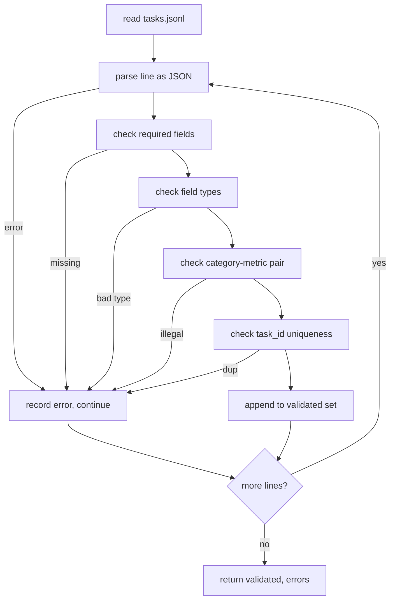

# कार्य विशिष्टता प्रारूप

> एक मूल्यांकन हर्नस केवल उतना ही अच्छा है जितना अनुबंध उसके कार्यों का सम्मान करता है। एक एकल स्कोरिंग फ़ंक्शन लिखने से पहले JSONL आकार और मीट्रिक शब्दावली को फ्रीज करें।

**Type:** Build
**Languages:** Python
**Prerequisites:** Phase 19 Track B foundations
**Time:** ~90 min

## सीखने के उद्देश्य

- एक JSONL कार्य रिकॉर्ड योजना को परिभाषित करें जो एक आकार में अंकगणित, बहु-विकल्प, कोड निष्पादन, वर्गीकरण और मुक्त पाठ सारांश को कवर करता है।
- मेट्रिक नामों की एक बंद शब्दावली को पिन करें ताकि डाउनस्ट्रीम पाठ (71-73) एक ही क्षेत्र पर भेज सकें।
- कुछ शॉट उदाहरण और पोस्ट प्रोसेसिंग नियमों को कार्य के हिस्से के रूप में निर्दिष्ट करें, न कि धावक, इसलिए एक ही प्रॉम्प्ट मॉडल के बीच एक ही लक्ष्य का उत्पादन करता है।
- एक सख्त सत्यापनकर्ता लागू करें जो धावक तक पहुंचने से पहले गलत रूप से तैयार रिकॉर्ड को अस्वीकार करता है।
- एक 10-कार्य फिटिंग सेट भेजें जो विनिर्देश की प्रत्येक शाखा का अभ्यास करता है ताकि सत्यापनकर्ता के पास कुछ असली चबाएं।

```figure
ci-task-spec-gate
```

## क्यों एक जमे हुए विनिर्देश

एक शोध कोडबेस परीक्षणों को जमा करने से अधिक तेजी से मूल्यांकन स्क्रिप्ट एकत्र करेगा। छह महीने में, प्रत्येक नोटबुक का अपना JSON आकार होता है, प्रत्येक मीट्रिक को दो बार फिर से लागू किया जाता है, और रन के बीच कुछ भी तुलना नहीं किया जा सकता है। फिक्स उबाऊ है। एक स्कीमा चुनें। एक सत्यापनकर्ता लिखें। बाकी सब कुछ अस्वीकार करें। यही इस पाठ का काम है।

आकार बिग-बेंच, हेलम और आईएम-एवल शैली के हार्नेस से विचारों को उधार लेता है, लेकिन क्षेत्र के नाम हमारे हैं। प्रत्येक क्षेत्र का एक ही मालिक है। धावक कार्य को पढ़ता है। मीट्रिक लक्ष्य को पढ़ता है। प्रक्रिया के बाद का चरण पीढ़ी को सामान्य बनाता है। कोई भी क्षेत्र मध्य पाइपलाइन में परिवर्तनीय नहीं है।

## रिकॉर्ड आकार

एक कार्य एक एकल पंक्ति पर एक JSON वस्तु है. हर्नस पढ़ता है `tasks.jsonl`एक खराब रेखा उस रिकॉर्ड को समाप्त करती है, रन नहीं।

```json
{
  "task_id": "arith_001",
  "category": "arithmetic",
  "prompt": "Compute the result. Question: 17 + 24\nAnswer:",
  "targets": ["41"],
  "metric_name": "exact_match",
  "few_shot_examples": [
    {"prompt": "Question: 2 + 2\nAnswer:", "completion": "4"}
  ],
  "post_process": "strip_whitespace",
  "metadata": {"difficulty": "easy"}
}
```

आवश्यक क्षेत्र `task_id`,`category`,`prompt`,`targets`,`metric_name`,`post_process`. .`few_shot_examples`और `metadata`अज्ञात शीर्ष स्तर के क्षेत्र सत्यापन विफल.

## क्षेत्र नियम

`task_id`वैधता फ़ाइल में अद्वितीयता लागू करता है।

`category``arithmetic`,`mcq`,`code_exec`,`classification`,`summary`. श्रेणी में यह निर्धारित किया गया है कि किस मीट्रिक और पोस्ट प्रोसेस जोड़ी कानूनी है।`code_exec`कार्य का उपयोग करना चाहिए `metric_name = code_exec`और एक `mcq`कार्य का उपयोग करना चाहिए `metric_name = exact_match`एक अक्षर के लक्ष्य के खिलाफ।

`prompt`सत्यापनकर्ता श्वेत स्थान को पीछे छोड़ने पर प्रतिबंध लगाता है और रिकॉर्ड को अस्वीकार करता है जिसमें पहले से ही शीघ्र शरीर में कुछ शॉट ब्लॉक शामिल हैं। कुछ शॉट रेंडरिंग धावक में होती है, लेखक में नहीं।

`targets`स्ट्रिंग्स की एक गैर-खाली सूची है।`exact_match`, किसी भी तत्व के मिलान गिनती.`f1`और `rouge_l`, उच्चतम स्कोर लक्ष्य जीतता है.`mcq`, सूची में एक ही तत्व है।

`metric_name``exact_match`,`f1`,`bleu_4`,`rouge_l`,`accuracy`,`code_exec`एक नया माप एक नया पाठ और एक नया प्रविष्टि की आवश्यकता है।

`few_shot_examples``{prompt, completion}`जोड़े. सत्यापितकर्ता सूची को आठ प्रविष्टियों पर सीमित रखने के लिए संकेतों को सीमित रखता है।

`post_process``none`,`strip_whitespace`,`lower`,`extract_letter`,`extract_code_block`,`extract_first_line`प्रत्येक नियम का एक ही निर्धारक व्यवहार होता है। वैधकर्ता नियमों को जोड़ने से मना करता है।

## सत्यापितकर्ता व्यवहार



सत्यापनकर्ता दो सूचियों को लौटाता हैः सत्यापित रिकॉर्ड और उल्लंघनकारी पंक्ति, उल्लंघन किए गए नियम और त्रुटि वाले क्षेत्र के साथ त्रुटि रिकॉर्ड। धावक शुरू करने से इनकार करता है यदि त्रुटि सूची गैर-खाली है जब तक कि स्पष्ट नहीं है `--allow-bad-tasks`ध्वज सेट है।

## कुछ शॉट रेंडरिंग

रनर एक खाली लाइन विभाजक के साथ प्रॉम्प्ट के सामने कुछ शॉट के उदाहरणों को जोड़ता है। प्रत्येक मॉडल के लिए एक ही कोड पथ चलता है, इसलिए भिन्नता का एकमात्र स्रोत खुद मॉडल है। लेखक उदाहरण एक बार लिखते हैं, न कि प्रत्येक प्रदाता के लिए एक बार।

```python
def render(task):
    parts = []
    for ex in task.get("few_shot_examples", []):
        parts.append(ex["prompt"] + " " + ex["completion"])
    parts.append(task["prompt"])
    return "\n\n".join(parts)
```

## प्रक्रिया के बाद के नियम

प्रक्रिया के बाद का चरण पीढ़ी के बाद, मीट्रिक से पहले चलता है। यह निर्धारक और निर्विवाद है।

- `none`स्ट्रिंग को अपरिवर्तित लौटाता है।
- `strip_whitespace`सफेद स्थान की ओर और पीछे की पट्टी।
- `lower`स्ट्रिंग को कम करता है।
- `extract_letter`पहला पात्र जो मेल खाता है लौटाता है `[A-E]`, MCQ के लिए इस्तेमाल किया जाता है।
- `extract_code_block`कोड निष्पादन के लिए उपयोग किए जाने वाले पहले तीन-बैकटिक बाड़ वाले ब्लॉक का शरीर लौटाता है।
- `extract_first_line`संक्षेप वर्गीकरण के लिए उपयोग की जाने वाली पहली गैर-खाली पंक्ति लौटाता है।

इस सूची के बाहर एक नियम की आवश्यकता वाले कार्य एक नए पाठ में शामिल हैं।

## यह सबक क्या नहीं करता

यह स्कोर नहीं करता, यह मॉडल नहीं कहता, यह कोड नहीं चलाता। ये सब 71, 72 और 75 के पाठ में आते हैं। यह सब अनुबंध को जमे हुए है जो वे सभी सम्मान करते हैं।

10-कार्य फिक्स्चर में दो अंकगणित आइटम, दो MCQ आइटम, दो कोड-exec आइटम, दो वर्गीकरण आइटम और दो सारांश आइटम शामिल हैं। सत्यापनकर्ता सभी 10 को पारित करता है। एक अलग फिक्स्चर (`tasks_bad.jsonl`) प्रत्येक नियम को ट्रिप करता है और सत्यापनकर्ता ठीक उसी तरह की त्रुटियों को लौटाता है।

## कोड कैसे पढ़ें

`main.py`परिभाषित करता है `TaskSpec`,`validate_task`,`validate_file`, और एक CLI प्रवेश बिंदु. फिटिंग लोडर है `load_fixtures`. रेंडर और पोस्ट प्रोसेस सहायक सत्यापन के बगल में रहते हैं इसलिए पाठ 75 में धावक एक ही मॉड्यूल आयात करता है।

पढ़िए `main.py`ऊपर से नीचे तक. फिर पढ़ें.`code/tests/test_spec.py`. परीक्षण प्रत्येक सत्यापन नियम और प्रत्येक प्रक्रिया के बाद व्यवहार को चिह्नित करते हैं.`main.py`बंडल किए गए फिटिंग को मान्य करता है और सारांश छापता है।

## आगे बढ़ना

वास्तविक मूल्यांकन सूट श्रेणियों को विकसित करते हैं जैसे कि योजनाएं कॉलम को विकसित करती हैं। एक स्पष्ट कदम यह है कि किसी श्रेणी को जोड़ने से इनकार करना बिना किसी मीट्रिक, एक पोस्ट-प्रक्रिया नियम और कम से कम एक फिक्स्चर कार्य को जोड़ने के। विशिष्टता को डेटाबेस माइग्रेशन की तरह व्यवहार करें। प्रत्येक परिवर्तन की समीक्षा की जाती है, संस्करणित किया जाता है, और परीक्षणों के साथ होता है। इस पाठ में सत्यापनकर्ता गेट है।
