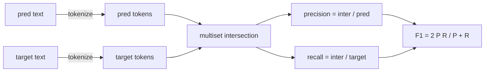
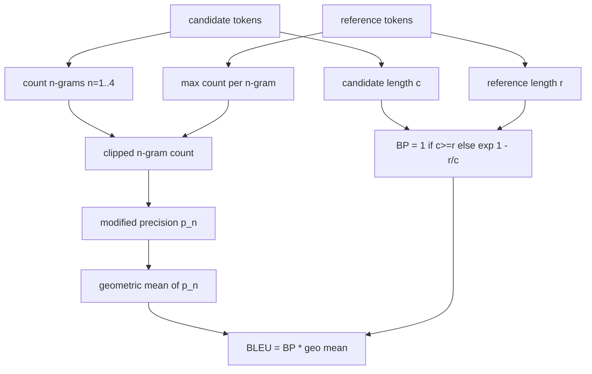

# क्लासिकल मेट्रिक्स

> ब्लू, ROUGE-L, F1, सटीक मिलान, सटीकता. पांच मीट्रिक जो अभी भी प्रकाशित LLM मूल्यांकन संख्या के लिए जिम्मेदार हैं. प्रत्येक को पहले सिद्धांतों से लागू करें ताकि आप जानते हैं कि संख्या का क्या अर्थ है।

**Type:** Build
**Languages:** Python
**Prerequisites:** Phase 19 Track B foundations, lesson 70
**Time:** ~90 min

## सीखने के उद्देश्य

- टोकन स्तर सटीक मेल, F1 और स्पष्ट टोकनकरण नियमों के साथ सटीकता को लागू करें।
- नीलामी से BLEU-4 लागू करेंः संशोधित n-ग्राम सटीकता, n से ऊपर ज्यामितीय औसत 1 से 4 के बराबर है, संक्षिप्तता दंड।
- सटीकता और याद करने के F-beta संयोजन के साथ सबसे लंबे सामान्य उपक्रम का उपयोग करके ROUGE-L को लागू करें।
- पाठ 70 से मीट्रिक_नाम फ़ील्ड पर भेजें ताकि धावक मीट्रिक-अज्ञानी बने रहे।
- व्यवहार को तीसरे पक्ष के पुस्तकालय से नहीं बल्कि काम किए गए उदाहरणों से प्राप्त संदर्भ वेक्टरों के साथ चिपकाएं।

```figure
cd-bleu-overlap
```

## पुनः कार्यान्वयन क्यों

आप ऐसे पेपर पढ़ेंगे जो ब्लू 28.3 और ब्लू 0.283 की रिपोर्ट करते हैं। आपको दो पुस्तकालयों में 10 अंक के अंतर वाले ROUGE-L स्कोर मिलेंगे क्योंकि एक छोटा सा है और दूसरा नहीं। भ्रमित होने से बचने का सबसे तेज़ तरीका है खुद मेट्रिक्स लिखना, फिर उस रेखा पर इंगित करना जहां टोकनराइज़र तय किया जाता है और उस रेखा पर जहां चिकनाई लागू की जाती है। उसके बाद, कागजातों के बीच संख्याओं की तुलना करने के लिए मीट्रिक सेटअप को पढ़ने का मामला बन जाता है, पुस्तकालयों के बारे में बहस नहीं।

Stdlib प्लस numpy पर्याप्त है. ब्लू गिनती और एक क्लैंप है. ROUGE-L गतिशील प्रोग्रामिंग है. F1 टोकन पर एक सेट चौराहे है. सबसे कठिन हिस्सा एक टोकनराइज़र चुनने और इसके लिए प्रतिबद्ध है.

## टोकनकरण

टोकनराइज़र है `re.findall(r"\w+", text.lower())`. लघु अक्षर, अल्फान्यूमेरिक रन, ड्रॉप अंकन. इस पाठ में प्रत्येक मीट्रिक इस टोकनराइज़र का उपयोग करता है. धावक को चुनने की अनुमति नहीं है. यदि आप टोकनराइज़रों को आदान-प्रदान करते हैं, तो आप एक अलग बेंचमार्क चला रहे हैं.

```python
TOKEN_RE = re.compile(r"\w+", re.UNICODE)
def tokenize(text):
    return TOKEN_RE.findall(text.lower())
```

यह एक जानबूझकर सरलता है। उत्पादन सेटअप CJK, संकुचन, और कोड पहचानकर्ताओं के बारे में परवाह करेंगे। पाठ का बिंदु यह है कि टोकनइज़र एक अनुबंध है, एक बटन नहीं।

## सटीक मेल

```python
def exact_match(pred, targets):
    return float(any(pred.strip() == t.strip() for t in targets))
```

यह प्रति कार्य 1.0 या 0.0 देता है। डेटासेट पर संकलित औसत है। यह अंकगणित, एमसीक्यू और लघु वर्गीकरण कार्यों के लिए कार्यघड़ी है।

## टोकन स्तर F1

भविष्यवाणी और लक्ष्य के लिए टोकन मल्टीसेट सेट करें। सटीकता भविष्यवाणी के मल्टीसेट से विभाजित मल्टीसेट चौराहे है। याद रखें लक्ष्य के मल्टीसेट से विभाजित एक ही चौराहे है। F1 सामंजस्य औसत है। कार्यान्वयन खाली भविष्यवाणी और खाली लक्ष्य किनारे मामलों को संभालता है।



बहु-लक्ष्य कार्यों के लिए, हम लक्ष्य सूची से ऊपर सर्वश्रेष्ठ F1 लेते हैं। जो साहित्य में व्यापक रूप से रिपोर्ट किए गए SQuAD शैली के व्यवहार से मेल खाता है।

## ब्लू-4

ब्लू एक कैनोनिक मशीन अनुवाद मीट्रिक है और यह अभी भी सारांश के काम में दिखाई देता है। हम कॉर्पस स्तर BLEU-4 का उपयोग मानक संक्षिप्तता दंड और परिष्कृत n-ग्राम गिनती पर योज्य-एक चिकनाई के साथ करते हैं ताकि एक भी गायब 4 ग्राम स्कोर को शून्य तक नहीं धकेलता है।

प्रत्येक उम्मीदवार-संदर्भ जोड़ी के लिए, हम n के लिए संशोधित n-ग्राम सटीकता गिनते हैं 1, 2, 3, 4. संशोधित सटीकता किसी भी संदर्भ में उस n-ग्राम की अधिकतम संख्या से उम्मीदवार n-ग्राम गिनती को क्लिप करती है, इसलिए एक उम्मीदवार एक वाक्यांश को दोहराकर उबल नहीं सकता है। चार सटीकताओं के पार ज्यामितीय औसत को संक्षिप्तता दंड से लपेटा जाता है।



समतल करने का नियम है कि एक Lin और Och कहा विधि 1: लॉग लेने से पहले प्रत्येक n-ग्राम सटीकता के संख्याकार और संकेतक दोनों में एक जोड़ें। यह बचता है`log 0`जब एक संदर्भ में 4 ग्राम के अनुरूप कोई नहीं है और लंबे उम्मीदवारों पर असंतुलित मूल्य के करीब रहता है।

## ROUGE-L

ROUGE-L उम्मीदवार और संदर्भ टोकन अनुक्रमों के सबसे लंबे सामान्य उपक्रम की तुलना करता है। LCS संबद्धता को मजबूर किए बिना शब्द क्रम को कैप्चर करता है, यही कारण है कि यह डिफ़ॉल्ट सारांशकरण मीट्रिक है। हम एक मानक गतिशील प्रोग्रामिंग तालिका के साथ LCS लंबाई की गणना करते हैं, फिर याद को प्राप्त करते हैं जैसे `lcs / reference length`, सटीकता के रूप में `lcs / candidate length`, और F-बीटा के साथ संयुक्त जहां बीटा सममित F1 रूप के लिए एक के बराबर है.

```python
def lcs_length(a, b):
    n, m = len(a), len(b)
    dp = numpy.zeros((n + 1, m + 1), dtype=int)
    for i in range(n):
        for j in range(m):
            if a[i] == b[j]:
                dp[i+1, j+1] = dp[i, j] + 1
            else:
                dp[i+1, j+1] = max(dp[i+1, j], dp[i, j+1])
    return int(dp[n, m])
```

Numpy तालिका कार्यान्वयन को पठनीय बनाती है; शुद्ध पायथन सूचियाँ भी काम करेंगी। ROUGE-L में ऑप्ट करने वाले कार्यों को प्रति कार्य O(n) लागत का भुगतान किया जाता है। सामान्य सारांश लंबाई के लिए जो मिलीसेकंड से कम रहता है।

## सटीकता

बहु-लक्ष्य वर्गीकरण कार्यों के लिए, सटीकता एक एकल सामान्य लक्ष्य के साथ सटीक मेल करने के लिए कम हो जाती है। हम इसे एक अलग कार्य के रूप में उजागर करते हैं ताकि डिस्पैचर पर भेज सकता है`metric_name`बिना रनर के अंदर स्ट्रिंग तुलना के माध्यम से जाने के लिए.

## डिस्पैच अनुबंध

प्रवेश का एकमात्र बिंदु `score(metric_name, prediction, targets)`. यह वापस एक तैरने में .`[0, 1]`. धावक मीट्रिक नाम पर शाखा नहीं है. यह कॉल छोड़ देता है और परिणाम लिखता है. यह सतह है कि पाठ 75 पाठ 70 से कार्य विनिर्देश के लिए चिपक जाएगा.

```python
def score(metric_name, pred, targets):
    if metric_name == "exact_match":
        return exact_match(pred, targets)
    if metric_name == "f1":
        return max(f1_score(pred, t) for t in targets)
    if metric_name == "bleu_4":
        return max(bleu4(pred, t) for t in targets)
    if metric_name == "rouge_l":
        return max(rouge_l(pred, t) for t in targets)
    if metric_name == "accuracy":
        return accuracy(pred, targets)
    raise ValueError(f"unknown metric_name: {metric_name}")
```

`code_exec`पाठ 72 में संभाला जाता है और वहां डिस्पैचर में स्लॉट किया जाता है।

## यह सबक क्या नहीं करता

यह एक मॉडल नहीं कहता है। यह पाठ 70 के बाद प्रक्रिया नियमों से पहले से ही किया गया से परे पीढ़ियों को सामान्य नहीं करता है। यह विश्वास अंतराल की गणना नहीं करता है। यह BLEURT या BERTScore नहीं करता है (उनके लिए एक मॉडल की आवश्यकता है और एक अलग पाठ में रहते हैं) । मुद्दा तल हैः पांच मीट्रिक, एक टोकन, एक डिस्पैच टेबल।

## कोड कैसे पढ़ें

`main.py`प्रत्येक मीट्रिक को एक मुक्त फ़ंक्शन प्लस डिस्पैचर के रूप में परिभाषित करता है।`_reference_examples`डेमो डिस्पैचर को आठ उदाहरणों के साथ चलाता है और प्रति मीट्रिक स्कोर प्रिंट करता है।`code/tests/test_metrics.py`संदर्भ वेक्टरों को पिन करें और प्रत्येक किनारे मामले को जोर दें (खाली भविष्यवाणी, खाली संदर्भ, कोई साझा टोकन नहीं, सटीक मैच, दोहराए गए वाक्यांश काटना) ।

पढ़िए `main.py`शीर्ष से नीचे तक. कार्यों को जटिलता के अनुसार क्रमबद्ध किया गया है। सटीक_मैच और सटीकता प्रत्येक एक पंक्ति है। F1 छह पंक्तियों है। ब्लू और ROUGE-L भारी भाग हैं और वे चिकनाई नियम और LCS पुनरावृत्ति पर विस्तृत टिप्पणी शामिल हैं।

## आगे बढ़ना

क्लासिकल मीट्रिक आवश्यक हैं, पर्याप्त नहीं हैं। वे सतह पर ओवरलैप और अर्थ को याद करते हैं। फिक्स मॉडल आधारित मीट्रिक को शीर्ष पर लेयर करना है (BLEURT, BERTScore, GEval) एक बार जब आप क्लासिकल फर्श पर भरोसा करते हैं। यह एक बाद का सबक है। अभी के लिएः इन पांचों को काम करें, उन्हें परीक्षणों के साथ चिपकाएं, और आपके पास एक मीट्रिक स्टैक है जो ऑडिट करने योग्य, तेज़ और पुनः उत्पन्न करने योग्य है।
