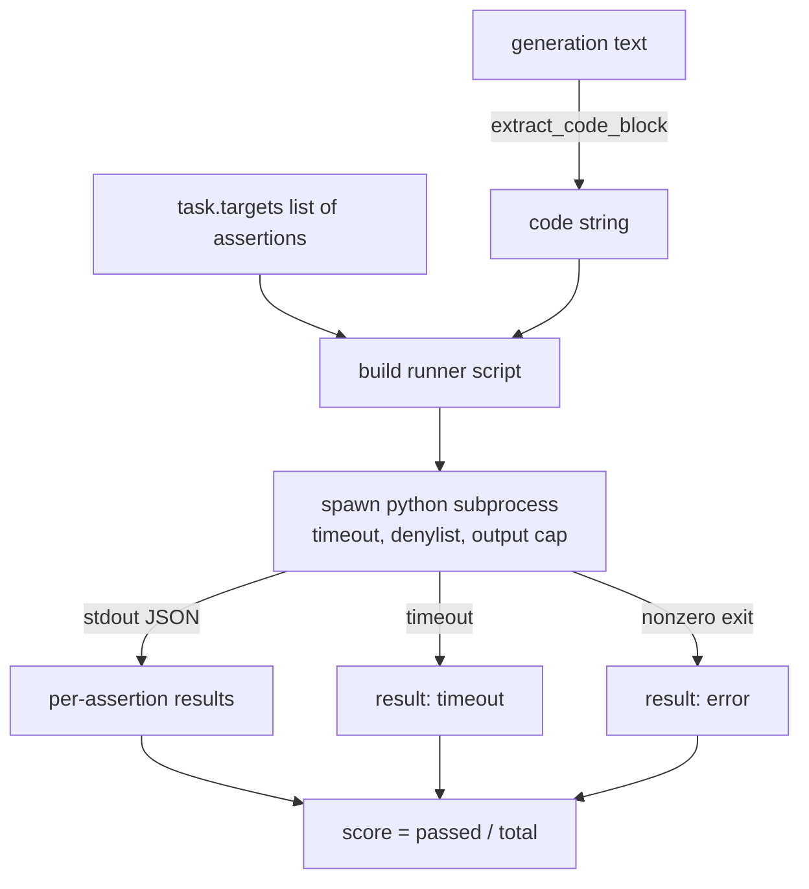
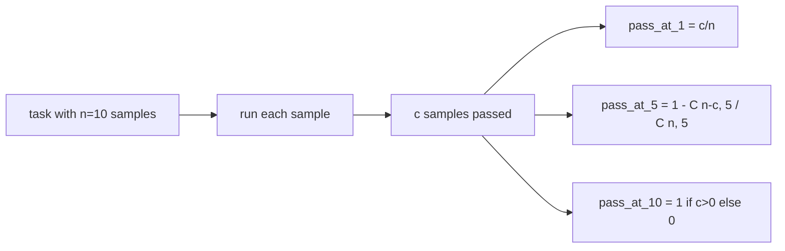

# कोड निष्पादन मेट्रिक

> जब यह परीक्षणों को पास करता है तो उत्पन्न कोड सही होता है। मूल्यांकन हर्नस को कोड निकालना होता है, इसे होस्ट को क्रैश किए बिना चलाना होता है, और ईमानदारी से पास-रेट को गिनना होता है। यह सबक उस सतह को बनाता है।

**Type:** Build
**Languages:** Python
**Prerequisites:** Phase 19 Track B foundations, lessons 70 and 71
**Time:** ~90 min

## सीखने के उद्देश्य

- पाठ 70 के पोस्ट-प्रोसेस नियम से मेल खाने के तरीके से मुक्त-रूप पीढ़ी से कोड ब्लॉक निकालें।
- एक दीवार घड़ी समय-आउट, आउटपुट कैप, और एक आयात denylist के साथ एक अलग उपप्रक्रिया में उम्मीदवार कोड निष्पादित करें।
- किसी कार्य को दिए गए दावा स्ट्रिंग के अंश के रूप में स्कोर करें जो उम्मीदवार के खिलाफ गुजरते हैं।
- एक मॉडल से कई पीढ़ियों का नमूना लेने वाले कार्यों के लिए पास-एट-के की गणना करें।
- रेत बॉक्स दुर्घटनाओं, वाक्य रचना त्रुटियों और समय-समय पर रनर अलग-अलग प्रस्थान कोड के साथ प्रथम श्रेणी विफलता मोड के रूप में व्यवहार कर सकते हैं लॉग।

```figure
sandbox-runner
```

## एक अलग उपप्रक्रिया क्यों

इनलाइन `exec`सुरक्षा और स्थिरता के लिए खतरा है।`while True: pass`एक उत्पन्न किया गया है`import shutil; shutil.rmtree('/')`यह ठीक है कि यह ध्वनि के रूप में ही विनाशकारी है. समाधान प्रति उम्मीदवार एक नया पायथन व्याख्याता पैदा करने के लिए है, stdin पर कोड पारित, stdout के लिए निष्कर्ष लिखने के लिए, और प्रक्रिया को मारने के लिए है अगर यह ओवरराउंड. होस्ट मूल्यांकन प्रक्रिया चलती रहती है.

वास्तविक मूल्यांकन जैसे ह्यूमनएवल, एमबीपीपी, बिगकोडबेंच और लाइवकोडबेंच सभी एक उपप्रक्रिया सैंडबॉक्स का उपयोग करते हैं। कुछ परत डॉकर शीर्ष पर है। हम एक कारण के लिए उपप्रक्रिया पर रुकते हैंः यह पोर्टेबल है, यह स्ट्डलिब है, और यह शैक्षिक मूल्यांकन के लिए महत्वपूर्ण विफलता मोड पकड़ता है। उत्पादन तैनाती में सेकम्प, नेटवर्क अलगाव और केवल पढ़ने वाली फ़ाइल प्रणाली शामिल होती है। इस ट्रैक के बाहर जीवन को कठोर करने पर अगला सबक।

## कोड-कार्यकारी कार्य का आकार

ए `code_exec`कार्य में दावा स्ट्रिंग्स हैं `targets`धावक ने पीढ़ी से एक बाड़ वाले कोड ब्लॉक को निकालकर उसके चारों ओर एक परीक्षण हर्न बनाकर परिणाम चलाया।



स्कोर में एक अंश है `[0, 1]`. एक कार्य जिसमें तीन कथन होते हैं जहां दो पास स्कोर 0.667 होता है। धावक एक ही आकार को वापस करता है चाहे वह क्या विफल हो जाएः उपप्रक्रिया दुर्घटनाओं को एक सामान्य त्रुटि कोड में मैप किया जाता है, ना कि एक पायथन ट्रैसबैक जो हर्नस तक बुलबुले करता है।

## डेनिलस्ट

डेनिल सूची आयात आधारित है. उम्मीदवार कोड चलाने से पहले, धावक स्क्रिप्ट खतरनाक मॉड्यूल के आयात को एक स्टब पर फिर से लिखता है जो उठता है `ImportError("denied")`. सूची जानबूझकर रूढ़िवादी हैः `os.system`,`subprocess`,`socket`,`requests`,`urllib`,`urllib.request`,`urllib.error`,`urllib.parse`,`ctypes`,`shutil`,`http.client`,`asyncio.subprocess`. .

हम यह नहीं करते कि यह गोली के सबूत है. निश्चित विरोधी कोड पायथन में किसी भी प्रक्रिया में सैंडबॉक्स से बच सकता है। डेनिलस्ट एक बैकस्टॉप है। दीवार घड़ी टाइमआउट और आउटपुट कैप लोड-बॉररिंग नियंत्रण हैं।

```python
DENIED = {
    "os.system": True,
    "subprocess": True,
    "socket": True,
    "shutil": True,
    "requests": True,
    "urllib": True,
    "ctypes": True,
}
```

हम उम्मीदवार को पूर्व-निलंबित करके लपेटते हैं `import sys`और एक गार्ड जो बंदरों को पैच करता है`os.system`पूरा टेम्पलेट है `main.py`. .

## दीवार घड़ी समय

प्रत्येक उपप्रक्रिया को तीन दीवार घड़ी सेकंड का डिफ़ॉल्ट बजट मिलता है। धावक का उपयोग करता है`subprocess.run(..., timeout=t)`. अगर टाइमआउट फायर करता है, धावक पकड़ता है`TimeoutExpired`, प्रक्रिया को मारता है, और रिकॉर्ड करता है एक `timeout`कार्य के लिए कारण छोड़ें। उस कार्य के लिए स्कोर शून्य है. धावक आगे बढ़ता है.

 से कार्य के अनुसार समय सीमा को कॉन्फ़िगर किया जा सकता है`task.metadata.timeout_s`. लंबे समय तक चलने वाले इकाई परीक्षण अधिक मांग सकते हैं; पाठ 70 से सत्यापितकर्ता सूट को सीमित रखने के लिए मूल्य को तीस सेकंड पर सीमित करता है।

## आउटपुट कैप

उपप्रक्रिया स्टडआउट को बाढ़ में डाल सकती है, जिससे मेजबान मेमोरी थका जा सकती है। धावक स्टडआउट को बफर में स्ट्रीम करता है और बच्चे को मार देता है जैसे ही चल रही कुल 256 KB पार हो जाती है। परिणाम को रिकॉर्ड किया जाता है `exit_code = error`विवरण स्ट्रिंग के साथ `"output overflow"`यह व्यवहार में दिखाई देता है जब एक पीढ़ी गलती से एक अनंत लूप लिखती है जो प्रिंट करती है।

## पास-ए-के

पास-एट-के एक निष्पक्ष अनुमान है जिसे ह्यूमन ईवल और उसके मित्रों द्वारा उपयोग किया जाता है।`n`प्रति कार्य स्वतंत्र नमूने और `c`उनमें से गुजरने की संभावना है कि आकार का एक नमूना `k``n`इसमें कम से कम एक पार करने वाला समाधान होता हैः

```
pass_at_k(n, c, k) = 1 - C(n - c, k) / C(n, k)
```

कब`n - c < k`संख्यात्मक अपरिभाषित है और मूल्य है `1`. कार्यान्वयन सीधे किनारे मामले को संभालता है. हम उजागर`pass_at_k(n, c, k)`पाठ 74 में रैंकिंग बोर्ड परत द्वारा उपयोग के लिए।



## प्रस्थान कोड

धावक प्रति कार्य पांच परिणामों में से एक लौटाता हैः

- `pass`जब हर बात का ज़िक्र हो जाएगा
- `assertion_fail`जब कोड चला गया लेकिन कम से कम एक दावा विफल रहा।
- `syntax_error`जब कोड आयात नहीं किया या एक वाक्यविन्यास त्रुटि थी.
- `timeout`जब दीवार घड़ी समाप्त हो गया।
- `error`किसी अन्य दुर्घटना के लिए, डेनिलस्ट हिट और आउटपुट ओवरफ्लो सहित (विस्तृत रूप से ओवरफ्लो सतहें `"output overflow"`) ।

स्कोर अभी भी एक अंश है। आउट कोड मेटाडेटा है। डाउनस्ट्रीम पाठ तय कर सकते हैं कि क्या शून्य या लापता डेटा के रूप में समय को गिनना है।

## यह सबक क्या नहीं करता

यह आपको एक असली सैंडबॉक्स नहीं देता है। यह खुले वेब से अविश्वसनीय कोड नहीं चलाता है। यह फ़ाइल I / O या नेटवर्क कॉल जैसे राज्यपूर्ण कार्यों को संभालता नहीं है। उन्हें एक कंटेनर या एक माइक्रोवीएम की आवश्यकता होती है। इस पाठ का मुद्दा अनुबंध हैः एक अलग उपप्रक्रिया, एक डेनिलस्ट, एक टाइमआउट, एक आउटपुट कैप, एक स्वच्छ आउटपुट कोड शब्दावली, और पास-एट-के गणित।

## कोड कैसे पढ़ें

`main.py`परिभाषित करता है `extract_code`,`run_candidate`,`score_code_exec`और `pass_at_k`उपप्रक्रिया रनर स्क्रिप्ट एक स्ट्रिंग के रूप में बनाया गया है और पारित किया गया है के रूप में `-c`एक ताजा पायथन अनुवादक के लिए.`code/tests/test_exec.py`HumanEval शैली से प्राप्त काम किए गए उदाहरणों के खिलाफ चार प्रस्थान कोड और पास-एट-के का प्रयोग करें।

पढ़िए `main.py`ऊपर से नीचे तक. धावक टेम्पलेट लोड-बहन टुकड़ा है. जब तक आप JSON लिफाफा यह मूल प्रक्रिया में वापस लिखता है भविष्यवाणी कर सकते हैं कि परिकल्पना लूप पर देखो.

## आगे बढ़ना

एक बार उपप्रक्रिया आकार काम कर जाता है, अगली चिंता पोर्टेबिलिटी है। अलग-अलग पायथन संस्करण विंडोज पर SIGKILL को अलग तरह से संभालते हैं। सबसे साफ समाधान है एक डॉकर छवि में धावक डाल करने के लिए. इसके बाद अगली बात यह है कि वास्तविक इकाई परीक्षण फ़ाइलों के साथ दावा स्ट्रिंगों को बदलने के लिए ताकि मूल्यांकन उत्पादन आईसी क्या करता है के अनुरूप है। उस बिंदु पर दावा स्ट्रिंग परीक्षणों को कॉल करना बंद करो; वे खिलौना परीक्षण हैं और उनके पास खिलौना विफलता मोड हैं।
