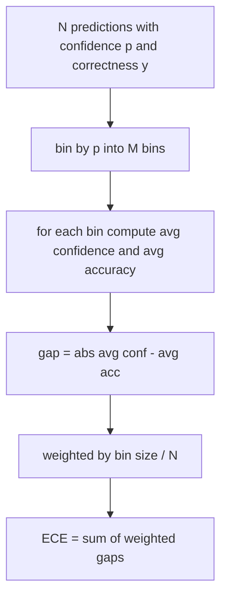
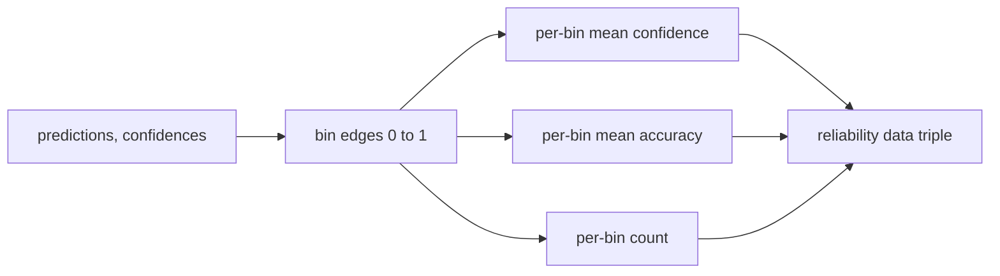

# उलझन और माप

> यदि आपका मॉडल एक हजार उत्तरों पर 90 प्रतिशत विश्वास करता है और 600 सही हो जाता है, तो यह अच्छी तरह से माप नहीं है। माप विश्वसनीय मूल्यांकन का आधा है। दूसरा आधा है भ्रम, जो आपको बताता है कि क्या मॉडल को लगता है कि बाहर रखा गया पाठ बिल्कुल भी मान्य है।

**Type:** Build
**Languages:** Python
**Prerequisites:** Phase 19 Track B foundations, lessons 70 and 71
**Time:** ~90 min

## सीखने के उद्देश्य

- मॉडल एडाप्टर द्वारा प्रदान की गई टोकन नकारात्मक लॉग-संभाव्यताओं से एक आयोजित कॉर्पस पर टोकन स्तर की उलझन की गणना करें।
- वर्गीकरणकर्ता या बहुविकल्पीय मूल्यांकन की अपेक्षित माप त्रुटि (ईसीई) को अंतर्निहित पूर्वानुमानित संभावनाओं से गणना करें।
- बीर स्कोर की गणना करें (सटीकता सूचक के मुकाबले औसत वर्ग त्रुटि) और बताएं कि यह कब करता है जो ईसीई नहीं करता है।
- विश्वसनीयता-सटीकता वक्र के चित्रण के लिए आवश्यक विश्वसनीयता आरेख डेटा का निर्माण करें।
- सभी तीनों को मूल्यांकन हर्न में तार ताकि धावक संलग्न कर सकते हैं`perplexity`,`ece`और `brier`मॉडल रिपोर्ट के लिए संख्या।

```figure
cd-reliability-diagram
```

## क्या भ्रम आपको बताता है

विडंबना प्रति टोकन की औसत नकारात्मक लॉग-संभाव्यता है। कम बेहतर है। एक की जटिलता का अर्थ है कि मॉडल प्रत्येक वास्तविक टोकन को संभावना एक सौंपता है। शब्दावली के आकार की जटिलता का अर्थ है कि मॉडल समान है और कुछ नहीं सीखा है। वास्तविक संख्याएं बीच में गिरती हैंः विकीटेक्सट -103 पर एक मजबूत 2026 आधार मॉडल आठ से बारह के आसपास बैठता है। एक ही पाठ पर एक बुरा पचास प्लस पर बैठता है।

हर्नस लॉग-संभाव्यताओं की गणना नहीं करता है। वे मॉडल एडाप्टर से आते हैं। हर्नस एग्रीगेटः यह प्रति टोकन लॉग-संभाव्यताओं की सूची लेता है, प्रति अनुक्रम टोकन गिनती की सूची लेता है, और कॉर्पस भ्रम देता है।

```python
def perplexity(neg_log_probs, token_counts):
    total_nll = sum(neg_log_probs)
    total_tokens = sum(token_counts)
    return math.exp(total_nll / total_tokens)
```

कार्यान्वयन शून्य टोकन किनारे मामलों को संभालता है और यह दावा करता है कि नकारात्मक लॉग-संभाव्यताएं गैर-नकारात्मक हैं। एक आम गलती नकारात्मकता को भूलना हैः एक एडाप्टर जो लौटाता है `log p`इसके बजाय `-log p`एक से कम जटिलता पैदा करता है, जो असंभव है। समारोह अनुबंध उल्लंघन के रूप में पकड़ता है।

## ईसीई क्या उपाय करता है

अपेक्षित माप त्रुटि एक निश्चित संख्या में डिब्बे में उनके विश्वास द्वारा भविष्यवाणियों को समूहित करती है, फिर डिब्बे के आकार द्वारा वजन किए गए डिब्बे के बीच विश्वसनीयता और सटीकता के बीच औसत अंतर को मापती है।



मानक सूत्र पर दस समान चौड़ाई वाले डिब्बे का उपयोग करता है `[0, 1]`. कार्यान्वयन किसी भी सकारात्मक पूर्णांक की गणना का समर्थन करता है. हम एक उजागर करते हैं .`bins`पैरामीटर ताकि धावक प्रकाशन सम्मेलन (10) और तुलना सम्मेलन (15) के बीच चुन सके।

ईसीई को कंटेनर की संख्या और नमूना आकार से पूर्वाग्रह दिया जाता है। दस कंटेनर और सौ भविष्यवाणियों के साथ, आप यादृच्छिक शोर से 0.02 ईसीई को अलग नहीं कर सकते। कार्यान्वयन ईसीई के साथ-साथ आबादी वाले कंटेनर की संख्या लौटाता है ताकि धावक बहुत कम नमूनों पर एक भी संख्या रिपोर्ट करने से इनकार कर सके।

## Brier स्कोर क्या करता है कि ECE नहीं करता है

ईसीई केवल औसत अंतराल के बारे में परवाह करता है। एक मॉडल जो आधा डिब्बे पर अत्यधिक विश्वास रखता है और दूसरे आधा पर कम विश्वास करता है, स्थानीय रूप से खराब कैलिब्रेट होने के बावजूद कम ईसीई हो सकता है। बीयर स्कोर भविष्यवाणी के अनुसार वास्तविक परिणाम के खिलाफ वर्ग त्रुटि का माप करता है, इसलिए यह सीधे प्रसार को दंडित करता है।

द्विआधारी परिणामों के लिए, Brier है `mean((p_i - y_i)^2)`. यह विश्वसनीयता, संकल्प और अनिश्चितता में विघटित होता है. हम स्कोर और विघटन की गणना करते हैं. धावक स्केलर रिपोर्ट करता है लेकिन डैशबोर्ड के लिए विघटन को लॉग करता है.

```python
def brier(p, y):
    return float(np.mean((p - y) ** 2))
```

## विश्वसनीयता आरेख डेटा

एक विश्वसनीयता आरेख प्रत्येक बिन में अनुभवजन्य सटीकता के खिलाफ विश्वास की भविष्यवाणी करता है। विकर्ण सही माप है। फ़ंक्शन तीन सरणी देता हैः प्रति बिन औसत विश्वसनीयता, प्रति बिन औसत सटीकता, और प्रति बिन गिनती। आरेखण कोड नीचे रहता है; यह सबक डेटा आकार पर रुकता है।



रिटर्न टूपल वह है जो एक कॉल लेयर को प्लॉट को आकर्षित करने या कस्टम ईसीई संस्करण (अनुकूली ईसीई, स्वीप ईसीई, आदि) की गणना करने की आवश्यकता होती है। हम नम्पी सरणी वापस करते हैं ताकि डाउनस्ट्रीम कोड को परिवर्तित करने की आवश्यकता न हो।

## विश्वास के स्रोत

हर्नस को सॉफ्टमैक्स से आत्मविश्वास नहीं लगता है।`[0, 1]`बहुविकल्पीय कार्यों के लिए प्राकृतिक आत्मविश्वास है`softmax over option log-likelihoods`. मुक्त पाठ के लिए प्राकृतिक विश्वास मॉडल की स्व-रिपोर्ट की संभावना या औसत लॉग-संभावना का घातक है. मूल्यांकन केवल संख्या का उपभोग करता है. जहां यह आता है यह एडाप्टर का काम है.

## किनारे के मामले

- सभी भविष्यवाणियां गलत हैंः ईसीई औसत आत्मविश्वास है, ब्रेयर उच्च है, उलझन वह है जो मॉडल पाठ के बारे में सोचता है।
- सभी भविष्यवाणियों में उच्च विश्वास के साथ सही कहा गया हैः ईसीई शून्य के निकट, बियर शून्य के निकट।
- p=0.5 पर पूरी तरह से अनिश्चित भविष्यवाणीः ईसीई 0.5 - निष्पादन सटीकता है, बियर 0.25 - सुधार अवधि है।
- खाली इनपुटः ईसीई, बीयर और विश्वसनीयता रिटर्न `0.0`(या शून्य से भरे हुए सरणी) । उलझन रिटर्न ।`NaN`शून्य टोकन के मामले के लिए। इन पैदलों में से कोई भी चेतावनी नहीं देता है; धावक मानों की जांच करता है और यह तय करता है कि रिपोर्ट करना है या छोड़ना है।

इन मामलों को परीक्षणों में बेक किया जाता है. एक असली मॉडल एक असली बेंचमार्क पर उन्हें नहीं मारा जाएगा, लेकिन एक बग एडाप्टर या एक छोटे से नमूना होगा, और धावक को दुर्घटना नहीं करनी चाहिए।

## भेजना

यह एक मॉडल रिपोर्ट है। धावक जमा होता है।`(confidence, correct)`पूरे मूल्यांकन के पार जोड़े और एक बार ईसीई, बीयर और विश्वसनीयता डेटा की गणना करता है। भ्रम एक लंबे समय तक चलने वाले पाठ कॉर्पस पर गणना की जाती है, जो कार्य-दर-कार्य स्कोरिंग से अलग है।

इंटरफ़ेस हैः

```python
report = CalibrationReport.from_predictions(confidences, correct)
report.ece          # float
report.brier        # float
report.reliability  # tuple of three numpy arrays
report.populated_bins  # int
```

`PerplexityResult.from_token_nll(neg_log_probs, token_counts)`प्रति टोकन पर उलझन और औसत नकारात्मक लॉग-संभाव्यता लौटाता है।

## यह सबक क्या नहीं करता

यह एक मॉडल नहीं कहता है। यह सॉफ्टमैक्स को लागू नहीं करता है। यह आउटपुट टोकन से विश्वसनीयता का अनुमान नहीं लगाता है; यह एडाप्टर का काम है। यह तापमान स्केलिंग या प्लेट स्केलिंग नहीं करता है; ये पोस्ट-हॉक फिक्स हैं जो एक अलग पाठ में रहते हैं। इस पाठ का उद्देश्य तीन संख्याओं (गंभीरता, ईसीई, बीयर) को विश्वसनीय और पुनः उत्पन्न करने योग्य बनाना है।

## कोड कैसे पढ़ें

`main.py`परिभाषित करता है `perplexity`,`expected_calibration_error`,`brier_score`,`reliability_diagram`, और `CalibrationReport`/`PerplexityResult`डेमो सिंथेटिक भविष्यवाणियों पर चलता है जहां मूल सत्य ज्ञात हैः एक अच्छी तरह से कैलिब्रेट मॉडल, एक अत्यधिक आत्मविश्वास वाला और एक कम आत्मविश्वास वाला।`code/tests/test_calibration.py`प्रत्येक किनारे मामले प्लस सिंथेटिक भविष्यवाणी के लिए संदर्भ मानों को पिन करें।

पढ़िए `main.py`ऊपर से नीचे तक. समारोह क्रम स्केलर से वेक्टर तक जाता है रिपोर्ट करने के लिए. प्रत्येक समारोह में गणित और अनुबंध के साथ एक छोटा डॉकस्ट्रिंग है.

## आगे बढ़ना

प्रकाशित मूल्यांकन में माप सबसे अधिक अनदेखी की जाती है। अधिकांश रैंकिंग बोर्ड एक ही सटीकता संख्या की रिपोर्ट करते हैं और इसे पूरा कहते हैं। एक मॉडल जो सटीकता पर जीतता है और Brier पर हारता है, वह एक मॉडल की तुलना में एक खराब उत्पादन तैनाती है जो सटीकता पर कुछ अंक कम स्कोर करता है लेकिन अपनी अनिश्चितता को विश्वसनीय रूप से रिपोर्ट करता है। एक बार जब आपके पास कैलिब्रेशन प्लंपिंग जगह हो, तो एक लंबे समय तक चलने वाले सत्यापन स्लाइस पर तापमान स्केल जोड़ें, ईसीई को फिर से गणना करें, और अंतर को छोटा करते हुए देखें। यह एक अलग पाठ है, लेकिन मंजिल यहाँ रहती है।
