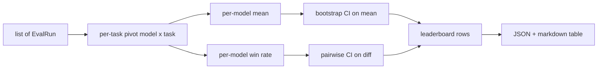
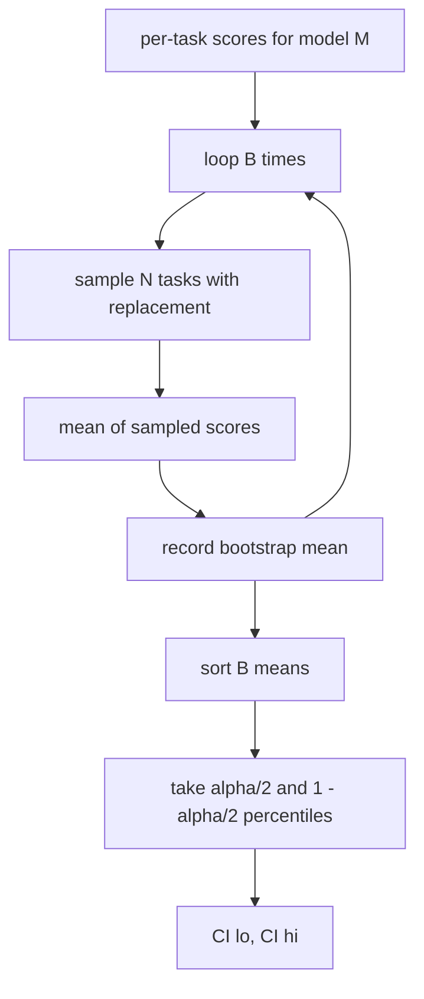

# रैंडरबोर्ड एग्रीगेशन

> प्रत्येक कार्य के लिए स्कोर आसान है। विषम कार्यों में प्रति मॉडल रैंकिंग कठिन है। एक हजार भविष्यवाणी रैंकिंग बोर्ड पर सांख्यिकीय महत्व वह हिस्सा है जिसे हर कोई छोड़ देता है। यह सबक इसे नहीं छोड़ता है।

**Type:** Build
**Languages:** Python
**Prerequisites:** Phase 19 Track B foundations, lessons 70, 71, 73
**Time:** ~90 min

## सीखने के उद्देश्य

- कई मॉडलों और कई कार्यों में प्रति-कार्य स्कोर को एक व्यवस्थित प्रति-मॉडल पंक्ति में इकट्ठा करें।
- विषम स्कोर को सामान्य बनाना ताकि पास दर और BLEU मान कुल पर अत्यधिक प्रभाव न डालें।
- औसत और जीत दर के आधार पर मॉडल को रैंक करें और समझाएं कि प्रत्येक सही सारांश कब है।
- प्रति मॉडल औसत स्कोर और जोड़ी अंतर पर बूटस्ट्रैप विश्वास अंतराल की गणना करें।
- JSON रिपोर्ट के रूप में रैंकरबोर्ड आउटपुट करें और मार्कडाउन तालिका के रूप में पाठ 75 में धावक एक आईसी टिप्पणी में पेस्ट कर सकता है।

```figure
ci-leaderboard-ci
```

## इनपुट का आकार

संश्लेषक  की एक सूची का उपभोग करता है`EvalRun`रिकॉर्डः

```python
@dataclass
class EvalRun:
    model_id: str
    task_id: str
    metric_name: str
    score: float          # in [0, 1]
    category: str
```

पाठ 75 में धावक प्रति व्यक्ति एक रिकॉर्ड जारी करता है`(model, task)`जोड़ी. एग्रीगेटर को परवाह नहीं है कि स्कोर कैसे बनाया गया था। यह उम्मीद करता है कि सामान्यीकरण पहले ही हुआ हैः प्रत्येक स्कोर में है `[0, 1]`. .

## आउटपुट

तीन टेबल बाहर आते हैंः



रैंकिंग बोर्ड की पंक्ति में निम्नलिखित शामिल हैंः `model_id`,`mean_score`,`mean_ci_lo`,`mean_ci_hi`,`win_rate`,`tasks_completed`, और एक वैकल्पिक `categories`प्रति श्रेणी औसत के लिए नक्शा।

## सामान्यीकरण

यदि एक कार्य में अंक प्राप्त होता है `[0, 1]`और एक और में `[0, 100]`संकलितकर्ता सत्यापित करता है कि प्रत्येक इनपुट स्कोर में बैठता है`[0, 1]`और अन्यथा दौड़ से इनकार करता है. फिक्स स्ट्रीम ऊपर रहता हैः मीट्रिक पहले से ही एक अंश वापस करना चाहिए. पाठ 71 से 73 उस अनुबंध को लागू करते हैं.

## औसत और जीत दर

दोनों रैंकिंग योजनाएं अलग-अलग उद्देश्यों के लिए काम करती हैं।

औसत स्कोर एक मॉडल के प्रति कार्य स्कोर का औसत है। यह शीर्ष अंक रैंकिंग बोर्ड रिपोर्ट है। यह असाधारण और कार्य असंतुलन के प्रति संवेदनशील है।

विन-रेट यह गणना करता है कि एक मॉडल एक ही कार्य पर प्रत्येक अन्य मॉडल को कितनी बार हराता है। प्रत्येक कार्य के लिए, उच्चतम स्कोर वाला मॉडल जीतता है (टी विभाजित) । विन-रेट बराबर है जीत के साथ विभाजित कार्यों की संख्या जहां मॉडल के पास स्कोर है। यह असाधारण और पैमाने के अंतर के प्रति कम संवेदनशील है लेकिन जानकारी खो देता है।

```python
def win_rate(model_id, runs_by_task, all_models):
    wins, total = 0, 0
    for task_id, runs in runs_by_task.items():
        scores = {r.model_id: r.score for r in runs if r.model_id in all_models}
        if model_id not in scores:
            continue
        total += 1
        best = max(scores.values())
        if scores[model_id] >= best:
            wins += 1
    return wins / total if total else 0.0
```

हर्नस दोनों रिपोर्ट करता है। पाठ 75 में धावक डिफ़ॉल्ट रूप से औसत के अनुसार रैंक करता है; उपयोगकर्ता द्वारा पसंद किए जाने की स्थिति में जीत दर के लिए मार्कडाउन कॉलम वहां है।

## बूटस्ट्रैप विश्वास अंतराल

प्रति मॉडल साधनों के साथ आते हैं एक विश्वास अंतराल के साथ अनुमानित किया गया है कि कार्य पर बूटस्ट्रैप पुनः नमूनाकरण। हम प्रतिस्थापन के साथ कार्य आईडी फिर से नमूना, गणना औसत पर पुनः नमूना सेट, दोहराएँ `B`समय, और स्तर पर प्रतिशतल अंतराल ले `alpha`. .



जोड़ी तुलना के लिए हम प्रति कार्य अंतर बूटस्ट्रैप `score_A - score_B`यदि यह होता है, तो अंतर अल्फा स्तर पर महत्वपूर्ण होता है। यदि यह नहीं होता है, तो रैंकिंग बोर्ड मॉडल को बराबरी के रूप में व्यवहार करता है।

निम्न स्तर के सहायक (`bootstrap_mean_ci`,`bootstrap_pairwise_diff`) के लिए default`B=1000`; सार्वजनिक संवर्धन (`aggregate`,`pairwise_diffs`) के लिए default`b=500`तो डेमो और परीक्षण तेजी से रहते हैं। डिफ़ॉल्ट अल्फा 0.05 है. पाठ बूटस्ट्रैप शुद्ध numpy रखता है, कोई स्किपी.

## श्रेणियाँ

यदि`EvalRun.category`यह प्रत्येक रैंकिंग बोर्ड पर स्तंभ है जो कहता है कि`math`,`reasoning`,`code`,`safety`. यह धावक को यह पता लगाने देता है कि क्या एक मॉडल समग्र रूप से अच्छा है लेकिन कोड में कमजोर है, जो कि शीर्षक का मतलब है कि जानकारी छिपाता है.

## मार्कडाउन रेन्डर

रैंकिंग बोर्ड को एक मार्कडाउन तालिका के रूप में प्रस्तुत किया गया हैः

```text
| Rank | Model | Mean | 95% CI | Win rate | Tasks |
|------|-------|------|--------|----------|-------|
| 1    | gpt   | 0.78 | 0.74-0.82 | 0.62 | 50 |
| 2    | claude| 0.75 | 0.71-0.79 | 0.34 | 50 |
| 3    | random| 0.10 | 0.07-0.13 | 0.04 | 50 |
```

तालिका औसत स्कोर के अनुसार क्रमबद्ध है। आईसी को दो दशमलव पर प्रस्तुत किया जाता है। लंबे मॉडल आईडी को बीस वर्णों तक छोटा किया जाता है।

## यह सबक क्या नहीं करता

यह मॉडल नहीं चलाता है। यह मीट्रिक परत को नहीं कहता है। यह अनुकूलन ईसीई या अन्य माप संस्करणों को लागू नहीं करता है; ये सबक 73 हैं। यह कार्य भार को लागू नहीं करता है। प्रत्येक कार्य का हिसाब यहां एक ही है। उत्पादन रैंकिंग बोर्ड वजन कार्य करता है; हम उस हुक को खोलकर छोड़ देते हैं।`weight`एक अनुवर्ती पाठ में वजन जोड़ें यदि आप इसकी जरूरत है।

## कोड कैसे पढ़ें

`main.py`परिभाषित करता है `EvalRun`,`LeaderboardRow`,`aggregate`,`bootstrap_mean_ci`,`bootstrap_pairwise_diff`और `render_markdown`. डेमो में तीन मॉडल और बारह कार्यों का एक सिंथेटिक सूट बनाया गया है, जो कि समग्र है और रैंकिंग बोर्ड और जोड़ी अंतर तालिका को प्रिंट करता है।`code/tests/test_leaderboard.py`बूटस्ट्रैप, मार्कडाउन रेंडर, जीत दर किनारे मामलों, और खाली-इनपुट व्यवहार को पिन करें।

पढ़िए `main.py`ऊपर से नीचे तक। डेटा आकार (EvalRun, LeaderboardRow) पहले आता है, एग्रीगेटर अगले, बूटस्ट्रैप तीसरे, रेंडरिंग अंतिम। प्रत्येक फ़ंक्शन में एक केंद्रित अनुबंध है।

## आगे बढ़ना

स्वाभाविक अगले कदम है जोड़ी-कार्य महत्व की बजाय अनपेरित बूटस्ट्रैप. यदि मॉडल ए और बी दोनों एक ही सौ कार्यों को चलाया, तो उपयुक्त परीक्षण कार्य-दर-कार्य अंतर पर जोड़ा बूटस्ट्रैप है, जिसे हम लागू करते हैं। इसके अलावा, आप एक पदानुक्रमिक बूटस्ट्रैप चाहते हैं जो कार्य परिवारों का सम्मान करता है (गणितीय समस्याएं एक दूसरे से स्वतंत्र नहीं हैं; एक अंकगणितीय त्रुटि पैटर्न उनमें से दस को प्रभावित करता है) । यह एक अनुवर्ती है। इस पाठ का उद्देश्य सही मंजिल प्राप्त करने के लिए है ताकि मूल्यांकन रिपोर्ट एक संख्या आप रक्षा कर सकते हैं.
