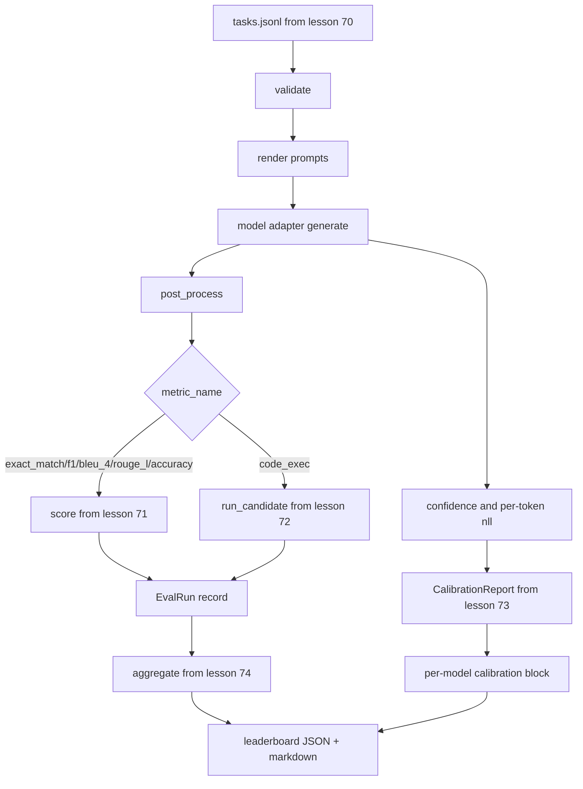

# अंत-से-अंत ईवल धावक

> पांच पाइपलाइन के पाठ, उन्हें चिपकाने के लिए एक पाठ। धावक पाठ 70 से कार्य विनिर्देश पढ़ता है, एक एडाप्टर के माध्यम से एक मॉडल को बुलाता है, पाठ 71 और 72 के साथ स्कोर करता है, पाठ 73 से माप रिपोर्ट संलग्न करता है, और पाठ 74 से लीडरबोर्ड जारी करता है। डेमो स्वयं समाप्त होता है।

**Type:** Build
**Languages:** Python
**Prerequisites:** Phase 19 Track B foundations, lessons 70 through 74
**Time:** ~90 min

## सीखने के उद्देश्य

- एक को परिभाषित करें `ModelAdapter`इंटरफ़ेस जो किसी भी मॉडल (मैक, स्थानीय, एपीआई) को एक छोटी विधि सतह से संतुष्ट कर सकता है।
- एक कार्यकर्ता पूल के पार समानांतर कार्य निष्पादन के साथ एक फिक्स्चर JSONL फ़ाइल पर मूल्यांकन चलाएं.
- एक पास में माप परत (exact_match, F1, BLEU-4, ROUGE-L, code_exec) के साथ माप परत को मिलाएं।
- प्रति मॉडल उत्सर्जन `EvalRun`रिकॉर्ड और उन्हें सीधे रैंकिंग बोर्ड एग्रीगेटर में खिलाएं।
- एक JSON रिपोर्ट और एक मार्कडाउन तालिका दोनों को आउटपुट करें; एक साफ रन पर नल आउट के साथ स्वयं समाप्त करें, सत्यापन या रनटाइम विफलता पर नॉन-नल।

```figure
eval-grid
```

## पाइपलाइन



धावक एकीकरण बिंदु है। प्रत्येक पाठ 70 से 74 तक एक मॉड्यूल का मालिक है जिसे धावक बनाता है। धावक उन मॉड्यूलों से किसी भी तर्क को दोहराता नहीं है: वह उन्हें आयात करता है।

## एडाप्टर इंटरफ़ेस

एडाप्टर धावक और किसी भी मॉडल के बीच सीम है। इंटरफ़ेस जानबूझकर छोटा है।

```python
class ModelAdapter:
    model_id: str

    def generate(self, prompt: str, task: TaskSpec) -> Generation: ...
```

`Generation`एक डेटा वर्ग है जिसमेंः

- `text`: मॉडल का मुक्त रूप आउटपुट
- `confidence`: एक फ्लोट में `[0, 1]`उत्तर के लिए मॉडल की स्व-रिपोर्ट की संभावना का प्रतिनिधित्व करना
- `token_nll`: उत्पन्न टोकन पर नकारात्मक लॉग-संभाव्यताओं का वैकल्पिक योग
- `token_count`: उत्पन्न टोकन की वैकल्पिक संख्या

रनिंग में नकली एडाप्टर तीन स्वाद प्रदान करते हैंः `RuleBasedAdapter`(निर्धारक, लगभग सही), `NoisyAdapter`(अत्यधिक आत्मविश्वास, अक्सर गलत) और`BiasedAdapter`डेमो सब तीनों पाठ 70 तय करता है।

## समानांतर निष्पादन

धावक उपयोग करता है `concurrent.futures.ThreadPoolExecutor`कार्य मॉडल के लिए समानांतर में कार्य करने के लिए। कार्यकर्ता संख्या डिफ़ॉल्ट रूप से आठ से छोटी और कार्य संख्या तक होती है। थ्रेड पर्याप्त हैं क्योंकि वास्तविक मॉडल कॉल के लिए बोतल की गर्दन नेटवर्क I / O है। कोड-exec पथ कार्य के अंदर अपनी स्वयं की उपप्रक्रिया उत्पन्न करता है और निष्पादक केवल प्रतीक्षा की योजना बनाता है।

निर्धारात्मक परीक्षणों के लिए, धावक को उजागर करता है `run_eval(adapters, tasks, parallel=False)`तो परीक्षण निष्पादन आदेश को pin कर सकते हैं।

## एकल-पास स्कोरिंग लूप

प्रत्येक कार्य के लिएः

1. प्रम्प्ट (कुछ शॉट्स प्रीफिक्स प्लस प्रम्प्ट बॉडी) को रिटर्न करें।
2. एडॉप्टर को कॉल करें और कॉल का समय निर्धारित करें।
3. कार्य के नियम के अनुसार पीढ़ी को पोस्ट-प्रोसेस करें।
4. मीट्रिक परत पर भेजें।
5. एक निर्माण `EvalRun`स्कोर और मेट्रिक मेटाडेटा के साथ रिकॉर्ड।
6.  को जोड़ें`(confidence, correct)`कैलिब्रेशन बफर से जोड़ी।

`correct`संकेत है`score >= 1.0`exact_match शैली मेट्रिक्स के लिए (`exact_match`,`accuracy`,`code_exec`) और `score >= 0.5`दरें निर्धारित करने के लिए।`_correct_from_score`और धावक सार्वजनिक ओवरराइड को उजागर नहीं करता है।

## संश्लेषण

प्रत्येक कार्य के परिणाम होने के बाद, धावक कॉल करता है`aggregate`और `pairwise_diffs`पाठ 74 और `CalibrationReport.from_predictions`पाठ 73 से। आउटपुट एक एकल JSON लिफाफा है:

```json
{
  "leaderboard": [...],
  "pairwise": [...],
  "calibration": {
    "model_id_a": {"ece": 0.04, "brier": 0.10, "populated_bins": 8, ...},
    ...
  },
  "summary": {
    "tasks": 10,
    "models": 3,
    "wall_seconds": 1.2
  }
}
```

धावक भी एक मार्कडाउन तालिका लिखता है stdout ताकि उपयोगकर्ता परिणाम को एक PR समीक्षा में पेस्ट कर सके।

## आत्म-निष्पादन डेमो

डेमो में पाठ 70 के दस फिक्स्चर कार्यों पर तीन नकली एडाप्टर चलाए जाते हैं। दीवार समय दस सेकंड से कम होना चाहिए। एक साफ रन पर एक्जिट कोड शून्य है।

स्वच्छ संचालन के मानदंड हैंः

- सबक 70 के तहत मान्य प्रत्येक कार्य।
- प्रत्येक कार्य को 71 और 72 के पाठों के तहत स्कोर किया गया।
- माप रिपोर्ट को पाठ 73 के तहत त्रुटि के बिना संकलित किया गया।
- रैंकिंग बोर्ड ने नियम आधारित एडाप्टर को यादृच्छिक एडाप्टर से सख्ती से ऊपर रखा।

यदि इनमें से कोई भी टूट जाता है, तो JSON लिफाफे में एक संरचित त्रुटि के साथ रनर गैर-शून्य से बाहर निकलता है।

## यह सबक क्या नहीं करता

यह एक वास्तविक मॉडल नहीं कहता है। यह एक एपीआई कुंजी प्रवाह या दर-सीमा हैंडलिंग लागू नहीं करता है। यह स्ट्रीमिंग या आंशिक पीढ़ी को लागू नहीं करता है; एडाप्टर प्रति कॉल एक पीढ़ी को लौटाता है। यह पुनः प्रयास या कैशिंग नहीं करता है। ये चिंताएं एडाप्टर परत पर रहती हैं; रनर मीट्रिक-अज्ञानी और प्रदाता-अज्ञानी है।

## कोड कैसे पढ़ें

`main.py`यह एक छोटे से माध्यम से अन्य पांच पाठ मॉड्यूल से आयात करता है`_load_sibling`सहायक जो उन्हें सापेक्ष पथ से हल करता है।`Generation`,`EvalReport`और `ModelAdapter`नकली एडाप्टर फ़ाइल के नीचे हैं।

पढ़िए `main.py`ऊपर से नीचे तक आयातों को स्किम करें, फिर देखें`run_eval`, तो `_score_one`अंत में डेमो प्रवेश बिंदु है।

`code/tests/test_runner.py`एडाप्टर इंटरफ़ेस, एकल-पास लूप, समानांतर बनाम अनुक्रमिक समकक्षता, माप बफर, और JSON लिफाफे के आकार को पिन करें।

## आगे बढ़ना

यह रनर फ्लोर है। एक उत्पादन मूल्यांकन प्रणाली जोड़ता हैः एक परिणाम कैश द्वारा कुंजीकृत `(task_id, model_id, model_version)`, एक लागत लेजर जो प्रति रन डॉलर और टोकन को ट्रैक करता है, एक रीट्री परत जो दर सीमाओं पर वापस आ जाती है, पास-एट-के कार्यों के लिए एक नमूना नीति, और लंबे सूट के लिए एक स्ट्रीमिंग आउटपुट प्रारूप। इनमें से प्रत्येक एक एकल चिंता है जो मीट्रिक या संश्लेषण परतों को बदलने के बिना धावक को लपेटता है। यह विभाजन अनुबंध का बिंदु है।

एक वास्तविक प्रदाता के लिए एक एडाप्टर जोड़ें जब आप नकली काम कर रहे हैं। एक मुक्त स्तर के साथ एक चुनें, चिपकने की तीस पंक्तियों लिखें, रैंकिंग बोर्ड को रोशनी देखने के लिए। फिर दूसरे प्रदाता को जोड़ें और हर्न को काम करने दें।
