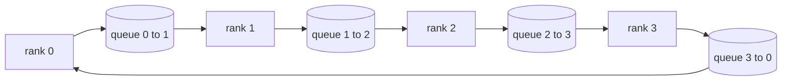

# सामूहिक संचालन शून्य से

> चार सामूहिक संचालन जो वितरित प्रशिक्षण को एक साथ रखते हैं वे सभी घटाएं, प्रसारण करें, सभी एकत्र करें और कम करें_प्रसारण करें। प्रत्येक अन्य आदिम प्रशिक्षण ढांचे की पेशकश इन चारों ओर एक रैपर है। उन्हें एक बार एक पर बनाएं `multiprocessing.Queue`जाल, उन्हें एक संदर्भ कार्यान्वयन के खिलाफ सत्यापित करें, और शेष ट्रैक प्लाईवुड बन जाता है।

**Type:** Build
**Languages:** Python
**Prerequisites:** Phase 19 Track C lessons 42-49
**Time:** ~90 min

## सीखने के लक्ष्य

- दो पास में सभी घटाएं (कम-खण्डन और फिर सभी एकत्र करें) और प्रति रैंक संचार मात्रा 2(N-1) /N बाइट प्रति तत्व है साबित करें।
- बिल्ड प्रसारण, सभी इकट्ठा, और कम_विखेरने बिंदु से बिंदु पर भेजने के ऊपर `multiprocessing.Queue`. .
- एक के खिलाफ प्रत्येक आदिम सत्यापित करें`torch.distributed`उसी इनपुट के लिए संदर्भ।
- क्लस्टर आकार, विलंबता मंजिल और बैंडविड्थ छत पर अंगूठी बनाम पेड़ के विकल्प का बचाव करें।

## समस्या

N रैंक पर एक साफ़ ऑलरिड्यूस N गुना टेंसर को रूट पर भेजता है और N गुना वापस प्रसारित करता है। बैंडविड्थ O ((N) प्रति रैंक के रूप में पैमाने, जड़ एक बोतल गला बन जाता है, और दीवार-घड़ी मंजिल सबसे धीमी लिंक गुना N है। रिंग ऑलड्रेक्ट्स 2 ((N-1) आकार के टुकड़ों में फ्लैट करते हैं T / N, इसलिए प्रति रैंक बाइट्स क्लस्टर आकार के बावजूद 2T ((N-1) / N तक गिरते हैं। पेड़ सभी कम करता है छोटे N और उच्च विलंबता लिंक पर जीत क्योंकि गहराई log2(N) 2(N-1 के बजाय कूदता है। क्लस्टर आकार के लिए गलत टॉपॉलजी चुनें और सबसे धीमी जीपीयू चरण समय निर्धारित करता है।

इस ट्रैक को पढ़ने वाले प्रत्येक वितरित प्रशिक्षण ढांचे इन चार आदिमों पर निर्भर करता है। PyTorch DDP प्रत्येक पैरामीटर बाल्ट के लिए एक ऑलरिड्यूस के साथ ग्रेडिएंट्स को सिंक्रनाइज़ करता है। ZeRO reduce_scatter द्वारा ऑप्टिमाइज़र स्टेट को छोटा करता है और allgather द्वारा अद्यतन पैरामीटर प्रसारित करता है। FSDP पूर्ण आगे को allgather प्लस reduce_scatter में बदल देता है। चरण समूहों के बीच सक्रियण के लिए पाइपलाइन समानांतर आवश्यकताओं का प्रसारण। यदि आप चार सामूहिकों को लागू नहीं कर सकते हैं, तो आप तर्क नहीं दे सकते कि प्रशिक्षण स्टॉल क्यों हैं, ग्रेडिएंट असंगतता रैंक 3 पर क्यों दिखाई देती है, या पाइपलाइन बुलबुला क्यों दोगुना होता है जब आप टॉपलॉजीज बदलते हैं।

## अवधारणा



### दो पार में रिंग allreduce

0..N-1 के साथ एन बराबर टुकड़ों में टेंसर को विभाजित करें। प्रत्येक रैंक के पास अपने रैंक के बराबर का टुकड़ा सूचकांक है। पास 1, कम-खेलने, N-1 कदम चलाता है। चरण s में, रैंक r भाग (r - s) mod N को रैंक (r + 1) mod N को भेजता है और रैंक (r - s - 1) mod N से भाग (r - 1) mod N प्राप्त करता है, जो प्राप्त भाग को अपनी स्थानीय प्रति में जमा करता है। N-1 चरणों के बाद, रैंक r भाग r के लिए पूर्ण राशि का मालिक है। पास 2, सभी एकत्र, एक और N-1 कदम चलाता है और रिंग के चारों ओर तैयार टुकड़े घूमता है जब तक प्रत्येक रैंक प्रत्येक टुकड़े के लिए पूर्ण राशि रखता है।

| Primitive | Per-rank bytes | Steps | When to use |
|-----------|---------------|-------|-------------|
| Ring allreduce | 2T(N-1)/N | 2(N-1) | Large T, fat-pipe homogeneous cluster |
| Tree allreduce | T log2(N) | 2 log2(N) | Small T or high-latency links |
| Broadcast | T | log2(N) tree | Parameter init, scalar config |
| Allgather | T(N-1)/N | N-1 | Sharded forward, ZeRO unshard |
| Reduce_scatter | T(N-1)/N | N-1 | ZeRO gradient sharding |

### एनसीसीएल के लिए स्टैंड-इन के रूप में कतार जाल

एनसीसीएल पीसीआईएल और NVLink पर हार्डवेयर-ऑफलोड किए गए कटौती के साथ चलाता है। सीपीयू पर आपके पास ऐसा नहीं है।`multiprocessing.Queue`प्रति रिंग किनारे आपको एक एकल निर्माता और एक एकल उपभोक्ता के साथ ऑर्डर किया गया बिंदु-टू-पॉइंट वितरण देता है। यह कमी उपयोगकर्ता स्थान में होती है, इसलिए आप पायथन ओवरहेड का भुगतान करते हैं, लेकिन तार पैटर्न एनसीसीएल रिंग ऑलरेड्यूस के समान है। कतार संस्करण पर सटीकता के बारे में तर्क और क्लस्टर व्यवहार निम्नलिखित है।

### ग्लू के खिलाफ सत्यापित करें

प्रत्येक आदिम एक इकाई परीक्षण के साथ भूमि है कि तुलना करता है अपने उत्पादन के साथ `torch.distributed`यदि आपका रिंग ऑलरेड्यूस फ्लोट32 एप्सिलन से अधिक समय तक ग्लो से भिन्न होता है, तो परीक्षण विफल रहता है। एक संदर्भ कार्यान्वयन के खिलाफ सत्यापन गैर-मजबूत है; इसके बिना मूल एक वास्तविक प्रशिक्षण रन के चरण 10000 तक सही लगता है।

```figure
ci-ring-allreduce
```

## इसे बनाओ

`code/main.py`कार्य करता हैः

- `Mesh`वर्ग जो तारों N `multiprocessing.Queue`एक अंगूठी में उदाहरण और उजागर करता है `send(dst, tensor)`और `recv(src)`प्रति रैंक।
- `ring_allreduce(mesh, rank, world_size, tensor)`दो पास एल्गोरिथ्म चला रहा है।
- `broadcast(mesh, rank, world_size, tensor, src)`एक लॉगरिथमिक पेड़ पर।
- `allgather(mesh, rank, world_size, tensor)`N-1 घूर्णन का उपयोग करके।
- `reduce_scatter(mesh, rank, world_size, tensor)`सभी कम करने के पहले आधे के रूप में.
- `_gloo_reference(op, world_size, tensor)`जो उसी इनपुट के माध्यम से चलाता है `torch.distributed`बाइट-समान तुलना के लिए ग्लू के साथ।

इसे चलाओः

```bash
python3 code/main.py
```

आउटपुटः प्रति प्राथमिक सत्यापन तालिका जो कतार-मेश और ग्लू आउटपुट की तुलना करती है, इसके बाद प्रति रैंक बाइट काउंटर जो 2T(N-1) /N स्केलिंग साबित करता है।

## जंगली में उत्पादन के पैटर्न

तीन पैटर्न आदिमों को जहाज के लिए पर्याप्त कठोर बनाते हैं।

**Bucket gradients before allreduce.**1B पैरामीटर मॉडल में दशकों के हजारों ग्रेडिएंट टेंसर होते हैं। एक ऑलरेड्यूस प्रति टेंसर लेटेंसी फ्लोर N बार का भुगतान करता है। डीडीपी बाल्ट्स ग्रेडिएंट्स को ~ 25 एमबी टुकड़ों में बदल देता है और एक ऑलरेड्यूस प्रति बाल्ट जारी करता है; छोटे टेंसर बड़े लोगों के पीछे चलते हैं। बिना बाल्टिंग लेटेंसी ओवरहेड चरण पर हावी होता है।

**Overlap communication with computation.**पिछड़े परत परतों को परतों के अनुसार उल्टे क्रम में गणना करता है। जब अंतिम परत का ग्रेडिएंट तैयार हो जाता है, तो अगले परत को कंप्यूटिंग जारी रखने के दौरान इसकी ऑलरिड्यूस शुरू कर देता है। PyTorch DDP इसे बाल्टी-तैयार हुक के साथ तार करता है। ओवरलैप नेटवर्क के ढीले होने पर दृश्य संचार समय को आधा कर देता है।

**Pick ring or tree by message size, not religion.**एनसीसीएल एक टोपोलॉजी डिटेक्टर भेजता है जो ~ 1 एमबी से ऊपर और पेड़ से नीचे संदेशों के लिए रिंग का चयन करता है। क्रॉसओवर बैंडविड्थ-वेरिस-लैटेंसी हैः 1 एमबी से ऊपर, बैंडविड्थ शब्द 2T(N-1) / N हावी है और रिंग जीतता है; 1 एमबी से नीचे, लॉग2(N) हॉप काउंट जीतता है। हार्ड-कोडिंग एक टोपोलॉजी गलत संदेश आकार पर आउटपुट लागत है।

## इसका प्रयोग करें

उत्पादन के पैटर्नः

- **PyTorch DDP.**कॉल करता है`dist.all_reduce`बैकेट आकार ट्यून करने योग्य है; डिफ़ॉल्ट 25 एमबी 100Gbit ईथरनेट के लिए उचित है।
- **DeepSpeed ZeRO.**प्रश्नों को घटाने_खण्डन करने के लिए स्क्रैड ग्रेडिएंट और सभी आगे बढ़ने से पहले पूर्ण मापदंडों को पुनर्निर्माण करने के लिए एकत्रित करें। पाठ की आदिम बातें बिल्कुल वही हैं जो ZeRO करता है।
- **FSDP.**आगे सभी को एक साथ इकट्ठा करके परत को अलग करने के लिए शुरू होता है, गणना करता है, फिर reduce_scatter के साथ घटाता है और unshard को त्याग देता है। समान आदिम, अलग कार्यक्रम।

## इसे भेजें

पाठ 77-81 में कतार-मेश आदिम का उपयोग करें। पाठ 77 तार सभी को डीडीपी में कम करता है। पाठ 78 तारों को ज़ेरो में कम करता है। पाठ 79 तारों को पाइपलाइन सक्रियण में प्रसारित किया जाता है। पाठ 81 सभी चार को अंत से अंत डेमो में शामिल करता है।

## व्यायाम

1. एक पेड़ जोड़ें सभी घटाएँ संस्करण और संदेश आकार के अनुसार अंगूठी और पेड़ के बीच स्विच करें। क्रॉसओवर मापें।
2. एक जोड़ें `recv_timeout_ms`तो एक स्थिर रैंक हमेशा के लिए लटका के बजाय एक समय सीमा त्रुटि के साथ सतह पर आता है।
3. प्रतिस्थापन`multiprocessing.Queue`चार आदिम के लिए टीसीपी सॉकेट के साथ. एक ही परीक्षण, असली तार.
4. एक बैंडविड्थ उपकरण हुक जोड़ें ताकि प्रति रैंक बाइट काउंटर JSONL में लॉग करता है।
5. 1KB, 1MB, 16MB के आकार के टेंसर के लिए 4 रैंक पर अंगूठी बनाम पेड़ के दीवार घड़ी समय की तुलना करें। क्रॉसओवर का अनुभवजन्य रूप से बचाव करें।

## प्रमुख शर्तें

| Term | What people say | What it actually means |
|------|----------------|------------------------|
| Allreduce | "Sum across ranks" | After the call every rank holds the same reduced tensor |
| Ring | "The fast topology" | N-1 chunks of size T/N flow around the cycle twice |
| Tree | "The log topology" | Reduction follows a binary tree; depth is log2(N) hops |
| Allgather | "Concatenate shards" | Every rank ends with every other rank's shard |
| Reduce_scatter | "Split the sum" | Each rank ends with the sum of one chunk only |
| Bucket | "Fuse small tensors" | Coalesce N small allreduces into one large one |

## आगे पढ़ना

- [PyTorch Distributed: NCCL collectives](https://pytorch.org/docs/stable/distributed.html#collective-functions)
- [Horovod ring allreduce paper](https://arxiv.org/abs/1802.05799)
- [NCCL topology and algorithm selection](https://docs.nvidia.com/deeplearning/nccl/user-guide/docs/index.html)
- [Patarasuk and Yuan, Bandwidth optimal allreduce algorithms](https://www.cs.fsu.edu/~xyuan/paper/09jpdc.pdf)
- चरण 10 पाठ 05 - वितरित प्रशिक्षण का अवलोकन
- चरण 19 पाठ 77 - इन आदिमों के ऊपर डीडीपी तार
