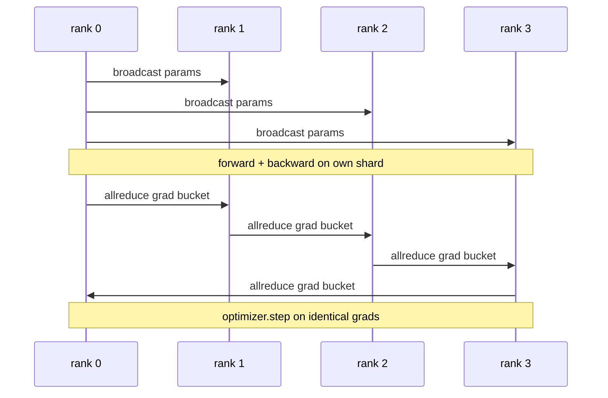

# डेटा समानांतर डीडीपी खरोंच से

> DistributedDataParallel सभी घटाएँ के ऊपर एक हुक है। एक मॉडल को लपेटें, रैंक 0 से प्रारंभिक मापदंडों को प्रसारित करें ताकि प्रत्येक रैंक समान शुरू हो जाए, प्रत्येक पैरामीटर पर एक पिछड़ा हुक स्थापित करें जो ग्रेडिएंट का सभी घटाता है, और बाकी ग्रेडिएंट अवतरण है। पूरे पैटर्न में 200 लाइनें हैं।

**Type:** Build
**Languages:** Python
**Prerequisites:** Phase 19 Track C lessons 42-49
**Time:** ~90 min

## सीखने के लक्ष्य

- तार ए `DistributedDataParallel`-आकार का लपेट जो प्रारंभिक मापदंडों को प्रसारित करता है और पीछे की ओर गिरने के बाद सभी गिरावट को कम करता है।
- Spawn N CPU रैंक के साथ `torch.multiprocessing.spawn`फ़ाइल आधारित डेट के साथ अंधेरे के पीछे के छोर पर।
- उसी मॉडल को क्रमशः एक ही डेटा पर प्रशिक्षित करके और प्रति चरण पैरामीटर समतुल्यता दिखाकर ग्रेडिएंट-सिंक सटीकता साबित करें।
- कामकाजी डीडीपी को उत्पादन डीडीपी में बदलने वाले दो परिवर्तनों के रूप में बाल्ट (ग्रेडिएंट फ्यूजन) और ओवरलैप (पछाड़ के दौरान कॉम) के उपयोग का बचाव करें।

## समस्या

एक 1 बिलियन पैरामीटर मॉडल 12 जीबी सक्रियण के साथ एक उपभोक्ता जीपीयू पर फिट नहीं होता है। यह फिट होने पर भी, प्रशिक्षण में हफ्तों लगते हैं। डेटा समानांतर N रैंक में बैच को विभाजित करता है, प्रत्येक रैंक अपने टुकड़े पर आगे और पीछे की गणना करता है, और प्रत्येक चरण में प्रत्येक रैंक के ग्रेडिएंट को योग किया जाता है ताकि सभी N प्रतियां समान रहें। योगित ग्रेडिएंट वह है जिस पर ऑप्टिमाइज़र कदम उठाता है।

ग्रेडिएंट सिंक के बिना, N प्रतिकृति चरण 2 से भिन्न होती है। मॉडल अब "एक मॉडल नहीं है जो अधिक डेटा पर प्रशिक्षित है", यह N अलग मॉडल हैं जो प्रारंभिक वजन साझा करते हैं। ग्रेडिएंट सिंक खराब तरीके से किया गया है (एक पैरामीटर प्रति ऑलरिड्यूस, कोई ओवरलैप, कोई बुकेटिंग नहीं) नेटवर्क बोतल गला है और GPUs तार की प्रतीक्षा में निष्क्रिय हैं। डीडीपी के शिल्प गणना के सापेक्ष ग्रेडिएंट सिंक्रनाइज़ेशन लगभग मुक्त कर रहा है। कैनोनिक PyTorch DDP बुकेटिंग ग्रेडिएंट्स, ओवरलैप सभी परत के पीछे के साथ कम करके और NVLink पर NCCL का उपयोग करके यह प्राप्त करता है। हम सभी तीनों को CPU पर ग्लू के साथ कर सकते हैं और एक ही सबक सीख सकते हैं।

## अवधारणा



### डीडीपी की तीनों गतिविधियों की आवश्यकता

| Stage | Collective | Why |
|-------|-----------|-----|
| Init | broadcast from rank 0 | Every rank starts with the same parameters |
| After backward | allreduce of each grad | The mean gradient is what the optimiser steps on |
| Sometimes | broadcast of buffers | Batchnorm running stats stay synchronised |

### क्यों बुरा और योग नहीं

Allreduce-SUM world_size से विभाजित औसत ग्रेडिएंट देता है। औसत world_size के लिए अपरिवर्तनीय हैः एक रैंक पर ट्यून की गई सीखने की दर चार रैंक पर काम करती है क्योंकि प्रति चरण ग्रेडिएंट परिमाण नहीं बदलता है। Allreduce-SUM बिना विभाजन आपको प्रत्येक बार सीखने की दर को फिर से समायोजित करने के लिए मजबूर करता है जब आप क्लस्टर आकार बदलते हैं। DDP SUM को लपेटता है और विभाजित करता है; पाठ में ऐसा ही करें।

### बाल्टी ग्रेडिएंट क्यों

एक ट्रांसफार्मर में हजारों पैरामीटर टेंसर होते हैं। एक ऑलरेड्यूस प्रति टेंसर एक बार ग्लू लेटेन्सि फ्लोर को हजारों बार भुगतान करता है। डीडीपी ग्रेडिएंट को ~ 25 एमबी बाल्ट में समूह करता है और एक ऑलरेड्यूस प्रति बाल्ट जारी करता है। समान कुल बाइट्स तार के माध्यम से चलते हैं लेकिन लटेंसी बाल्ट पर कमी होती है। पाठ के छोटे मॉडल के लिए हम सब कुछ को एक बाल्ट में समूहित करते हैं; संरचना वह है जो पार करती है।

### बीज को क्यों बांधें

हर रैंक को बुलाया जाना चाहिए`torch.manual_seed(seed + rank)`मिश्राब करने के लिए लेकिन `torch.manual_seed(seed)`पैरामीटर init के लिए एक एकल साझा बीज का मतलब है कि प्रत्येक रैंक एक ही बैच क्रम (डेटा समानांतर को हराता है) देखता है; पैरामीटर के लिए एक रैंक-विशिष्ट बीज का मतलब है कि प्रारंभिक पैरामीटर फ्लोट एप्सिलन द्वारा असहमत हैं और ग्रेडिएंट सिंक्रनाइज़ेशन अब प्रतिकृति को समान नहीं बनाता है। बीज पैटर्न को सही करें या पैरामीटर समकक्षता परीक्षण चरण 1 पर विफल रहता है।

```figure
ci-ddp-grad-sync
```

## इसे बनाओ

`code/main.py`कार्य करता हैः

- `MiniMLP`: एक 3-परत MLP सेकंड में अभिसरण करने के लिए पर्याप्त छोटे, तारों को उजागर करने के लिए पर्याप्त बड़ा।
- `DistributedDataParallel(model, world_size)`: निर्माण समय पर पैराम्स प्रसारित करता है, एक लपेट जो `sync_grads`दुनिया_size के अनुसार संचित सभी घटा-संचित ग्रेड को विभाजित करता है।
- `worker(rank, world_size, ...)`: पूर्ण प्रशिक्षण लूप के साथ `torch.distributed`प्रारंभ ग्लू पर, आगे, पीछे, समक्रमण, कदम.
- `_reference_single_process_loop(...)`: एक रैंक पर क्रमशः एक ही मॉडल को एक ही डेटा पर ट्रेन करता है, जिसका उपयोग प्रत्येक चरण के बाद बाइट-समान पैरामीटर समतुल्यता के लिए परीक्षण द्वारा किया जाता है।

इसे चलाओः

```bash
python3 code/main.py
```

आउटपुटः एक चरण प्रशिक्षण तालिका जो एकल प्रक्रिया हानि और पैरामीटर चेकसम की तुलना 4 रैंक पर डीडीपी रन से करती है। दोनों पथ फ्लोट ईप्सिलन के लिए समान हानि वक्र उत्पन्न करते हैं, जिससे ग्रेडिएंट सिंक्रनाइज़ेशन सही साबित होता है।

## जंगली में उत्पादन के पैटर्न

तीन पैटर्न DDP जहाज करने के लिए पर्याप्त कठोरता।

**Find unused parameters.**कुछ आगे पथों पैरामीटर को सशर्त रूप से छोड़ते हैं (प्रारंभिक बाहर निकलना, विशेषज्ञों के मिश्रण रूटर) । छोड़ने वाले पैरामीटर में कोई ग्रेडिएंट नहीं है, लेकिन डीडीपी का बाल्टी-तैयार हुक अभी भी उनका इंतजार करता है और सभी अस्थिरता को कम करता है। `find_unused_parameters=True`यह एक ग्राफ कदम प्रति कदम है, तो इसे छोड़ दें जब तक आप आगे शाखाओं.

**Static graph optimisation.**जब आगे कदमों के पार स्थिर है, `static_graph=True`डीडीपी बाल्ट शेड्यूल पूर्व-गणना करने देता है। अनुकूलन पैमाने पर मायने रखता हैः पूर्व-गणना प्रति चरण कुछ ms बचाता है जो 10000 चरणों में मिश्रित होता है।

**Gradient accumulation needs care.**प्रत्येक माइक्रोबैच को सिंक्रनाइज़ किए बिना K माइक्रोबैच पर ग्रेडिएंट्स जमा करना 10x थ्रूपुट जीत है। डीडीपी उजागर करता है `no_sync()`प्रबंधक को भूल जाओ और आप सभी के लिए कम कर के समय; आउटपुट तल पर गिर जाता है।

## इसका प्रयोग करें

उत्पादन के पैटर्नः

- **PyTorch DDP.**कैनोनिक कार्यान्वयन। `torch.nn.parallel.DistributedDataParallel(model)`तारों बुकेट, ओवरलैप, और no_sync संदर्भ.
- **HuggingFace Accelerate.**एक लांचर जोड़े जो संभालता है `torchrun`एक ही डीडीपी हुड के नीचे.
- **Megatron-LM data parallel.**बड़े मॉडल के लिए टेन्सर समानांतर के साथ डीडीपी को जोड़ता है; डेटा समानांतर टुकड़ा एक ही सभी-कम-बचे-पछाड़ पैटर्न है।

## इसे भेजें

पाठ 78 (ZeRO sharding) प्रति पैरामीटर allreduce को reduce_scatter के साथ बदल देता है ताकि प्रत्येक रैंक केवल अपने अनुकूलन राज्य के shard को संग्रहीत करता है। पाठ 81 DDP को ZeRO के साथ अंत-से-अंत डेमो में बनाता है।

## व्यायाम

1. कॉन्फ़िगरेबल आकार के ग्रेडिएंट बाल्ट जोड़ें और गहरे मॉडल पर स्पीडअप बनाम एक-सब कुछ प्रति पैरामीटर मापें।
2. कार्यान्वयन`no_sync()`संदर्भ प्रबंधक के रूप में और सत्यापित करें कि ग्रेडिएंट जमा K माइक्रोबैच पर एकल प्रक्रिया बेसलाइन से मेल खाता है।
3. एक जोड़ें `find_unused_parameters`मोड जहां आगे कभी कभी MLP परतों में से एक छोड़ता है; ध्वज के बिना दौड़ अस्थिर होना चाहिए।
4. ग्लू को  से बदलें`torch.distributed.barrier()`- केवल सभी-संकलन आधारित और बाधा आधारित सिंक्रनाइजेशन के बीच अंतर महसूस करने के लिए सिंक्रनाइज़ेशन।
5. बैच आकार 1, 16, 256 के लिए चरण समय के अंश के रूप में ग्रेडिएंट-सिंक ओवरहेड को मापें और स्केलिंग की व्याख्या करें।

## प्रमुख शर्तें

| Term | What people say | What it actually means |
|------|----------------|------------------------|
| DDP | "Data parallel" | Wrapper that broadcasts params and allreduces grads each step |
| Bucket | "Fuse grads" | Group N small allreduces into one large one |
| Overlap | "Hide comm" | Issue allreduce while later layers still computing backward |
| no_sync | "Accumulate" | Skip the post-backward allreduce for gradient accumulation |
| find_unused | "Branchy forward" | Detect parameters with no grad before reducing |

## आगे पढ़ना

- [PyTorch DistributedDataParallel docs](https://pytorch.org/docs/stable/generated/torch.nn.parallel.DistributedDataParallel.html)
- [PyTorch DDP internals tutorial](https://pytorch.org/tutorials/intermediate/ddp_tutorial.html)
- [Li et al, PyTorch Distributed: Experiences on Accelerating Data Parallel Training](https://arxiv.org/abs/2006.15704)
- चरण 19 पाठ 76 - सामूहिक DDP पर बनाया गया है
- चरण 19 पाठ 78 - ZeRO स्क्रैडिंग प्रति पैराम allreduce को reduce_scatter से बदल देता है
