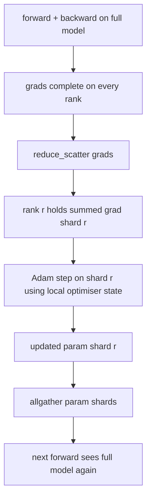

# ZeRO अनुकूलक राज्य sharding

> एडम प्रति पैरामीटर दो क्षण अनुमानों को संग्रहीत करता है, दोनों float32 में। 7 बी पैरामीटर मॉडल में 56 जीबी ऑप्टिमाइज़र स्टेट होता है। ZeRO चरण 1 N रैंक के पार को छोटा करता है; प्रत्येक रैंक में अनुकूलक का 1/N होता है। स्थानीय चरण के बाद अद्यतन पैरामीटर शार्ट्स प्रसारित वापस, प्रत्येक रैंक पूर्ण मॉडल का पुनर्निर्माण, और अगले चरण शुरू होता है। जीत प्रशिक्षण स्टैक में सबसे बड़ा एकल आवंटन पर रैखिक स्मृति गिरावट है।

**Type:** Build
**Languages:** Python
**Prerequisites:** Phase 19 Track C lessons 42-49
**Time:** ~90 min

## सीखने के लक्ष्य

- Shard अनुकूलक राज्य (पहला क्षण, दूसरा क्षण, fp32 मास्टर कॉपी) N रैंक के पार तो प्रत्येक रैंक स्वामित्व 1/N.
- प्रत्येक रैंक को केवल उसके टुकड़े के ग्रेडिएंट योग प्रदान करने के लिए reduce_scatter का उपयोग करें, फिर सभी अपडेट किए गए पैरामीटर टुकड़े वापस प्रसारित करने के लिए एकत्र करें।
- चरण 1, चरण 2, चरण 3 के लिए मेमोरी बचत तालिका को वैनिला डीडीपी के साथ गणना करें।
- मॉडल आकार और बैंडविड्थ बजट पर चरण 1 बनाम चरण 2 बनाम चरण 3 के विकल्प का बचाव करें।

## समस्या

वैनिला डीडीपी सब कुछ दोहराता हैः पैरामीटर, ग्रेडिएंट और ऑप्टिमाइज़र स्टेट हर रैंक पर पूरी तरह से मौजूद हैं। एफपी16 में 7 बी-पैरामीटर मॉडल के लिए इसका मतलब है कि 14 जीबी पैरामीटर, 14 जीबी ग्रेडिएंट और 28 जीबी ऑप्टिमाइज़र स्टेट प्रति रैंक। ऑप्टिमाइज़र स्टेट सबसे बड़ा शब्द है और इसे टुकड़े टुकड़े करने में सबसे आसान है क्योंकि इसे केवल कदम के दौरान छुआ जाता है, आगे या पीछे के दौरान नहीं।

ज़ेरो चरण 1 अनुकूलन स्थिति को छोटा करता है। प्रत्येक रैंक में आदम के क्षणों का 1/N होता है। पीछे की ओर, पूरे ग्रेडिएंट को कम करने और स्थानीय रूप से कदम उठाने के बजाय, ZeRO कम_स्केटर करता है ताकि प्रत्येक रैंक को केवल उसके टुकड़े का योगित ग्रेडिएंट प्राप्त हो। रैंक मुख्य मापदंडों के अपने टुकड़े पर अनुकूलन चरण लागू करता है। अद्यतन पैरामीटर टुकड़े फिर सभी को फिर से इकट्ठा ताकि प्रत्येक रैंक अगले आगे के लिए पूर्ण मॉडल है। अनुकूलन स्मृति N द्वारा गिर जाता है। प्रत्येक चरण के लिए तार यातायात डीडीपी के समान हैः एक reduce_scatter प्लस एक allgather बैंडविड्थ द्वारा एक allreduce के बराबर है। स्मृति जीतती है, गति बरकरार रहती है।

## अवधारणा



### ZeRO के चरण

| Stage | What is sharded | Memory per rank | Comm per step |
|-------|----------------|------------------|---------------|
| DDP | nothing | params + grads + optim | 1x allreduce |
| ZeRO-1 | optimiser state | params + grads + optim/N | 1x reduce_scatter + 1x allgather |
| ZeRO-2 | optim + grads | params + grads/N + optim/N | 1x reduce_scatter + 1x allgather |
| ZeRO-3 | optim + grads + params | params/N + grads/N + optim/N | 1x allgather per layer + 1x reduce_scatter per layer |

चरण 1 सबसे सस्ता जीत है क्योंकि अनुकूलन राज्य बजट पर हावी है। चरण 2 को ग्रेडिएंट-शिट संचय तर्क की आवश्यकता होती है लेकिन बैंडविड्थ समान है। चरण 3 (FSDP) प्रत्येक आगे और पीछे के लिए प्रति परत संचार का भुगतान करता है, पैरामीटर-शिट मेमोरी ड्रॉप प्राप्त करता है। पाठ चरण 1 को पूरी तरह से लागू करता है।

### स्मृति गणित, वास्तविक संख्या

पी पैरामीटर वाले मॉडल के लिए जो मिश्रित परिशुद्धता में एडम के साथ प्रशिक्षित हैंः

| Term | Vanilla | ZeRO-1 | Why |
|------|---------|--------|-----|
| fp16 params | 2P bytes | 2P bytes | needed for forward |
| fp16 grads | 2P bytes | 2P bytes | needed for backward |
| fp32 master copy | 4P bytes | 4P/N bytes | only the optim uses it |
| fp32 first moment | 4P bytes | 4P/N bytes | only the optim uses it |
| fp32 second moment | 4P bytes | 4P/N bytes | only the optim uses it |
| Total | 16P bytes | 4P + 12P/N bytes |   |

N=8: वैनिला 16P पर ZeRO-1 5.5P, 65% की गिरावट। N=64 पर: वैनिला 16P पर ZeRO-1 4.19P, 74% की गिरावट।

### क्यों reduce_scatter धड़कन सभीreduce-then-shard

Allreduce प्रत्येक रैंक को पूर्ण योग gradient देता है। यदि आपको केवल shard r की आवश्यकता है, तो घटित ग्रेडिएंट का (N-1) /N रैंक r पर बर्बाद हो जाता है। Reduce_scatter प्रत्येक रैंक के लिए सटीक रूप से shard प्रदान करता है; प्रति रैंक बाइट्स allreduce के समान हैं (क्योंकि allreduce reduce_scatter + allgather है) लेकिन दूसरे आधे को बाद में पैरामीटर-shard allgather द्वारा प्रतिस्थापित किया जाता है। नेट वायर डीडीपी के समान है, स्मृति विभाजित है।

```figure
cd-zero-shard
```

## इसे बनाओ

`code/main.py`कार्य करता हैः

- `flatten_params(module)`और `unflatten_into(module, flat)`एक समतल लेआउट है जो क्रम द्वारा टुकड़े टुकड़े एक सरल स्लाइस बनाता है।
- `ZeroOptimizer(model, world_size, rank, lr)`जो मास्टर कॉपी और एडम क्षणों के रैंक के टुकड़े का मालिक है।
- `step()`जो फ्लैट ग्रेडिएंट पर reduce_scatter चलाता है, रैंक के टुकड़े पर एडम लागू करता है, और सभी अद्यतन मापदंडों को वापस एकत्र करता है।
- एक डेमो जो 20 चरणों के लिए एक 3-परत MLP को प्रशिक्षित करता है और वैनिला डीडीपी बेसलाइन के साथ प्रति चरण मेमोरी बजट प्रिंट करता है।

इसे चलाओः

```bash
python3 code/main.py
```

आउटपुटः प्रति चरण हानि और ZeRO-1 को दिखाने वाली मेमोरी तालिका प्रत्येक रैंक पर अनुकूलक स्थिति का 1/N रखता है DDP की पूरी प्रति के विपरीत।

## जंगली में उत्पादन के पैटर्न

तीन पैटर्न ZeRO जहाज करने के लिए पर्याप्त कठोरता।

**Sharded checkpointing matters.**ZeRO-1 की अनुकूलन स्थिति रैंक में विभाजित है; चेकपॉइंट को रिकॉर्ड करना है कि किस रैंक का मालिक कौन है। पाठ 80 में एक टुकड़ा टुकड़ा चेकपॉइंट मैनिफस्ट का निर्माण किया गया है जो एक ही विश्व आकार पर ZeRO रन को फिर से शुरू करता है। इसके बिना सहेजी गई स्थिति को पुनरारंभ करने पर पढ़ा नहीं जा सकता है।

**Mixed precision is the point.**ZeRO एक मिश्रित परिशुद्धता तकनीक है; fp32 मास्टर कॉपी वह है जो टुकड़े टुकड़े किया जाता है। मिश्रित परिशुद्धता के बिना ZeRO चलाना एफपी32 मास्टर पर संबंधित एफपी 16 आगे जीत के बिना मेमोरी कर का भुगतान करता है। उत्पादन रन हमेशा ऑटोकास्ट या बीएफ 16 वजन के साथ ZeRO को जोड़ते हैं।

**Stage 1 is a near-free win.**संचार बैंडविड्थ द्वारा डीडीपी के समान है। मेमोरी बचत एन में रैखिक है। एकमात्र लागत ऑप्टिमाइज़र शार्ड के लिए लेखांकन है। उत्पादन स्टैक डिफ़ॉल्ट रूप से चरण 1 तक जाता है, जब तक कि पैरामीटर शार्ड मेमोरी भी समस्या नहीं है; फिर चरण 2 या 3 मेमोरी के लिए संचार व्यापार करता है।

## इसका प्रयोग करें

उत्पादन के पैटर्नः

- **DeepSpeed ZeRO.**संदर्भ कार्यान्वयन। `deepspeed_config.json`चरण 1/2/3 और विभाजन आकार का चयन करता है।
- **PyTorch FSDP.**पाइटोरच-स्वदेशी समकक्ष।`ShardingStrategy.SHARD_GRAD_OP`ZeRO-2 है; `FULL_SHARD`यह ZeRO-3 है।
- **HuggingFace Accelerate.**एक समान कॉन्फिग के तहत दोनों डीपस्पीड और एफएसडीपी को लपेटता है।

## इसे भेजें

पाठ 79 (पाइपलाइन समानांतर) ऑर्थोगनल स्क्रैडिंग अक्ष हैः एक ही मॉडल पर स्क्रैडिंग ऑप्टिमाइज़र स्टेट के बजाय, पाइपलाइन स्क्रैड्स रैंक के पार परतें बनाते हैं। पाठ 81 अंत-से-अंत डेमो पर डीडीपी + ज़ेआरओ बनाता है।

## व्यायाम

1. झेरो-2 तक स्क्रैडिंग ग्रेडिएंट्स के द्वारा विस्तारित करेंः प्रत्येक रैंक केवल अपने स्क्रैड के लिए स्क्रैडिंग को संग्रहीत करता है, जो पीछे की ओर के बाद गैर-स्क्रैड भाग को शून्य करके प्राप्त होता है।
2. एक मेमोरी प्रोफाइलर जो फॉर्मूला भविष्यवाणी के मुकाबले रैंक 0 पर वास्तविक fp32 बाइट उपयोग प्रिंट करता है जोड़ें।
3. वैनिला डीडीपी बनाम ज़ेरो-1 के प्रति चरण वॉल-घड़ी समय को मापें और आगे, पीछे, कम्युनिकेशन में विघटित करें।
4. ZeRO-1 के तहत ग्रेडिएंट क्लिपिंग लागू करेंः स्थानीय मानदंड के वर्ग के सभी घटकों के माध्यम से L2 मानदंड की गणना की जानी चाहिए।
5. सभीreduce के बजाय reduce_scatter के साथ "नाईव ZeRO" लागू करें, तार-समय अंतर मापें। संख्याओं के साथ reduce_scatter विकल्प का बचाव करें।

## प्रमुख शर्तें

| Term | What people say | What it actually means |
|------|----------------|------------------------|
| ZeRO-1 | "Shard the optimiser" | Each rank holds 1/N of fp32 master + Adam moments |
| ZeRO-2 | "Shard grads too" | Each rank also drops the non-shard gradients after reduce_scatter |
| ZeRO-3 | "Shard params" | Each rank holds 1/N of fp16 params; allgather per layer in forward |
| Master copy | "fp32 weights" | The high-precision parameter copy the optimiser updates |
| Reduce_scatter | "Split the sum" | Deliver each rank only its shard's summed gradient |

## आगे पढ़ना

- [Rajbhandari et al, ZeRO: Memory Optimizations Toward Training Trillion Parameter Models](https://arxiv.org/abs/1910.02054)
- [DeepSpeed ZeRO documentation](https://www.deepspeed.ai/tutorials/zero/)
- [PyTorch FSDP documentation](https://pytorch.org/docs/stable/fsdp.html)
- चरण 19 पाठ 76 - कम करें_खारें और सभी इकट्ठा करें यह पाठ पर खड़ा है
- चरण 19 पाठ 80 - झेरो राज्य को उपयोग करना चाहिए
