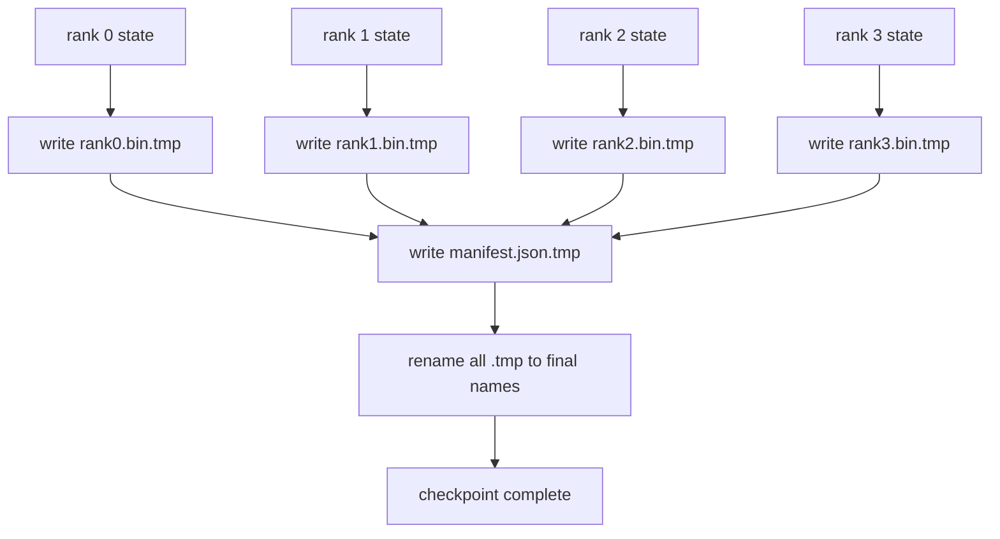

# टुकड़े टुकड़े चेकपॉइंट और परमाणु जीवनकाल

> 70B पैरामीटर प्रशिक्षण कार्य को हर कुछ घंटों में एक नोड विफलता द्वारा रोक दिया जाता है। चेकपॉइंट प्रारूप तय करता है कि आप 30 मिनट या 30 घंटे खो देते हैं या नहीं। एक टुकड़ा टुकड़ा चेकपोस्ट प्रत्येक रैंक के टुकड़े को समानांतर में लिखता है और एक मैनिफिस में स्वामित्व दर्ज करता है। फिर से शुरू प्रत्येक श्रेणी के टुकड़े को अपनी फ़ाइल से लोड करता है, राज्य को उसी विश्व आकार पर पुनर्निर्माण करता है, और कुछ भी नहीं हुआ जैसे अधिक अनुकूलित कदम उठाता है। परमाणु लेखन एक अर्ध-समाप्त चेकपॉइंट को अगले रिज्यूमे को जहर से बचाता है।

**Type:** Build
**Languages:** Python
**Prerequisites:** Phase 19 Track C lessons 42-49
**Time:** ~90 min

## सीखने के लक्ष्य

- एक बहु-रैंक चेकपॉइंट को प्रति रैंक शार्ट फ़ाइल के रूप में सहेजें प्लस एक मैनिफस्ट जो रिकॉर्ड करता है कि कौन सी रैंक क्या स्वामित्व रखती है।
- परमाणु लेखन पैटर्न का उपयोग करें (अस्थायी पथ पर लिखें और फिर नाम बदलें) ताकि दुर्घटनाग्रस्त मध्य-लेखन कभी भी आधा-समाप्त चेकपॉइंट नहीं उत्पन्न करता है।
- मैनिफस्ट से सारांशित करें, प्रत्येक रैंक पर fp16 पैरामीटर और ZeRO अनुकूलक स्थिति दोनों के लिए बाइट-समान स्थिति की पुष्टि करना।
- तीन विफलता मोडों के खिलाफ प्रकट योजना का बचाव करेंः विश्व आकार परिवर्तन, टुकड़े गिनती असंगत, और आंशिक लेखन।

## समस्या

एक वैनिला चेकपॉइंट सभी मापदंडों और ऑप्टिमाइज़र स्टेट को रैंक 0 में पढ़ता है, एकत्र करता है, और एक एकल फ़ाइल लिखता है। एक 70B मॉडल के लिए जो एक रैंक के नेटवर्क पोर्ट के माध्यम से 1.1 TB राज्य है। लेखकों ने दूसरे सभी रैंक को अवरुद्ध कर दिया है क्योंकि वे जमा होने की प्रतीक्षा में आलसी हैं। IO बैंडविड्थ सबसे धीमी एकल GPU के नेटवर्क लिंक है, न कि समग्र। एक वास्तविक क्लस्टर पर एकत्र-फिर-लेखन चरण पिछले प्रशिक्षण घंटे से अधिक समय ले सकता है, जिसका अर्थ है कि कार्य जहाजों को प्रशिक्षण के प्रति दिन एक से कम चेकपॉइंट से बाहर रखा जाता है।

टुकड़े टुकड़े किए गए चेकपोइंट पैटर्न को उलट देते हैंः प्रत्येक रैंक समानांतर में अपनी फ़ाइल में अपना टुकड़ा लिखता है। स्पष्ट रिकॉर्ड जो रैंक के स्वामित्व में था जो टुकड़ा है तो फिर से शुरू कर सकते हैं प्रत्येक टुकड़ा वापस जहां से यह आया था. संचयी समूह के साथ बैंडविड्थ स्केल लिखें। एक 1 टीबी चेकपॉइंट में एक रैंक से 4 घंटे गुजरने में 4 मिनट लगते हैं 64 रैंक से गुजरने में। इसके अलावा मैनिफेस्ट आपको असंगत जीवनशैली के लिए एक अनुबंध देता हैः विश्व आकार का परिवर्तन पता लगाया जा सकता है, आंशिक लेखन पता लगाया जा सकता है, और लोड पथ पुराने डेटा का उपयोग करके चुपचाप करने के बजाय जोर से विफल हो सकता है।

## अवधारणा



### प्रकट योजना

```json
{
  "world_size": 4,
  "step": 1234,
  "wall_clock_seconds": 4521,
  "shards": [
    {"rank": 0, "path": "rank0.bin", "sha256": "...", "param_shard_offset": 0, "param_shard_numel": 65536},
    {"rank": 1, "path": "rank1.bin", "sha256": "...", "param_shard_offset": 65536, "param_shard_numel": 65536}
  ],
  "schema_version": 1
}
```

तीन क्षेत्र लोड ले रहे हैं।`world_size`एक अलग आकार पर एक रिज्यूमे को चुपचाप भ्रष्ट करने के बजाय जोर से विफल बनाता है। `sha256`प्रति टुकड़ा आंशिक या भ्रष्ट लिखता है। `param_shard_offset`और `param_shard_numel`प्रति टुकड़ा लोडर को सही स्थिति में फ्लैट पैरामीटर Tensor को पुनर्निर्माण करने दें।

### परमाणु लेखन

मानक पैटर्नः प्रत्येक टुकड़ा लिखें `<name>.tmp`, मैनिफेर लिखें `manifest.json.tmp`एक ही फ़ाइल सिस्टम के भीतर POSIX नामकरण परमाणु है; या तो नई फ़ाइल पूरी तरह से मौजूद है या पुरानी है। अंतिम नामकरण से पहले एक क्रैश पिछले चेकपॉइंट को जीवित के रूप में छोड़ देता है। परमाणु लिखने के बिना एक क्रैश एक आंशिक टुकड़ा छोड़ सकता है जिसमें वर्तमान मैनिफेस्ट है जो इसे इंगित करता है, और लोड रिज्यूमे पर अनुकूलक राज्य को खराब करता है।

### तीन विफलता मोड योजना के खिलाफ रक्षा करनी चाहिए

| Failure | Symptom | Defence |
|---------|---------|---------|
| World-size change | resume on N=8 with manifest from N=4 | world_size mismatch in manifest, fail loudly |
| Shard count mismatch | resume sees fewer rank*.bin files than shards in manifest | enumerate shards, verify every one exists |
| Partial write | shard file truncated mid-flush | sha256 verification on load |

प्रत्येक रक्षा ने खराब भार को जल्दी से खारिज कर दिया है; विकल्प चुपचाप भ्रष्टाचार है जो 100 कदम बाद में सामने आता है जब नुकसान एनएएन को जाता है।

### क्यों प्रति रैंक फ़ाइलें, एक बड़ी फ़ाइल नहीं

एक फ़ाइल के लिए एक साथ लिखें `O_APPEND`पॉसिक्स पर बाइट-संरेखित लेखन के लिए काम करता है, लेकिन व्यवहार में एक शार्ट के भीतर ऑफसेट एमबी-आकार के क्षेत्रों का विस्तार करते हैं और लॉकिंग हावी होती है। प्रति रैंक फ़ाइलों में कोई विवाद नहीं होता है और जब अंतर्निहित फ़ाइल सिस्टम समानांतर होता है (लस्ट्रे, जीपीएफएस) तो स्ट्रिपिंग से लाभ होता है। उत्पादन स्टैक (डीपस्पीड, एफएसडीपी, नेमो) सभी इस कारण से प्रति रैंक फ़ाइलों का उपयोग करते हैं।

```figure
ci-sharded-checkpoint
```

## इसे बनाओ

`code/main.py`कार्य करता हैः

- `ShardManifest`उपरोक्त योजना के साथ डेटा क्लास प्लस `to_json`/`from_json`. .
- `save_sharded(state_dict_per_rank, dir, step)`जो परमाणु समय-तब-नाम-पैटर्न का उपयोग करके प्रत्येक रैंक की द्विआधारी स्थिति को अपनी फ़ाइल में लिखता है, फिर मैनिफिस लिखता है।
- `load_sharded(dir, expected_world_size)`जो मैनिफेस्ट पढ़ता है, प्रत्येक टुकड़े के sha256 सत्यापित करता है, और प्रति रैंक राज्य dictes लौटता है।
- एक वापसी परीक्षणः प्रति रैंक स्थिति का निर्माण, सहेजें, लोड करें, बाइट-बराबर का दावा करें।

इसे चलाओः

```bash
python3 code/main.py
```

आउटपुटः 4 टुकड़े फ़ाइलें प्लस मैनिफस्ट लिखित, फिर बायट-बराबर सत्यापन के साथ पुनः लोड।

## जंगली में उत्पादन के पैटर्न

तीन पैटर्न चेकपोस्ट को जहाज के लिए पर्याप्त कठोर बनाते हैं।

**Async write.**उत्पादन स्टैक एक अलग धागे या प्रक्रिया पर चेकपॉइंट लिखते हैं ताकि प्रशिक्षण जारी रहे। बाधा अगले चेकपॉइंट पर हैः अगले सहेजने को शुरू न करें जब तक कि पिछले एक पूरा नहीं हो जाता है।`async_io`फ्लैग ठीक यही करता है. पाठ लेखन समकालिक रखता है ताकि चरणों को दिखाई दे रहे हैं.

**Local fast disk first, then async upload.**स्थानीय NVMe (फास्ट) पर लिखें, फिर S3 या GCS पर असिंक्रोनस अपलोड करें। दो-स्तरीय पैटर्न संग्रह के लिए एक टिकाऊ प्रतिलिपि आउट-क्लास्टर के लिए शिपिंग करते हुए रिज्यूमे के लिए इन-क्लास्टर चेकपॉइंट को तेजी से रखता है। मैनिफिस स्थानीय पथ ले जाता है; अपलोड मैनिफिस रिमोट पथ ले जाता है।

**Rotation matters.**उत्पादन रन अंतिम K चेकपोइंट (आमतौर पर 3-5) रखता है और सबसे पुराने को घुमाता है। बिना रोटेशन के डिस्क मध्य-चलन भरता है और अगला चेकपोइंट विफल रहता है। रोटेशन के साथ अगला सहेजने सबसे पुराने को पहले हटा देता है, बजट को मुक्त करता है।

## इसका प्रयोग करें

उत्पादन के पैटर्नः

- **DeepSpeed checkpointing.** `deepspeed.save_checkpoint(tag=step)`प्रति रैंक फ़ाइलों लिखता है और एक `latest`सक्रिय टैग पर इंगित फ़ाइल।
- **PyTorch FSDP checkpointing.** `torch.distributed.checkpoint`एक के साथ टुकड़े टुकड़े राज्य बचाता है `Planner`जो प्रति रैंक लेआउट तय करता है।
- **NeMo.**एक वर्दी के साथ डीपस्पीड और FSDP को लपेटता है `save_to_checkpoint`एपीआई जो मेटाडेटा जोड़ता है।

## इसे भेजें

पाठ 81 में अंत-से-अंत डीडीपी+जेआरओ रन का एक टुकड़ा-टुकड़ा चेकपॉइंट सहेजा जाता है और फिर से इसे उसी विश्व आकार पर लोड किया जाता है ताकि यह साबित हो सके कि रिज्यूमे अनुबंध मान्य है।

## व्यायाम

1. असिंक्रोनस लिखेंः एक धागे में सहेज शुरू करें और प्रशिक्षण जारी रखें। अगले सहेजने को तब तक ब्लॉक करें जब तक कि पिछले एक पूरा नहीं हो जाता।
2. एक जोड़ें `last_5_steps`रोटेशनः 5 नवीनतम चेकपॉइंट रखें, एक नए को सहेजने से पहले पुराने को हटा दें।
3. केवल CRC-केवल आंतरिक लूप रिलोड के लिए एक त्वरित सत्यापन पथ जोड़ें (रोटेशन एक चेकपॉइंट को पूर्ण sha256 के बिना नया सक्रिय होने में रोल करता है) ।
4. एक क्रॉस-वर्ल्ड आकार लोड जोड़ेंः प्रकट, संश्लेषण और पुनः विभाजन पढ़कर N=4 से N=8 तक टुकड़े का पुनर्व्यवस्थित करना।
5. एक नकली S3 (एक दूसरी निर्देशिका) में अपलोड जोड़ें और अपलोड मैनिफेस्ट लिखें। दो-स्तरीय भंडारण नीति का बचाव करें।

## प्रमुख शर्तें

| Term | What people say | What it actually means |
|------|----------------|------------------------|
| Sharded checkpoint | "Per-rank save" | Each rank writes its own shard file in parallel |
| Manifest | "Index" | JSON file recording shard paths, offsets, and sha256 |
| Atomic write | "tmp then rename" | Write to .tmp then POSIX rename so a crash leaves the previous file live |
| Partial write | "Truncated shard" | A crash during write produces a corrupt shard; sha256 catches it |
| Rotation | "Keep last K" | Delete oldest checkpoint before writing new one to bound disk usage |

## आगे पढ़ना

- [DeepSpeed checkpointing](https://deepspeed.readthedocs.io/en/latest/model-checkpointing.html)
- [PyTorch torch.distributed.checkpoint](https://pytorch.org/docs/stable/distributed.checkpoint.html)
- [POSIX rename atomicity](https://pubs.opengroup.org/onlinepubs/9699919799/functions/rename.html)
- चरण 19 पाठ 78 - ZeRO राज्य इस चेकपॉइंट को बचाने के लिए तैयार किया गया है
- चरण 19 पाठ 81 - अंत-से-अंत डेमो सहेजे गए राज्य के लिए राउंड-ट्रिप्स
