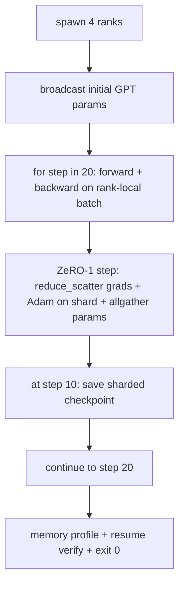

# अंत-से-अंत तक वितरण प्रशिक्षण

> पाठ 76 से 80 प्रत्येक एक टुकड़ा बनाया। यह असेंबली हैः ग्रेडिएंट सिंक्रनाइज़ेशन के लिए डीडीपी के साथ 4 सिमुलेटेड रैंकों पर प्रशिक्षित एक छोटा जीपीटी, ऑप्टिमाइज़र-स्टेट स्क्रैडिंग के लिए ज़ेरो -1 और आधे रास्ते के निशान पर एक स्क्रैच्ड चेकपॉइंट। डेमो 20 चरणों को चलाता है, स्वयं समाप्त होता है, एक हानि वक्र प्रिंट करता है और एक मेमोरी प्रोफ़ाइल, और एक पुनः प्रयोज्य चेकपॉइंट लिखता है।

**Type:** Build
**Languages:** Python
**Prerequisites:** Phase 19 Track C lessons 42-49
**Time:** ~90 min

## सीखने के लक्ष्य

- डीडीपी (पाठ 77) प्लस ज़ेआरओ-1 (पाठ 78) प्लस टुकड़े टुकड़े किए गए चेकपोइंट (पाठ 80) को एक प्रशिक्षण लूप में मिलाएं।
- 4 अनुकरणित रैंकों पर 20 चरणों के लिए एक छोटे सिंथेटिक कॉर्पस पर 2-परत ट्रांसफार्मर भाषा मॉडल का प्रशिक्षण दें।
- प्रति चरण हानि तालिका, प्रति रैंक स्मृति प्रोफ़ाइल, और एक चेकपॉइंट मैनिफेस्ट प्रिंट जो एक ही विश्व आकार पर बाइट-बराबर फिर से शुरू होता है।
- रचना का बचाव करें: प्रत्येक टुकड़ा पहले के पाठों में स्वतंत्र रूप से परीक्षण किया जा सकता है और यह पाठ साबित करता है कि वे रचना करते हैं।

## समस्या

एक शिला सबूत है कि टुकड़े एक साथ फिट होते हैं। पाठ 76 लागू सामूहिक। पाठ 77 ने उन्हें डीडीपी में लपेटा। पाठ 78 कम_खण्डन के साथ स्क्रैड ऑप्टिमाइज़र स्टेट। पाठ 79 पाइपलाइन का विश्लेषण किया। पाठ 80 एक टुकड़े टुकड़े चेकपोस्ट बचाया। प्रत्येक पाठ का अपना परीक्षण था। एक वास्तविक प्रशिक्षण रन में एक ही समय में प्रत्येक आदिम का उपयोग किया जाता है; यदि संरचना गलत है, तो हानि भिन्न होती है, चेकपॉइंट फिर से शुरू करने से इनकार करता है, या प्रति रैंक स्मृति बढ़ जाती है जब यह सिकुड़ना चाहिए।

यह पाठ अंत-से-अंत डेमो चलाता है और चार अपरिवर्तनीयता की पुष्टि करता हैः (क) फ्लोट शोर के भीतर 20 चरणों में हानि एकतरफा रूप से कम होती है, (ख) प्रत्येक रैंक प्रत्येक चरण में एक ही पैरामीटर मानदंड रखता है, (ग) प्रति रैंक अनुकूलक स्मृति ZeRO-1 सूत्र 12P/N बाइट्स के बराबर है, और (घ) चरण 10 पर चेकपॉइंट पुनः आरंभ करने पर बाइट-बराबर है। डेमो स्वतः समाप्त होता हैः 20 कदम, एकल आदेश, 0 से बाहर निकलें।

## अवधारणा



### मिनी जीपीटी

मॉडल उद्देश्य से छोटा हैः 2 ट्रांसफार्मर ब्लॉक, एम्बेड डिम 32, 4 ध्यान सिर, वाक्यांश 64, अनुक्रम लंबाई 16, बैच 4. कुछ हजार मापदंडों. प्रत्येक वायरिंग निर्णय का अभ्यास करने के लिए पर्याप्त बड़ा (बहु-हेड ध्यान मानक मास्क पथ चलाता है; लेयरनॉर्म में सिंक्रनाइज़ करने के लिए वजन होते हैं; एलएम हेड एक अलग रैखिक प्रोजेक्शन है जो वाक्यांश के लिए वापस आता है) । पर्याप्त छोटे कि 4 सीपीयू रैंक पर 20 कदम सेकंड में समाप्त हो जाते हैं।

### संरचना नियम

| Lesson piece | What it owns | What it leaves to the loop |
|--------------|--------------|----------------------------|
| DDP broadcast | Initial parameter sync | One call at construct time |
| ZeRO-1 step | Gradient sync, master copy update, parameter broadcast | One call per step replacing optimiser.step |
| Sharded checkpoint | Persist per-rank state, manifest with sha256 | Called on rank 0 with state collected via allgather |
| Training loop | Forward, backward, loss logging | Calls the three above in order |

लूप reduce_scatter या rendezvous फ़ाइलों के बारे में नहीं जानता है। ZeRO और चेकपॉइंट मॉड्यूल संकीर्ण इंटरफेस को उजागर करते हैं जो लूप बनाते हैं।

### क्यों एक छोटी सी जीपीटी और सिर्फ एक एमएलपी

कक्षा 77 का एमएलपी ग्रेडिएंट सिंक्रनाइज़ेशन सत्यापित करने के लिए पर्याप्त था। एक छोटी सी जीपीटी तीन चीजें जोड़ती हैः एक अलग एलएम सिर वक्कल पर (इस पाठ में, स्पष्टता के लिए अनटाई; पूर्ण जीपीटी आमतौर पर सिर को टोकन एम्बेडिंग से जोड़ती है), हानि के रूप में सॉफ्टमैक्स + क्रॉस-एंट्रोपी (एमएसई की तुलना में अधिक संख्यात्मक किनारे मामले) और एक असंबद्ध आगे (एम्बेडिंग्स फिर ध्यान फिर प्रति परत एमएलपी) । कैपस्टोन के लिए एक एमएलपी के साथ चिपके रहने से यह छिपाया जाएगा कि क्या संरचना लेयरनॉर्म या एम्बेडिंग परत के ग्रेड आकार को सही ढंग से संभालती है।

### स्व-निष्पादन का अर्थ है बाहर निकलना 0

लूप एक निश्चित 20 कदम चलाता है और बाहर निकलता है।`while True`एक कैपस्टोन आप बिना पर्यवेक्षण चल छोड़ सकते हैं और एक पूरा लॉग जब यह खत्म हो जाता है एक कैपस्टोन है कि प्रणाली सही ढंग से तार है कि साबित करता है। अगर किसी भी टुकड़ा अवरुद्ध करता है डेमो कभी नहीं लौटता है और परीक्षण रग इसे पकड़ता है।

```figure
ci-distributed-assembly
```

## इसे बनाओ

`code/main.py`कार्य करता हैः

- `MiniGPT`: मास्क स्व-विचार और एक अलग एलएम सिर के साथ 2-परत ट्रांसफार्मर।
- `make_corpus(seed, total_tokens)`: निर्धारक अगले टोकन भविष्यवाणी डेटा।
- `_train_worker`: क्रमशः उत्पन्न; प्रसारण init पैराम्स, लूप चलाता है, ZeRO चरण बुलाता है, चरण 10 पर टुकड़े टुकड़े चेकपॉइंट लिखता है।
- `verify_resume`: मुख्य रन के बाद, प्रक्रिया में चरण-10 चेकपॉइंट को पुनः लोड करता है और यह दावा करता है कि सहेजे गए मास्टर शार्ड स्मृति में स्नैपशॉट बाइट-टू-बाइट से मेल खाते हैं।
- `main`: पूरे डेमो को व्यवस्थित करता है, हानि तालिका, स्मृति प्रोफ़ाइल, और सत्यापन परिणाम प्रिंट करता है।

इसे चलाओः

```bash
python3 code/main.py
```

आउटपुटः 20 पंक्ति हानि तालिका, प्रति रैंक मेमोरी प्रोफ़ाइल 4 पंक्ति, चेकपॉइंट मैनिफिस, और सफलता पर "संक्षेप सत्यापित" पंक्ति।

## जंगली में उत्पादन के पैटर्न

तीन पैटर्न वास्तविक रन के लिए रचना को समाप्त करते हैं।

**Checkpoint every K minutes, not every K steps.**चरण समय अनुक्रम लंबाई और माइक्रोबैच की संख्या के साथ भिन्न होता है। 10 मिनट का चेकपॉइंट कैडेन्स मॉडल के आकार के बावजूद एक ही गणना पकड़ता है। पाठ सरलता के लिए चरण-आधारित का उपयोग करता है; उत्पादन दीवार घड़ी-आधारित का उपयोग करता है।

**Detect divergence early.**उत्पादन रन में पीछे की ओर एक एनएएन गार्ड और एक हानि-स्पाइक डिटेक्टर जोड़ें; यदि एक कदम में नुकसान 2 गुना से अधिक कूदता है, तो अनुकूलक को एक विकृत स्थिति में जाने की अनुमति देने के बजाय पिछले चेकपॉइंट पर वापस रोल करें। पाठ का नुकसान वक्र चिकना है इसलिए गार्ड अप्रयुक्त है लेकिन हुक रहता है।

**Aggregate the memory profile across ranks.**प्रति रैंक स्मृति वास्तविक रन में रैंक से भिन्न होती है (सबसे बड़े पाइपलाइन चरण के साथ रैंक अधिक सक्रियण रखता है) । उत्पादन रैंक के पार अधिकतम और औसत को लॉग करता है; सूत्र मेल खाने को दिखाने के लिए पाठ प्रति रैंक प्रिंट करता है।

## इसका प्रयोग करें

उत्पादन के पैटर्नः

- **DeepSpeed.**एक कॉन्फ़िग के तहत डीडीपी + ज़ेआरओ + पाइपलाइन + सक्रियण चेकपोइंटिंग को जोड़ता है। पाठ की रचना लघु आकार में डीपस्पीड आकार है।
- **PyTorch FSDP.**मूल समकक्ष।`FullyShardedDataParallel`के साथ`ShardingStrategy.SHARD_GRAD_OP`यह ZeRO-2 है।
- **NeMo and Megatron-LM.**सबसे बड़े मॉडल के लिए तन्सर समानांतर जोड़ें; अन्यथा संरचना एक ही आकार है।

## इसे भेजें

पूरा ट्रैक यहां समाप्त होता है। 6 सबक एक साथ डिस्ट्रिब्यूटेड-ट्रेनिंग सबसिस्टम है जो एक वास्तविक टीम डीपस्पीड को अपनाने से पहले बनाती है; अमूर्तता को ग्लो के खिलाफ साबित किया गया है और विफलता मोड का अभ्यास किया गया है। चरण 17 (संसंरचना और उत्पादन) एक वास्तविक क्लस्टर में ले जाने का स्थान है।

## व्यायाम

1. ध्यान सिर के एक टेन्सर-समान विभाजन जोड़ें और यह सत्यापित करें कि हानि एकल-रैंक बेसलाइन से मेल खाती है। दो रैंकः प्रति रैंक आधा सिर, सभी ध्यान आउटपुट को कम करें।
2. 4 माइक्रो बैच में ग्रेडिएंट जमा को जोड़ें और प्रमाणीकरण करें कि ग्रेडिएंट एक बड़े बैच के ग्रेडिएंट के बराबर है।
3. चरण 10 से एक रिज्यूमे जोड़ें जो वास्तव में चरण 20 तक प्रशिक्षण जारी रखता है और मूल रन के समान अंतिम नुकसान पैदा करता है।
4. JSONL में एक मेट्रिक्स निर्यात (हानि, ग्रेड मानदंड, चरण समय) जोड़ें ताकि घटना के बाद रन को दृश्यमान किया जा सके।
5. एक नुकसान स्पाइक पर पिछले चेकपॉइंट पर वापस रोल करने वाले एक एनएएन गार्ड जोड़ें, और रोलबैक का अभ्यास करने के लिए एक-चरण एलआर गुणक के साथ एक स्पाइक को मजबूर करें।

## प्रमुख शर्तें

| Term | What people say | What it actually means |
|------|----------------|------------------------|
| End-to-end | "Wire it all up" | One run composes every piece, not a unit test per piece |
| Memory profile | "GB per rank" | Bytes held on each rank for params, grads, optimiser state |
| Resume contract | "Save and load" | Per-rank state byte-equal after a checkpoint round-trip |
| Self-terminating | "Bounded run" | Fixed step count, exit 0 on completion, no human in the loop |

## आगे पढ़ना

- [DeepSpeed end-to-end training tutorial](https://www.deepspeed.ai/getting-started/)
- [PyTorch FSDP advanced tutorial](https://pytorch.org/tutorials/intermediate/FSDP_advanced_tutorial.html)
- [Megatron-LM training script reference](https://github.com/NVIDIA/Megatron-LM)
- चरण 19 पाठ 76-80 - प्रत्येक टुकड़ा इस पाठ में शामिल है
- चरण 17 - संरचना को वास्तविक क्लस्टर में स्थानांतरित करना
