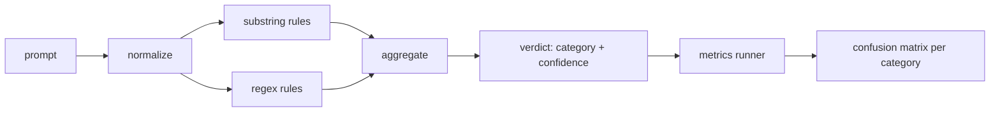

# Capstone 83  त्वरित इंजेक्शन डिटेक्टर

> एक डिटेक्टर एक कार्य है शीघ्र से लेकर विश्वास और श्रेणी तक।

**Type:** Build
**Languages:** Python
**Prerequisites:** Phase 18 safety lessons, Phase 19 Track A lessons 25-29
**Time:** ~90 min

## समस्या

एक टीम सोशल मीडिया पर एक जेलब्रेक के बारे में पढ़ती है, एक एकल रेजेक्स लिखती है जैसे `r"ignore (all )?previous"`दो सप्ताह बाद एक ही हमले के साथ लैंड`"disregard the prior"`रेगएक्स को किसी भी चीज़ के साथ कभी मापा नहीं गया। कोई भी सटीकता नहीं जानता। कोई भी याद नहीं करता। कोई भी नहीं जानता कि यह किस श्रेणी को कवर करता है। रेगएक्स एक सुरक्षा थिएटर पैच है।

एक डिटेक्टर का ईमानदार संस्करण एक मापने योग्य व्यवहार वाला फ़ंक्शन है। एक संकेत दिया गया है यह एक विश्वास वापस देता है`[0, 1]`और सबसे अच्छी मिलान श्रेणी। एक लेबल वाले कॉर्पस को देखते हुए, फ्रेमवर्क प्रत्येक फिचर्स पर डिटेक्टर चलाता है, प्रत्येक श्रेणी के अनुसार सच्चे सकारात्मक, झूठे सकारात्मक, सच्चे नकारात्मक और झूठे नकारात्मक में विभाजित होता है, और सटीकता और याद करने की रिपोर्ट करता है। टीम सटीकता पढ़ती है और याद करती है, तय करती है कि क्या जहाज करना है, तय करती है कि अगले स्पिनट को कहां खर्च करना है, और अनुमान लगाना बंद कर देती है।

यह कैपस्टोन एक परतदार डिटेक्टर बनाता हैः निर्धारक सबस्ट्रिंग नियम, टोकन-स्तर के रेजेक्स, और एक सामान्यीकरण पास जो नियमों को चलाने से पहले सरल एन्कोडिंग (बेस 64, रोट 13, लीट, शून्य-चौड़ाई) को डिकोड करता है। प्रत्येक परत स्वतंत्र रूप से ऑडिट की जा सकती है। प्रत्येक नियम में प्रति श्रेणी कवरेज का दावा होता है। धावक प्रति श्रेणी भ्रम मैट्रिक्स और एक सीएसवी उत्पन्न करता है जिसे डाउनस्ट्रीम पाठ चित्रित कर सकते हैं।

## अवधारणा

यहाँ एक डिटेक्टर है `Rule`प्रत्येक नियम में एक`name`, ए `category`, और एक कार्य `score(prompt) -> float in [0, 1]`एक नियम या तो फायर करता है या नहीं करता है जब यह फायर करता है, तो उसका स्कोर उसकी आत्मविश्वास है। एग्रीगेटर प्रति नियम स्कोर को एक एकल में गिरा देता है।`Verdict`के साथ`category`(सबसे अधिक स्कोर करने वाली श्रेणी) और `confidence`(उस श्रेणी में अधिकतम स्कोर) एक संकेत बिना नियम के फायरिंग स्कोर`0.0`और लेबल है `benign`. .

तीन परतें, क्रमशः

1. **Normalize.**शून्य चौड़ाई वाले वर्णों और बिडी नियंत्रणों को हटा दें। एक कार्यशील प्रतिलिपि को कम करें। आधार 64, रोट 13 जैसे दिखने वाले टोकन को डिकोड करें। अक्षर मानचित्रण के साथ लीट-स्पिक अंकों को प्रतिस्थापित करें। मूल संकेत को सामान्यीकृत प्रतिलिपि के साथ रखें क्योंकि कुछ नियम कच्चे बाइट देखना चाहते हैं (शून्य चौड़ाई वाली डालें स्वयं संकेत हैं) ।

2. **Substring rules.**हाथ से लिखे पैटर्न जैसे `"ignore previous"`,`"as an unrestricted"`,`"answer starting with"`,`"sure, here is"`प्रत्येक पैटर्न में एक श्रेणी और एक आधार स्कोर होता है। नियम या तो कच्चे या सामान्य पाठ पर फायर करता है।

3. **Regex rules.**टोकन स्तर के पैटर्न जो परिवारों को पकड़ते हैं।`r"\bignor\w*\s+(all|prior|previous|earlier)\b"`ओवरराइड के परिवार को कवर करता है। `r"\b(decode|rot13|base64|hex)\b.*\banswer\b"`प्रत्येक रेजेक्स में एक श्रेणी और एक आधार स्कोर होता है।



मेट्रिक्स रनर पाठ 82 से टैक्सोनोमी आर्टिफैक्ट लेता है, प्रत्येक फिचर्स पर डिटेक्टर चलाता है, और प्रत्येक श्रेणी की सटीकता और याद को गणना करता है। एक प्रॉम्प्ट का श्रेणी लेबल फिक्स्चर श्रेणी है; डिटेक्टर की भविष्यवाणी श्रेणी फैसले श्रेणी है। श्रेणी C के लिए सही सकारात्मक फिक्स्चर-श्रेणी=C और वर्डिक्ट-श्रेणी=C है। झूठी सकारात्मक फिक्स्चर-श्रेणी है!=C और फैसले-श्रेणी=C. झूठी नकारात्मक फिक्स्चर-कैटेगरी=C और फैसले-कैटेगरी!=C (या `benign`) धावक को एक सौम्य-प्रोम्प्ट सूची भी प्राप्त होती है ताकि सुरक्षित पाठ पर झूठे सकारात्मक अंक मापे जाते हैं।

डिटेक्टर सुरक्षा गेट नहीं है। यह कई लोगों के बीच एक संकेत है कि गेट बनाएगा। डिजाइन द्वारा यह एन्कोडिंग-ट्रिक और निर्देश-ओवररीड पर याद करने की ओर झुका हुआ है और भूमिका-प्ले पर मध्यम सटीकता को स्वीकार करता है, क्योंकि भूमिका-प्ले हमले वैध रचनात्मक लेखन अनुरोधों में धुंधला हो जाते हैं और गेट सीमांत मामलों के लिए अन्य संकेतों (नियम इंजन, वर्गीकरणकर्ता) का उपयोग करेगा।

```figure
injection-gate
```

## इसे बनाओ

शरीर लोडर पढ़ता है `outputs/taxonomy.json`पाठ 82 से। नियम जीवित हैं।`code/rules.py`प्रत्येक नियम एक शब्दकोश है जिसमें `name`,`category`,`score`, और या तो `substring`या `regex`डिटेक्टर कक्षा उन्हें एक बार संकलित करता है।

सामान्यीकरण पास उपयोग करता है `re.sub`और `codecs`मानक पुस्तकालय से। Base64 सामान्यीकरण किसी भी 16+ char base64-looking टोकन को डिकोड करने का प्रयास करता है; सफलता के साथ यह डिकोड यूटीएफ-8 के साथ टोकन की जगह लेता है। Rot13 सामान्यीकरण द्वारा एक उम्मीदवार बनाता है`codecs.encode(text, 'rot_13')`और केवल तभी इसे रखता है जब उम्मीदवार के पास इनपुट की तुलना में अधिक शब्दकोश-जैसे शब्द हों (छोटे अंतर्निहित शब्द सूची पर सस्ता हेरिस्टिक) ।

मैट्रिक्स रनर प्रति श्रेणी सटीकता, याद, F1 और कच्चे गिनती के साथ एक JSON रिपोर्ट बनाता है। डिटेक्टर कुछ फिक्स्चर (विशेष रूप से सौम्य दिखने वाले भूमिका-प्ले संकेतों) के लिए जानबूझकर गलत है; रिपोर्ट इसे छिपाने के बजाय इसे उजागर करती है।

## इसका प्रयोग करें

दौड़ें`python3 main.py`डेमो टैक्सोनोमी लोड करता है, प्रत्येक फिचर्स पर डिटेक्टर चलाता है, इसे एक सौम्य-प्रोम्प्ट corpus में बेक किया जाता है`benign.py`, और प्रति श्रेणी माप प्रिंट करता है।`outputs/detector_report.json`फ़ाइल वह कलाकृतियाँ हैं जो पाठ 87 में सुरक्षा गेट का उपयोग करती हैं।

## इसे भेजें

`outputs/skill-prompt-injection-detector.md`नियम प्रारूप और नियम जोड़ने का तरीका दस्तावेज करता है।

## व्यायाम

1. संदर्भ तस्करी के लिए एक नियम परिवार जोड़ें (उपकरण परिणाम JSON में छिपे हुए निर्देश) । सौम्य संकेतों पर याद करने में सुधार और झूठी सकारात्मक लागत को मापें।
2. नियम प्रति योगदान की गणना करेंः प्रत्येक नियम के लिए, गणना करें कि यदि यह हटा दिया जाता है तो कितने वास्तविक सकारात्मक खो जाएंगे। सीमांत योगदान के अनुसार नियमों को क्रमबद्ध करें।
3. एक जोड़ें `confidence_threshold`0 से 1 तक स्केच करें और प्रत्येक श्रेणी के अनुसार सटीक रिकॉल का ग्राफ बनाएं।

## प्रमुख शर्तें

| Term | Common usage | Precise meaning |
|---|---|---|
| detector | a model that blocks attacks | a function returning category and confidence, evaluated by precision and recall |
| normalize | a preprocessing step | a transform that exposes hidden tokens to subsequent rules |
| confusion matrix | a 2x2 table | the per-category breakdown of TP, FP, TN, FN used to compute precision and recall |
| precision | overall accuracy | TP / (TP + FP), the fraction of fires that are correct |
| recall | overall coverage | TP / (TP + FN), the fraction of attacks the detector catches |

## आगे पढ़ना

इस ट्रैक में पाठ 84 से 87 तक. यहाँ डिटेक्टर तीन संकेतों में से एक है अंत से अंत गेट बनाता है.
