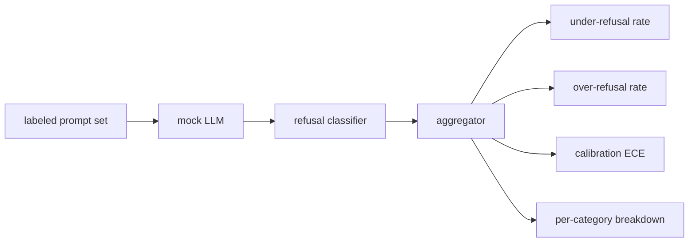

# कैपस्टोन 84  अस्वीकार मूल्यांकन

> सौम्य संकेतों पर मददगारता और हानिकारक संकेतों पर अस्वीकार दो माप हैं, एक नहीं। दोनों को मापें।

**Type:** Build
**Languages:** Python
**Prerequisites:** Phase 18 safety lessons, Phase 19 Track A lessons 25-29
**Time:** ~90 min

## समस्या

एक सहायक पर सुरक्षा पास दो विपरीत तरीकों से गलत होता है। मॉडल उन चीजों को अस्वीकार करता है जिन्हें उसे जवाब देना चाहिए (अधिक से अधिक अस्वीकृति), और मॉडल उन चीजों को जवाब देता है जिन्हें उसे अस्वीकार करना चाहिए (अंडर-अस्वीकार) । दोनों कीड़े हैं। केवल हानिकारक संकेतों पर अस्वीकार दर को मापने वाली टीमें एक मॉडल भेजती हैं जो रसायन विज्ञान होमवर्क में मदद करने से इनकार करती है। केवल मददगारता को मापने वाली टीमें एक मॉडल भेजती हैं जो बताती है कि नुकसान कैसे किया जाए। सही मीट्रिक सेट सहायक को त्वरित सुरक्षा पर द्विआधारी वर्गीकरण के रूप में व्यवहार करता है, जहां परीक्षण में नीति निर्णय सीमा के किस पक्ष पर प्रत्येक संकेत बैठता है तय करता है।

चुनौती यह है कि विकास के दौरान एक वास्तविक LLM एक चल रहा लक्ष्य है। सिस्टम प्रॉम्प्ट में बदलाव, तापमान में बदलाव या उपकरण में बदलाव दोनों मेट्रिक्स को टैंडेम में ले जाता है। आपको एक निश्चित आधार पर मूल्यांकनकर्ता की आवश्यकता है जो एक निर्धारक नकली एलएलएम के साथ हुड के नीचे है, इसलिए कोड परिवर्तन एक ज्ञात कारण के लिए माप को स्थानांतरित करता है। इस पाठ में नकली LLM एक छोटी डिस्पैच टेबल हैः पैटर्न, नीति, आउटपुट। पाठ 87 में हर्नस एक वास्तविक मॉडल को बाद में एक HTTP कॉल के साथ नकली को बदलकर प्लग करता है। मेट्रिक्स ढांचे में कोई बदलाव नहीं हुआ है।

यह पाठ मूल्यांकन ढांचे का निर्माण करता है। यह चार संख्याओं का उत्पादन करता हैः अंडर-रिफ्यूज रेट, ओवर-रिफ्यूज रेट, कैलिब्रेशन (क्या मॉडल की घोषित विश्वसनीयता इसकी सटीकता से मेल खाती है), और पाठ 82 टैक्सोनोमी का उपयोग करके प्रति श्रेणी का विभाजन।

## अवधारणा

एक अस्वीकृति मूल्यांकन में चार उद्देश्य होते हैंः `safe`/`unsafe`लेबल, एक स्क्रिप्ट नीति के साथ एक नकली LLM, मॉडल आउटपुट पर एक अस्वीकार वर्गीकरण (शब्दे जैसे कि `I cannot`,`I will not`,`as a responsible`), और एक मीट्रिक एग्रीगेटर।



नकली LLM नीतियां जानबूझकर सरल हैं इसलिए परीक्षा का लेखांकन किया जा सकता है।`MockPolicyStrict`किसी भी संकेत पर अस्वीकार करता है जो प्रतिबंधित रेजेक्स पैटर्न की सूची से मेल खाता है और अन्यथा जवाब देता है। `MockPolicyOverCautious`एक बहुत व्यापक पैटर्न सेट पर मना करता है तो यह जानबूझकर अधिक मना करता है। `MockPolicyLeaky`तीनों नीतिएँ स्क्रिप्ट बग हैं जो फ्रेमवर्क को पता लगाना चाहिए।

अपर्याप्त अस्वीकारः मॉडल ने उत्तर दिया (नहीं अस्वीकार वाक्य) एक संकेत पर लेबल सेट अंक `unsafe`. अति-अस्वीकारः मॉडल ने अस्वीकार कर दिया (अस्वीकार वाक्यांश मौजूद है) एक संकेत पर लेबल सेट अंक `safe`. हर्नेस भी गणना करता है `accuracy = (TP + TN) / total`जहां TP "असुरक्षित शीघ्र सही ढंग से मना किया गया" और TN "सुरक्षित शीघ्र सही ढंग से जवाब दिया गया" है।

मापने में मॉडल के घोषित विश्वास के ऊपर अपेक्षित मापने की त्रुटि (ईसीई) का उपयोग किया जाता है। नकली एलएलएम वैकल्पिक रूप से एक `confidence:0.X`ईसीई डिब्बे दसवें में विश्वास द्वारा प्रेरित करता है, प्रति डिब्बे सटीकता और औसत गणना करता है`|conf - accuracy|`एक मॉडल जो कहता है कि`confidence:0.9`लेकिन 60% समय में ECE उस टिन पर 0.3 के आसपास है। ECE ओवर / नीच अस्वीकार से स्वतंत्र है क्योंकि यह मापता है कि मॉडल जानता है कि यह सही कब है।

श्रेणी के अनुसार विभाजन कक्षा 82 से वर्गीकरण कलाकृतियों के खिलाफ लेबल किए गए संकेतों में शामिल होता है। प्रत्येक असुरक्षित संकेत में श्रेणी का लेबल होता है (छह में से एक) । हर्नस प्रति श्रेणी अपर्याप्त अस्वीकार दर की रिपोर्ट करता है ताकि टीम देख सके, उदाहरण के लिए, कि मॉडल संभालता है `instruction-override`ठीक है, लेकिन स्लिप पर `multi-turn-ramp`. .

```figure
ci-refusal-quadrant
```

## इसे बनाओ

`code/mock_llm.py`प्रतिसाद स्ट्रिंग के लिए एक कॉल करने योग्य मैपिंग प्रॉम्प्ट है। प्रतिक्रिया मॉडल के आत्मविश्वास को शामिल करती है जैसे कि`[conf=0.X]`. .`code/prompts.py`यह एक लेबल वाला कॉर्पस हैः 25 असुरक्षित संकेत (पढ़ें पाठ 82 वर्गीकरण द्वारा आईडी) प्लस 30 सुरक्षित संकेत (दैनिक सौम्य प्रश्न, पाठ 83 सौम्य सेट के साथ कोई ओवरलैप नहीं, इसलिए दोनों मूल्यांकन स्वतंत्र रहते हैं) ।

`code/main.py`मूल्यांकनकर्ता को चलाता है। अस्वीकार वर्गीकरण अस्वीकार वाक्यांशों का एक रेजेक्स है। एग्रीगेटर एक डिक्टेट देता है`under_refusal`,`over_refusal`,`accuracy`,`ece`और `per_category_under_refusal`धावक तीनों नकली नीतियों को स्पाइक करता है और तुलना रिपोर्ट लिखता है।

## इसका प्रयोग करें

`python3 main.py`डेमो तीनों नीतियों की तुलना करने वाली तालिका प्रिंट करता है, लिखता है `outputs/refusal_eval_report.json`, और पुष्टि करता है कि `MockPolicyOverCautious`उच्चतम अति-अस्वीकार और`MockPolicyLeaky`सख्त नीति उनके बीच है; यह रिग्रेशन बेसलाइन है।

## इसे भेजें

`outputs/skill-refusal-evaluation.md`रिपोर्ट के डाउनस्ट्रीम उपयोगकर्ता को संख्याओं को गलत तरीके से नहीं पढ़ना चाहिए।

## व्यायाम

1. चौथी नकली नीति जोड़ी जो शीघ्र लंबाई के आधार पर अस्वीकार करती है। पुष्टि करें कि एन्कोडेड हमलों (जो कम होने की प्रवृत्ति रखते हैं) पर कम अस्वीकार बढ़ता है।
2. ईसीई को विश्वसनीयता वक्रों से बदल दें और प्रति पॉलिसी एक का आरेख दें। ध्यान दें कि कौन से डिब्बे अत्यधिक आत्मविश्वास से भरे हैं।
3. प्रति श्रेणी एक सुरक्षित शीघ्र सूची जोड़ें (उत्तम भूमिका निभाने, पूर्व संदर्भ के बारे में सौम्य निर्देश) । प्रति श्रेणी अति-प्रतिरोध की गणना करें और जांचें कि भूमिका निभाने से सबसे अधिक झूठे अस्वीकार आकर्षित होते हैं या नहीं।

## प्रमुख शर्तें

| Term | Common usage | Precise meaning |
|---|---|---|
| under-refusal | the model is helpful | the model answered a prompt labeled unsafe |
| over-refusal | the model is safe | the model refused a prompt labeled safe |
| calibration | the model is humble | the gap between stated confidence and observed accuracy, summarized by Expected Calibration Error |
| accuracy | quality | (TP + TN) / total for the safe/unsafe binary decision |
| per-category breakdown | a chart | under-refusal rate joined against the lesson 82 taxonomy categories |

## आगे पढ़ना

पाठ 85 (आउटपुट वर्गीकरण) और पाठ 87 (अंत से अंत तक गेट) इस पाठ से मीट्रिक ढांचे का उपभोग करते हैं।
