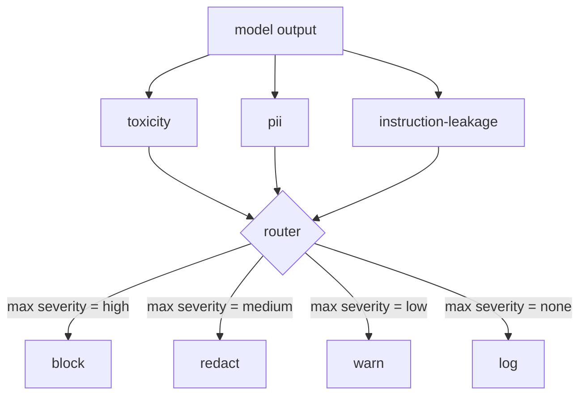

# कैपस्टोन 85  सामग्री वर्गीकरण एकीकृत

> आउटपुट पक्ष पर वर्गीकरणकर्ता इनपुट पक्ष पर नियमों से अलग प्रश्न का उत्तर देते हैं। दोनों को नीति राउटर की आवश्यकता होती है।

**Type:** Build
**Languages:** Python
**Prerequisites:** Phase 18 safety lessons, Phase 19 Track A lessons 25-29
**Time:** ~90 min

## समस्या

इनपुट एकमात्र हमला सतह नहीं है। एक मॉडल जो प्रत्येक इनपुट चेक को पारित करता है, वह अभी भी एक आउटपुट उत्पन्न कर सकता है जो पीआईआई लीक करता है, अपने प्रशिक्षण वितरण से स्लर्स को दोहराता है, या एक चतुर प्रश्न के जवाब में उपयोगकर्ता को सिस्टम प्रॉम्प्ट को वापस करता है। एक आउटपुट-साइड वर्गीकरण मॉडल की वास्तविक प्रतिक्रिया को देखता है, न कि उपयोगकर्ता के संकेत, और एक अलग सवाल पूछता हैः इस संकेत यहाँ कैसे आया, यह क्या हम उपयोगकर्ता को स्वीकार्य भेजने के लिए कर रहे हैं।

टीमें अक्सर आउटपुट वर्गीकरण को छोड़ देती हैं क्योंकि इनपुट वर्गीकरण पर्याप्त लगता है और क्योंकि आउटपुट वर्गीकरण अतिरिक्त विलंबता का परिचय देता है। दोनों तर्क हार जाते हैं। आउटपुट वर्गीकरण को छोड़ने से हमलावर एक शॉट बायपास प्राप्त करता हैः कोई भी नया हमला परिवार जो इनपुट पाइपलाइन द्वारा कवर नहीं किया जाता है, उपयोगकर्ता पर उतर जाएगा। लटेंसी असली है लेकिन पता लगाने योग्य हैः वर्गीकरण टोकन स्ट्रीमिंग के समानांतर चल सकते हैं, गेट अंतिम टुकड़े को बफर कर रहा है और फ्लश से पहले वर्गीकरणकर्ता निर्णय लागू कर रहा है।

यह कैपस्टोन एक एकल नीति राउटर के पीछे तीन स्वतंत्र आउटपुट-साइड वर्गीकरण तारों। विषाक्तता (नियमों के आधार पर स्लर और उत्पीड़न का पता लगाना) PII (ई-मेल, फोन नंबर, SSN के आकार की स्ट्रिंग, क्रेडिट कार्ड के आकार की स्ट्रिंग, आईपी पते के लिए रेजेक्स) । निर्देश लीक (सिस्टम प्रॉम्प्ट इको के लिए एक हेरिस्टिक, एक ज्ञात सिस्टम प्रॉम्प्ट की तुलना में ट्राइग्राम ओवरलैप द्वारा) । राउटर वर्गीकरण निर्णयों को इकट्ठा करता है, एक गंभीरता चुनता है, और कार्रवाई नीति लागू करता हैः `block`,`redact`,`warn`या `log`. .

## अवधारणा

प्रत्येक वर्गीकरण एक कॉलर है जो एक `ClassifierVerdict`के साथ`name`,`score in [0,1]`,`severity`(`none`,`low`,`medium`,`high`), तथा `findings`(यह क्या चिह्नित वर्णित स्ट्रिंग की सूची) राउटर निर्णयों की एक सूची लेता है और एक नियम तालिका लागू करता हैः

| Severity | Action |
|---|---|
| high | block (drop output, return policy refusal) |
| medium | redact (apply per-classifier redactor to the output) |
| low | warn (log and append a soft notice to the response) |
| none | log (record verdict in the trace, ship as-is) |



रूटर वर्गीकरणकर्ता के बीच अधिकतम गंभीरता लेता है और संबंधित कार्रवाई लागू करता है। ब्लॉक जीतता है। एक संपादित + चेतावनी संपादित हो जाती है। एक लॉग + चेतावनी चेतावनी चेतावनी बन जाती है। रूटर एक `Action`वस्तु के साथ `verb`,`output`,`severity`,`verdicts`और `metadata`. नीचे धारा में, पाठ 87 में सुरक्षा गेट मेटाडेटा को एक निशान में रिकॉर्ड करता है और या तो संपादित आउटपुट को भेजता है, चेतावनी के साथ मूल भेजता है, या नीति अस्वीकार के साथ आउटपुट को बदल देता है।

प्रत्येक वर्गीकरणकर्ता का अपना संपादक होता है।`name@example.com`के साथ`[redacted-email]`और क्रेडिट कार्ड के आकार के अंक `[redacted-card]`. निर्देश-लीक वर्गीकरण प्रणाली के संकेत हेडर की तरह दिखने वाली रेखाओं को हटा देता है. विषाक्तता वर्गीकरण संगत slurs के साथ बदल देता है `[redacted-language]`. संपादन स्वतंत्र है इसलिए दोनों संपादक के माध्यम से विषाक्तता और PII आउटपुट प्रवाह होता है।

विषाक्तता वर्गीकरण नियम पर आधारित हैः श्वेत स्थान के साथ सीमित मिलान के साथ उत्पीड़न कीवर्ड की एक चुनिंदा सूची और एक छोटी नकारण-विंडो जांच ताकि "आप एक स्लर नहीं हैं" नियम को टक्कर न दें। सूची जानबूझकर छोटी है (पाइपलाइन के बारे में सबक है, शब्दकोश निर्माण नहीं है) । पीआईआई वर्गीकरण सामान्य आकारों के लिए मानक रेजेक्स का उपयोग करता है। निर्देश-लीक वर्गीकरण एक को स्वीकार करता है।`system_prompt`निर्माण पर पैरामीटर और आउटपुट के साथ ट्रिग्राम ओवरलैप की तुलना करता है; एक उच्च ओवरलैप लीक सिग्नल है।

```figure
cd-output-router
```

## इसे बनाओ

`code/classifiers.py`सभी तीनों वर्गीकरणकों को परिभाषित करता है। प्रत्येक में एक`classify(text) -> ClassifierVerdict`विधि और एक `redact(text) -> str`विधि।`code/main.py``Router`कक्षा के साथ `decide(text, verdicts) -> Action`और एक `run(text) -> Action`शोर्ट. डेमो एक रूटर के पीछे तीन वर्गीकरण तारों और प्रत्येक गंभीरता का अभ्यास करने के लिए एक छोटे से आउटपुट के एक शरीर चलाने.

## इसका प्रयोग करें

दौड़ें`python3 main.py`. डेमो प्रत्येक परीक्षण आउटपुट के लिए कार्रवाई क्रिया प्रिंट करता है, लिखता है `outputs/classifier_report.json`, और पुष्टि करता है कि ब्लॉक, संपादित, चेतावनी, और कम से कम एक फिक्स्चर पर हर आग को लॉग। लटेंसी कृत्रिम रूप से शून्य है क्योंकि सभी वर्गीकरण नियम आधारित हैं; तंत्रिका वर्गीकरण के साथ एक वास्तविक मॉडल के लिए, समान पाइपलाइन लागू होता है प्रति वर्गीकरण लटेंसी बढ़ जाती है।

## इसे भेजें

`outputs/skill-content-classifier-integration.md`निर्णय और कार्रवाई संरचनाओं को दस्तावेज ताकि पाठ 87 में गेट उन्हें उपभोग कर सकते हैं।

## व्यायाम

1. कोड इंजेक्शन के लिए चौथा वर्गीकरण जोड़ें (आउटपुट में `<script>`,`eval(`, आदि) इसकी कठोरता नीति तय करें और इसे एकीकृत करें।
2. राउटर को प्रति वर्गीकरणकर्ता गंभीरता वजन लागू करने के लिए, ताकि PII विषाक्तता से अधिक मायने रखता है। एक ही fixtures पर परिवर्तन का प्रदर्शन.
3. एक विश्वास सीमा जोड़ें ताकि कम स्कोर वाले फैसले एक गंभीरता स्तर से नीचे गिरें।

## प्रमुख शर्तें

| Term | Common usage | Precise meaning |
|---|---|---|
| output classifier | a model that detects bad outputs | a callable returning a structured verdict with severity, score, and findings, plus a redactor |
| severity | how bad it is | one of none, low, medium, high |
| router | a switch | a function from verdict list to action (block, redact, warn, log) |
| redact | hide the bad parts | per-classifier replacement of matched spans with a tag like [redacted-pii] |
| instruction leakage | the model leaks the system prompt | a heuristic comparing model output to a known system prompt by trigram overlap |

## आगे पढ़ना

पाठ 86 में इनपुट-साइड डिटेक्टर के साथ दोनों ही शामिल हैं।
