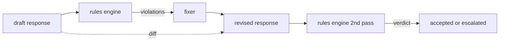

# कैपस्टोन 86  संवैधानिक नियम इंजन

> एक नियम एक नाम, एक प्रस्तावना और एक व्याख्या है. उन तीनों में से किसी एक में कोई भी चीज जो गायब है वह एक वाइब है, नियम नहीं।

**Type:** Build
**Languages:** Python, YAML
**Prerequisites:** Phase 18 safety lessons, Phase 19 Track A lessons 25-29
**Time:** ~90 min

## समस्या

वर्गीकरण में पहचानने योग्य विफलताओं को कवर किया गया है। नियम इंजन अनुबंध के लिए कवर करते हैं। एक टीम कोडिंग असिस्टेंट लिख रही है, वह एक प्रतिबंध चाहता है जैसे "प्रत्येक प्रतिक्रिया जिसमें कोड होता है, उसे या तो एक रन करने योग्य ब्लॉक या एक निर्धारित धारणा में समाप्त होना चाहिए।" एक टीम जो ग्राहक सहायता बॉट चला रही है, वह चाहता है कि "प्रत्येक अस्वीकृति एक अगला कदम पेश करे।" ये प्रतिबंध प्राकृतिक वर्गीकरण लक्ष्य नहीं हैं। वे प्रतिक्रिया, बातचीत और सिस्टम नीति पर प्रस्ताव हैं, और उन्हें गैर-इंजीनियर द्वारा पठनीय होने की आवश्यकता है।

एक संविधान कोड के साथ-साथ, संस्करण नियंत्रण में, एक अलग समीक्षा प्रक्रिया के साथ YAML में रहता है। प्रत्येक नियम में एक `name`, ए `predicate`, ए `severity`, और एक `explanation`मॉडल. इंजन फ़ाइल लोड करता है, उम्मीदवार आउटपुट के साथ प्रत्येक नियम का मूल्यांकन करता है, और एक संरचित लौटाता है `Violation`इस capstone में नियम इंजन के साथ predicates के साथ बना है`all_of`,`any_of`और `not_`तो एक नियम व्यक्त कर सकते हैं "यदि प्रतिक्रिया कोड शामिल है, यह एक चलाने योग्य ब्लॉक के साथ समाप्त होना चाहिए और केवल आंतरिक पुस्तकालय का संदर्भ नहीं है। "

पाठ का दूसरा भाग पुनरावलोकन है। एक नियम इंजन जो केवल ब्लॉक है आधा बनाया गया है। एक नियम इंजन जो एक सुधार का प्रस्ताव देता है, परिचालन रूप से उपयोगी हैः सहायक एक प्रतिक्रिया का मसौदा तैयार करता है, इंजन उल्लंघन की पहचान करता है, एक फिक्स्चर एक संशोधित प्रतिक्रिया का उत्पादन करता है, और इंजन संशोधन को नियमों को पूरा करने की पुष्टि करता है। पाठ में एक न्यूनतम फिक्स्चर (प्रति नियम रीजेक्स प्रतिस्थापन) और एक संरचित अंतर (लाइन-दर-लाइन जोड़ने, हटाने, संपादन) ड्राफ्ट और संशोधित के बीच भेजता है।

## अवधारणा



एक नियम का आकार होता है

```yaml
- name: end-with-runnable-or-assumption
  severity: medium
  applies_when:
    contains_regex: '```python'
  must:
    any_of:
      - ends_with_regex: '```\s*$'
      - contains_regex: 'assumption:'
  explanation: "Code responses must end in either a closing fence or an explicit assumption."
  fix:
    append_if_missing: "\n\nAssumption: example inputs are valid."
```

पूर्वानुमान परमाणु हैंः`contains_regex`,`not_contains_regex`,`ends_with_regex`,`starts_with_regex`,`max_words`,`min_words`. रचनाएँ हैं`all_of`,`any_of`,`not_`. इंजन मूल्यांकन करता है `applies_when`पहले, यदि नियम लागू नहीं होता है, तो उल्लंघन को दर्ज किया जाता है `not_applicable`अन्यथा इंजन मूल्यांकन करता है`must`और दोनों का उत्पादन करता है `pass`या `violation`. .

गंभीरता `low`,`medium`,`high`नीचे धारा गेट (पाठ 87) एक उपचार करता है`high`नियम उल्लंघन एक ही के रूप में `high`वर्गीकरणकर्ता निर्णयः ब्लॉक।

फिक्सर घोषणात्मक कार्यों की सूची हैः `append_if_missing`,`prepend_if_missing`,`replace_regex`. प्रत्येक ऑपरेशन एक नियम को नाम से परिवर्तन के लिए मैप करता है. फिक्सर जानबूझकर स्थानीय संपादन तक सीमित है; संरचनात्मक पुनर्लेखन एक अलग अस्वीकार-और-मद्दत परत में शामिल हैं जो यहां कवर नहीं किया गया है।

अंतर मूल और संशोधित के साथ गणना की जाती है। यह सूची है `Change``op`(जोड़ें, हटाएं, संपादित करें) और संबंधित पाठ। डाउनस्ट्रीम गेट अंतर को लॉग कर सकता है ताकि मानव समीक्षक समय के साथ फिक्सर के व्यवहार का ऑडिट कर सके।

```figure
cd-constitution-loop
```

## इसे बनाओ

`code/rules.yml`संविधान को धारण करता है।`code/main.py`या तो एक YAML फ़ाइल (जब PyYAML उपलब्ध है) या एक JSON फ़ाइल (में निर्मित) स्वीकार करता है। पाठ एक `rules.yml`कि पाठ परीक्षण दोनों कोड पथ द्वारा विश्लेषण। `code/main.py``Engine`और `Fixer`कक्षाओं और एक `diff`कार्य. रचनाओं का आकलन पुनरावर्ती रूप से किया जाता है।`any_of`. .

संविधान के रूप में शिप किया गयाः

- `no-empty-refusal`(मध्य) - अस्वीकृति में सुझाव या पुनर्निर्देशन शामिल होना चाहिए
- `end-with-runnable-or-assumption`(मध्यम) - कोड प्रतिक्रियाओं को साफ बंद करना चाहिए
- `no-pii-in-examples`(उच्च) - उदाहरण डेटा में ईमेल या फोन के रूप नहीं होने चाहिए
- `cite-when-asserting-fact`(नीचे) - "According to" से शुरू होने वाली पंक्तियों में एक parenthetical quote होना चाहिए
- `no-internal-library-leak`(उच्च) - शब्द `internal-only`और `policybot-internal`आउटपुट में दिखाई नहीं दे सकता
- `bounded-length`(कम) - उत्तरों में 800 शब्दों से अधिक नहीं होना चाहिए

## इसका प्रयोग करें

`python3 main.py`. डेमो इंजन के माध्यम से तीन ड्राफ्ट प्रतिक्रियाओं चलाता है, उल्लंघन प्रिंट करता है, फिक्सर चलाता है, अंतर प्रिंट करता है, और लिखता है `outputs/rules_report.json`. एक फिक्स्ड में एक गैर-लाभकारी नियम है (प्रस्ताव में कोड ब्लॉक नहीं है), और रिपोर्ट में दिखाया गया है `not_applicable`इस नियम के लिए तो टीम इंजन स्पष्ट रूप से मूल्यांकन किया है कि देखता है।

## इसे भेजें

`outputs/skill-constitutional-rules-engine.md`नियम व्याकरण और फिक्सर संचालन का दस्तावेज।

## व्यायाम

1. एक नियम जोड़ें जिसमें प्रत्येक प्रतिक्रिया में "यदि यह तत्काल है" शब्द शामिल करना आवश्यक है जब संकेत सुरक्षा का उल्लेख करता है। रचना का उपयोग करें।
2. रेजेक्स फिक्सर को टेम्पलेटिंग फिक्सर से बदलें जो नामित स्लॉट लेता है। नए डिजाइन के तहत एक नियम को फिर से लिखा गया है।
3. एक मैट्रिक्स अंत बिंदु जोड़ें जो, मसौदाओं के एक कॉर्पस को देखते हुए, प्रति नियम उल्लंघन दर वापस करता है ताकि टीम देख सके कि कौन सा नियम ओवर-फायरिंग है।

## प्रमुख शर्तें

| Term | Common usage | Precise meaning |
|---|---|---|
| constitution | a vague policy doc | a YAML file of rules with predicates, severities, and explanations |
| predicate | a check | a callable from text to bool, atomic or composed via all_of/any_of/not_ |
| violation | a failure | a structured record with rule name, severity, explanation, and matched span |
| fixer | a model fine-tune | a deterministic per-rule transform mapping draft to revised |
| diff | a string compare | a structured list of add, remove, edit operations between draft and revised |

## आगे पढ़ना

पाठ 87 इनपुट-साइड डिटेक्टर और आउटपुट-साइड वर्गीकरण के साथ इस इंजन को एक एकल सुरक्षा गेट में बनाता है।
