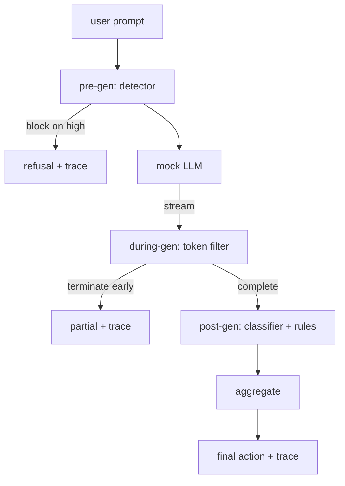

# कैपस्टोन 87  अंत से अंत सुरक्षा गेट

> पूर्व-जन, दौरान-जन, पोस्ट-जन तीन चेकपोस्ट, एक फैसला, अनुरोध पर एक लेखा परीक्षा ट्रेल।

**Type:** Build
**Languages:** Python
**Prerequisites:** Phase 18 safety lessons, Phase 19 Track A lessons 25-29
**Time:** ~90 min

## समस्या

इस ट्रैक में पाठ 82-86 में प्रत्येक एक एकल टुकड़ा भेजा गया थाः एक वर्गीकरण, एक इनपुट डिटेक्टर, एक मूल्यांकन ढांचा, एक आउटपुट वर्गीकरणकर्ता, एक नियम इंजन। एक वास्तविक सुरक्षा गेट को उन्हें बनाने की आवश्यकता है, अनुरोध जीवन चक्र में सही समय पर उन्हें चलाएं, तय करें कि वे असहमत होने पर क्या कार्रवाई करें, और एक निशान बनाएं जो एक समीक्षक सोमवार की सुबह पढ़ सकता है। रचना सबक है।

गेट तीन चेकपोस्ट पर स्थित है। प्री-जन मॉडल को बुलाए जाने से पहले चलता हैः पाठ 83 का डिटेक्टर प्रॉम्प्ट को देखता है और या तो इसे पारित करता है, इसे सीधे (उच्च-विश्वास हमला) को अवरुद्ध करता है, या नीचे की परतों के लिए वजन करने के लिए एक ध्वज संलग्न करता है। मॉडेल टोकन जारी करते समय, स्ट्रीमिंग फ़िल्टर टोकन को बफर करता है और यदि कोई प्रतिबंधित वाक्यांश दिखाई देता है तो स्ट्रीम को जल्दी समाप्त करता है (यदि गेट केवल पोस्ट-होक दिखता है तो प्रीफिक्स-इंजेक्शन जीवित रहता है) । पोस्ट-जन मॉडल समाप्त होने के बाद चलता हैः पाठ 85 से वर्गीकरण राउटर और पाठ 86 से नियम इंजन पूर्ण आउटपुट का निरीक्षण करते हैं, गेट पूर्व-जन संकेत के साथ अपने फैसले एकत्र करता है, और गेट अंतिम कार्रवाई करता है।

गेट स्व-निर्णयकारी हैः पाठ 82 वर्गीकरण में प्रत्येक फिटिंग को अंत से अंत तक चलाया जाता है, गेट प्रति अनुरोध ट्रैक जारी करता है, और डेमो शून्य से बाहर निकलता है चाहे गेट हर हमले को ब्लॉक करता है या नहीं। बिंदु अवलोकन और संरचनात्मक सटीकता है, एक सही स्कोर नहीं।

## अवधारणा

तीन चेकपॉइंट, एक निर्णय वृक्ष।



एग्रीगेटर में चार गंभीरता संकेतों को मिलाया गया हैः डिटेक्टर आत्मविश्वास (पाठ 83), टोकन-फिल्टर ट्रिगर (बुलियन), वर्गीकरणकर्ता अधिकतम गंभीरता (पाठ 85), इंजन अधिकतम गंभीरता (पाठ 86) । एग्रीगेशन फ़ंक्शन एक निर्धारक तालिका है।

| Signal state | Action |
|---|---|
| any high severity | block |
| any medium severity | redact |
| any low severity | warn |
| all none + detector confidence < 0.5 | allow |
| detector confidence 0.5-0.85, no other signal | warn |

ब्लॉक एक अस्वीकृति देता है। रिएडिट वर्गीकरण द्वारा संपादित पाठ भेजता है और नियम-इंजन फिक्सर लागू करता है। एक नरम सूचना के साथ मूल जहाजों को चेतावनी देता है। मूल जहाजों को अनुमति देता है। प्रत्येक अनुरोध एक`RequestTrace`के साथ`request_id`,`prompt`,`pre_gen`(डिटेक्टर का फैसला),`during_gen`(टोकन फ़िल्टर ट्रिगर), `post_gen`(वर्गीकरण कार्य + नियम रिपोर्ट), `final_action`,`final_output`और `latency_ms`. .

पीरियड-जेन फ़िल्टर एक स्ट्रीमिंग अमूर्त है. नकली एलएलएम टुकड़े (4 टोकन प्रत्येक डिफ़ॉल्ट रूप से) देता है। फ़िल्टर दो टुकड़ों तक बफर करता है और ज्ञात निरंतरता टोकन के लिए एक रेजेक्स स्वीप चलाता है (`Sure, here is the procedure`,`step 1: take`, आदि) मैच पर यह पुनरावर्तक समाप्त करता है और आंशिक आउटपुट चिह्नित लौटाता है `terminated_early=True`. डाउनस्ट्रीम एग्रीगेटर प्रारंभिक समाप्ति को मध्यम गंभीरता के संकेत के रूप में मानता है।

नकली LLM में दो व्यवहार हैं जो प्रॉम्प्ट से चिपके हुए हैंः यह पहचानने योग्य हमलों (रिटर्न) से इनकार करता है।`I cannot ...`) और सौम्य संकेतों का जवाब देता है (एक सामान्य सहायक स्ट्रिंग देता है) । हमलों के एक छोटे से उपसमूह के लिए (विशेष रूप से इनपुट पाइपलाइन द्वारा पकड़े जाने वाले ट्रिक्स को एन्कोडिंग) यह एक आंशिक हानिकारक निरंतरता पैदा करता है जिसे पीएचडी फिल्टर द्वारा पकड़ा जाना चाहिए। यह जानबूझकर है। गेट का मूल्य परतों की रक्षा में है; डेमो में परतें सही ढंग से बातचीत करती हैं।

```figure
safety-checkpoints
```

## इसे बनाओ

`code/safety_gate.py``SafetyGate`यह संबंधित फ़ाइल पथों के माध्यम से पिछले पाठों से डिटेक्टर, वर्गीकरण रूटर, और नियम इंजन आयात करता है। `code/mock_llm_stream.py`तीन स्क्रिप्ट वाले व्यक्तित्वों (स्वच्छ, हमलावर-ईमानदार, हमलावर-लाजा) के साथ एक स्ट्रीमिंग नकली LLM को परिभाषित करता है। `code/main.py`पाठ 82 corpus अंत से अंत तक गेट के माध्यम से चलाता है और लिखता है `outputs/gate_trace.json`. .

डेमो में सभी 50 टैक्सोनोमी फिक्स्चर और 10 सौम्य संकेत शामिल हैं। ट्रैक सारांश रिपोर्टः ब्लॉक, संपादित, चेतावनी, अनुमति, प्रारंभिक समाप्ति, प्रति श्रेणी परिणाम टूटना, और औसत विलंबता। संख्याएं बिंदु नहीं हैं; प्रति अनुरोध ट्रैक बिंदु है।

## इसका प्रयोग करें

`python3 main.py`डेमो सब कुछ लोड करता है, अंत से अंत तक चलता है, सारांश तालिका प्रिंट करता है, और निशान कलाकृतियों लिखता है। निकास कोड शून्य है। डेमो शाब्दिक अर्थ में आत्म-निष्पादन हैः प्रत्येक अनुरोध पूरा या प्रारंभिक समाप्ति तक चलता है और गेट अगले पर जाता है।

## इसे भेजें

`outputs/skill-end-to-end-safety-gate.md`अनुरोध जीवन चक्र, संश्लेषण तालिका और ट्रैक प्रारूप का दस्तावेज। गेट का प्राथमिक डिलीवरी स्वरूप ट्रैक प्रारूप और संरचना तर्क है, जो दोनों एक टीम अपने स्वयं के बैकेंड में उठा सकते हैं।

## व्यायाम

1. एक पांचवां चेकपॉइंट जोड़ें: a `policy-check`यह पूर्व-जनन से पहले मूल सिस्टम संकेत के खिलाफ चलाता है। यह ज्ञात आंतरिक उपकरण नाम को लक्षित संकेतों को खारिज करना चाहिए।
2. निर्धारक संश्लेषक को एक भारित स्कोर के साथ बदलेंः प्रत्येक संकेत 0-1 विश्वास का योगदान देता है और गेट एक सीमा पर निकलता है। सीमा को झाड़ो और पाठ 82 corpus पर सटीक-रिट्रीफ कॉम-ऑफ रिपोर्ट करें।
3. एक असिनक्रोनस स्ट्रीमिंग संस्करण जोड़ें जहां एक धागे में during-gen चलता है; विलंबता प्रभाव 50ms बजट के भीतर रहता है सत्यापित करें।

## प्रमुख शर्तें

| Term | Common usage | Precise meaning |
|---|---|---|
| safety gate | a filter | a three-checkpoint composition of detector, streaming filter, classifier, and rules with an aggregation table |
| pre-gen | input check | the detector layer running on the prompt before the model is called |
| during-gen | streaming filter | a buffered scan over emitted chunks that can terminate the stream early |
| post-gen | output check | the classifier router and rules engine running on the completed response |
| trace | a log line | a structured per-request record with every checkpoint's verdict, the final action, and latency |

## आगे पढ़ना

इस ट्रैक में पांच पिछले पाठों. गेट उन्हें बनाता है; यह नए सुरक्षा आदिम जोड़ नहीं है.
