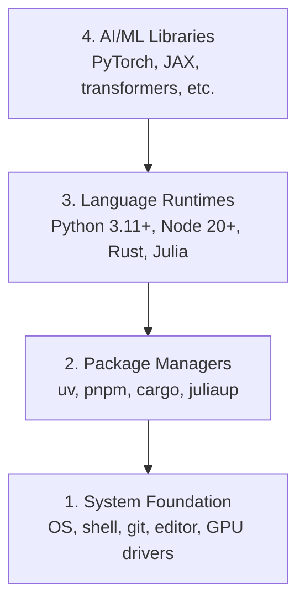

# Ambiente de desenvolvimento

> As tuas ferramentas moldam o teu pensamento.

**Type:** Build
**Languages:** Python, Node.js, Rust
**Prerequisites:** None
**Time:** ~45 minutes

## Objetivos de aprendizagem

- Configure Python 3.11+, Node.js 20+, e Rust toolchains a partir do zero
- Configurar ambientes virtuais e gerenciadores de pacotes para construções reprodutíveis
- Verificar o acesso da GPU com CUDA/MPS e executar uma operação de tensor de teste
- Compreender a pilha de quatro camadas: sistema, pacotes, tempos de execução, bibliotecas de IA

## O problema

Você está prestes a aprender engenharia de IA em mais de 500 aulas usando Python, TypeScript, Rust e Julia. Se o seu ambiente for quebrado, cada aulas se torna uma luta contra ferramentas em vez de aprender.

A maioria das pessoas esquece a configuração do ambiente, depois passa horas a depurar erros de importação, conflitos de versões e drivers de CUDA faltantes.

## O conceito

Um ambiente de engenharia de IA tem quatro camadas:



Instalamos de baixo para cima. Cada camada depende da que está abaixo dela.

```figure
s0-env-stack
```

## Construí-lo

### Passo 1: Fundamento do Sistema

Verifique o seu sistema e instale o básico.

```bash
# macOS
xcode-select --install
brew install git curl wget

# Ubuntu/Debian
sudo apt update && sudo apt install -y build-essential git curl wget

# Windows (use WSL2)
wsl --install -d Ubuntu-24.04
```

### Passo 2: Python com UV

Usamos`uv`É 10-100 vezes mais rápido do que o pip e lida automaticamente com ambientes virtuais.

```bash
curl -LsSf https://astral.sh/uv/install.sh | sh

uv python install 3.12

uv venv
source .venv/bin/activate  # or .venv\Scripts\activate on Windows

uv pip install numpy matplotlib jupyter
```

Verificar:

```python
import sys
print(f"Python {sys.version}")

import numpy as np
print(f"NumPy {np.__version__}")
a = np.array([1, 2, 3])
print(f"Vector: {a}, dot product with itself: {np.dot(a, a)}")
```

### Passo 3: Node.js com pnpm

Para aulas de TypeScript (agentes, servidores MCP, aplicativos web).

```bash
curl -fsSL https://fnm.vercel.app/install | bash
fnm install 22
fnm use 22

npm install -g pnpm

node -e "console.log('Node', process.version)"
```

**macOS / Apple Silicon (M1/M2/M3/M4):**Se o instalador parar com `Error: Cannot install under Rosetta 2 in ARM default prefix (/opt/homebrew)`O seu terminal está a funcionar sob a Rosetta 2 (`arch`impressões digitais`i386`Instalhar o arm64 forçador fnm, acoplar-o ao seu shell, e depois reiniciar os comandos acima de`fnm install 22`- Não .

```bash
arch -arm64 brew install fnm
echo 'eval "$(fnm env --use-on-cd)"' >> ~/.zshrc
source ~/.zshrc
```

### Passo 4: Corrosão

Para aulas críticas ao desempenho (inferência, sistemas).

```bash
curl --proto '=https' --tlsv1.2 -sSf https://sh.rustup.rs | sh

rustc --version
cargo --version
```

### Passo 5: Julia (opcional)

Para aulas de matemática pesadas onde a Julia brilha.

```bash
curl -fsSL https://install.julialang.org | sh

julia -e 'println("Julia ", VERSION)'
```

### Passo 6: Configuração de GPU (se você tiver um)

**NVIDIA (Linux / Windows):**

```bash
nvidia-smi

# Install PyTorch with CUDA
uv pip install torch torchvision torchaudio --index-url https://download.pytorch.org/whl/cu124
```

**macOS / Apple Silicon (M1/M2/M3/M4):**Não há CUDA num Mac que seja esperado, nem um fracasso.**not**Passagem .`--index-url .../cuXXX`(aquelas rodas são apenas Linux / Windows, então a instalação falha). Instale a construção simples, que inclui o backend da GPU MPS (Metal) da Apple:

```bash
uv pip install torch torchvision torchaudio
```

Verificar (funciona em qualquer plataforma):

```python
import torch
print(f"CUDA available: {torch.cuda.is_available()}")           # False on macOS — expected
print(f"MPS available:  {torch.backends.mps.is_available()}")   # True on Apple Silicon
if torch.cuda.is_available():
    print(f"GPU: {torch.cuda.get_device_name(0)}")
```

Não há GPU? Não há problema. A maioria das aulas funciona em CPU. Para aulas pesadas de treinamento, use Google Colab ou GPUs em nuvem.

### Passo 7: Verifique a rota que deseja iniciar

Execute todos os comandos nesta lição a partir da raiz do repositório, o diretório que
contém `README.md`E ...`phases/`O pré-voo verifica apenas o que você precisa
O sistema de aprendizagem é um sistema de aprendizagem que permite que um aprendiz
Uma resposta clara em vez de um muro de advertências.

Comece a sequência completa de iniciantes:

```bash
python3 phases/00-setup-and-tooling/01-dev-environment/code/verify.py --route beginner
```

Ou verifique apenas a rota que quiser:

```bash
python3 phases/00-setup-and-tooling/01-dev-environment/code/verify.py --route ml-foundations
python3 phases/00-setup-and-tooling/01-dev-environment/code/verify.py --route llm-engineering
python3 phases/00-setup-and-tooling/01-dev-environment/code/verify.py --route agents
python3 phases/00-setup-and-tooling/01-dev-environment/code/verify.py --route mcp
python3 phases/00-setup-and-tooling/01-dev-environment/code/verify.py --route agent-skills
python3 phases/00-setup-and-tooling/01-dev-environment/code/verify.py --route certification
```

Adicionar`--show-later`Quando quiser o mesmo pré-voo para inspecionar ferramentas opcionais
Uma ferramenta posterior que falte nunca bloqueia a
rota selecionada.

Cada verificação necessária falhada inclui o caminho detectado ou o erro de importação e um
As habilidades dos agentes e as rotas de certificação também mostram
verifica manualmente o host porque um script Python não pode provar que um host de IA tem
Descobriu uma habilidade ou que o seu escopo de habilidade escolhido é escritível.

Quando o pré-voio iniciante passa, ele imprime a primeira lição correta:

```text
Ready to start Beginner course.
Next: python3 phases/01-math-foundations/01-linear-algebra-intuition/code/vectors.py
```

## Usá-lo

O seu ambiente está pronto para iniciar a rota que você verificou.
Quando uma lição pede por eles em vez de bloquear a sua primeira lição no todo
Aqui está o que você vai usar em todo o currículo:

| Language | Used In | Package Manager |
|----------|---------|-----------------|
| Python | Phases 1-12 (ML, DL, NLP, Vision, Audio, LLMs) | uv |
| TypeScript | Phases 13-17 (Tools, Agents, Swarms, Infra) | pnpm |
| Rust | Phases 12, 15-17 (Performance-critical systems) | cargo |
| Julia | Phase 1 (Math foundations) | Pkg |

## Envia-o

Esta lição produz um script de verificação que qualquer um pode executar para verificar a sua configuração.

Veja .`outputs/prompt-env-check.md`para um prompt que ajuda os assistentes de IA a diagnosticar problemas ambientais.

## Exercícios

1. Execute o script de verificação e corrija quaisquer falhas
2. Criar um ambiente virtual Python para este curso e instalar PyTorch
3. Escreva um "olá ao mundo" em todas as quatro línguas e execute cada uma
