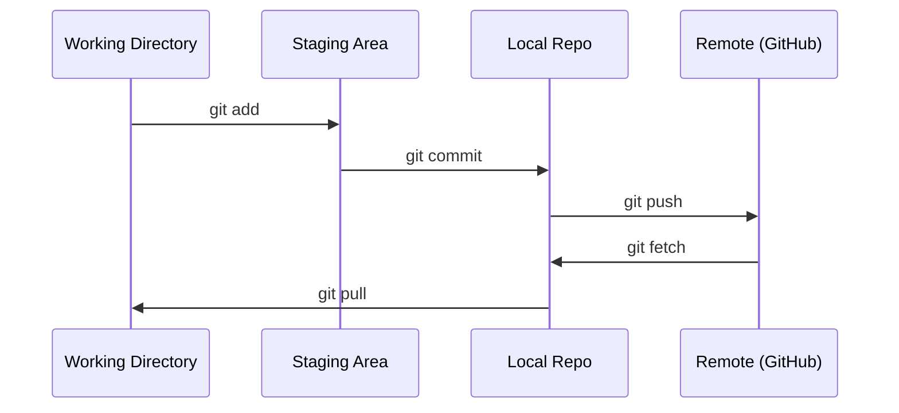

# Git & Colaboração

> Cada experimento, modelo, lição que construímos aqui são rastreados.

**Type:** Learn
**Languages:** --
**Prerequisites:** Phase 0, Lesson 01
**Time:** ~30 minutes

## Objetivos de aprendizagem

- Configure a identidade git e use o fluxo de trabalho diário de adicionar, comprometer e empurrar
- Criar e fundir ramos para experimentos isolados sem quebrar o principal
- Escreva um`.gitignore`que exclui os pontos de controlo de modelo e os grandes ficheiros binários
- Navegue no histórico de compromissos com `git log`compreender a evolução do projeto

## O problema

Você está prestes a escrever centenas de arquivos de código em 20 fases, sem controle de versão, perderá trabalho, quebrará coisas que não pode desfechar e não terá forma de colaborar com os outros.

Git é a ferramenta. GitHub é onde o código vive. Esta lição cobre o que você precisa para este curso e nada mais.

## O conceito



Três coisas para lembrar:
1. Salvar frequentemente (`git commit`)
2. Empurrar para remoto (`git push`)
3. O ramo de experiências (`git checkout -b experiment`)

```figure
s0-commit-dag
```

## Construí-lo

### Passo 1: Configurar git

```bash
git config --global user.name "Your Name"
git config --global user.email "you@example.com"
```

### Passo 2: Fluxo de trabalho diário

```bash
git status
git add file.py
git commit -m "Add perceptron implementation"
git push origin main
```

### Passo 3: A ramificação para experimentos

```bash
git checkout -b experiment/new-optimizer

# ... make changes, commit ...

git checkout main
git merge experiment/new-optimizer
```

### Passo 4: Trabalhar com este repo de curso

Não pode empurrar para o próprio repo do curso  apenas os mantenedores têm acesso a escrever. Forque-o no GitHub primeiro (o botão Forque, em cima à direita) assim `origin`Pontos em sua própria cópia:

```bash
git clone https://github.com/YOUR-USERNAME/ai-engineering-from-scratch.git
cd ai-engineering-from-scratch

git checkout -b my-progress
# work through lessons, commit your code
git push origin my-progress
```

## Usá-lo

Para este curso, precisam exactamente destes comandos:

| Command | When |
|---------|------|
| `git clone` | Get the course repo |
| `git add` + `git commit` | Save your work |
| `git push` | Back it up to GitHub |
| `git checkout -b` | Try something without breaking main |
| `git log --oneline` | See what you've done |

Não precisas de rebases, de pistas ou submodules para este curso.

## Exercícios

1. Forque este repo, clone o seu fork, crie um ramo chamado `my-progress`, fazer um arquivo, cometer, empurrá-lo
2. Criar um`.gitignore`que exclui os modelos de ficheiros de checkpoint (`.pt`- Não .`.pth`- Não .`.safetensors`)
3. Veja o histórico de compromissos deste repo com `git log --oneline`E ler como as lições foram adicionadas

## Termos-chave

| Term | What people say | What it actually means |
|------|----------------|----------------------|
| Commit | "Saving" | A snapshot of your entire project at a point in time |
| Branch | "A copy" | A pointer to a commit that moves forward as you work |
| Merge | "Combining code" | Taking changes from one branch and applying them to another |
| Remote | "The cloud" | A copy of your repo hosted somewhere else (GitHub, GitLab) |
