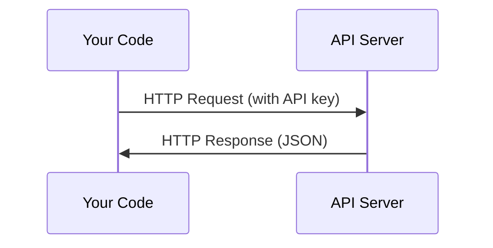

# APIs & Chaves

> Todas as API de IA funcionam da mesma forma: enviar uma solicitação, obter uma resposta. Os detalhes mudam, o padrão não.

**Type:** Build
**Languages:** Python, TypeScript
**Prerequisites:** Phase 0, Lesson 01
**Time:** ~30 minutes

## Objetivos de aprendizagem

- Armazenar as chaves API com segurança usando variáveis do ambiente e `.env`Arquivos
- Faça uma chamada de API LLM usando tanto o SDK Anthropic Python quanto o HTTP bruto
- Compare formatos de solicitação/resposta HTTP baseados em SDK e crus para depuração
- Identificar e lidar com erros comuns da API, incluindo limites de autenticação e taxa

## O problema

A partir da Fase 11, você vai chamar APIs LLM (Antropic, OpenAI, Google). Na Fase 13-16 você vai construir agentes que usam essas APIs em loops. Você precisa saber como as chaves API funcionam, como armazená-las com segurança, e como fazer sua primeira chamada API.

## O conceito



Cada chamada de API tem:
1. Um endpoint (URL)
2. Uma chave API (autenticação)
3. Um organismo de solicitação (o que desejar)
4. Um corpo de resposta (o que você retorna)

```figure
s0-secret-inject
```

## Construí-lo

### Passo 1: Armazenar as chaves API de forma segura

Nunca coloque chaves API em código. Use variáveis ambientais.

```bash
export ANTHROPIC_API_KEY="sk-ant-..."
export OPENAI_API_KEY="sk-..."
```

Ou usar um`.env`arquivo (ajustar `.gitignore`):

```
ANTHROPIC_API_KEY=sk-ant-...
OPENAI_API_KEY=sk-...
```

### Passo 2: Primeira chamada de API (Python)

```python
import os

import anthropic

client = anthropic.Anthropic()

MODEL = os.environ.get("LLM_MODEL", "claude-sonnet-5")

response = client.messages.create(
    model=MODEL,
    max_tokens=256,
    messages=[{"role": "user", "content": "What is a neural network in one sentence?"}]
)

print(response.content[0].text)
```

`LLM_MODEL`seleciona o id do modelo Anthropic, e o padrão é o alias Sonnet não datado. Outros provedores (OpenAI, Google e outros) seguem o mesmo padrão de uma chave mais um id do modelo, mas cada um tem seu próprio SDK, endpoint e esquema de solicitação / resposta.

### Passo 3: Primeira chamada de API (TypeScript)

```typescript
import Anthropic from "@anthropic-ai/sdk";

const client = new Anthropic();

const MODEL = process.env.LLM_MODEL ?? "claude-sonnet-5";

const response = await client.messages.create({
  model: MODEL,
  max_tokens: 256,
  messages: [{ role: "user", content: "What is a neural network in one sentence?" }],
});

console.log(response.content[0].text);
```

### Passo 4: HTTP bruto (sem SDK)

```python
import os
import urllib.request
import json

url = "https://api.anthropic.com/v1/messages"
headers = {
    "Content-Type": "application/json",
    "x-api-key": os.environ["ANTHROPIC_API_KEY"],
    "anthropic-version": "2023-06-01",
}
body = json.dumps({
    "model": os.environ.get("LLM_MODEL", "claude-sonnet-5"),
    "max_tokens": 256,
    "messages": [{"role": "user", "content": "What is a neural network in one sentence?"}],
}).encode()

req = urllib.request.Request(url, data=body, headers=headers, method="POST")
with urllib.request.urlopen(req) as resp:
    result = json.loads(resp.read())
    print(result["content"][0]["text"])
```

Isto é o que os SDKs fazem sob o capô. Entender a chamada HTTP crua ajuda ao depurar.

## Usá-lo

Para este curso:

| API | When you need it | Free tier |
|-----|-----------------|-----------|
| Anthropic (Claude) | Phases 11-16 (agents, tools) | $5 credit on signup |
| OpenAI | Phase 11 (comparison) | $5 credit on signup |
| Hugging Face | Phases 4-10 (models, datasets) | Free |

Não precisas de todos agora, arranja-os quando a lição precisar.

## Envia-o

Esta lição produz:
- `outputs/prompt-api-troubleshooter.md`- diagnóstico de erros comuns na API

## Exercícios

1. Obtenha uma chave de API Anthropic e faça sua primeira chamada de API
2. Tente a versão HTTP crua e compare o formato de resposta com a versão SDK
3. Usar intencionalmente uma chave de API errada e ler a mensagem de erro

## Termos-chave

| Term | What people say | What it actually means |
|------|----------------|----------------------|
| API key | "Password for the API" | A unique string that identifies your account and authorizes requests |
| Rate limit | "They're throttling me" | Maximum requests per minute/hour to prevent abuse and ensure fair usage |
| Token | "A word" (in API context) | A billing unit: input and output tokens are counted and charged separately |
| Streaming | "Real-time responses" | Getting the response word by word instead of waiting for the full response |
