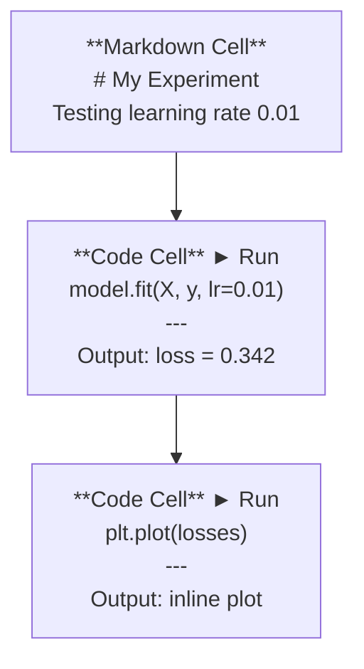
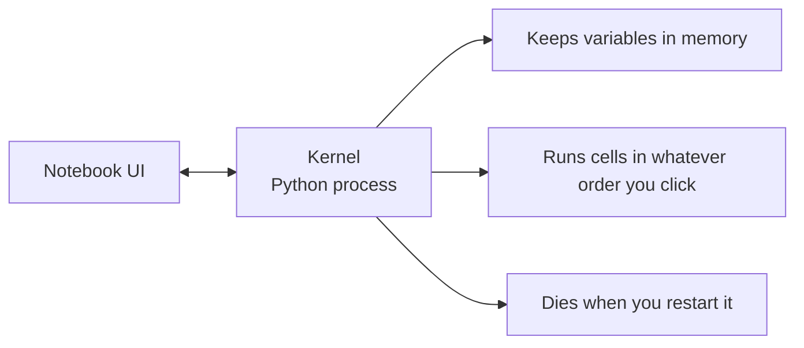

# Júpiter

> Os portáteis são o banco de laboratório da engenharia da IA.

**Type:** Build
**Languages:** Python
**Prerequisites:** Phase 0, Lesson 01
**Time:** ~30 minutes

## Objetivos de aprendizagem

- Instalar e lançar o JupyterLab, o Jupyter Notebook ou o VS Code com a extensão Jupyter
- Usar comandos mágicos (`%timeit`- Não .`%%time`- Não .`%matplotlib inline`) para comparar e visualizar em linha
- Distinguir quando usar notebooks versus scripts e aplicar o fluxo de trabalho "explorar em notebooks, enviar em scripts"
- Identificar e evitar as armadilhas comuns dos portáteis: execução fora de ordem, estado oculto e vazamentos de memória

## O problema

Todos os artigos de IA, tutoriais e competições de Kaggle usam notebooks Jupyter. Eles permitem executar código em pedaços, ver as saídas em linha, misturar código com explicações e iterar rapidamente. Se você tentar aprender IA sem notebooks, você está fazendo tarefas matemáticas sem papéis de arranhão.

Mas os cadernos têm armadilhas reais. As pessoas usam-nos para tudo, incluindo coisas em que são péssimas. Saber quando usar um cadastro e quando usar um script vai salvá-lo de debugging pesadelos mais tarde.

## O conceito

Um caderno é uma lista de células. Cada célula é código ou texto.



O kernel é um processo Python que funciona em segundo plano. Quando você executa uma célula, ele envia o código para o kernel, que o executa e envia o resultado de volta. Todas as células compartilham o mesmo kernel, então as variáveis persistem entre as células.



Essa parte de "qualquer ordem que você clique" é tanto o superpoder quanto a arma de pé.

```figure
s0-cell-order
```

## Construí-lo

### Passo 1: Escolha a sua interface

Três opções, um formato:

| Interface | Install | Best for |
|-----------|---------|----------|
| JupyterLab | `pip install jupyterlab` then `jupyter lab` | Full IDE experience, multiple tabs, file browser, terminal |
| Jupyter Notebook | `pip install notebook` then `jupyter notebook` | Simple, lightweight, one notebook at a time |
| VS Code | Install "Jupyter" extension | Already in your editor, git integration, debugging |

Todos os três leram e escreveram o mesmo .`.ipynb`O JupyterLab é o mais comum no trabalho de IA.

```bash
pip install jupyterlab
jupyter lab
```

### Passo 2: atalhos de teclado que importam

- Obras em dois modos.`Escape`para o modo de comando (barra azul à esquerda), `Enter`para o modo de edição (barra verde).

**Command mode (most used):**

| Key | Action |
|-----|--------|
| `Shift+Enter` | Run cell, move to next |
| `A` | Insert cell above |
| `B` | Insert cell below |
| `DD` | Delete cell |
| `M` | Convert to markdown |
| `Y` | Convert to code |
| `Z` | Undo cell operation |
| `Ctrl+Shift+H` | Show all shortcuts |

**Edit mode:**

| Key | Action |
|-----|--------|
| `Tab` | Autocomplete |
| `Shift+Tab` | Show function signature |
| `Ctrl+/` | Toggle comment |

`Shift+Enter`É o que vais usar mil vezes por dia.

### Passo 3: Tipos de células

**Code cells**executar Python e mostrar a saída:

```python
import numpy as np
data = np.random.randn(1000)
data.mean(), data.std()
```

Output: `(0.0032, 0.9987)`

**Markdown cells**O que você está fazendo e porquê.`$E = mc^2$`), tabelas e imagens.

### Passo 4: comandos mágicos

Estes não são Python, são comandos específicos de Jupyter que começam com`%`(Mágico de Linha) ou `%%`(Mágia celular).

**Time your code:**

```python
%timeit np.random.randn(10000)
```

Output: `45.2 us +/- 1.3 us per loop`

```python
%%time
model.fit(X_train, y_train, epochs=10)
```

Output: `Wall time: 2.34 s`

`%timeit`executa o código muitas vezes e medias. `%%time`- É só uma vez.`%timeit`para microbemarcações, `%%time`para corridas de treinamento.

**Enable inline plots:**

```python
%matplotlib inline
```

Todos .`plt.plot()`ou `plt.show()`Agora, o renderizado está no bloco.

**Install packages without leaving the notebook:**

```python
!pip install scikit-learn
```

O `!`O prefixo executa qualquer comando de shell.

**Check environment variables:**

```python
%env CUDA_VISIBLE_DEVICES
```

### Passo 5: Exibir a saída rica em linha

Os portáteis exibem automaticamente a última expressão numa célula.

```python
import pandas as pd

df = pd.DataFrame({
    "model": ["Linear", "Random Forest", "Neural Net"],
    "accuracy": [0.72, 0.89, 0.94],
    "training_time": [0.1, 2.3, 45.6]
})
df
```

Isto representa uma tabela HTML formatada, não um depósito de texto.

```python
import matplotlib.pyplot as plt

plt.figure(figsize=(8, 4))
plt.plot([1, 2, 3, 4], [1, 4, 2, 3])
plt.title("Inline Plot")
plt.show()
```

O gráfico aparece logo abaixo da célula. É por isso que os portáteis dominam o trabalho da IA.

Para imagens:

```python
from IPython.display import Image, display
display(Image(filename="architecture.png"))
```

### Passo 6: Google Colab

Colab é um notebook Jupyter gratuito na nuvem. Ele dá-lhe uma GPU, bibliotecas pré-instaladas e integração com o Google Drive.

1. Vai para o[colab.research.google.com](https://colab.research.google.com)
2. Faça o upload .`.ipynb`arquivo deste curso
3. Tempo de execução > Mudança de tipo de tempo de execução > T4 GPU (gratuito)

Colab diferenças de Jupyter local:
- Arquivos não persistem entre sessões (salva para Drive ou download)
- Pre-instalado: numpy, pandas, matplotlib, tocha, tensorflow, sklearn
- `from google.colab import files`para fazer upload/download de arquivos
- `from google.colab import drive; drive.mount('/content/drive')`para armazenamento persistente
- Tempo de interrupção das sessões após 90 minutos de inatividade (nível livre)

## Usá-lo

### Notebooks vs Scripts: Quando usar qual

| Use notebooks for | Use scripts for |
|-------------------|-----------------|
| Exploring a dataset | Training pipelines |
| Prototyping a model | Reusable utilities |
| Visualizing results | Anything with `if __name__` |
| Explaining your work | Code that runs on a schedule |
| Quick experiments | Production code |
| Course exercises | Packages and libraries |

A regra:**explore in notebooks, ship in scripts**- Não .

Um fluxo de trabalho comum em IA:
1. Explorar dados em um caderno
2. O protótipo do seu modelo no caderno
3. Quando funcionar, mude o código para `.py`Arquivos
4. Importar esses .`.py`Arquivos de volta para o caderno para mais experimentos

### Trampas comuns

**Out-of-order execution.**Você executa a célula 5, depois a célula 2, depois a célula 7. O portátil funciona na sua máquina, mas quebra quando alguém o executa de cima para baixo.

**Hidden state.**Você exclui uma célula, mas a variável criada ainda está na memória. O notebook parece limpo, mas depende de uma célula fantasma. Correção: reinicie o kernel regularmente.

**Memory leaks.**Carregar um conjunto de dados de 4 GB, treinar um modelo, carregar outro conjunto de dados. Nada é liberado.`del variable_name`E ...`gc.collect()`, ou reiniciar o núcleo.

## Envia-o

Esta lição produz:
- `outputs/prompt-notebook-helper.md`para depurar problemas de blocos de notas

## Exercícios

1. Abra o JupyterLab, crie um caderno e use `%timeit`Para comparar compreensão de lista vs numpy para criar uma matriz de 100.000 números aleatórios
2. Crie um bloco de notas com marcas e células de código que carreguem um CSV, exijam uma estrutura de dados e trazem um gráfico. Em seguida, execute Kernel > Restart & Run All para verificar que funciona de cima para baixo
3. Tome o código de `code/notebook_tips.py`, colar em um notebook Colab, e executá-lo com uma GPU livre

## Termos-chave

| Term | What people say | What it actually means |
|------|----------------|----------------------|
| Kernel | "The thing running my code" | A separate Python process that executes cells and keeps variables in memory |
| Cell | "A code block" | An independently runnable unit in a notebook, either code or markdown |
| Magic command | "Jupyter tricks" | Special commands prefixed with `%` or `%%` that control the notebook environment |
| `.ipynb` | "Notebook file" | A JSON file containing cells, outputs, and metadata. Stands for IPython Notebook |

## Mais leitura

- [JupyterLab Docs](https://jupyterlab.readthedocs.io/)para o conjunto completo de características
- [Google Colab FAQ](https://research.google.com/colaboratory/faq.html)para os limites e características específicos do Colab
- [28 Jupyter Notebook Tips](https://www.dataquest.io/blog/jupyter-notebook-tips-tricks-shortcuts/)para atalhos de utilizador de energia
