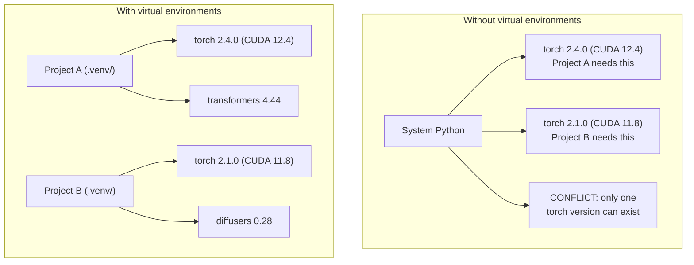

# Ambientes Python

> O inferno da dependência é real, os ambientes virtuais são a cura.

**Type:** Build
**Languages:** Shell
**Prerequisites:** Phase 0, Lesson 01
**Time:** ~30 minutes

## Objetivos de aprendizagem

- Criar ambientes virtuais isolados usando `uv`- Não .`venv`, ou `conda`
- Escreva um`pyproject.toml`com grupos de dependência opcionais e gerar arquivos de bloqueio para reprodução
- Diagnóstico e correção de armadilhas comuns: instalações globais, mistura de pip/conda, desajustes na versão CUDA
- Implementar uma estratégia de ambiente por fase para projectos com dependências conflitantes

## O problema

Você instala PyTorch 2.4 para um projeto de ajuste fino. Na próxima semana, um projeto diferente precisa de PyTorch 2.1 porque sua construção CUDA está fixa. Você atualiza globalmente, e o primeiro projeto se rompe. Você rebaixar, e o segundo se rompe.

Isto é um inferno de dependência.

- PyTorch, JAX e TensorFlow enviam cada um seus próprios enlaces CUDA
- Libraerias de modelos pin versões específicas do framework
- Um mundo inteiro`pip install`O que foi antes
- As construtores CUDA 11.8 não funcionam com drivers CUDA 12.x (e vice-versa)

A solução: cada projeto tem o seu próprio ambiente isolado com os seus próprios pacotes.

## O conceito



```figure
s0-env-isolation
```

## Construí-lo

### Opção 1: uv venv (recomendado)

`uv`É o gerenciador de pacotes Python mais rápido (10-100 vezes mais rápido do que pip).

```bash
curl -LsSf https://astral.sh/uv/install.sh | sh

uv python install 3.12

cd your-project
uv venv
source .venv/bin/activate
```

Instalação de pacotes:

```bash
uv pip install torch numpy
```

Criar um projeto com `pyproject.toml`em um passo:

```bash
uv init my-ai-project
cd my-ai-project
uv add torch numpy matplotlib
```

### Opção 2: venv (construído)

Se não conseguir instalar `uv`, naves Python com `venv`- Não .

```bash
python3 -m venv .venv
source .venv/bin/activate  # Linux/macOS
.venv\Scripts\activate     # Windows

pip install torch numpy
```

Mais lento que `uv`, mas funciona em todos os lugares onde Python está instalado.

### Opção 3: conda (quando precisar)

Conda gerencia dependências não Python como kits de ferramentas CUDA, cuDNN e bibliotecas C. Use-o quando:

- Você precisa de uma versão específica do kit de ferramentas CUDA sem instalar em todo o sistema
- Você está em um cluster compartilhado onde não pode instalar pacotes do sistema
- As instruções de instalação de uma biblioteca dizem "utilizar conda"

```bash
# Install miniconda (not the full Anaconda)
curl -LsSf https://repo.anaconda.com/miniconda/Miniconda3-latest-Linux-x86_64.sh -o miniconda.sh
bash miniconda.sh -b

conda create -n myproject python=3.12
conda activate myproject

conda install pytorch torchvision torchaudio pytorch-cuda=12.4 -c pytorch -c nvidia
```

Uma regra: se utilizar conda para um ambiente, use conda para todos os pacotes nesse ambiente.`pip install`O condomínio de condomínio causa conflitos de dependência que são dolorosos de depurar.

### Para este curso: Estratégia por fase

Pode-se criar um ambiente para todo o curso. Não. Diferentes fases precisam de dependências diferentes (às vezes conflitantes).

Estratégia:

```
ai-engineering-from-scratch/
├── .venv/                    <-- shared lightweight env for phases 0-3
├── phases/
│   ├── 04-neural-networks/
│   │   └── .venv/            <-- PyTorch env
│   ├── 05-cnns/
│   │   └── .venv/            <-- same PyTorch env (symlink or shared)
│   ├── 08-transformers/
│   │   └── .venv/            <-- might need different transformer versions
│   └── 11-llm-apis/
│       └── .venv/            <-- API SDKs, no torch needed
```

O roteiro em `code/env_setup.sh`cria o ambiente de base para este curso.

## pyproject.toml Basics

Todo projeto Python deve ter um`pyproject.toml`Substitui-o .`setup.py`- Não .`setup.cfg`, e `requirements.txt`num único ficheiro.

```toml
[project]
name = "ai-engineering-from-scratch"
version = "0.1.0"
requires-python = ">=3.11"
dependencies = [
    "numpy>=1.26",
    "matplotlib>=3.8",
    "jupyter>=1.0",
    "scikit-learn>=1.4",
]

[project.optional-dependencies]
torch = ["torch>=2.3", "torchvision>=0.18"]
llm = ["anthropic>=0.39", "openai>=1.50"]
```

Então instale:

```bash
uv pip install -e ".[torch]"    # base + PyTorch
uv pip install -e ".[llm]"     # base + LLM SDKs
uv pip install -e ".[torch,llm]" # everything
```

## Ficha de bloqueio

Um arquivo de bloqueio fixa todas as dependências (incluindo as transitivas) em versões exatas. Isto garante reproducibilidade: qualquer pessoa que instala do arquivo de bloqueio recebe exatamente os mesmos pacotes.

```bash
# uv generates uv.lock automatically when using uv add
uv add numpy

# pip-tools approach
uv pip compile pyproject.toml -o requirements.lock
uv pip install -r requirements.lock
```

Quando alguém clona o repo, instalam do ficheiro e obtêm versões idênticas.

## Erros comuns

### 1. Instalação global

```bash
pip install torch  # BAD: installs to system Python

source .venv/bin/activate
pip install torch  # GOOD: installs to virtual environment
```

Verifique onde vão as suas embalagens:

```bash
which python       # should show .venv/bin/python, not /usr/bin/python
which pip           # should show .venv/bin/pip
```

### 2. Mistura de pip e conda

```bash
conda create -n myenv python=3.12
conda activate myenv
conda install pytorch -c pytorch
pip install some-other-package   # BAD: can break conda's dependency tracking
conda install some-other-package # GOOD: let conda manage everything
```

Se for necessário utilizar pip dentro do conda (alguns pacotes são apenas de pip), instale primeiro todos os pacotes de conda, e depois os pacotes de pip duram.

### 3. Esquecer de ativar

```bash
python train.py           # uses system Python, missing packages
source .venv/bin/activate
python train.py           # uses project Python, packages found
```

O prompt de shell deve mostrar o nome do ambiente:

```
(.venv) $ python train.py
```

### 4. Compromissando .venv a git

```bash
echo ".venv/" >> .gitignore
```

Os ambientes virtuais são de 200MB a 2GB.`pyproject.toml`E o ficheiro de fechamento em vez disso.

### 5. Desconhecimento da versão CUDA

```bash
nvidia-smi                # shows driver CUDA version (e.g., 12.4)
python -c "import torch; print(torch.version.cuda)"  # shows PyTorch CUDA version

# These must be compatible.
# PyTorch CUDA version must be <= driver CUDA version.
```

## Usá-lo

Execute o script de configuração para criar o ambiente do curso:

```bash
bash phases/00-setup-and-tooling/06-python-environments/code/env_setup.sh
```

Isto cria um`.venv`na raiz repo com dependências de núcleo instaladas e verificadas.

## Exercícios

1. Corra .`env_setup.sh`e verificar todos os cheques passar
2. Crie um segundo ambiente virtual, instale uma versão diferente de numpy nele e confirme que os dois ambientes são isolados
3. Escreva um`pyproject.toml`para um projeto que necessita tanto do PyTorch quanto do SDK Anthropic
4. Instale um pacote globalmente de forma deliberada (sem ativar um venv), note onde ele vai, e depois desinstala-lo

## Termos-chave

| Term | What people say | What it actually means |
|------|----------------|----------------------|
| Virtual environment | "A venv" | An isolated directory containing a Python interpreter and packages, separate from the system Python |
| Lockfile | "Pinned dependencies" | A file listing every package and its exact version, guaranteeing identical installs across machines |
| pyproject.toml | "The new setup.py" | The standard Python project configuration file, replacing setup.py/setup.cfg/requirements.txt |
| Transitive dependency | "A dependency of a dependency" | Package B depends on C; if you install A which depends on B, C is a transitive dependency of A |
| CUDA mismatch | "My GPU isn't working" | PyTorch was compiled for a different CUDA version than what your GPU driver supports |
