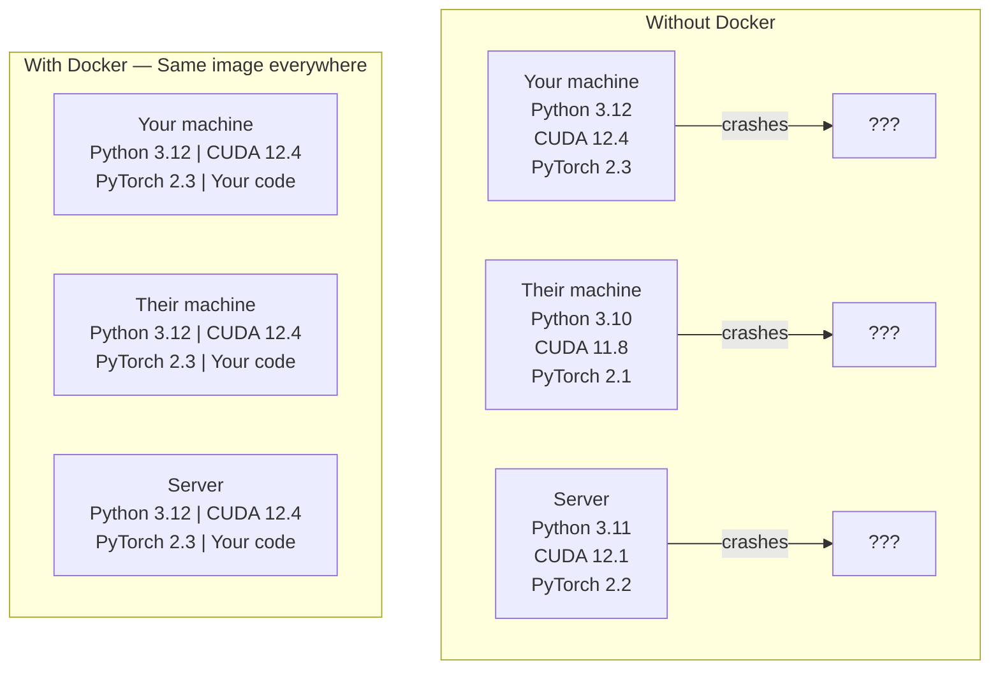

# Docker para IA

> Os contêineres fazem do "trabalho na minha máquina" uma coisa do passado.

**Type:** Build
**Languages:** Docker
**Prerequisites:** Phase 0, Lessons 01 and 03
**Time:** ~60 minutes

## Objetivos de aprendizagem

- Construa uma imagem docker habilitada para GPU com bibliotecas CUDA, PyTorch e AI a partir de um arquivo docker
- Montar diretórios host como volumes para persistir modelos, conjuntos de dados e código em todas as reconstruções de contêineres
- Configurar o Kit de Ferramentas NVIDIA Container para expor GPUs dentro de recipientes
- Orquestra aplicações de IA multi-serviço (servidor de inferência + banco de dados vetorial) usando Docker Compose

## O problema

Você treinou um modelo no seu laptop com PyTorch 2.3, CUDA 12.4 e Python 3.12. Seu colega tem PyTorch 2.1, CUDA 11.8 e Python 3.10.

Os projetos de IA são pesadelos de dependência. Uma pilha típica inclui Python, PyTorch, drivers CUDA, cuDNN, bibliotecas C de nível de sistema e pacotes especializados como flash-attn que precisam de versões exatas de compilador. Docker enche tudo isso em uma única imagem que é executada de forma idêntica em todos os lugares.

## O conceito

O Docker enrola o seu código, tempo de execução, bibliotecas e ferramentas do sistema em uma unidade isolada chamada contêiner. Pense nisso como uma máquina virtual leve, exceto que compartilha o kernel do sistema operacional hospedeiro em vez de executar o seu próprio, por isso começa em segundos em vez de minutos.



### Por que os projetos de IA precisam do Docker mais do que a maioria

1. **GPU drivers are fragile.**O código CUDA 12.4 não é executado no CUDA 11.8. Docker isola o kit de ferramentas CUDA dentro do recipiente enquanto compartilha o driver de GPU hospedeiro através do kit de ferramentas NVIDIA Container.

2. **Model weights are large.**Um modelo de parâmetro 7B é de 14 GB em fp16. Você não quer baixá-lo novamente toda vez que reconstruir.

3. **Multi-service architectures are common.**Uma aplicação de IA real não é apenas um script Python. É um servidor de inferência, um banco de dados vetorial para RAG, talvez uma frontend web. Docker Compose orquestra tudo isso com um comando.

### Vocabulário chave

| Term | What it means |
|------|---------------|
| Image | A read-only template. Your recipe. Built from a Dockerfile. |
| Container | A running instance of an image. Your kitchen. |
| Dockerfile | Instructions to build an image. Layer by layer. |
| Volume | Persistent storage that survives container restarts. |
| docker-compose | A tool for defining multi-container applications in YAML. |

### Padrões comuns de contêineres em IA

```
Dev Container
  Full toolkit. Editor support. Jupyter. Debugging tools.
  Used during development and experimentation.

Training Container
  Minimal. Just the training script and dependencies.
  Runs on GPU clusters. No editor, no Jupyter.

Inference Container
  Optimized for serving. Small image. Fast cold start.
  Runs behind a load balancer in production.
```

```figure
s0-image-layers
```

## Construí-lo

### Passo 1: Instale o Docker

```bash
# macOS
brew install --cask docker
open /Applications/Docker.app

# Ubuntu
curl -fsSL https://get.docker.com | sh
sudo usermod -aG docker $USER
# Log out and back in for group change to take effect
```

Verificar:

```bash
docker --version
docker run hello-world
```

### Passo 2: Instale o Kit de Ferramentas de Container NVIDIA (Linux com GPU NVIDIA)

Os usuários do macOS e do Windows (WSL2) podem ignorar isso; o Docker Desktop lida com a GPU de forma diferente nessas plataformas.

```bash
distribution=$(. /etc/os-release;echo $ID$VERSION_ID)
curl -fsSL https://nvidia.github.io/libnvidia-container/gpgkey | sudo gpg --dearmor -o /usr/share/keyrings/nvidia-container-toolkit-keyring.gpg
curl -s -L https://nvidia.github.io/libnvidia-container/$distribution/libnvidia-container.list | \
    sed 's#deb https://#deb [signed-by=/usr/share/keyrings/nvidia-container-toolkit-keyring.gpg] https://#g' | \
    sudo tee /etc/apt/sources.list.d/nvidia-container-toolkit.list

sudo apt-get update
sudo apt-get install -y nvidia-container-toolkit
sudo nvidia-ctk runtime configure --runtime=docker
sudo systemctl restart docker
```

Teste de acesso de GPU dentro de um recipiente:

```bash
docker run --rm --gpus all nvidia/cuda:12.4.1-base-ubuntu22.04 nvidia-smi
```

Se vires as informações da GPU, o kit de ferramentas está a funcionar.

### Passo 3: Entender imagens básicas

Escolher a imagem base certa economiza horas de depuração.

```
nvidia/cuda:12.4.1-devel-ubuntu22.04
  Full CUDA toolkit. Compilers included.
  Use for: building packages that need nvcc (flash-attn, bitsandbytes)
  Size: ~4 GB

nvidia/cuda:12.4.1-runtime-ubuntu22.04
  CUDA runtime only. No compilers.
  Use for: running pre-built code
  Size: ~1.5 GB

pytorch/pytorch:2.6.0-cuda12.4-cudnn9-runtime
  PyTorch pre-installed on top of CUDA.
  Use for: skipping the PyTorch install step
  Size: ~6 GB

python:3.12-slim
  No CUDA. CPU only.
  Use for: inference on CPU, lightweight tools
  Size: ~150 MB
```

### Passo 4: Escrever um arquivo docker para desenvolvimento de IA

Aqui está o arquivo do Docker .`code/Dockerfile`- Passe por ela .

```dockerfile
FROM nvidia/cuda:12.4.1-devel-ubuntu22.04

ENV DEBIAN_FRONTEND=noninteractive
ENV PYTHONUNBUFFERED=1

RUN apt-get update && apt-get install -y --no-install-recommends \
    software-properties-common \
    git \
    curl \
    build-essential \
    && add-apt-repository -y ppa:deadsnakes/ppa \
    && apt-get update && apt-get install -y --no-install-recommends \
    python3.12 \
    python3.12-venv \
    python3.12-dev \
    && rm -rf /var/lib/apt/lists/*

RUN update-alternatives --install /usr/bin/python python /usr/bin/python3.12 1

RUN curl -sSL https://raw.githubusercontent.com/pypa/get-pip/3b73145063be545b649ad9ca83ea8da5fc915a4f/public/get-pip.py -o /tmp/get-pip.py \
    && echo "a341e1a43e38001c551a1508a73ff23636a11970b61d901d9a1cad2a18f57055  /tmp/get-pip.py" | sha256sum -c - \
    && python /tmp/get-pip.py \
    && rm /tmp/get-pip.py \
    && update-alternatives --install /usr/bin/pip pip /usr/local/bin/pip3.12 1

RUN python -m pip install --no-cache-dir --upgrade pip setuptools wheel

RUN python -m pip install --no-cache-dir \
    torch==2.6.0+cu124 \
    torchvision==0.21.0+cu124 \
    torchaudio==2.6.0+cu124 \
    --index-url https://download.pytorch.org/whl/cu124

RUN python -m pip install --no-cache-dir \
    numpy \
    pandas \
    scikit-learn \
    matplotlib \
    jupyter \
    transformers \
    datasets \
    accelerate \
    safetensors

WORKDIR /workspace

VOLUME ["/workspace", "/models"]

EXPOSE 8888

CMD ["python"]
```

Construí-lo:

```bash
docker build -t ai-dev -f phases/00-setup-and-tooling/07-docker-for-ai/code/Dockerfile .
```

Isto leva um tempo na primeira vez (descarregando imagem base CUDA + PyTorch). edificações subsequentes usam camadas em cache.

- É o que é ?

```bash
docker run --rm -it --gpus all \
    -v $(pwd):/workspace \
    -v ~/models:/models \
    ai-dev python -c "import torch; print(f'PyTorch {torch.__version__}, CUDA: {torch.cuda.is_available()}')"
```

Exercer Jupyter dentro do recipiente:

```bash
docker run --rm -it --gpus all \
    -v $(pwd):/workspace \
    -v ~/models:/models \
    -p 8888:8888 \
    ai-dev jupyter notebook --ip=0.0.0.0 --port=8888 --no-browser --allow-root
```

### Passo 5: Montes de volume para dados e modelos

As montagens de volume são críticas para o trabalho da IA. Sem elas, os downloads do modelo de 14 GB desaparecem quando o recipiente parou.

```bash
# Mount your code
-v $(pwd):/workspace

# Mount a shared models directory
-v ~/models:/models

# Mount datasets
-v ~/datasets:/data
```

Dentro do seu roteiro de treinamento, carrega do caminho montado:

```python
from transformers import AutoModel

model = AutoModel.from_pretrained("/models/llama-7b")
```

O modelo vive no seu sistema de arquivos host. Reconstruir o recipiente tantas vezes quanto quiser sem fazer o download novamente.

### Passo 6: Docker Compose para aplicativos de IA multi-serviço

Uma aplicação RAG real precisa de um servidor de inferência e um banco de dados vetorial.

Veja .`code/docker-compose.yml`- Não .

```yaml
services:
  ai-dev:
    build:
      context: .
      dockerfile: Dockerfile
    deploy:
      resources:
        reservations:
          devices:
            - driver: nvidia
              count: all
              capabilities: [gpu]
    volumes:
      - ../../../:/workspace
      - ~/models:/models
      - ~/datasets:/data
    ports:
      - "8888:8888"
    stdin_open: true
    tty: true
    command: jupyter notebook --ip=0.0.0.0 --port=8888 --no-browser --allow-root

  qdrant:
    image: qdrant/qdrant:v1.12.5
    ports:
      - "6333:6333"
      - "6334:6334"
    volumes:
      - qdrant_data:/qdrant/storage

volumes:
  qdrant_data:
```

Começa tudo:

```bash
cd phases/00-setup-and-tooling/07-docker-for-ai/code
docker compose up -d
```

Agora o seu contêiner de desenvolvimento de IA pode chegar à base de dados de vetores em `http://qdrant:6333`O Docker Compose cria uma rede compartilhada automaticamente.

Teste a conexão a partir do interior do recipiente de IA:

```python
from qdrant_client import QdrantClient

client = QdrantClient(host="qdrant", port=6333)
print(client.get_collections())
```

Pára de tudo .

```bash
docker compose down
```

Adicionar`-v`para excluir também o volume de qdrant:

```bash
docker compose down -v
```

### Passo 7: Comandações do Docker úteis para o trabalho de IA

```bash
# List running containers
docker ps

# List all images and their sizes
docker images

# Remove unused images (reclaim disk space)
docker system prune -a

# Check GPU usage inside a running container
docker exec -it <container_id> nvidia-smi

# Copy a file from container to host
docker cp <container_id>:/workspace/results.csv ./results.csv

# View container logs
docker logs -f <container_id>
```

## Usá-lo

Agora temos um ambiente de desenvolvimento de IA reprodutivel.

- Utilização`docker compose up`para iniciar seu ambiente de desenvolvimento e banco de dados vetorial juntos
- Coloque seu código, modelos e dados em volumes para que nada se perca entre as reconstruções
- Quando uma lição requer um novo pacote Python, adicione-o ao arquivo Docker e reconstruir
- Compartilhe o seu ficheiro com os colegas, eles têm o mesmo ambiente.

### Não há GPU?

Remova o `--gpus all`O contêiner ainda funciona para a aprendizagem baseada na CPU. PyTorch detecta a ausência de CUDA e retorna automaticamente para a CPU.

## Exercícios

1. Construir o arquivo do Docker e executar `python -c "import torch; print(torch.__version__)"`dentro do recipiente
2. Inicie a pilha de composição docker e verifique se o Qdrant é acessível a partir do recipiente de IA em `http://qdrant:6333/collections`
3. Adicionar`flask`Para o arquivo do Docker, reconstruir e executar um servidor API simples no porto 5000.`-p 5000:5000`
4. Messa o tamanho da imagem com `docker images`Tente mudar a imagem de base de`devel`- Não .`runtime`e comparar os tamanhos

## Termos-chave

| Term | What people say | What it actually means |
|------|----------------|----------------------|
| Container | "Lightweight VM" | An isolated process using the host kernel, with its own filesystem and network |
| Image layer | "Cached step" | Each Dockerfile instruction creates a layer. Unchanged layers are cached, so rebuilds are fast. |
| NVIDIA Container Toolkit | "GPU in Docker" | A runtime hook that exposes host GPUs to containers via `--gpus` flag |
| Volume mount | "Shared folder" | A directory on the host mapped into the container. Changes persist after the container stops. |
| Base image | "Starting point" | The `FROM` image your Dockerfile builds on top of. Determines what is pre-installed. |
