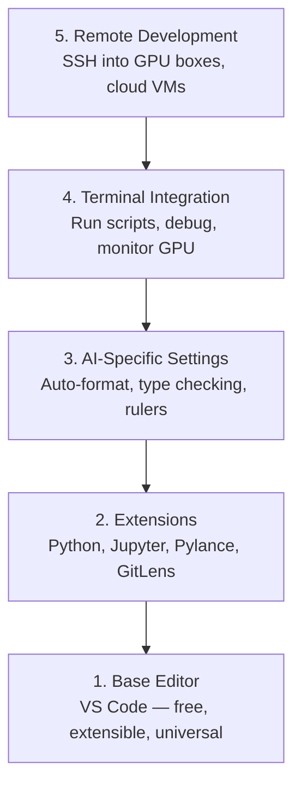

# Configuração do editor

> O editor é o seu co-piloto, configure-o uma vez para não te atrapalhar e começar a puxar o peso.

**Type:** Build
**Languages:** --
**Prerequisites:** Phase 0, Lesson 01
**Time:** ~20 minutes

## Objetivos de aprendizagem

- Instalar VS Code com extensões essenciais para Python, Jupyter, linting e SSH remoto
- Configurar o formato-on-save, a verificação de tipo e o rolamento de saída do notebook para fluxos de trabalho de IA
- Configure Remote SSH para editar e depurar o código em máquinas remotas de GPU como se fossem locais
- Avaliação das alternativas de editor (Cursor, Windsurf, Neovim) e suas compensações para o trabalho de IA

## O problema

Você passará milhares de horas dentro do editor a escrever Python, executar notebooks, depurar os loops de treinamento e inserir SSH nas caixas da GPU. Um editor mal configurado transforma cada sessão em atrito: sem autocompleto, sem sugestões de tipo, sem erros de linha, formatagem manual e um fluxo de trabalho terminal desajeitado.

A configuração correta leva 20 minutos, mas saltar custa 20 minutos por dia.

## O conceito

Uma configuração de editor de engenharia de IA precisa de cinco coisas:



```figure
s0-lsp-roundtrip
```

## Construí-lo

### Passo 1: Instalar o código VS

VS Code é o editor recomendado. É gratuito, funciona em todos os sistemas operacionais, tem suporte a notebook Jupyter de primeira classe, e o ecossistema de extensão cobre tudo o que você precisa para o trabalho de IA.

Descarregue-o de [code.visualstudio.com](https://code.visualstudio.com/)- Não .

Verifique a partir do terminal:

```bash
code --version
```

Se`code`Não está disponível no macOS, abre VS Code, pressione `Cmd+Shift+P`, digite "Comando de shell", e selecione "Instalou o comando 'código' no PATH".

### Passo 2: Instale extensões essenciais

Abre o terminal integrado em Código VS (`` Ctrl+``` em todas as plataformas) e instalar as extensões que são importantes para o trabalho da IA:

```bash
code --install-extension ms-python.python
code --install-extension ms-python.vscode-pylance
code --install-extension ms-toolsai.jupyter
code --install-extension eamodio.gitlens
code --install-extension ms-vscode-remote.remote-ssh
code --install-extension ms-python.debugpy
code --install-extension ms-python.black-formatter
code --install-extension charliermarsh.ruff
```

O que cada um faz:

| Extension | Why |
|-----------|-----|
| Python | Language support, virtual env detection, run/debug |
| Pylance | Fast type checking, autocomplete, import resolution |
| Jupyter | Run notebooks inside VS Code, variable explorer |
| GitLens | See who changed what, inline git blame |
| Remote SSH | Open a folder on a remote GPU box as if it were local |
| Debugpy | Step-through debugging for Python |
| Black Formatter | Auto-format on save, consistent style |
| Ruff | Fast linting, catches common mistakes |

O arquivo .`code/.vscode/extensions.json`Quando você abrir a pasta do projeto, o VS Code irá pedir-lhe para instalar.

### Passo 3: Configurar as configurações

Copie as configurações de `code/.vscode/settings.json`Neste curso, ou aplicá-los manualmente através de`Settings > Open Settings (JSON)`- Não .

As configurações-chave para o trabalho da IA:

```jsonc
{
    "python.analysis.typeCheckingMode": "basic",
    "editor.formatOnSave": true,
    "editor.rulers": [88, 120],
    "notebook.output.scrolling": true,
    "files.autoSave": "afterDelay"
}
```

Por que é importante:

- **Type checking on basic**Capta tipos de argumento errados antes de executar. Economiza tempo de depuração em tensor de forma desajustes e parâmetros de API errados.
- **Format on save**Nunca mais pense na formatação.
- **Rulers at 88 and 120**O marcador 120 mostra quando as linhas de documentos e comentários estão ficando muito longas.
- **Notebook output scrolling**Os circuitos de treinamento imprimem milhares de linhas.
- **Auto-save**O seu script de treinamento irá executar código obsoleto.

### Passo 4: Integração do terminal

O terminal integrado do VS Code é onde você executa scripts de treinamento, monitora GPUs e gerencia ambientes.

Configure-o corretamente:

```jsonc
{
    "terminal.integrated.defaultProfile.osx": "zsh",
    "terminal.integrated.defaultProfile.linux": "bash",
    "terminal.integrated.fontSize": 13,
    "terminal.integrated.scrollback": 10000
}
```

Cortar de olhos úteis:

| Action | macOS | Linux/Windows |
|--------|-------|---------------|
| Toggle terminal | `` Ctrl+` `` | `` Ctrl+` `` |
| New terminal | `` Ctrl+Shift+` `` | `` Ctrl+Shift+` `` |
| Split terminal | `Cmd+\` | `Ctrl+Shift+5` |

Os terminais divididos são úteis: um para executar o seu script, outro para monitorar a GPU com `nvidia-smi -l 1`ou `watch -n 1 nvidia-smi`- Não .

### Passo 5: Desenvolvimento remoto (SSH em GPU Boxes)

Esta é a extensão mais importante para o trabalho de IA. Você executará treinamento em máquinas remotas (VMs em nuvem, servidores de laboratório, Lambda, Vast.ai).

Configuração:

1. Instale a extensão SSH remota (feita na etapa 2).
2. Pressão `Ctrl+Shift+P`(ou `Cmd+Shift+P`), o tipo "Remote-SSH: Conectar-se ao host".
3. Entrem .`user@your-gpu-box-ip`- Não .
4. O VS Code instala automaticamente o seu componente de servidor na máquina remota.

Para acesso sem senha, configure chaves SSH:

```bash
ssh-keygen -t ed25519 -C "your-email@example.com"
ssh-copy-id user@your-gpu-box-ip
```

Adicionar o host para `~/.ssh/config`Para conveniência:

```
Host gpu-box
    HostName 203.0.113.50
    User ubuntu
    IdentityFile ~/.ssh/id_ed25519
    ForwardAgent yes
```

Agora .`Remote-SSH: Connect to Host > gpu-box`liga-se instantaneamente.

## Alternativas

### Cursor

[cursor.com](https://cursor.com)é um fork VS Code com geração de código de IA incorporada. Ele usa o mesmo ecossistema de extensão e formato de configurações. Se você usar Cursor, tudo nesta lição ainda se aplica. Importa o mesmo `settings.json`E ...`extensions.json`- Não .

### Windsurf

[windsurf.com](https://windsurf.com)A mesma história: as mesmas extensões, o mesmo formato de configurações, o mesmo suporte de Remote SSH.

### Vim/Neovim

Se você já usa Vim ou Neovim e é produtivo nele, fique lá. A configuração mínima para o trabalho da AI Python:

- **pyright**ou **pylsp**para controlo de tipo (via instalação manual ou de maçonaria)
- **nvim-lspconfig**para integração de servidores de linguagem
- **jupyter-vim**ou **molten-nvim**para execução de tipo notebook
- **telescope.nvim**para a pesquisa de arquivos/símbolos
- **none-ls.nvim**com preto e ruff para formatagem/limpação

Se você ainda não usa o Vim, não comece agora. A curva de aprendizagem irá competir com o aprendizado de engenharia de IA. Use o código VS.

## Usá-lo

Com esta configuração, o seu fluxo de trabalho diário parece:

1. Abra a pasta do projeto no VS Code (ou conecte através do Remote SSH a uma caixa de GPU).
2. Escreva Python no editor com autocompleto, sugestões de digitação e erros de linha.
3. Execute os portáteis do Jupyter em linha com a extensão do Jupyter.
4. Usar o terminal integrado para os scripts de formação,`uv pip install`, e monitoramento de GPU.
5. Revisar as alterações com GitLens antes de se comprometer.

## Exercícios

1. Instalar o código VS e todas as extensões listadas na etapa 2
2. Copie o `settings.json`A partir desta lição, para a configuração do código VS
3. Abra um arquivo Python e verifique se Pylance mostra dicas de tipo e formatos em preto no save
4. Se você tem acesso a uma máquina remota, configure Remote SSH e abra uma pasta nela

## Termos-chave

| Term | What people say | What it actually means |
|------|----------------|----------------------|
| LSP | "Autocomplete engine" | Language Server Protocol: a standard for editors to get type info, completions, and diagnostics from a language-specific server |
| Pylance | "The Python plugin" | Microsoft's Python language server using Pyright for type checking and IntelliSense |
| Remote SSH | "Working on the server" | VS Code extension that runs a lightweight server on a remote machine and streams the UI to your local editor |
| Format on save | "Auto-prettier" | The editor runs a formatter (Black, Ruff) every time you save, so code style is always consistent |
