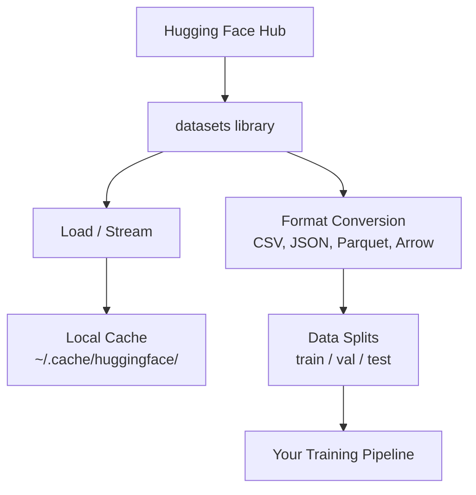

# Gestão de dados

> Os dados são o combustível, e a forma como os gerenciamos determina a velocidade.

**Type:** Build
**Language:**Python
**Prerequisites:** Phase 0, Lesson 01
**Time:** ~45 minutes

## Objetivos de aprendizagem

- Carregar, fluir e cache conjuntos de dados usando o abraço Face `datasets`biblioteca
- Converte entre os formatos CSV, JSON, Parquet e Arrow e explique suas compensações
- Criar divisões de treinamento/validação/teste reprodutíveis com sementes aleatórias fixas
- Gerenciar arquivos de modelos e conjuntos de dados grandes usando `.gitignore`, Git LFS ou DVC

## O problema

Todos os projetos de IA começam com dados. Você precisa encontrar conjuntos de dados, baixá-los, converter entre formatos, dividir-los para treinamento e avaliação, e versá-los para que as experiências sejam reprodutíveis. Fazer isso manualmente a cada vez é lento e propenso a erros. Você precisa de um fluxo de trabalho repetível.

## O conceito



O rosto abraçador`datasets`A biblioteca é a forma padrão de carregar dados para trabalho de IA.

```figure
s0-data-pipeline
```

## Construí-lo

### Passo 1: Instale a biblioteca de conjuntos de dados

```bash
pip install datasets huggingface_hub
```

### Passo 2: Carregar um conjunto de dados

```python
from datasets import load_dataset

dataset = load_dataset("stanfordnlp/imdb")
print(dataset)
print(dataset["train"][0])
```

Isto descarrega o conjunto de dados de revisão de filmes do IMDB. Após o primeiro download, ele carrega do cache em `~/.cache/huggingface/datasets/`- Não .

### Passo 3: Transmissão de grandes conjuntos de dados

Alguns conjuntos de dados são grandes demais para caber no disco.

```python
dataset = load_dataset("wikimedia/wikipedia", "20220301.en", split="train", streaming=True)

for i, example in enumerate(dataset):
    print(example["title"])
    if i >= 4:
        break
```

O streaming dá-te um `IterableDataset`O uso de memória permanece constante independentemente do tamanho do conjunto de dados.

### Passo 4: Formatos de conjuntos de dados

O `datasets`A biblioteca usa a seta Apache sob o capô. Você pode converter para outros formatos dependendo do que seu pipeline precisa.

```python
dataset = load_dataset("stanfordnlp/imdb", split="train")

dataset.to_csv("imdb_train.csv")
dataset.to_json("imdb_train.json")
dataset.to_parquet("imdb_train.parquet")
```

Comparador de formato:

| Format | Size | Read Speed | Best For |
|--------|------|-----------|----------|
| CSV | Large | Slow | Human readability, spreadsheets |
| JSON | Large | Slow | APIs, nested data |
| Parquet | Small | Fast | Analytics, columnar queries |
| Arrow | Small | Fastest | In-memory processing (what `datasets` uses internally) |

Para o trabalho de IA, o Parquet é o melhor formato de armazenamento. Arrow é o que você trabalha na memória. CSV e JSON são para intercâmbio.

### Passo 5: Divisão de dados

Cada projeto de ML precisa de três divisões:

- **Train**O modelo aprende disso (normalmente 80%)
- **Validation**• Verificar os progressos durante o treino (normalmente 10%)
- **Test**: Avaliação final após a formação (normalmente 10%)

Alguns conjuntos de dados são pré-divididos, quando não são, dividi-os tu mesmo.

```python
dataset = load_dataset("stanfordnlp/imdb", split="train")

split = dataset.train_test_split(test_size=0.2, seed=42)
train_val = split["train"].train_test_split(test_size=0.125, seed=42)

train_ds = train_val["train"]
val_ds = train_val["test"]
test_ds = split["test"]

print(f"Train: {len(train_ds)}, Val: {len(val_ds)}, Test: {len(test_ds)}")
```

Sempre fique uma semente para a reprodução.

### Passo 6: Modelos de download e cache

Os modelos são arquivos grandes.`huggingface_hub`As bibliotecas controlam o download e o armazenamento em cache.

```python
from huggingface_hub import hf_hub_download, snapshot_download

model_path = hf_hub_download(
    repo_id="sentence-transformers/all-MiniLM-L6-v2",
    filename="config.json"
)
print(f"Cached at: {model_path}")

model_dir = snapshot_download("sentence-transformers/all-MiniLM-L6-v2")
print(f"Full model at: {model_dir}")
```

Modelos em cache para `~/.cache/huggingface/hub/`Uma vez baixados, carregam-se instantaneamente nas corridas subsequentes.

### Passo 7: Manusear arquivos grandes

Os modelos de peso e grandes conjuntos de dados não devem entrar em git.

**Option A: .gitignore (simplest)**

```
*.bin
*.safetensors
*.pt
*.onnx
data/*.parquet
data/*.csv
models/
```

**Option B: Git LFS (track large files in git)**

```bash
git lfs install
git lfs track "*.bin"
git lfs track "*.safetensors"
git add .gitattributes
```

O Git LFS armazena os indicadores no seu repo e os arquivos reais em um servidor separado. GitHub dá-lhe 1 GB gratuitamente.

**Option C: DVC (data version control)**

```bash
pip install dvc
dvc init
dvc add data/training_set.parquet
git add data/training_set.parquet.dvc data/.gitignore
git commit -m "Track training data with DVC"
```

DVC cria pequenos`.dvc`Os dados vivem em S3, GCS ou outro backend de armazenamento remoto.

| Approach | Complexity | Best For |
|----------|-----------|----------|
| .gitignore | Low | Personal projects, downloaded data you can re-fetch |
| Git LFS | Medium | Teams sharing model weights via git |
| DVC | High | Reproducible experiments, large datasets, teams |

Para este curso,`.gitignore`Use DVC quando precisar de reproduzir experiências exatas em máquinas.

### Passo 8: padrões de armazenamento

**Local storage**funciona para conjuntos de dados com menos de 10 GB. O cache HF lida com isso automaticamente.

**Cloud storage**é para qualquer coisa maior ou compartilhada entre máquinas:

```python
import os

local_path = os.path.expanduser("~/.cache/huggingface/datasets/")

# s3_path = "s3://my-bucket/datasets/"
# gcs_path = "gs://my-bucket/datasets/"
```

DVC integra-se diretamente com S3 e GCS:

```bash
dvc remote add -d myremote s3://my-bucket/dvc-store
dvc push
```

Para este curso, o armazenamento local é suficiente.

## Dados utilizados neste curso

| Dataset | Lessons | Size | What It Teaches |
|---------|---------|------|----------------|
| IMDB | Tokenization, classification | 84 MB | Text classification basics |
| WikiText | Language modeling | 181 MB | Next-token prediction |
| SQuAD | QA systems | 35 MB | Question answering, spans |
| Common Crawl (subset) | Embeddings | Varies | Large-scale text processing |
| MNIST | Vision basics | 21 MB | Image classification fundamentals |
| COCO (subset) | Multimodal | Varies | Image-text pairs |

Não é preciso fazer download de todas estas coisas agora, cada lição especifica o que é necessário.

## Usá-lo

Execute o script de utilidade para verificar que tudo funciona:

```bash
python code/data_utils.py
```

Este descarrega um pequeno conjunto de dados, converte-o, divide-o e imprime um resumo.

## Envia-o

Esta lição produz:
- `code/data_utils.py`- Utilidade de carregamento e armazenamento em cache de dados reutilizáveis
- `outputs/prompt-data-helper.md`- de forma rápida para encontrar o conjunto de dados adequado para uma tarefa

## Exercícios

1. Carregar o `glue`conjunto de dados com o `mrpc`Configurar e inspecionar os primeiros 5 exemplos
2. Transmitir o `c4`conjunto de dados e contar quantos exemplos você pode processar em 10 segundos
3. Converte um conjunto de dados para Parquet e compare o tamanho do arquivo para CSV
4. Criar uma divisão de trens/val/teste 70/15/15 com uma semente fixa e verificar os tamanhos

## Termos-chave

| Term | What people say | What it actually means |
|------|----------------|----------------------|
| Dataset split | "Training data" | A named subset (train/val/test) used at different stages of the ML lifecycle |
| Streaming | "Load it lazily" | Processing data row by row from a remote source without downloading the full dataset |
| Parquet | "Compressed CSV" | A columnar file format optimized for analytical queries and storage efficiency |
| Arrow | "Fast dataframe" | An in-memory columnar format used internally by the datasets library for zero-copy reads |
| Git LFS | "Git for big files" | An extension that stores large files outside the git repo while keeping pointers in version control |
| DVC | "Git for data" | A version control system for datasets and models that integrates with cloud storage |
| Cache | "Already downloaded" | A local copy of previously fetched data, stored at ~/.cache/huggingface/ by default |
