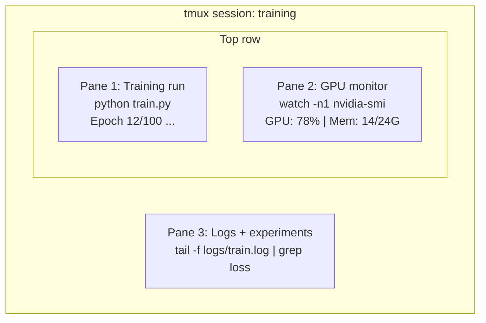

# Terminal & Shell

> O terminal é onde vivem os engenheiros de IA.

**Type:** Learn
**Languages:** --
**Prerequisites:** Phase 0, Lesson 01
**Time:** ~35 minutes

## Objetivos de aprendizagem

- Usar tubos, redireções e `grep`Filtrar e processar os registos de treinamento a partir da linha de comando
- Criar sessões persistentes de tmux com vários painéis para treinamento simultâneo e monitoramento de GPU
- Monitorar os recursos do sistema e da GPU com `htop`- Não .`nvtop`, e `nvidia-smi`
- Transferência de arquivos entre máquinas locais e remotas usando SSH, `scp`, e `rsync`

## O problema

Você vai passar mais tempo no terminal do que em qualquer editor. Treinamento, monitoramento de GPU, log tailing, sessões remotas de SSH, gestão do ambiente. Cada fluxo de trabalho de IA toca a concha. Se você é lento aqui, você é lento em todos os lugares.

Esta lição abrange as habilidades terminais que importam para o trabalho da IA, sem história do Unix, sem mergulho profundo no scripting Bash, apenas o que você precisa.

## O conceito



Três coisas a correr ao mesmo tempo, um terminal, podes desligar, ir para casa, voltar para dentro e ligar novamente.

```figure
s0-shell-pipeline
```

## Construí-lo

### Passo 1: Conheça a sua concha

Verifique qual arma está a executar.

```bash
echo $SHELL
```

A maioria dos sistemas usa`bash`ou `zsh`Ambos funcionam bem, os comandos neste curso funcionam em ambos.

Coisas-chave para saber:

```bash
# Move around
cd ~/projects/ai-engineering-from-scratch
pwd
ls -la

# History search (most useful shortcut you'll learn)
# Ctrl+R then type part of a previous command
# Press Ctrl+R again to cycle through matches

# Clear terminal
clear   # or Ctrl+L

# Cancel a running command
# Ctrl+C

# Suspend a running command (resume with fg)
# Ctrl+Z
```

### Passo 2: Escanamento e redirecionamento

O piping conecta comandos juntos. É assim que você processa registros, saída de filtros e ferramentas de cadeia. Você usará isso constantemente.

```bash
# Count how many times "loss" appears in a log
cat train.log | grep "loss" | wc -l

# Extract just the loss values from training output
grep "loss:" train.log | awk '{print $NF}' > losses.txt

# Watch a log file update in real time, filtering for errors
tail -f train.log | grep --line-buffered "ERROR"

# Sort experiments by final accuracy
grep "final_accuracy" results/*.log | sort -t= -k2 -n -r

# Redirect stdout and stderr to separate files
python train.py > output.log 2> errors.log

# Redirect both to the same file
python train.py > train_full.log 2>&1
```

Os três redirecionamentos que precisas:

| Symbol | What it does |
|--------|-------------|
| `>` | Write stdout to file (overwrite) |
| `>>` | Append stdout to file |
| `2>` | Write stderr to file |
| `2>&1` | Send stderr to same place as stdout |
| `\|` | Send stdout of one command as stdin to the next |

### Passo 3: Processos de antecedência

O treino leva horas, não queres manter o terminal aberto o tempo todo.

```bash
# Run in background (output still goes to terminal)
python train.py &

# Run in background, immune to hangup (closing terminal won't kill it)
nohup python train.py > train.log 2>&1 &

# Check what's running in background
jobs
ps aux | grep train.py

# Bring a background job to foreground
fg %1

# Kill a background process
kill %1
# or find its PID and kill that
kill $(pgrep -f "train.py")
```

A diferença entre `&`- Não .`nohup`, e `screen`- Não .`tmux`- Não .

| Method | Survives terminal close? | Can reattach? |
|--------|-------------------------|---------------|
| `command &` | No | No |
| `nohup command &` | Yes | No (check log file) |
| `screen` / `tmux` | Yes | Yes |

Para qualquer coisa que dure mais de alguns minutos, use tmux.

### Passo 4: tmux

O tmux permite criar sessões terminais persistentes com vários painéis.

```bash
# Install
# macOS
brew install tmux
# Ubuntu
sudo apt install tmux

# Start a named session
tmux new -s training

# Split horizontally
# Ctrl+B then "

# Split vertically
# Ctrl+B then %

# Navigate between panes
# Ctrl+B then arrow keys

# Detach (session keeps running)
# Ctrl+B then d

# Reattach
tmux attach -t training

# List sessions
tmux ls

# Kill a session
tmux kill-session -t training
```

Uma sessão típica de fluxo de trabalho de IA:

```bash
tmux new -s train

# Pane 1: start training
python train.py --epochs 100 --lr 1e-4

# Ctrl+B, " to split, then run GPU monitor
watch -n1 nvidia-smi

# Ctrl+B, % to split vertically, tail the logs
tail -f logs/experiment.log

# Now detach with Ctrl+B, d
# SSH out, go get coffee, come back
# tmux attach -t train
```

### Passo 5: Monitorização com htop e nvtop

```bash
# System processes (better than top)
htop

# GPU processes (if you have NVIDIA GPU)
# Install: sudo apt install nvtop (Ubuntu) or brew install nvtop (macOS)
nvtop

# Quick GPU check without nvtop
nvidia-smi

# Watch GPU usage update every second
watch -n1 nvidia-smi

# See which processes are using the GPU
nvidia-smi --query-compute-apps=pid,name,used_memory --format=csv
```

`htop`- Telas que usará:
- `F6`ou `>`para classificar por coluna (classificar por memória para encontrar vazamentos de memória)
- `F5`para alterar a visão de árvore (ver processos de crianças)
- `F9`para matar um processo
- `/`para procurar um nome de processo

### Passo 6: SSH para caixas remotas de GPU

Quando aluga uma GPU em nuvem (Lambda, RunPod, Vast.ai), conecta-se através de SSH.

```bash
# Basic connection
ssh user@gpu-box-ip

# With a specific key
ssh -i ~/.ssh/my_gpu_key user@gpu-box-ip

# Copy files to remote
scp model.pt user@gpu-box-ip:~/models/

# Copy files from remote
scp user@gpu-box-ip:~/results/metrics.json ./

# Sync a whole directory (faster for many files)
rsync -avz ./data/ user@gpu-box-ip:~/data/

# Port forward (access remote Jupyter/TensorBoard locally)
ssh -L 8888:localhost:8888 user@gpu-box-ip
# Now open localhost:8888 in your browser

# SSH config for convenience
# Add to ~/.ssh/config:
# Host gpu
#     HostName 192.168.1.100
#     User ubuntu
#     IdentityFile ~/.ssh/gpu_key
#
# Then just:
# ssh gpu
```

### Passo 7: Alias úteis para o trabalho da IA

Adicione isto à sua .`~/.bashrc`ou `~/.zshrc`- Não .

```bash
source phases/00-setup-and-tooling/10-terminal-and-shell/code/shell_aliases.sh
```

Ou copiar as que quiser.

```bash
# GPU status at a glance
alias gpu='nvidia-smi --query-gpu=index,name,utilization.gpu,memory.used,memory.total,temperature.gpu --format=csv,noheader'

# Kill all Python training processes
alias killtraining='pkill -f "python.*train"'

# Quick virtual environment activate
alias ae='source .venv/bin/activate'

# Watch training loss
alias watchloss='tail -f logs/*.log | grep --line-buffered "loss"'
```

Veja .`code/shell_aliases.sh`Para o conjunto completo.

### Passo 8: Padrões de terminais comuns de IA

Estes aparecem repetidamente na prática:

```bash
# Run training, log everything, notify when done
python train.py 2>&1 | tee train.log; echo "DONE" | mail -s "Training complete" you@email.com

# Compare two experiment logs side by side
diff <(grep "accuracy" exp1.log) <(grep "accuracy" exp2.log)

# Find the largest model files (clean up disk space)
find . -name "*.pt" -o -name "*.safetensors" | xargs du -h | sort -rh | head -20

# Download a model from Hugging Face
wget https://huggingface.co/model/resolve/main/model.safetensors

# Untar a dataset
tar xzf dataset.tar.gz -C ./data/

# Count lines in all Python files (see how big your project is)
find . -name "*.py" | xargs wc -l | tail -1

# Check disk space (training data fills disks fast)
df -h
du -sh ./data/*

# Environment variable check before training
env | grep -i cuda
env | grep -i torch
```

## Usá-lo

Aqui está quando cada ferramenta entra em jogo durante este curso:

| Tool | When you use it |
|------|----------------|
| tmux | Every training run (Phases 3+) |
| `tail -f` + `grep` | Monitoring training logs |
| `nohup` / `&` | Quick background tasks |
| `htop` / `nvtop` | Debugging slow training, OOM errors |
| SSH + `rsync` | Working on cloud GPUs |
| Piping + redirects | Processing experiment results |
| Aliases | Saving time on repetitive commands |

## Exercícios

1. Instale tmux, crie uma sessão com três painéis e execute `htop`em um,`watch -n1 date`Em outro, e um script Python no terceiro.
2. Adicione os alias de `code/shell_aliases.sh`Para a sua concha configurar e recarregá-lo com `source ~/.zshrc`(ou `~/.bashrc`)).
3. Criar um registro de treinamento falso com `for i in $(seq 1 100); do echo "epoch $i loss: $(echo "scale=4; 1/$i" | bc)"; sleep 0.1; done > fake_train.log`e depois usar `grep`- Não .`tail`, e `awk`Para extrair apenas os valores de perda.
4. Configurar uma entrada de configuração SSH para um servidor que você tem acesso (ou utiliza `localhost`Para praticar a sintaxe).

## Termos-chave

| Term | What people say | What it actually means |
|------|----------------|----------------------|
| Shell | "The terminal" | The program that interprets your commands (bash, zsh, fish) |
| tmux | "Terminal multiplexer" | A program that lets you run multiple terminal sessions inside one window, and detach/reattach |
| Pipe | "The bar thing" | The `\|` operator that sends one command's output as input to another |
| PID | "Process ID" | A unique number assigned to every running process, used to monitor or kill it |
| nohup | "No hangup" | Runs a command immune to the hangup signal, so closing the terminal won't kill it |
| SSH | "Connecting to the server" | Secure Shell, an encrypted protocol for running commands on a remote machine |
