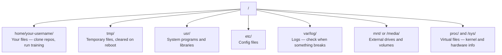

# Linux para IA

> A maior parte da IA funciona no Linux.

**Type:** Learn
**Languages:** --
**Prerequisites:** Phase 0, Lesson 01
**Time:** ~30 minutes

## Objetivos de aprendizagem

- Navegue no sistema de arquivos Linux e execute operações de arquivos essenciais a partir da linha de comando
- Gerenciar permissões de arquivo com `chmod`E ...`chown`Para resolver os erros "Permissão negada"
- Instalar pacotes de sistema com `apt`e configurar uma caixa de GPU nova para o trabalho de IA
- Identificar diferenças entre macOS e Linux que geralmente atrapalham os desenvolvedores que trabalham em máquinas remotas

## O problema

Desenvolve-se no macOS ou no Windows. Mas no momento em que você entra numa caixa de GPU em nuvem, aluga uma instância Lambda, ou roda uma máquina EC2, você entra no Ubuntu. O terminal é a sua única interface. Não há Finder, não há Explorer, não há interface gráfica. Se não conseguir navegar pelo sistema de arquivos, instalar pacotes e gerenciar processos a partir da linha de comando, fica preso a pagar por horas de GPU inativas enquanto procura no Google "como deslizar um arquivo no Linux".

Este é um guia de sobrevivência. cobre exatamente o que você precisa para operar em uma máquina Linux remota para o trabalho da IA. Nada mais.

## Layout do sistema de arquivos

O Linux organiza tudo sob uma única raiz .`/`Não há .`C:\`ou `/Volumes`Os diretórios que realmente tocarão:



O seu diretório de casa é`~`ou `/home/your-username`Quase tudo o que fazemos acontece aqui.

## Mandamentos Essenciais

Estes são os 15 comandos que cobrem 95% do que você fará em uma caixa de GPU remota.

### Movendo-se

```bash
pwd                         # Where am I?
ls                          # What's here?
ls -la                      # What's here, including hidden files with details?
cd /path/to/dir             # Go there
cd ~                        # Go home
cd ..                       # Go up one level
```

### Arquivos e diretórios

```bash
mkdir my-project            # Create a directory
mkdir -p a/b/c              # Create nested directories in one shot

cp file.txt backup.txt      # Copy a file
cp -r src/ src-backup/      # Copy a directory (recursive)

mv old.txt new.txt          # Rename a file
mv file.txt /tmp/           # Move a file

rm file.txt                 # Delete a file (no trash, it's gone)
rm -rf my-dir/              # Delete a directory and everything inside
```

`rm -rf`Não há desfecho, verifique o caminho antes de entrar.

### Leitura de arquivos

```bash
cat file.txt                # Print entire file
head -20 file.txt           # First 20 lines
tail -20 file.txt           # Last 20 lines
tail -f log.txt             # Follow a log file in real time (Ctrl+C to stop)
less file.txt               # Scroll through a file (q to quit)
```

### Buscar

```bash
grep "error" training.log           # Find lines containing "error"
grep -r "learning_rate" .           # Search all files in current directory
grep -i "cuda" config.yaml          # Case-insensitive search

find . -name "*.py"                 # Find all Python files under current dir
find . -name "*.ckpt" -size +1G     # Find checkpoint files larger than 1GB
```

## Permissões

Todos os arquivos no Linux têm um proprietário e bits de permissão. Você vai encontrar isto quando os scripts não executam ou você não pode escrever para um diretório.

```bash
ls -l train.py
# -rwxr-xr-- 1 user group 2048 Mar 19 10:00 train.py
#  ^^^             owner permissions: read, write, execute
#     ^^^          group permissions: read, execute
#        ^^        everyone else: read only
```

Correções comuns:

```bash
chmod +x train.sh           # Make a script executable
chmod 755 deploy.sh         # Owner: full, others: read+execute
chmod 644 config.yaml       # Owner: read+write, others: read only

chown user:group file.txt   # Change who owns a file (needs sudo)
```

Quando algo diz "Permissão negada", é quase sempre uma questão de permissões.`chmod +x`ou `sudo`Vai resolver a maioria dos casos.

## Gestão de pacotes (apto)

Utilizações do Ubuntu`apt`É assim que instalas software de nível de sistema.

```bash
sudo apt update             # Refresh the package list (always do this first)
sudo apt install -y htop    # Install a package (-y skips confirmation)
sudo apt install -y build-essential  # C compiler, make, etc. Needed by many Python packages
sudo apt install -y tmux    # Terminal multiplexer (keep sessions alive after disconnect)

apt list --installed        # What's installed?
sudo apt remove htop        # Uninstall
```

Pacotes comuns que você vai instalar em uma caixa de GPU nova:

```bash
sudo apt update && sudo apt install -y \
    build-essential \
    git \
    curl \
    wget \
    tmux \
    htop \
    unzip \
    python3-venv
```

## Usuários e sudo

Normalmente, você está ligado como usuário regular. Algumas operações precisam de acesso root (admin).

```bash
whoami                      # What user am I?
sudo command                # Run a single command as root
sudo su                     # Become root (exit to go back, use sparingly)
```

Em instâncias de GPU em nuvem, você é normalmente o único usuário e já tem acesso ao sudo. Não execute tudo como root. Use sudo apenas quando necessário.

## Processos e sistemas

Quando o teu treinamento está pendurado, ou precisas de verificar o que está a correr:

```bash
htop                        # Interactive process viewer (q to quit)
ps aux | grep python        # Find running Python processes
kill 12345                  # Gracefully stop process with PID 12345
kill -9 12345               # Force kill (use when graceful doesn't work)
nvidia-smi                  # GPU processes and memory usage
```

sistemad gerencia serviços (daemons de fundo). Você vai usá-lo se executar servidores de inferência:

```bash
sudo systemctl start nginx          # Start a service
sudo systemctl stop nginx           # Stop it
sudo systemctl restart nginx        # Restart it
sudo systemctl status nginx         # Check if it's running
sudo systemctl enable nginx         # Start automatically on boot
```

## Espaço no disco

As caixas de GPU muitas vezes têm espaço limitado no disco.

```bash
df -h                       # Disk usage for all mounted drives
df -h /home                 # Disk usage for /home specifically

du -sh *                    # Size of each item in current directory
du -sh ~/.cache             # Size of your cache (pip, huggingface models land here)
du -sh /data/checkpoints/   # Check how big your checkpoints are

# Find the biggest space hogs
du -h --max-depth=1 / 2>/dev/null | sort -hr | head -20
```

Salvadores de espaço comuns:

```bash
# Clear pip cache
pip cache purge

# Clear apt cache
sudo apt clean

# Remove old checkpoints you don't need
rm -rf checkpoints/epoch_01/ checkpoints/epoch_02/
```

## Rede

Você vai baixar modelos, transferir arquivos e acessar APIs a partir da linha de comando.

```bash
# Download files
wget https://example.com/model.bin                   # Download a file
curl -O https://example.com/data.tar.gz              # Same thing with curl
curl -s https://api.example.com/health | python3 -m json.tool  # Hit an API, pretty-print JSON

# Transfer files between machines
scp model.bin user@remote:/data/                     # Copy file to remote machine
scp user@remote:/data/results.csv .                  # Copy file from remote to local
scp -r user@remote:/data/checkpoints/ ./local-dir/   # Copy directory

# Sync directories (faster than scp for large transfers, resumes on failure)
rsync -avz --progress ./data/ user@remote:/data/
rsync -avz --progress user@remote:/results/ ./results/
```

Utilização`rsync`- Não .`scp`Ele só transfere bytes alterados e lida com conexões interrompidas.

## Mantenha as sessões vivas

Quando você entra num dispositivo remoto, fechar o seu laptop mata a sua corrida de treinamento.

```bash
tmux new -s train           # Start a new session named "train"
# ... start your training, then:
# Ctrl+B, then D            # Detach (training keeps running)

tmux ls                     # List sessions
tmux attach -t train        # Reattach to session

# Inside tmux:
# Ctrl+B, then %            # Split pane vertically
# Ctrl+B, then "            # Split pane horizontally
# Ctrl+B, then arrow keys   # Switch between panes
```

Sempre trabalha longos treinamentos dentro de um "tmux".

## WSL2 para usuários do Windows

Se estiveres no Windows, o WSL2 dá-te um ambiente Linux real sem dual-booting.

```bash
# In PowerShell (admin)
wsl --install -d Ubuntu-24.04

# After restart, open Ubuntu from Start menu
sudo apt update && sudo apt upgrade -y
```

O WSL2 executa um kernel Linux real. Tudo nesta lição funciona dentro dele. Os seus arquivos do Windows estão em`/mnt/c/Users/YourName/`do interior da WSL.

A GPU passa através de funciona com drivers NVIDIA instalados no lado do Windows. Instale o driver NVIDIA do Windows (não o Linux), e CUDA estará disponível dentro do WSL2.

## Gotchas: macOS para Linux

Coisas que te vão tropeçar se estiveres a vir do macOS:

| macOS | Linux | Notes |
|-------|-------|-------|
| `brew install` | `sudo apt install` | Different package names sometimes. `brew install htop` vs `sudo apt install htop` works the same, but `brew install readline` vs `sudo apt install libreadline-dev` does not. |
| `open file.txt` | `xdg-open file.txt` | But you won't have a GUI on a remote box. Use `cat` or `less`. |
| `pbcopy` / `pbpaste` | Not available | Pipe to/from clipboard doesn't exist over SSH. |
| `~/.zshrc` | `~/.bashrc` | macOS defaults to zsh. Most Linux servers use bash. |
| `/opt/homebrew/` | `/usr/bin/`, `/usr/local/bin/` | Binaries live in different places. |
| `sed -i '' 's/a/b/' file` | `sed -i 's/a/b/' file` | macOS sed needs an empty string after `-i`. Linux does not. |
| Case-insensitive filesystem | Case-sensitive filesystem | `Model.py` and `model.py` are two different files on Linux. |
| Line endings `\n` | Line endings `\n` | Same. But Windows uses `\r\n`, which breaks bash scripts. Run `dos2unix` to fix. |

## Cartão de referência rápido

```
Navigation:     pwd, ls, cd, find
Files:          cp, mv, rm, mkdir, cat, head, tail, less
Search:         grep, find
Permissions:    chmod, chown, sudo
Packages:       apt update, apt install
Processes:      htop, ps, kill, nvidia-smi
Services:       systemctl start/stop/restart/status
Disk:           df -h, du -sh
Network:        curl, wget, scp, rsync
Sessions:       tmux new/attach/detach
```

```figure
s0-process-fork
```

## Exercícios

1. SSH em qualquer máquina Linux (ou abrir WSL2) e navegar para o seu diretório de casa. Crie uma pasta de projeto, crie três arquivos vazios dentro dele com `touch`, então lista-os com `ls -la`- Não .
2. Instalação`htop`com apt, execute-o e identifique qual processo está a usar mais memória.
3. Comece uma sessão de tmux, corre.`sleep 300`dentro dele, desligar, fazer uma lista de sessões e religar.
4. Utilização`df -h`para verificar o espaço disponível no disco, em seguida, use `du -sh ~/.cache/*`Para encontrar o que ocupa espaço no teu cache.
5. Transferir um arquivo de sua máquina local para um remoto usando `scp`, então faça a mesma transferência com `rsync`e comparar a experiência.
