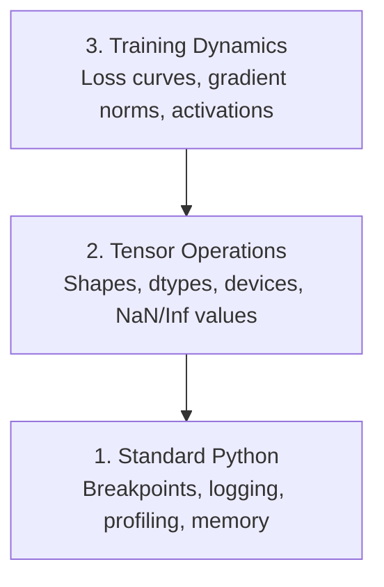

# Desembaraçamento e Profilagem

> Os piores bugs da IA não caem, treinam silenciosamente no lixo e relatam uma bela curva de perdas.

**Type:** Build
**Language:**Python
**Prerequisites:** Lesson 1 (Dev Environment), basic PyTorch familiarity
**Time:** ~60 minutes

## Objetivos de aprendizagem

- Use condicional `breakpoint()`E ...`debug_print`para inspecionar as formas, os tipos e os valores de tensor NaN no meio do treino
- Loops de treinamento de perfil com `cProfile`- Não .`line_profiler`, e `tracemalloc`para encontrar gargalos de engarrafamento
- Detectar bugs comuns da IA: desajustes de forma, perda de NaN, vazamento de dados e tensores de dispositivo errado
- Configure TensorBoard para visualizar curvas de perda, histogramas de peso e distribuições de gradientes

## O problema

O código da IA falha de forma diferente do código normal. Um aplicativo web cai com um rastreamento de pilha. Um ciclo de treinamento mal configurado funciona por 8 horas, queima $ 200 em tempo de GPU e produz um modelo que prevê a média de cada entrada. O código nunca errou. O bug foi um tensor no dispositivo errado, um esquecido.`.detach()`, ou rótulos que vazam para as características.

Precisas de ferramentas de depuração que captam estas falhas silenciosas antes que desperdicem o teu tempo e computação.

## O conceito

A desativação da IA opera em três níveis:



A maioria das pessoas salta para o nível 3 (olhando para TensorBoard). Mas 80% dos bugs da IA vivem nos níveis 1 e 2.

```figure
s0-flame-hot
```

## Construí-lo

### Parte 1: Desembaçamento de impressão (Sim, funciona)

Para o código tensor, uma instrução de impressão direcionada é melhor do que passar por um depurador porque você precisa ver formas, tipos e intervalos de valores de uma só vez.

```python
def debug_print(name, tensor):
    print(f"{name}: shape={tensor.shape}, dtype={tensor.dtype}, "
          f"device={tensor.device}, "
          f"min={tensor.min().item():.4f}, max={tensor.max().item():.4f}, "
          f"mean={tensor.mean().item():.4f}, "
          f"has_nan={tensor.isnan().any().item()}")
```

Liga-nos depois de cada operação suspeita, e quando o bug for encontrado, remova as impressões digitais.

### Parte 2: Python Debugger (pdb e ponto de ruptura)

O depurador embuído é subestimado para o trabalho da IA.`breakpoint()`Entrem no seu ciclo de treinamento e inspecionem os tensores de forma interativa.

```python
def training_step(model, batch, criterion, optimizer):
    inputs, labels = batch
    outputs = model(inputs)
    loss = criterion(outputs, labels)

    if loss.item() > 100 or torch.isnan(loss):
        breakpoint()

    loss.backward()
    optimizer.step()
```

Quando o depurador o deixa entrar, comandos úteis:

- `p outputs.shape`para verificar as formas
- `p loss.item()`Para ver o valor da perda
- `p torch.isnan(outputs).sum()`para contar os NAN
- `p model.fc1.weight.grad`para verificar os gradientes
- `c`Continuar,`q`para desistir

Isto é depuração condicional, só se pára quando algo parece errado, para uma corrida de treinamento de 10.000 passos, isso importa.

### Parte 3: Logging Python

Substitua as instruções de impressão por registos quando o seu depuração excede uma verificação rápida.

```python
import logging

logging.basicConfig(
    level=logging.INFO,
    format="%(asctime)s [%(levelname)s] %(message)s",
    handlers=[
        logging.FileHandler("training.log"),
        logging.StreamHandler()
    ]
)
logger = logging.getLogger(__name__)

logger.info("Starting training: lr=%.4f, batch_size=%d", lr, batch_size)
logger.warning("Loss spike detected: %.4f at step %d", loss.item(), step)
logger.error("NaN loss at step %d, stopping", step)
```

A registrosagem dá-lhe marcas de tempo, níveis de gravidade e saída de arquivo. Quando uma execução de treinamento falha às 3 da manhã, você quer um arquivo de registro, não uma saída terminal que deslize a tela.

### Parte 4: Seções de Código de Tempo

Saber onde vai o tempo é o primeiro passo para a otimização.

```python
import time

class Timer:
    def __init__(self, name=""):
        self.name = name

    def __enter__(self):
        self.start = time.perf_counter()
        return self

    def __exit__(self, *args):
        elapsed = time.perf_counter() - self.start
        print(f"[{self.name}] {elapsed:.4f}s")

with Timer("data loading"):
    batch = next(dataloader_iter)

with Timer("forward pass"):
    outputs = model(batch)

with Timer("backward pass"):
    loss.backward()
```

A conclusão comum é que a carga de dados demora 60% do tempo de formação.`num_workers > 0`no seu DataLoader, não numa GPU mais rápida.

### Parte 5: cProfil e line_profil

Quando precisar de mais do que temporizadores manuais:

```bash
python -m cProfile -s cumtime train.py
```

Isto mostra cada chamada de função ordenada por tempo cumulativo.

```bash
pip install line_profiler
```

```python
@profile
def train_step(model, data, target):
    output = model(data)
    loss = F.cross_entropy(output, target)
    loss.backward()
    return loss

# Run with: kernprof -l -v train.py
```

### Parte 6: Profilagem da memória

#### Memória de CPU com tracemalloc

```python
import tracemalloc

tracemalloc.start()

# your code here
model = build_model()
data = load_dataset()

snapshot = tracemalloc.take_snapshot()
top_stats = snapshot.statistics("lineno")
for stat in top_stats[:10]:
    print(stat)
```

#### Memória de CPU com memória_profil

```bash
pip install memory_profiler
```

```python
from memory_profiler import profile

@profile
def load_data():
    raw = read_csv("data.csv")       # watch memory jump here
    processed = preprocess(raw)       # and here
    return processed
```

Corra com `python -m memory_profiler your_script.py`para ver o uso de memória linha por linha.

#### Memória GPU com PyTorch

```python
import torch

if torch.cuda.is_available():
    print(torch.cuda.memory_summary())

    print(f"Allocated: {torch.cuda.memory_allocated() / 1e9:.2f} GB")
    print(f"Cached: {torch.cuda.memory_reserved() / 1e9:.2f} GB")
```

Quando você tocar OOM (Out of Memory):

1. Reduzir o tamanho do lote (primeira coisa a tentar, sempre)
2. Utilização`torch.cuda.empty_cache()`para liberar a memória em cache
3. Utilização`del tensor`seguida por `torch.cuda.empty_cache()`para grandes intermediários
4. Utilize precisão mista (`torch.cuda.amp`) para reduzir ao meio o uso de memória
5. Utilize o ponto de controlo de gradientes para modelos muito profundos

### Parte 7: Bugs comuns de IA e como pegá-los

#### Desconformidade de forma

O bug mais frequente. Um tensor tem forma.`[batch, features]`Quando o modelo espera`[batch, channels, height, width]`- Não .

```python
def check_shapes(model, sample_input):
    print(f"Input: {sample_input.shape}")
    hooks = []

    def make_hook(name):
        def hook(module, inp, out):
            in_shape = inp[0].shape if isinstance(inp, tuple) else inp.shape
            out_shape = out.shape if hasattr(out, "shape") else type(out)
            print(f"  {name}: {in_shape} -> {out_shape}")
        return hook

    for name, module in model.named_modules():
        hooks.append(module.register_forward_hook(make_hook(name)))

    with torch.no_grad():
        model(sample_input)

    for h in hooks:
        h.remove()
```

Exerça isto uma vez com um lote de amostra.

#### Perda de N

A perda de NaN significa algo explodido.

- Taxa de aprendizagem muito alta
- Divisão por zero em perda aduaneira
- Registro de número zero ou negativo
- Gradientes explosivos em NNR

```python
def detect_nan(model, loss, step):
    if torch.isnan(loss):
        print(f"NaN loss at step {step}")
        for name, param in model.named_parameters():
            if param.grad is not None:
                if torch.isnan(param.grad).any():
                    print(f"  NaN gradient in {name}")
                if torch.isinf(param.grad).any():
                    print(f"  Inf gradient in {name}")
        return True
    return False
```

#### Fugas de dados

O teu modelo tem 99% de precisão no teste.

```python
def check_data_leakage(train_set, test_set, id_column="id"):
    train_ids = set(train_set[id_column].tolist())
    test_ids = set(test_set[id_column].tolist())
    overlap = train_ids & test_ids
    if overlap:
        print(f"DATA LEAKAGE: {len(overlap)} samples in both train and test")
        return True
    return False
```

Verifique também se há vazamento temporal: usando dados futuros para prever o passado.

#### Dispositivo errado

Tensores em diferentes dispositivos (CPU vs GPU) causam erros de execução. Mas às vezes um tensor permanece silenciosamente na CPU enquanto tudo o resto está na GPU, e o treinamento funciona lentamente.

```python
def check_devices(model, *tensors):
    model_device = next(model.parameters()).device
    print(f"Model device: {model_device}")
    for i, t in enumerate(tensors):
        if t.device != model_device:
            print(f"  WARNING: tensor {i} on {t.device}, model on {model_device}")
```

### Parte 8: Fundamentos do TensorBoard

TensorBoard mostra-lhe o que acontece dentro do treino ao longo do tempo.

```bash
pip install tensorboard
```

```python
from torch.utils.tensorboard import SummaryWriter

writer = SummaryWriter("runs/experiment_1")

for step in range(num_steps):
    loss = train_step(model, batch)

    writer.add_scalar("loss/train", loss.item(), step)
    writer.add_scalar("lr", optimizer.param_groups[0]["lr"], step)

    if step % 100 == 0:
        for name, param in model.named_parameters():
            writer.add_histogram(f"weights/{name}", param, step)
            if param.grad is not None:
                writer.add_histogram(f"grads/{name}", param.grad, step)

writer.close()
```

Lança:

```bash
tensorboard --logdir=runs
```

O que procurar:

- **Loss not decreasing**: Taxa de aprendizagem muito baixa ou problema de arquitetura de modelo
- **Loss oscillating wildly**: Taxa de aprendizagem demasiado elevada
- **Loss goes to NaN**: Instabilidade numérica (ver secção NaN acima)
- **Train loss decreasing, val loss increasing**: Super-ajustamento
- **Weight histograms collapsing to zero**: Gradientes desaparecendo
- **Gradient histograms exploding**: Precisa de cortes de gradiente

### Parte 9: Debugger de código VS

Para depuração interativa, configure o código VS com um `launch.json`- Não .

```json
{
    "version": "0.2.0",
    "configurations": [
        {
            "name": "Debug Training",
            "type": "debugpy",
            "request": "launch",
            "program": "${file}",
            "console": "integratedTerminal",
            "justMyCode": false
        }
    ]
}
```

Configure pontos de ruptura clicando no canal. Use o painel de variáveis para inspecionar as propriedades do tensor. O Console de depuração permite executar expressões arbitrárias do Python no meio da execução.

Útil para passar por canais de pré-processamento de dados onde você quer ver cada transformação.

## Usá-lo

Aqui está o fluxo de trabalho de depuração que capta a maioria dos bugs da IA:

1. **Before training**- Correr .`check_shapes`Verificar que as dimensões de entrada e saída correspondem às expectativas.
2. **First 10 steps**Utilização: `debug_print`Confirme que nada é NaN e os valores estão em intervalos razoáveis.
3. **During training**: Perda de registro, taxa de aprendizagem e normas de gradiente. Use TensorBoard para visualização.
4. **When something breaks**- Deixe cair .`breakpoint()`Inspeccionar os tensores de forma interativa.
5. **For performance**Tempo de carregamento de dados versus avanço versus passagem para trás. Memória de perfil se estiver perto de OOM.

## Envia-o

Execute o script de depuração do kit de ferramentas:

```bash
python phases/00-setup-and-tooling/12-debugging-and-profiling/code/debug_tools.py
```

Veja .`outputs/prompt-debug-ai-code.md`para um prompt que ajuda a diagnosticar bugs específicos da IA.

## Exercícios

1. Corra .`debug_tools.py`Modifique o modelo de manobra para introduzir um NaN (indicação: divide por zero na passagem para a frente) e observe o detector pegá-lo.
2. Profila um ciclo de treinamento com `cProfile`e identificar a função mais lenta.
3. Utilização`tracemalloc`para encontrar qual linha no seu pipeline de carga de dados atribui a maior memória.
4. Configure o TensorBoard para uma simples formação e identifique se o modelo está em excesso.
5. Utilização`breakpoint()`Exercício de inspecção de formas tensores, dispositivos e valores de gradiente a partir do prompt debugger.
