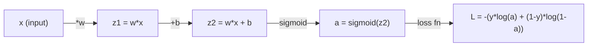
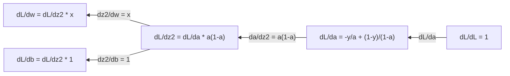
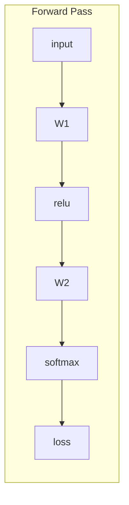
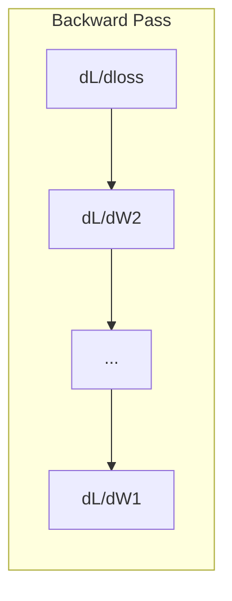

# Calculo para aprendizado de máquina

> Os derivados dizem qual é o caminho para baixo.

**Type:** Learn
**Language:**Python
**Prerequisites:** Phase 1, Lessons 01-03
**Time:** ~60 minutes

## Objetivos de aprendizagem

- Computação de derivados numéricos e analíticos para funções ML comuns (x^2, sigmoide, entropia cruzada)
- Implementar descida de gradiente a partir do zero para minimizar uma função de perda em 1D e 2D
- Derivar o gradiente de um modelo de regressão linear e treiná-lo através de atualizações manuais de peso
- Explique a matriz hessiana, as aproximações da série Taylor e sua conexão com os métodos de otimização

## O problema

Temos uma rede neural com milhões de pesos, cada peso é um botão, precisamos de descobrir em que direcção virar cada botão para que o modelo seja um pouco menos errado.

Sem cálculo, treinar uma rede neural significaria tentar mudanças aleatórias e esperar o melhor. com derivados, você sabe exatamente como cada peso afeta o erro.

## O conceito

### O que é uma derivada?

Uma derivada mede a taxa de mudança. Para uma função y = f(x), a derivada f'(x) diz-lhe: se você empurrar x por uma quantidade pequena, quanto muda y?

Geometricamente, a derivada é a inclinação da linha tangente em um ponto.

**f(x) = x^2:**

| x | f(x) | f'(x) (slope) |
|---|------|---------------|
| 0 | 0    | 0 (flat, at the bottom) |
| 1 | 1    | 2 |
| 2 | 4    | 4 (tangent line slope at this point) |
| 3 | 9    | 6 |

Se você mover x um pouco para a direita, y aumenta cerca de 4 vezes essa quantidade.

A definição formal:

```
f'(x) = lim   f(x + h) - f(x)
        h->0  -----------------
                     h
```

No código, você pular o limite e apenas usar uma pequena h. Isso é a derivada numérica.

### Derivados parciais: uma variável por vez

Funções reais têm muitas entradas. Uma perda de rede neural depende de milhares de pesos. Uma derivada parcial mantém todas as variáveis constantes exceto uma, então toma a derivada em relação a essa.

```
f(x, y) = x^2 + 3xy + y^2

df/dx = 2x + 3y     (treat y as a constant)
df/dy = 3x + 2y     (treat x as a constant)
```

Cada derivada parcial responde: se eu empurrar apenas este peso, como a perda muda?

### O gradiente: vetor de todas as derivadas parciais

O gradiente reúne todas as derivadas parciais em um vetor. Para uma função f ((x, y, z), o gradiente é:

```
grad f = [ df/dx, df/dy, df/dz ]
```

A gradiente aponta na direcção da ascensão mais íngreme.

**Contour plot of f(x,y) = x^2 + y^2:**

A função forma uma forma de tigela com círculos concêntricos como linhas de contorno.

| Point | grad f | -grad f (descent direction) |
|-------|--------|----------------------------|
| (1, 1) | [2, 2] (points uphill, away from minimum) | [-2, -2] (points downhill, toward minimum) |
| (0, 0) | [0, 0] (flat, at the minimum) | [0, 0] |

Isto é descida de gradiente numa imagem.

### A ligação à otimização

O treinamento de uma rede neural é otimização. Você tem uma função de perda L ((w1, w2, ..., wn) que mede o quão errado é o modelo. Você quer minimizá-lo.

```
Gradient descent update rule:

  w_new = w_old - learning_rate * dL/dw

For every weight:
  1. Compute the partial derivative of loss with respect to that weight
  2. Subtract a small multiple of it from the weight
  3. Repeat
```

A taxa de aprendizagem controla o tamanho dos passos, é grande demais e você supera, é pequeno demais e você rasteja.

**Loss landscape (1D slice):**

A função de perda L ((w) forma uma curva com picos e vales à medida que o peso w varia.

| Feature | Description |
|---------|-------------|
| Global minimum | The lowest point on the entire curve -- the best solution |
| Local minimum | A valley that is lower than its neighbors but not the lowest overall |
| Slope | Gradient descent follows the slope downhill from any starting point |

A descida gradual segue a inclinação para baixo. Pode ficar presa em mínimos locais, mas em espaços de alta dimensão (milhões de pesos) raramente é um problema prático.

### Derivados numéricos versus analíticos

Há duas maneiras de calcular uma derivada.

Analítica: aplicar as regras do cálculo à mão. Para f ((x) = x^2, a derivada é f ((x) = 2x. Exactamente. Rapido.

Numérica: aproximar usando a definição. Calcule f ((x+h) e f ((x-h) para uma pequena h, então use a diferença.

```
Numerical (central difference):

f'(x) ~= f(x + h) - f(x - h)
          -----------------------
                  2h

h = 0.0001 works well in practice
```

Os derivados numéricos são mais lentos, mas funcionam para qualquer função. Os derivados analíticos são rápidos, mas exigem que você derive a fórmula.

### Derivados manuais para funções simples

Estas são as derivadas que verão repetidamente no ML.

```
Function        Derivative       Used in
--------        ----------       -------
f(x) = x^2     f'(x) = 2x      Loss functions (MSE)
f(x) = wx + b  f'(w) = x        Linear layer (gradient w.r.t. weight)
                f'(b) = 1        Linear layer (gradient w.r.t. bias)
                f'(x) = w        Linear layer (gradient w.r.t. input)
f(x) = e^x     f'(x) = e^x     Softmax, attention
f(x) = ln(x)   f'(x) = 1/x     Cross-entropy loss
f(x) = 1/(1+e^-x)  f'(x) = f(x)(1-f(x))   Sigmoid activation
```

Para f ((x) = x^2:

```
f(x) = x^2    f'(x) = 2x

  x    f(x)   f'(x)   meaning
  -2    4      -4      slope tilts left (decreasing)
  -1    1      -2      slope tilts left (decreasing)
   0    0       0      flat (minimum!)
   1    1       2      slope tilts right (increasing)
   2    4       4      slope tilts right (increasing)
```

Para f ((w) = wx + b com x=3, b=1:

```
f(w) = 3w + 1    f'(w) = 3

The derivative with respect to w is just x.
If x is big, a small change in w causes a big change in output.
```

### A regra da cadeia

Quando as funções são compostas, a regra da cadeia diz-lhe como diferenciar.

```
If y = f(g(x)), then dy/dx = f'(g(x)) * g'(x)

Example: y = (3x + 1)^2
  outer: f(u) = u^2       f'(u) = 2u
  inner: g(x) = 3x + 1    g'(x) = 3
  dy/dx = 2(3x + 1) * 3 = 6(3x + 1)
```

As redes neurais são cadeias de funções: entrada -> linear -> ativação -> linear -> ativação -> perda. A retropagação é a regra da cadeia aplicada repetidamente da saída para a entrada.

### A Matriz Hessiana

O gradiente diz-te a inclinação.

O Hessiano é a matriz de derivadas parciais de segunda ordem. Para uma função f ((x1, x2, ..., xn), a entrada (i, j) do Hessiano é:

```
H[i][j] = d^2f / (dx_i * dx_j)
```

Para uma função de 2 variáveis f ((x, y):

```
H = | d^2f/dx^2    d^2f/dxdy |
    | d^2f/dydx    d^2f/dy^2 |
```

**What the Hessian tells you at a critical point (where gradient = 0):**

| Hessian property | Meaning | Example surface |
|-----------------|---------|-----------------|
| Positive definite (all eigenvalues > 0) | Local minimum | Bowl pointing up |
| Negative definite (all eigenvalues < 0) | Local maximum | Bowl pointing down |
| Indefinite (mixed eigenvalues) | Saddle point | Horse saddle shape |

**Example:**f(x, y) = x^2 - y^2 (função de sela)

```
df/dx = 2x       df/dy = -2y
d^2f/dx^2 = 2    d^2f/dy^2 = -2    d^2f/dxdy = 0

H = | 2   0 |
    | 0  -2 |

Eigenvalues: 2 and -2 (one positive, one negative)
--> Saddle point at (0, 0)
```

Comparar com f ((x, y) = x^2 + y^2 (uma tigela):

```
H = | 2  0 |
    | 0  2 |

Eigenvalues: 2 and 2 (both positive)
--> Local minimum at (0, 0)
```

**Why the Hessian matters in ML:**

O método de Newton usa o Hessiano para tomar melhores passos de otimização do que a descida de gradiente.

```
Newton's update:    w_new = w_old - H^(-1) * gradient
Gradient descent:   w_new = w_old - lr * gradient
```

O método de Newton converge mais rápido porque o Hessian "rescalando" o gradiente - direções íngremes obtêm passos menores, direções planas obtêm passos maiores.

A conclusão: para uma rede neural com N parâmetros, o Hessiano é N x N. Um modelo com 1 milhão de parâmetros precisaria de uma matriz de 1 trilhão de entradas.

| Method | What it uses | Cost | Convergence |
|--------|-------------|------|-------------|
| Gradient descent | First derivatives only | O(N) per step | Slow (linear) |
| Newton's method | Full Hessian | O(N^3) per step | Fast (quadratic) |
| L-BFGS | Approximate Hessian from gradient history | O(N) per step | Medium (superlinear) |
| Adam | Per-parameter adaptive rates (diagonal Hessian approx) | O(N) per step | Medium |
| Natural gradient | Fisher information matrix (statistical Hessian) | O(N^2) per step | Fast |

Na prática, Adam é o optimizador padrão para aprendizado profundo. Aproxima informações de segunda ordem a baixo custo, rastreando a média em execução e a variância de gradientes por parâmetro.

### Aproximação da série Taylor

Qualquer função lisa pode ser aproximada localmente por um polinômio:

```
f(x + h) = f(x) + f'(x)*h + (1/2)*f''(x)*h^2 + (1/6)*f'''(x)*h^3 + ...
```

Quanto mais termos você incluir, melhor a aproximação - mas apenas perto do ponto x.

**Why Taylor series matter for ML:**

- **First-order Taylor = gradient descent.**Quando você usa f(x + h) ~ f(x) + f'(x) *h, você está fazendo uma aproximação linear.

- **Second-order Taylor = Newton's method.**Usando f(x + h) ~ f(x) + f'(x) *h + (1/2) *f'(x) *h^2, você obtém um modelo quadrático. Minimizando isso dá h = -f'(x) / f'(x) -- passo de Newton.

- **Loss function design.**A MSE e a entropia cruzada são suaves, o que significa que as suas expansões Taylor são bem comportadas.

```
Approximation order    What it captures    Optimization method
-------------------    -----------------   -------------------
0th order (constant)   Just the value      Random search
1st order (linear)     Slope               Gradient descent
2nd order (quadratic)  Curvature           Newton's method
Higher orders          Finer structure     Rarely used in ML
```

A principal ideia: toda a otimização baseada em gradientes é realmente aproximar a função de perda localmente e chegar ao mínimo dessa aproximação.

### Integral em ML

Os derivados dizem as taxas de mudança. Os integrals computam acumulações - área sob uma curva.

No ML, raramente se computa integrals à mão, mas o conceito está em todo o lado:

**Probability.**Para uma variável aleatória contínua com densidade p ((x):
```
P(a < X < b) = integral from a to b of p(x) dx
```
A área sob a curva de densidade de probabilidade entre a e b é a probabilidade de pouso nesse intervalo.

**Expected value.**O resultado médio ponderado pela probabilidade:
```
E[f(X)] = integral of f(x) * p(x) dx
```
A perda esperada sobre uma distribuição de dados é uma parte integral.

**KL divergence.**Medem a diferença entre duas distribuições:
```
KL(p || q) = integral of p(x) * log(p(x) / q(x)) dx
```
Usado em VAEs, destilação do conhecimento e inferência bayesiana.

**Normalization constants.**Na inferência Bayesiana:
```
p(w | data) = p(data | w) * p(w) / integral of p(data | w) * p(w) dw
```
O denominador é uma integral sobre todos os valores de parâmetros possíveis. É muitas vezes intratavel, e é por isso que usamos aproximações como MCMC e inferência variável.

| Integral concept | Where it appears in ML |
|-----------------|----------------------|
| Area under curve | Probability from density functions |
| Expected value | Loss functions, risk minimization |
| KL divergence | VAEs, policy optimization, distillation |
| Normalization | Bayesian posteriors, softmax denominator |
| Marginal likelihood | Model comparison, evidence lower bound (ELBO) |

### Regra da cadeia multivariável num gráfico de computação

A regra da cadeia não se aplica apenas às funções escalares em uma linha. Em uma rede neural, as variáveis se expandem e se fundem. Aqui está como os derivados fluem através de um simples passo para a frente:



A passagem para trás calcula os gradientes de direita para esquerda:



Cada flecha é multiplicada pela derivada local. O gradiente para qualquer parâmetro é o produto de todas as derivadas locais ao longo do caminho da perda para esse parâmetro. Quando os caminhos se ramificam e se fundem, somamos as contribuições (regra da cadeia multivariada).

Isto é tudo a backpropagation é: a regra da cadeia aplicada sistematicamente através de um gráfico de cálculo, de saída para entradas.

### A matriz jacobiana

Quando uma função mapeia um vetor para um vetor (como uma camada de rede neural), sua derivada é uma matriz. O Jacobian contém todas as derivadas parciais de cada saída em relação a cada entrada.

Para f: R^n -> R^m, o Jacobiano J é uma matriz m x n:

| | x1 | x2 | ... | xn |
|---|---|---|---|---|
| f1 | df1/dx1 | df1/dx2 | ... | df1/dxn |
| f2 | df2/dx1 | df2/dx2 | ... | df2/dxn |
| ... | ... | ... | ... | ... |
| fm | dfm/dx1 | dfm/dx2 | ... | dfm/dxn |

Não é possível calcular Jacobians à mão para redes neurais. PyTorch o lida. Mas saber que existe ajuda a entender formas em backpropagation: se uma camada mapeia R^n a R^m, seu Jacobian é m x n. O gradiente flui para trás através da transposição desta matriz.

### Por que isso importa para redes neurais

Cada peso numa rede neural recebe um gradiente.





Cada atualização de peso:
- `W1 = W1 - lr * dL/dW1`
- `W2 = W2 - lr * dL/dW2`

O passo para a frente calcula a previsão e a perda. O passo para trás calcula a gradiência da perda em relação a cada peso. Então cada peso faz um pequeno passo para baixo. Repita por milhões de passos. Isso é aprendizado profundo.

```figure
derivative-tangent
```

## Construí-lo

### Passo 1: Derivada numérica a partir do zero

```python
def numerical_derivative(f, x, h=1e-7):
    return (f(x + h) - f(x - h)) / (2 * h)

def f(x):
    return x ** 2

for x in [-2, -1, 0, 1, 2]:
    numerical = numerical_derivative(f, x)
    analytical = 2 * x
    print(f"x={x:2d}  f'(x) numerical={numerical:.6f}  analytical={analytical:.1f}")
```

A derivada numérica corresponde à analítica com muitos pontos decimais.

### Passo 2: Derivadas e gradientes parciais

```python
def numerical_gradient(f, point, h=1e-7):
    gradient = []
    for i in range(len(point)):
        point_plus = list(point)
        point_minus = list(point)
        point_plus[i] += h
        point_minus[i] -= h
        partial = (f(point_plus) - f(point_minus)) / (2 * h)
        gradient.append(partial)
    return gradient

def f_multi(point):
    x, y = point
    return x**2 + 3*x*y + y**2

grad = numerical_gradient(f_multi, [1.0, 2.0])
print(f"Numerical gradient at (1,2): {[f'{g:.4f}' for g in grad]}")
print(f"Analytical gradient at (1,2): [2*1+3*2, 3*1+2*2] = [{2*1+3*2}, {3*1+2*2}]")
```

### Passo 3: Descenso gradual para encontrar o mínimo de f ((x) = x^2

```python
x = 5.0
lr = 0.1
for step in range(20):
    grad = 2 * x
    x = x - lr * grad
    print(f"step {step:2d}  x={x:8.4f}  f(x)={x**2:10.6f}")
```

A partir de x=5, cada passo se aproxima de x=0 (o mínimo).

### Passo 4: Descenso gradiente em uma função 2D

```python
def f_2d(point):
    x, y = point
    return x**2 + y**2

point = [4.0, 3.0]
lr = 0.1
for step in range(30):
    grad = numerical_gradient(f_2d, point)
    point = [p - lr * g for p, g in zip(point, grad)]
    loss = f_2d(point)
    if step % 5 == 0 or step == 29:
        print(f"step {step:2d}  point=({point[0]:7.4f}, {point[1]:7.4f})  f={loss:.6f}")
```

### Passo 5: Comparar derivados numéricos e analíticos

```python
import math

test_functions = [
    ("x^2",      lambda x: x**2,          lambda x: 2*x),
    ("x^3",      lambda x: x**3,          lambda x: 3*x**2),
    ("sin(x)",   lambda x: math.sin(x),   lambda x: math.cos(x)),
    ("e^x",      lambda x: math.exp(x),   lambda x: math.exp(x)),
    ("1/x",      lambda x: 1/x,           lambda x: -1/x**2),
]

x = 2.0
print(f"{'Function':<12} {'Numerical':>12} {'Analytical':>12} {'Error':>12}")
print("-" * 50)
for name, f, df in test_functions:
    num = numerical_derivative(f, x)
    ana = df(x)
    err = abs(num - ana)
    print(f"{name:<12} {num:12.6f} {ana:12.6f} {err:12.2e}")
```

### Passo 6: Calcular o Hessiano numéricamente

```python
def hessian_2d(f, x, y, h=1e-5):
    fxx = (f(x + h, y) - 2 * f(x, y) + f(x - h, y)) / (h ** 2)
    fyy = (f(x, y + h) - 2 * f(x, y) + f(x, y - h)) / (h ** 2)
    fxy = (f(x + h, y + h) - f(x + h, y - h) - f(x - h, y + h) + f(x - h, y - h)) / (4 * h ** 2)
    return [[fxx, fxy], [fxy, fyy]]

def saddle(x, y):
    return x ** 2 - y ** 2

def bowl(x, y):
    return x ** 2 + y ** 2

H_saddle = hessian_2d(saddle, 0.0, 0.0)
H_bowl = hessian_2d(bowl, 0.0, 0.0)
print(f"Saddle Hessian: {H_saddle}")  # [[2, 0], [0, -2]] -- mixed signs
print(f"Bowl Hessian:   {H_bowl}")    # [[2, 0], [0, 2]]  -- both positive
```

O Hessiano da função de sela tem valores próprios 2 e -2 (sinos mistos, confirmando um ponto de sela).

### Passo 7: Aproximação de Taylor em ação

```python
import math

def taylor_approx(f, f_prime, f_double_prime, x0, h, order=2):
    result = f(x0)
    if order >= 1:
        result += f_prime(x0) * h
    if order >= 2:
        result += 0.5 * f_double_prime(x0) * h ** 2
    return result

x0 = 0.0
for h in [0.1, 0.5, 1.0, 2.0]:
    true_val = math.sin(h)
    t1 = taylor_approx(math.sin, math.cos, lambda x: -math.sin(x), x0, h, order=1)
    t2 = taylor_approx(math.sin, math.cos, lambda x: -math.sin(x), x0, h, order=2)
    print(f"h={h:.1f}  sin(h)={true_val:.4f}  order1={t1:.4f}  order2={t2:.4f}")
```

Próximo a x0=0, sin(x) ~ x (primeira ordem Taylor). A aproximação é excelente para pequenas h, mas se desintegra para grandes h. É por isso que a descida de gradiente funciona melhor com pequenas taxas de aprendizagem - cada passo assume que a aproximação linear é precisa.

### Passo 8: Por que isso é importante para uma rede neural

```python
import random

random.seed(42)

w = random.gauss(0, 1)
b = random.gauss(0, 1)
lr = 0.01

xs = [1.0, 2.0, 3.0, 4.0, 5.0]
ys = [3.0, 5.0, 7.0, 9.0, 11.0]

for epoch in range(200):
    total_loss = 0
    dw = 0
    db = 0
    for x, y in zip(xs, ys):
        pred = w * x + b
        error = pred - y
        total_loss += error ** 2
        dw += 2 * error * x
        db += 2 * error
    dw /= len(xs)
    db /= len(xs)
    total_loss /= len(xs)
    w -= lr * dw
    b -= lr * db
    if epoch % 40 == 0 or epoch == 199:
        print(f"epoch {epoch:3d}  w={w:.4f}  b={b:.4f}  loss={total_loss:.6f}")

print(f"\nLearned: y = {w:.2f}x + {b:.2f}")
print(f"Actual:  y = 2x + 1")
```

Cada ciclo de treinamento baseado em gradientes segue este padrão: previsão, perda de cálculo, gradientes de cálculo, pesos de atualização.

## Usá-lo

Com o NumPy, as mesmas operações são mais rápidas e concisas:

```python
import numpy as np

x = np.array([1, 2, 3, 4, 5], dtype=float)
y = np.array([3, 5, 7, 9, 11], dtype=float)

w, b = np.random.randn(), np.random.randn()
lr = 0.01

for epoch in range(200):
    pred = w * x + b
    error = pred - y
    loss = np.mean(error ** 2)
    dw = np.mean(2 * error * x)
    db = np.mean(2 * error)
    w -= lr * dw
    b -= lr * db

print(f"Learned: y = {w:.2f}x + {b:.2f}")
```

A PyTorch automatiza o cálculo do gradiente, mas o ciclo de atualização é idêntico.

## Exercícios

1. Implementação `numerical_second_derivative(f, x)`usando`numerical_derivative`Verifique se a segunda derivada de x^3 em x=2 é 12.
2. Use a descida de gradiente para encontrar o mínimo de f ((x, y) = (x - 3) ^ 2 + (y + 1) ^ 2. Comece a partir de (0, 0). A resposta deve convergir para (3, -1).
3. Adicionar impulso ao ciclo de descida de gradiente: manter um vetor de velocidade que acumula gradientes passados. Compare a velocidade de convergência com e sem impulso em f ((x) = x^4 - 3x^2.

## Termos-chave

| Term | What people say | What it actually means |
|------|----------------|----------------------|
| Derivative | "The slope" | The rate of change of a function at a point. Tells you how much the output changes per unit change in input. |
| Partial derivative | "Derivative of one variable" | The derivative with respect to one variable while all others are held constant. |
| Gradient | "Direction of steepest ascent" | A vector of all partial derivatives. Points in the direction that increases the function fastest. |
| Gradient descent | "Go downhill" | Subtract the gradient (times a learning rate) from the parameters to reduce the loss. The core of neural network training. |
| Learning rate | "Step size" | A scalar that controls how big each gradient descent step is. Too large: diverge. Too small: converge slowly. |
| Chain rule | "Multiply the derivatives" | The rule for differentiating composed functions: df/dx = df/dg * dg/dx. The mathematical basis of backpropagation. |
| Jacobian | "Matrix of derivatives" | When a function maps vectors to vectors, the Jacobian is the matrix of all partial derivatives of outputs with respect to inputs. |
| Numerical derivative | "Finite differences" | Approximating a derivative by evaluating the function at two nearby points and computing the slope between them. |
| Backpropagation | "Reverse-mode autodiff" | Computing gradients layer by layer from output to input using the chain rule. How neural networks learn. |
| Hessian | "Matrix of second derivatives" | The matrix of all second-order partial derivatives. Describes the curvature of a function. Positive definite Hessian at a critical point means local minimum. |
| Taylor series | "Polynomial approximation" | Approximating a function near a point using its derivatives: f(x+h) ~ f(x) + f'(x)h + (1/2)f''(x)h^2 + ... The basis for understanding why gradient descent and Newton's method work. |
| Integral | "Area under the curve" | The accumulation of a quantity over a range. In ML, integrals define probabilities, expected values, and KL divergence. |

## Mais leitura

- [3Blue1Brown: Essence of Calculus](https://www.3blue1brown.com/topics/calculus)- Intuição visual para derivados, integrais e regra da cadeia
- [Stanford CS231n: Backpropagation](https://cs231n.github.io/optimization-2/)- como os gradientes fluem através das camadas da rede neural
