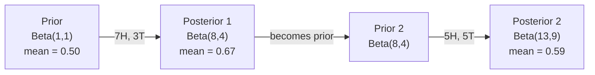

# Teorema de Bayes

> A probabilidade é o que se espera, o teorema de Bayes é o que se aprende.

**Type:** Build
**Language:**Python
**Prerequisites:** Phase 1, Lesson 06 (Probability Fundamentals)
**Time:** ~75 minutes

## Objetivos de aprendizagem

- Aplicar o teorema de Bayes para calcular probabilidades posteriores a partir de antecedentes, probabilidades e evidências
- Construir um classificador de texto Bayes ingênuo a partir do zero com Laplace suavizamento e log-space computação
- Comparar estimativas MLE e MAP e explicar como o MAP corresponde à regularização L2
- Implementar atualizações Bayesianas sequenciais usando antecedentes conjugados beta-binomial para testes A/B

## O problema

Um teste médico é 99% preciso, e se tivermos positivo, quais são as chances de termos a doença?

A maioria das pessoas diz 99%. A resposta real depende de quão rara é a doença. Se 1 em cada 10.000 pessoas a têm, um resultado positivo só dá a você cerca de 1% de chance de ficar doente. Os outros 99% de resultados positivos são falsos alarmes de pessoas saudáveis.

Esta não é uma pergunta de truque. É teorema de Bayes. Todo filtro de spam, todo diagnóstico médico, todo modelo de aprendizagem automática que quantifica a incerteza usa este raciocínio exato. Começa com uma crença. Veja evidências. Atualiza.

Se construir sistemas de inteligência artificial sem entender isso, interpretará mal as saídas do modelo, estabelecerá prazos ruins e enviará previsões exageradas.

## O conceito

### Da probabilidade conjunta para Bayes

Já sabe da lição 06 que a probabilidade condicional é:

```
P(A|B) = P(A and B) / P(B)
```

E simetricamente:

```
P(B|A) = P(A and B) / P(A)
```

Ambas as expressões compartilham o mesmo numerador: P(A e B).

```
P(A and B) = P(A|B) * P(B) = P(B|A) * P(A)

Therefore:

P(A|B) = P(B|A) * P(A) / P(B)
```

É o teorema de Bayes, quatro quantidades, uma equação.

### As quatro partes

| Part | Name | What it means |
|------|------|---------------|
| P(A\|B) | Posterior | Your updated belief about A after seeing evidence B |
| P(B\|A) | Likelihood | How probable the evidence B is if A is true |
| P(A) | Prior | Your belief about A before seeing any evidence |
| P(B) | Evidence | Total probability of seeing B under all possibilities |

O termo prova P ((B) atua como um normalizer.

```
P(B) = P(B|A) * P(A) + P(B|not A) * P(not A)
```

### Exemplo de teste médico

Uma doença afeta 1 em cada 10.000 pessoas. O teste é 99% preciso (aparece em 99% dos doentes, dá falsos resultados em 1% das vezes).

```
P(sick)          = 0.0001     (prior: disease is rare)
P(positive|sick) = 0.99       (likelihood: test catches it)
P(positive|healthy) = 0.01    (false positive rate)

P(positive) = P(positive|sick) * P(sick) + P(positive|healthy) * P(healthy)
            = 0.99 * 0.0001 + 0.01 * 0.9999
            = 0.000099 + 0.009999
            = 0.010098

P(sick|positive) = P(positive|sick) * P(sick) / P(positive)
                 = 0.99 * 0.0001 / 0.010098
                 = 0.0098
                 = 0.98%
```

Quando uma condição é rara, mesmo os testes precisos produzem em sua maioria falsos positivos.

### Exemplo de filtro de spam

Recebe um e-mail com a palavra "loteria". É spam?

```
P(spam)                = 0.3      (30% of email is spam)
P("lottery"|spam)      = 0.05     (5% of spam emails contain "lottery")
P("lottery"|not spam)  = 0.001    (0.1% of legitimate emails contain "lottery")

P("lottery") = 0.05 * 0.3 + 0.001 * 0.7
             = 0.015 + 0.0007
             = 0.0157

P(spam|"lottery") = 0.05 * 0.3 / 0.0157
                  = 0.955
                  = 95.5%
```

Uma palavra muda a probabilidade de 30% para 95,5%. Um verdadeiro filtro de spam aplica Bayes em centenas de palavras simultaneamente.

### Bayes ingênuo: suposição de independência

Naive Bayes estende isso a múltiplas características assumindo que todas as características são condicionalmente independentes dada a classe:

```
P(class | feature_1, feature_2, ..., feature_n)
  = P(class) * P(feature_1|class) * P(feature_2|class) * ... * P(feature_n|class)
    / P(feature_1, feature_2, ..., feature_n)
```

A parte "ingênua" é a suposição de independência. No texto, ocorrências de palavras não são independentes ("Novo" e "York" estão correlacionados). Mas a suposição funciona surpreendentemente bem na prática porque o classificador só precisa classificar classes, não produzir probabilidades calibradas.

Como o denominador é o mesmo para todas as classes, você pode ignorá-lo e apenas comparar os numeradores:

```
score(class) = P(class) * product of P(feature_i | class)
```

Escolha a classe com a maior pontuação.

### Estimação máxima de probabilidade (MLE)

Como obtém P "feature " (classe de características) dos dados de treinamento?

```
P("free"|spam) = (number of spam emails containing "free") / (total spam emails)
```

Este é MLE: escolha os valores de parâmetros que tornam os dados observados mais prováveis. Você está maximizando a função de probabilidade, que para contagens discretas se reduz à frequência relativa.

O problema é que se uma palavra nunca aparece no spam durante o treinamento, a MLE dá-lhe probabilidade zero. Uma palavra invisível mata todo o produto.

```
P(word|class) = (count(word, class) + 1) / (total_words_in_class + vocabulary_size)
```

Adicionar 1 a cada contagem garante que nenhuma probabilidade seja nunca zero.

### MAP (Maksimal a posteriori)

O MLE pergunta: quais os parâmetros que maximizam os parâmetros de dados P?

O MAP pergunta: quais os parâmetros maximizam os parâmetros P ((data)?

Pelo teorema de Bayes:

```
P(parameters|data) proportional to P(data|parameters) * P(parameters)
```

MAP adiciona um prévio sobre os próprios parâmetros. Se você acredita que os parâmetros devem ser pequenos, você codifica isso como um prévio que penaliza valores grandes. Isso é idêntico à regularização de L2 no ML. A penalidade "redonda" na regressão de cresta é literalmente um prévio gaussiano nos pesos.

| Estimation | Optimizes | ML equivalent |
|------------|-----------|---------------|
| MLE | P(data\|params) | Unregularized training |
| MAP | P(data\|params) * P(params) | L2 / L1 regularization |

### Bayesian vs frequentist: a diferença prática

Os frequentistas consideram os parâmetros como algo fixo desconhecido, perguntando: "Se eu repetisse esta experiência muitas vezes, o que aconteceria?"

Os bayesianos tratam os parâmetros como distribuições.

Para a construção de sistemas ML, a diferença prática:

| Aspect | Frequentist | Bayesian |
|--------|-------------|----------|
| Output | Point estimate | Distribution over values |
| Uncertainty | Confidence intervals (about procedure) | Credible intervals (about parameter) |
| Small data | Can overfit | Prior acts as regularization |
| Computation | Usually faster | Often requires sampling (MCMC) |

A maioria dos métodos de produção de MLM é frequentista (SGD, estimativas de pontos). Os métodos bayesianos brilham quando é necessária incerteza calibrada (decisões médicas, sistemas críticos para a segurança) ou quando os dados são escassos (aprendizagem em poucas tentativas, arranque a frio).

### Por que o pensamento bayesiano importa para a ML

A conexão é mais profunda do que a analogia:

**Priors are regularization.**Um prévio gaussiano em pesos é a regularização L2. Um prévio de Laplace é L1. Toda vez que você adiciona um termo de regularização, você está fazendo uma declaração bayesiana sobre quais valores de parâmetros você espera.

**Posteriors are uncertainty.**Uma única probabilidade prevista não diz nada sobre o quão confiante o modelo é nessa estimativa.

**Bayes updates are online learning.**O posterior de hoje torna-se o anterior de amanhã, quando o seu modelo vê novos dados, ele atualiza suas crenças gradualmente em vez de reestruturar a partir do zero.

**Model comparison is Bayesian.**O critério Bayesian de informação (BIC), a probabilidade marginal e os fatores Bayes usam o raciocínio Bayesian para escolher entre modelos sem sobreajuste.

```figure
bayes-update
```

## Construí-lo

### Passo 1: Função do teorema de Bayes

```python
def bayes(prior, likelihood, false_positive_rate):
    evidence = likelihood * prior + false_positive_rate * (1 - prior)
    posterior = likelihood * prior / evidence
    return posterior

result = bayes(prior=0.0001, likelihood=0.99, false_positive_rate=0.01)
print(f"P(sick|positive) = {result:.4f}")
```

### Passo 2: Classificador Bayes Ingênuo

```python
import math
from collections import defaultdict

class NaiveBayes:
    def __init__(self, smoothing=1.0):
        self.smoothing = smoothing
        self.class_counts = defaultdict(int)
        self.word_counts = defaultdict(lambda: defaultdict(int))
        self.class_word_totals = defaultdict(int)
        self.vocab = set()

    def train(self, documents, labels):
        for doc, label in zip(documents, labels):
            self.class_counts[label] += 1
            words = doc.lower().split()
            for word in words:
                self.word_counts[label][word] += 1
                self.class_word_totals[label] += 1
                self.vocab.add(word)

    def predict(self, document):
        words = document.lower().split()
        total_docs = sum(self.class_counts.values())
        vocab_size = len(self.vocab)
        best_class = None
        best_score = float("-inf")
        for cls in self.class_counts:
            score = math.log(self.class_counts[cls] / total_docs)
            for word in words:
                count = self.word_counts[cls].get(word, 0)
                total = self.class_word_totals[cls]
                score += math.log((count + self.smoothing) / (total + self.smoothing * vocab_size))
            if score > best_score:
                best_score = score
                best_class = cls
        return best_class
```

As probabilidades de registro impedem o fluxo inferior. Multiplicar muitas probabilidades pequenas produz números muito pequenos para um ponto flutuante.

### Passo 3: Treinar dados de spam

```python
train_docs = [
    "win free money now",
    "free lottery ticket winner",
    "claim your prize today free",
    "urgent offer free cash",
    "congratulations you won free",
    "meeting tomorrow at noon",
    "project update attached",
    "can we schedule a call",
    "quarterly report review",
    "lunch on thursday sounds good",
    "team standup notes attached",
    "please review the pull request",
]

train_labels = [
    "spam", "spam", "spam", "spam", "spam",
    "ham", "ham", "ham", "ham", "ham", "ham", "ham",
]

classifier = NaiveBayes()
classifier.train(train_docs, train_labels)

test_messages = [
    "free money waiting for you",
    "meeting rescheduled to friday",
    "you won a free prize",
    "please review the attached report",
]

for msg in test_messages:
    print(f"  '{msg}' -> {classifier.predict(msg)}")
```

### Passo 4: Inspeccionar as probabilidades aprendidas

```python
def show_top_words(classifier, cls, n=5):
    vocab_size = len(classifier.vocab)
    total = classifier.class_word_totals[cls]
    probs = {}
    for word in classifier.vocab:
        count = classifier.word_counts[cls].get(word, 0)
        probs[word] = (count + classifier.smoothing) / (total + classifier.smoothing * vocab_size)
    sorted_words = sorted(probs.items(), key=lambda x: x[1], reverse=True)
    for word, prob in sorted_words[:n]:
        print(f"    {word}: {prob:.4f}")

print("\nTop spam words:")
show_top_words(classifier, "spam")
print("\nTop ham words:")
show_top_words(classifier, "ham")
```

## Usá-lo

Navio-aprendizagem de esculturas, pronto para produção implementações Bayes ingênuos:

```python
from sklearn.feature_extraction.text import CountVectorizer
from sklearn.naive_bayes import MultinomialNB
from sklearn.metrics import classification_report

vectorizer = CountVectorizer()
X_train = vectorizer.fit_transform(train_docs)
clf = MultinomialNB()
clf.fit(X_train, train_labels)

X_test = vectorizer.transform(test_messages)
predictions = clf.predict(X_test)
for msg, pred in zip(test_messages, predictions):
    print(f"  '{msg}' -> {pred}")
```

O CountVectorizer lida com a tokenização e a construção de vocabulário. MultinomialNB lida com o suavização e as probabilidades de registro internamente. A sua versão do zero faz a mesma coisa em 40 linhas.

## Envia-o

A classe NaiveBayes construída aqui demonstra o conjunto completo: tokenization, estimativa de probabilidade com suavização Laplace, previsão de log-space.`code/bayes.py`funciona de ponta a ponta sem dependências além da biblioteca padrão do Python.

### Precessos conjuntos

Quando o anterior e posterior pertencem à mesma família de distribuições, o anterior é chamado de "conjugado". Isso torna a atualização de Bayesian algébrica limpa - você obtém um posterior fechado sem integração numérica.

| Likelihood | Conjugate Prior | Posterior | Example |
|-----------|----------------|-----------|---------|
| Bernoulli | Beta(a, b) | Beta(a + successes, b + failures) | Coin flip bias estimation |
| Normal (known variance) | Normal(mu_0, sigma_0) | Normal(weighted mean, smaller variance) | Sensor calibration |
| Poisson | Gamma(a, b) | Gamma(a + sum of counts, b + n) | Modeling arrival rates |
| Multinomial | Dirichlet(alpha) | Dirichlet(alpha + counts) | Topic modeling, language models |

Por que isso importa: sem antecedentes conjugados, você precisa de amostragem Monte Carlo ou inferência variável para aproximar o posterior.

A distribuição Beta é o conjugado anterior mais comum na prática. Beta(a, b) representa a sua crença sobre um parâmetro de probabilidade. A média é a/(a+b). Quanto maior a +b, mais concentrada (confiante) a distribuição.

Casos especiais do Beta anterior:
- Beta ((1, 1) = uniforme. Você não tem opinião sobre o parâmetro.
- Beta ((10, 10) = pico em 0,5. Você acredita fortemente que o parâmetro está perto de 0,5.
- Beta(1, 10) = distorcido em direção a 0. Você acredita que o parâmetro é pequeno.

A regra da atualização é simples:

```
Prior:     Beta(a, b)
Data:      s successes, f failures
Posterior: Beta(a + s, b + f)
```

Sem integrals, sem amostragem, só adição.

### Atualização Bayesiana Sequencial

A inferência Bayesiana é naturalmente sequencial. O posterior de hoje se torna o anterior de amanhã. É assim que os sistemas reais aprendem incrementalmente sem reprocessar todos os dados históricos.

Exemplo concreto: estimar se uma moeda é justa.

**Day 1: No data yet.**
Comece com Beta ((1, 1) -- um prior uniforme.
- Medida anterior: 0,5
- O Prior é plano em [0, 1]

**Day 2: Observe 7 heads, 3 tails.**
Posterior = Beta(1 + 7, 1 + 3) = Beta(8, 4)
- Medida posterior: 8/12 = 0,667
- Evidências sugerem que a moeda é tendenciosa em direção às cabeças

**Day 3: Observe 5 more heads, 5 more tails.**
Use o posterior de ontem como o anterior de hoje.
Posterior = Beta(8 + 5, 4 + 5) = Beta(13, 9)
- Medida posterior: 13/22 = 0,591
- Os novos dados equilibrados retiraram a estimativa para 0,5.



A ordem das observações não importa. Beta(1,1) atualizado com todas as 12 cabeças e 8 caudas ao mesmo tempo dá Beta(13, 9) - o mesmo resultado. Atualização sequencial e atualização de lote são matematicamente equivalentes. Mas atualização sequencial permite que você tome decisões em cada etapa sem armazenar dados brutos.

Esta é a base da aprendizagem on-line em sistemas de produção ML. Tompons sampling para bandidos, sistemas de recomendação incremental e detectores de anomalia de streaming todos usam este padrão.

### Conexão com testes A/B

Os testes A/B são inferências Bayesianas disfarçadas.

Configuração: você está testando duas cores de botões: variante A (azul) e variante B (verde). Você quer saber qual deles recebe mais cliques.

O teste Bayesian A/B:

1. **Prior.**Comece com Beta ((1, 1) para ambas as variantes.
2. **Data.**A variante A: 50 cliques em cada 1000 visualizações. A variante B: 65 cliques em cada 1000 visualizações.
3. **Posteriors.**
   - A: Beta(1 + 50, 1 + 950) = Beta(51, 951).
   - B: Beta(1 + 65, 1 + 935) = Beta(66, 936).
4. **Decision.**Calcule P ((B > A) -- a probabilidade de que a taxa de conversão verdadeira de B é maior do que A.

Computação P ((B > A) analítica é difícil. Mas Monte Carlo torna trivial:

```
1. Draw 100,000 samples from Beta(51, 951)  -> samples_A
2. Draw 100,000 samples from Beta(66, 936)  -> samples_B
3. P(B > A) = fraction of samples where B > A
```

Se P(B > A) > 0,95, você envia a variante B. Se estiver entre 0,05 e 0,95, você continua a coletar dados. Se P(B > A) < 0,05, você envia a variante A.

Vantagens em relação aos testes A/B frequentistas:
- Você recebe uma declaração de probabilidade direta: "há uma chance de 97% B é melhor"
- Não há confusão de p-valor, não há cobertura de "falha em rejeitar a hipótese nula".
- Pode verificar os resultados a qualquer momento sem aumentar as taxas falsas positivas (sem "problema de olho")
- Pode incorporar conhecimentos prévios (por exemplo, testes anteriores sugerem taxas de conversão geralmente de 3-8%)

| Aspect | Frequentist A/B | Bayesian A/B |
|--------|----------------|--------------|
| Output | p-value | P(B > A) |
| Interpretation | "How surprising is this data if A=B?" | "How likely is B better than A?" |
| Early stopping | Inflates false positives | Safe at any point (given a well-chosen prior and correctly specified model) |
| Prior knowledge | Not used | Encoded as Beta prior |
| Decision rule | p < 0.05 | P(B > A) > threshold |

## Exercícios

1. **Multiple tests.**Um paciente tem positivo duas vezes em testes independentes (ambos 99% de precisão, prevalência de doença 1 em 10.000).

2. **Smoothing impact.**Execute o classificador de spam com valores de suavizamento de 0.01, 0.1, 1.0 e 10.0. Como as probabilidades de palavra superior mudam? O que acontece com suavizamento=0 e uma palavra que aparece apenas em presunto?

3. **Add features.**Extenda a classe NaiveBayes para também usar o comprimento da mensagem (curto/longo) como um recurso ao lado da contagem de palavras. Estima P(short dizer spam) e P(short dizerham) a partir dos dados de treinamento e dobrá-lo na pontuação de previsão.

4. **MAP by hand.**Dados os dados observados (7 cabeças em 10 lançamentos de moeda), calcular a estimativa MAP do viés usando um Beta(2,2) anterior.

## Termos-chave

| Term | What people say | What it actually means |
|------|----------------|----------------------|
| Prior | "My initial guess" | P(hypothesis) before observing evidence. In ML: the regularization term. |
| Likelihood | "How well the data fits" | P(evidence\|hypothesis). How probable the observed data is under a specific hypothesis. |
| Posterior | "My updated belief" | P(hypothesis\|evidence). The prior multiplied by the likelihood, then normalized. |
| Evidence | "The normalizing constant" | P(data) across all hypotheses. Ensures the posterior sums to 1. |
| Naive Bayes | "That simple text classifier" | A classifier that assumes features are independent given the class. Works well despite the false assumption. |
| Laplace smoothing | "Add-one smoothing" | Adding a small count to every feature to prevent zero probabilities from unseen data. |
| MLE | "Just use the frequencies" | Choose parameters that maximize P(data\|parameters). No prior. Can overfit with small data. |
| MAP | "MLE with a prior" | Choose parameters that maximize P(data\|parameters) * P(parameters). Equivalent to regularized MLE. |
| Log-probability | "Work in log space" | Using log(P) instead of P to avoid floating-point underflow when multiplying many small numbers. |
| False positive | "A wrong alarm" | The test says positive, but the true state is negative. Drives the base rate fallacy. |

## Mais leitura

- [3Blue1Brown: Bayes' theorem](https://www.youtube.com/watch?v=HZGCoVF3YvM)- explicação visual com o exemplo do ensaio médico
- [Stanford CS229: Generative Learning Algorithms](https://cs229.stanford.edu/notes2022fall/cs229-notes2.pdf)- Bayes ingênuo e a sua ligação a modelos discriminatórios
- [Think Bayes](https://greenteapress.com/wp/think-bayes/)- Livro livre, estatísticas bayesianas com código Python
- [scikit-learn Naive Bayes](https://scikit-learn.org/stable/modules/naive_bayes.html)- implementações de produção e quando utilizar cada variante
