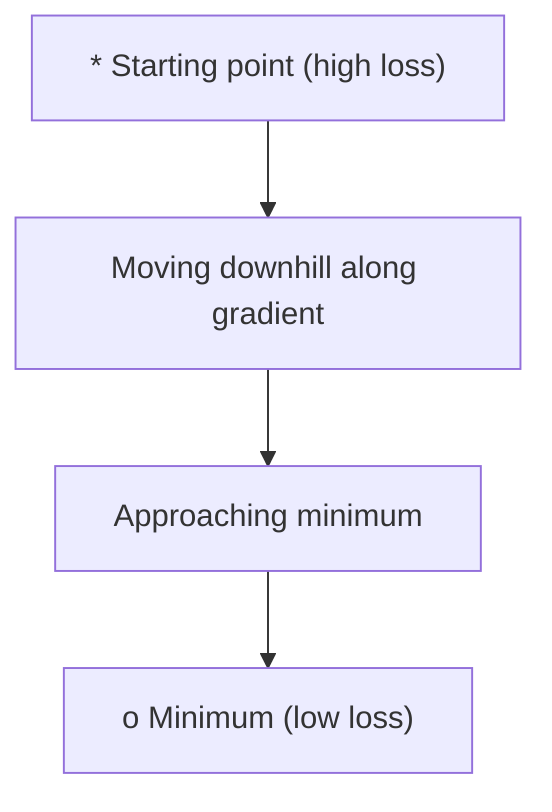
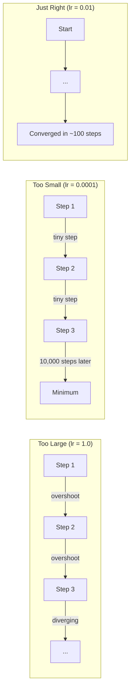
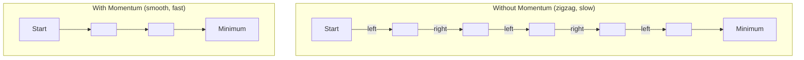
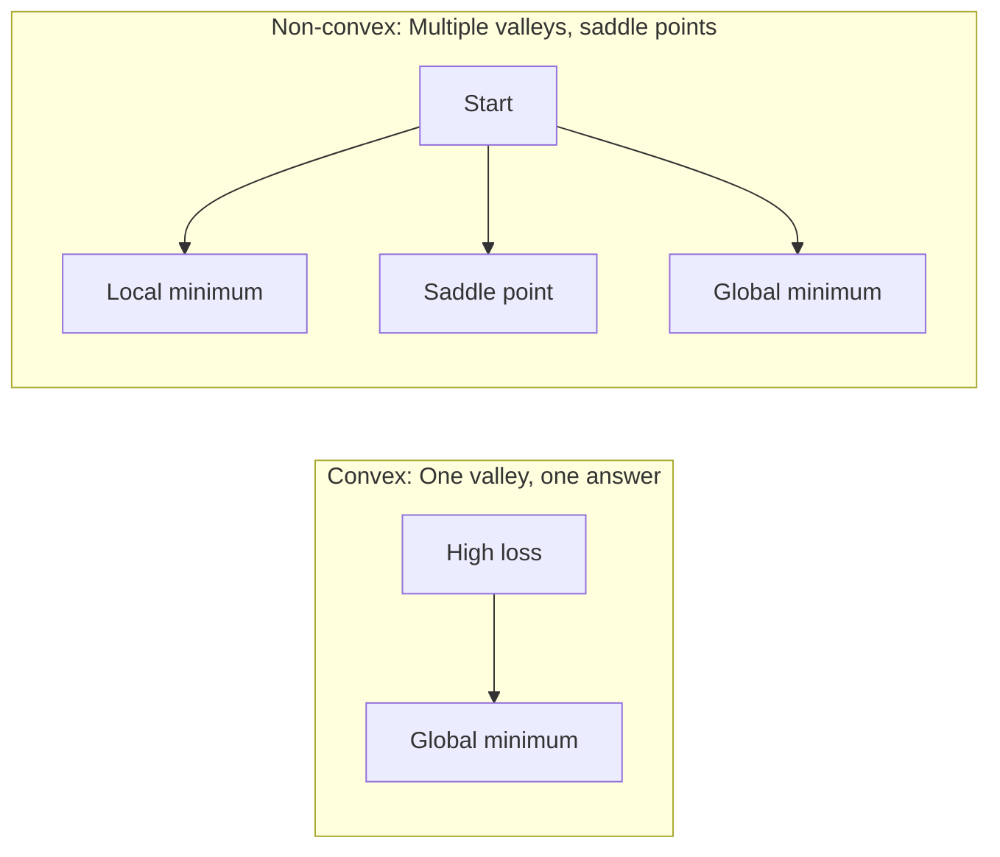
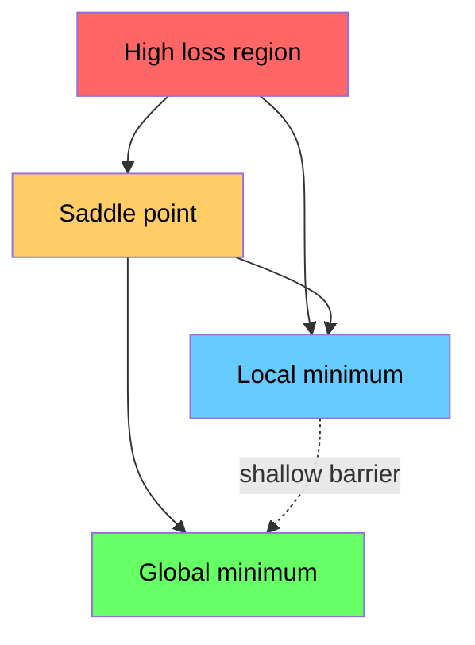

# Optimização

> Treinar uma rede neural não é mais do que encontrar o fundo de um vale.

**Type:** Build
**Language:**Python
**Prerequisites:** Phase 1, Lessons 04-05 (Derivatives, Gradients)
**Time:** ~75 minutes

## Objetivos de aprendizagem

- Implementar descida de gradiente de vainilha, SGD com impulso, e Adam a partir do zero
- Compare a convergência do optimizador na função Rosenbrock e explique por que Adam adapta as taxas de aprendizagem por peso
- Distinguir as paisagens de perdas convexas das não convexas e explicar o papel dos pontos de sela em dimensões elevadas
- Configurar os horários de aprendizagem (desintegração de etapas, cocinas, aquecimento) para a estabilidade do treinamento

## O problema

Você tem uma função de perda. Ele diz-lhe o quão errado seu modelo é. Você tem gradientes. Eles dizem-lhe em que direção a perda piora. Agora você precisa de uma estratégia para caminhar para baixo.

A abordagem ingênua é simples: mover-se em direcção oposta ao gradiente. Escala o passo por algum número chamado taxa de aprendizagem. Repito. - Não. Isto é descida de gradiente, e funciona. Mas "trabalhos" tem algumas precauções. Uma taxa de aprendizagem muito alta e você ultrapassar o vale inteiramente, saltando entre paredes. É muito pequeno e você corre para a resposta através de milhares de passos desnecessários. Apetece-se a um ponto de sela e deixa de se mover, mesmo que não tenha encontrado um mínimo.

Cada optimizador no aprendizado profundo é uma resposta à mesma pergunta: como chegar ao fundo do vale mais rápido e de forma mais confiável?

## O conceito

### O que significa otimização

Otimizar é encontrar os valores de entrada que minimizam (ou maximizam) uma função. Na aprendizagem de máquina, a função é a perda. As entradas são os pesos do modelo. O treinamento é a otimização.

```
minimize L(w) where:
  L = loss function
  w = model weights (could be millions of parameters)
```

### Descenso gradual (vanilha)

Otimizador mais simples: calcular o gradiente da perda em relação a cada peso. mover cada peso na direção oposta do seu gradiente. Escala o passo pela taxa de aprendizagem.

```
w = w - lr * gradient
```

É o algoritmo inteiro.



### Taxa de aprendizagem: o hiperparâmetro mais importante

A taxa de aprendizagem controla o tamanho dos passos.



Não há fórmula para a taxa de aprendizagem certa. Você encontra por experimento. pontos de partida comuns: 0,001 para Adam, 0,01 para SGD com impulso.

### SGD vs lote vs mini lote

A descida do gradiente de vanilla calcula a descida do conjunto de dados inteiro antes de dar um passo.

A descida do gradiente estocástico (SGD) calcula o gradiente em uma única amostra aleatória e passa imediatamente.

A descida do gradiente de mini-parcela divide a diferença. Calcule o gradiente em um pequeno lote (32, 64, 128, 256 amostras), e depois siga.

| Variant | Batch size | Gradient quality | Speed per step | Noise |
|---------|-----------|-----------------|---------------|-------|
| Batch GD | Entire dataset | Exact | Slow | None |
| SGD | 1 sample | Very noisy | Fast | High |
| Mini-batch | 32-256 | Good estimate | Balanced | Moderate |

O ruído no SGD e no mini-batch não é um bug, ajuda a escapar dos mínimos locais superficiais e dos pontos de sela.

### Impulso: a bola rola para baixo

A descida do gradiente de vanilla só olha para o gradiente atual. Se o gradiente zigzag (comum em vales estreitos), o progresso é lento.

```
v = beta * v + gradient
w = w - lr * v
```

A analogia: uma bola que rola para baixo, não para e reinicia a cada golpe, mas aumenta a velocidade em direções consistentes e amortece as oscilações.



`beta`O beta mais alto significa mais impulso, caminhos mais suaves, mas uma resposta mais lenta às mudanças de direção.

### Adam: taxas de aprendizagem adaptativas

Os diferentes pesos precisam de diferentes taxas de aprendizagem. Um peso que raramente recebe grandes gradientes deve dar passos maiores quando finalmente o fizer. Um peso que recebe grandes gradientes constantemente deve dar passos menores.

Adam (Estimação de Momento Adaptativo) rastreia duas coisas por peso:

1. Primeiro momento (m): média corrente de gradientes (como momento)
2. Segundo momento (v): média corrente de gradientes quadrados (magnitude de gradiente)

```
m = beta1 * m + (1 - beta1) * gradient
v = beta2 * v + (1 - beta2) * gradient^2

m_hat = m / (1 - beta1^t)    bias correction
v_hat = v / (1 - beta2^t)    bias correction

w = w - lr * m_hat / (sqrt(v_hat) + epsilon)
```

A divisão por `sqrt(v_hat)`Os pesos com grandes gradientes são divididos por um grande número (pequeno passo efetivo). Os pesos com pequenos gradientes são divididos por um pequeno número (grande passo efetivo). Cada peso tem sua própria taxa de aprendizagem adaptativa.

Hiperparametros padrão: `lr=0.001, beta1=0.9, beta2=0.999, epsilon=1e-8`Estas configurações funcionam bem para a maioria dos problemas.

### Horários de taxa de aprendizagem

Uma taxa de aprendizagem fixa é um compromisso. No início do treino, você quer grandes passos para fazer progressos rápidos. No final do treino, você quer pequenos passos para ajustar-se perto do mínimo.

Horários comuns:

| Schedule | Formula | Use case |
|----------|---------|----------|
| Step decay | lr = lr * factor every N epochs | Simple, manual control |
| Exponential decay | lr = lr_0 * decay^t | Smooth reduction |
| Cosine annealing | lr = lr_min + 0.5 * (lr_max - lr_min) * (1 + cos(pi * t / T)) | Transformers, modern training |
| Warmup + decay | Linear ramp up, then decay | Large models, prevents early instability |

### Convexo vs não convexo

Uma função convexa tem um mínimo. descida gradiente sempre encontra.`f(x) = x^2`é convexa.

As funções de perda de rede neural não são convexas.



Na prática, os mínimos locais em redes neurais de alta dimensão raramente são um problema. A maioria dos mínimos locais tem valores de perda próximos ao mínimo global. Os pontos de sela (flatos em algumas direções, curvos em outras) são o verdadeiro obstáculo.

### Visualização de paisagem perdida

A perda é uma função de todos os pesos. Para um modelo com 1 milhão de pesos, a paisagem de perda vive em 1.000,001 dimensões. Nós visualizamos escolhendo duas direções aleatórias no espaço de peso e traçando a perda ao longo dessas direções, produzindo uma superfície 2D.



Os mínimos nítidos geralmente geralmente não são bem geralmente utilizados, mas os mínimos planos geralmente são bem geralmente geralmente geralmente geralmente geralmente geralmente geralmente geralmente geralmente geralmente geralmente geralmente geralmente geralmente geralmente geralmente geralmente geralmente geralmente geralmente geralmente geralmente geralmente geralmente geralmente geralmente geralmente geralmente geralmente geralmente geralmente geralmente geralmente geralmente geralmente geralmente geralmente geralmente geralmente geralmente geralmente geralmente geralmente geralmente geralmente geralmente geralmente geralmente geralmente geralmente geralmente geralmente geralmente geralmente geralmente geralmente geralmente geralmente geralmente geralmente geralmente geralmente geralmente geralmente geralmente geralmente geralmente geralmente geralmente geralmente geralmente geralmente geralmente geralmente geralmente geralmente geralmente geralmente geralmente geralmente geralmente geralmente geralmente geralmente geralmente geralmente geralmente geralmente geralmente geralmente geralmente geralmente geralmente geralmente geralmente geralmente geralmente geralmente geralmente geralmente geralmente geralmente geralmente geralmente geralmente geralmente geralmente geralmente geralmente geralmente geralmente geralmente geralmente geralmente geralmente geralmente geralmente geralmente geralmente geralmente geralmente geralmente geralmente geralmente geralmente geralmente geralmente geralmente geralmente geralmente geralmente geralmente geralmente geralmente geralmente geralmente geralmente geralmente geralmente geralmente geralmente geralmente geralmente geralmente geralmente geralmente geralmente geralmente geralmente geralmente geralmente geralmente geralmente geralmente geralmente geralmente geralmente geralmente geralmente geralmente geralmente geralmente geralmente geralmente geralmente geralmente geralmente geralmente geralmente geralmente geralmente geralmente geralmente geralmente geralmente geralmente geralmente geralmente geralmente geralmente geralmente geralmente geralmente geralmente geralmente geralmente geralmente geralmente geralmente geralmente geralmente geralmente geralmente geralmente geralmente geralmente geralmente geralmente geralmente geralmente geralmente geralmente geralmente geralmente geralmente geralmente geralmente geralmente ger ger ger ger ger ger ger ger ger ger ger ger ger ger ger ger ger ger ger ger ger ger ger ger ger ger ger ger ger ger ger ger ger ger ger ger ger ger ger ger ger ger ger ger ger ger ger ger ger ger ger ger ger ger ger ger ger ger ger ger ger ger ger ger ger ger ger ger ger

```figure
gradient-descent
```

## Construí-lo

### Passo 1: Defina uma função de ensaio

A função Rosenbrock é um padrão clássico de otimização. Seu mínimo é (1, 1) dentro de um vale curvo estreito que é fácil de encontrar, mas difícil de seguir.

```
f(x, y) = (1 - x)^2 + 100 * (y - x^2)^2
```

```python
def rosenbrock(params):
    x, y = params
    return (1 - x) ** 2 + 100 * (y - x ** 2) ** 2

def rosenbrock_gradient(params):
    x, y = params
    df_dx = -2 * (1 - x) + 200 * (y - x ** 2) * (-2 * x)
    df_dy = 200 * (y - x ** 2)
    return [df_dx, df_dy]
```

### Passo 2: Descenso do gradiente de vanilla

```python
class GradientDescent:
    def __init__(self, lr=0.001):
        self.lr = lr

    def step(self, params, grads):
        return [p - self.lr * g for p, g in zip(params, grads)]
```

### Passo 3: SGD com impulso

```python
class SGDMomentum:
    def __init__(self, lr=0.001, momentum=0.9):
        self.lr = lr
        self.momentum = momentum
        self.velocity = None

    def step(self, params, grads):
        if self.velocity is None:
            self.velocity = [0.0] * len(params)
        self.velocity = [
            self.momentum * v + g
            for v, g in zip(self.velocity, grads)
        ]
        return [p - self.lr * v for p, v in zip(params, self.velocity)]
```

### Passo 4: Adão

```python
class Adam:
    def __init__(self, lr=0.001, beta1=0.9, beta2=0.999, epsilon=1e-8):
        self.lr = lr
        self.beta1 = beta1
        self.beta2 = beta2
        self.epsilon = epsilon
        self.m = None
        self.v = None
        self.t = 0

    def step(self, params, grads):
        if self.m is None:
            self.m = [0.0] * len(params)
            self.v = [0.0] * len(params)

        self.t += 1

        self.m = [
            self.beta1 * m + (1 - self.beta1) * g
            for m, g in zip(self.m, grads)
        ]
        self.v = [
            self.beta2 * v + (1 - self.beta2) * g ** 2
            for v, g in zip(self.v, grads)
        ]

        m_hat = [m / (1 - self.beta1 ** self.t) for m in self.m]
        v_hat = [v / (1 - self.beta2 ** self.t) for v in self.v]

        return [
            p - self.lr * mh / (vh ** 0.5 + self.epsilon)
            for p, mh, vh in zip(params, m_hat, v_hat)
        ]
```

### Passo 5: Correr e comparar

```python
def optimize(optimizer, func, grad_func, start, steps=5000):
    params = list(start)
    history = [params[:]]
    for _ in range(steps):
        grads = grad_func(params)
        params = optimizer.step(params, grads)
        history.append(params[:])
    return history

start = [-1.0, 1.0]

gd_history = optimize(GradientDescent(lr=0.0005), rosenbrock, rosenbrock_gradient, start)
sgd_history = optimize(SGDMomentum(lr=0.0001, momentum=0.9), rosenbrock, rosenbrock_gradient, start)
adam_history = optimize(Adam(lr=0.01), rosenbrock, rosenbrock_gradient, start)

for name, history in [("GD", gd_history), ("SGD+M", sgd_history), ("Adam", adam_history)]:
    final = history[-1]
    loss = rosenbrock(final)
    print(f"{name:6s} -> x={final[0]:.6f}, y={final[1]:.6f}, loss={loss:.8f}")
```

A produção esperada: Adam converge mais rápido. SGD com impulso segue um caminho mais suave.

## Usá-lo

Na prática, use o PyTorch ou o JAX optimizers. Eles lidam com grupos de parâmetros, declínio de peso, corte de gradiente e aceleração da GPU.

```python
import torch

model = torch.nn.Linear(784, 10)

sgd = torch.optim.SGD(model.parameters(), lr=0.01, momentum=0.9)
adam = torch.optim.Adam(model.parameters(), lr=0.001)
adamw = torch.optim.AdamW(model.parameters(), lr=0.001, weight_decay=0.01)

scheduler = torch.optim.lr_scheduler.CosineAnnealingLR(adam, T_max=100)
```

Regras de execução:

- Comece com o Adam (lr=0.001). Funciona para a maioria dos problemas sem sintonização.
- Passe para SGD com impulso (lr=0,01, impulso=0,9) quando precisar da melhor precisão final e pode pagar mais sintonização.
- Use AdamW (Adam com decomposição de peso descoplada) para transformadores.
- Sempre utilizar um cronograma de taxa de aprendizagem para a formação que dura mais do que algumas épocas.
- Se o treino for instável, reduzir a taxa de aprendizagem.

## Envia-o

Esta lição produz uma indicação para escolher o óptimo.`outputs/prompt-optimizer-guide.md`- Não .

As classes de optimizadores construídas aqui reaparecem na Fase 3 quando treinamos uma rede neural a partir do zero.

## Exercícios

1. **Learning rate sweep.**Execute descida de gradiente de vainilha na função Rosenbrock com taxas de aprendizagem [0.0001, 0.0005, 0.001, 0.005, 0.01].

2. **Momentum comparison.**Execute SGD com valores de momento [0,0, 0,5, 0,9, 0,99] na função Rosenbrock.

3. **Saddle point escape.**Defina a função `f(x, y) = x^2 - y^2`Comparar como a vanilha GD, SGD com o momento, e Adam se comportam.

4. **Implement learning rate decay.**Adicionar um cronograma de decomposição exponencial para a classe GradientDescent: `lr = lr_0 * 0.999^step`Comparar a convergência com e sem decadência na função Rosenbrock.

## Termos-chave

| Term | What people say | What it actually means |
|------|----------------|----------------------|
| Gradient descent | "Go downhill" | Update weights by subtracting the gradient scaled by the learning rate. The most basic optimizer. |
| Learning rate | "Step size" | A scalar that controls how far each update moves the weights. Too large causes divergence. Too small wastes compute. |
| Momentum | "Keep rolling" | Accumulate past gradients into a velocity vector. Dampens oscillations and accelerates movement through consistent directions. |
| SGD | "Random sampling" | Stochastic gradient descent. Compute gradient on a random subset instead of the full dataset. Almost always means mini-batch SGD in practice. |
| Mini-batch | "A chunk of data" | A small subset of training data (32-256 samples) used to estimate the gradient. Balances speed and gradient accuracy. |
| Adam | "The default optimizer" | Adaptive Moment Estimation. Tracks per-weight running averages of gradients and squared gradients to give each weight its own learning rate. |
| Bias correction | "Fix the cold start" | Adam's first and second moments are initialized to zero. Bias correction divides by (1 - beta^t) to compensate during early steps. |
| Learning rate schedule | "Change lr over time" | A function that adjusts the learning rate during training. Large steps early, small steps late. |
| Convex function | "One valley" | A function where any local minimum is the global minimum. Gradient descent always finds it. Neural network losses are not convex. |
| Saddle point | "Flat but not a minimum" | A point where the gradient is zero but it is a minimum in some directions and a maximum in others. Common in high dimensions. |
| Loss landscape | "The terrain" | The loss function plotted over weight space. Visualized by slicing along two random directions. |
| Convergence | "Getting there" | The optimizer has reached a point where further steps do not meaningfully reduce the loss. |

## Mais leitura

- [Sebastian Ruder: An overview of gradient descent optimization algorithms](https://ruder.io/optimizing-gradient-descent/)- uma pesquisa abrangente de todos os principais optimistas
- [Why Momentum Really Works (Distill)](https://distill.pub/2017/momentum/)- visualização interativa da dinâmica de impulso
- [Adam: A Method for Stochastic Optimization (Kingma & Ba, 2014)](https://arxiv.org/abs/1412.6980)- o papel original de Adam, legível e curto
- [Visualizing the Loss Landscape of Neural Nets (Li et al., 2018)](https://arxiv.org/abs/1712.09913)- o papel que mostrou mínimos nítidos versus planos
