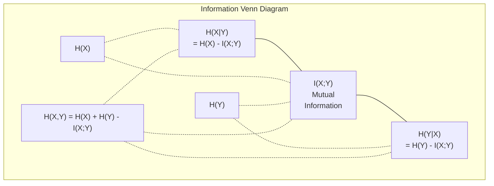

# Teoria da informação

> A teoria da informação mede a surpresa.

**Type:** Learn
**Language:**Python
**Prerequisites:** Phase 1, Lesson 06 (Probability)
**Time:** ~60 minutes

## Objetivos de aprendizagem

- Compute a entropia, a entropia cruzada e a divergência KL a partir do zero e explique sua relação
- Derivar por que minimizar a perda de entropia cruzada é equivalente a maximizar a probabilidade de log
- Calcular informações mútuas entre características e um alvo para classificar a importância das características
- Explique a perplexidade como o tamanho do vocabulário eficaz que um modelo de linguagem escolhe entre

## O problema

Tu ligas .`CrossEntropyLoss()`Em cada modelo de classificação que você treina, você vê "perplexidade" em cada modelo de idioma. Você lê sobre divergência KL em VAEs, destilação e RLHF. Estes não são conceitos desconectados.

A teoria da informação dá-lhe a linguagem para raciocinar sobre incerteza, compressão e previsão. Claude Shannon inventou-o em 1948 para resolver problemas de comunicação.

Esta lição construiu todas as fórmulas a partir do zero para que você veja de onde vêm e por que funcionam.

## O conceito

### Conteúdo de informação (surpresa)

Quando algo improvável acontece, ele carrega mais informações.

O conteúdo de informação de um evento com probabilidade p é:

```
I(x) = -log(p(x))
```

Usando o log base 2 dá bits, usando o log natural dá nats, a mesma ideia, unidades diferentes.

```
Event              Probability    Surprise (bits)
Fair coin heads    0.5            1.0
Rolling a 6        0.167          2.58
1-in-1000 event    0.001          9.97
Certain event      1.0            0.0
```

Alguns eventos não contêm informação, já sabias que acontecerão.

### Entropia (surpresa média)

Entropia é a surpresa esperada em todos os resultados possíveis de uma distribuição.

```
H(P) = -sum( p(x) * log(p(x)) )  for all x
```

Uma moeda justa tem entropia máxima para uma variável binária: 1 bit. Uma moeda tendenciosa (99% de cabeças) tem entropia baixa: 0,08 bits. Você já sabe o que vai acontecer, então cada virada diz-lhe quase nada.

```
Fair coin:    H = -(0.5 * log2(0.5) + 0.5 * log2(0.5)) = 1.0 bit
Biased coin:  H = -(0.99 * log2(0.99) + 0.01 * log2(0.01)) = 0.08 bits
```

A entropia mede a incerteza irredutível numa distribuição.

### A entropia cruzada (a função de perda que você usa todos os dias)

A entropia cruzada mede a surpresa média quando se usa a distribuição Q para codificar eventos que realmente vêm da distribuição P.

```
H(P, Q) = -sum( p(x) * log(q(x)) )  for all x
```

P é a distribuição verdadeira (as etiquetas). Q é a previsão do seu modelo. Se Q coincide perfeitamente com P, a entropia cruzada é igual à entropia. Qualquer desajuste a torna maior.

Na classificação, P é um vetor de um só calor (a classe verdadeira tem probabilidade 1, tudo o resto 0).

```
H(P, Q) = -log(q(true_class))
```

Isso é toda a fórmula de perda de entropia cruzada para classificação. Maximizar a probabilidade prevista da classe correta.

### KL Divergência (Distança entre Distribuições)

A divergência KL mede a quantidade de surpresa extra que você obtém usando Q em vez de P.

```
D_KL(P || Q) = sum( p(x) * log(p(x) / q(x)) )  for all x
             = H(P, Q) - H(P)
```

A entropia cruzada é entropia mais divergência KL. Como a entropia da distribuição verdadeira é constante durante o treinamento, minimizar a entropia cruzada é o mesmo que minimizar a divergência KL. Você está empurrando a distribuição do seu modelo para a distribuição verdadeira.

A divergência KL não é simétrica: D_KL(P ∫ Q) != D_KL(Q ∫ P). Não é uma métrica de distância verdadeira.

### Informações mútuas

A informação mútua mede o quanto saber uma variável diz-lhe sobre outra.

```
I(X; Y) = H(X) - H(X|Y)
        = H(X) + H(Y) - H(X, Y)
```

Se X e Y são independentes, a informação mútua é zero. Saber um não diz nada sobre o outro. Se eles estão perfeitamente correlacionados, a informação mútua é igual à entropia de qualquer uma das variáveis.

Na seleção de características, uma alta informação mútua entre uma característica e o alvo significa que a característica é útil.

### Entropia condicional

H(Y de X) mede a quantidade de incerteza que permanece sobre Y após a observação de X.

```
H(Y|X) = H(X,Y) - H(X)
```

Dois extremos:
- Se X determina completamente Y, então H(Y ≠X) = 0. Conhecer X elimina toda a incerteza sobre Y. Exemplo: X = temperatura em Celsius, Y = temperatura em Fahrenheit.
- Se X não lhe diz nada sobre Y, então H(YX não) = H(Y). Saber X não reduz sua incerteza em tudo.

A entropia condicional é sempre não negativa e nunca excede H(Y):

```
0 <= H(Y|X) <= H(Y)
```

Em aprendizado de máquina, a entropia condicional aparece em árvores de decisão. Em cada divisão, o algoritmo escolhe a característica X que minimiza H(Y X) - a característica que remove a maior incerteza sobre o rótulo Y.

### Entropia conjunta

H ((X,Y) é a entropia da distribuição conjunta de X e Y juntos.

```
H(X,Y) = -sum sum p(x,y) * log(p(x,y))   for all x, y
```

Propriedade chave:

```
H(X,Y) <= H(X) + H(Y)
```

A igualdade é válida quando X e Y são independentes. Se eles compartilham informações, a entropia conjunta é menor que a soma de entropias individuais. A entropia "missente" é exatamente a informação mútua.



As relações:
- H(X,Y) = H(X) + H(Y que seja X) = H(Y) + H(X que seja)
- O valor de um valor de um valor de um valor de um valor de um valor de um valor de um valor de um valor de um valor de um valor de um valor de um valor de um valor de um valor de um valor de um valor de um valor de um valor de um valor de um valor de um valor de um valor de um valor de um valor de um valor de um valor de um valor de um valor de um valor de um valor de um valor de um valor de um valor de um valor de um valor de um valor de um valor de um valor de um valor de um valor de um valor de um valor de um valor de um valor de um valor de um valor de um valor de um valor de um valor de um valor de um valor de um valor de um valor de um valor de um valor de um valor de um valor de um valor de um valor de um valor de um valor de um valor de um valor de um valor de um valor de um valor de um valor de um valor de um valor de um valor de um valor de um valor de um valor de um valor de um valor de um valor de um valor de um valor de um valor de um valor de um valor de um valor de um valor de um valor de um valor de um valor de um valor de um valor de um valor de um valor de um valor de um valor de um valor de um valor de um valor de um valor de um valor de um valor de um valor de um valor de um valor de um valor de um valor de um valor de um valor de um valor de um valor de um valor de um valor de um valor de um valor de um valor de um valor de um valor de um valor de um valor de um valor de um valor de um valor de um valor de um valor de um valor de um valor de um valor de um valor de um valor de um valor de um valor de um valor de um valor de um valor de um valor de um valor de um valor de um valor de um valor de um valor de um valor de valor de valor de valor de um valor de valor de um valor de valor de valor de valor de um valor de valor de um valor de valor de valor de valor de valor de valor de valor de valor de valor de valor de valor de valor de valor de valor de valor de valor de valor de valor de valor de valor de valor de valor de valor de valor de valor de valor de valor de valor de valor de valor de valor de valor de valor de valor
- H(X,Y) = H(X) + H(Y) - I(X;Y)

### Informações mútuas (mergulho profundo)

Informação mútua I  X; Y) quantifica o quanto o conhecimento de uma variável reduz a incerteza sobre a outra.

```
I(X;Y) = H(X) - H(X|Y)
       = H(Y) - H(Y|X)
       = H(X) + H(Y) - H(X,Y)
       = sum sum p(x,y) * log(p(x,y) / (p(x) * p(y)))
```

Propriedades:
- I ((X;Y) >= 0 sempre. Você nunca perde informações observando algo.
- I ((X;Y) = 0 se e apenas se X e Y são independentes.
- I(X;Y) = I(Y;X). É simétrico, ao contrário da divergência KL.
- I ((X;X) = H ((X). Uma variável compartilha todas as suas informações consigo mesma.

**Mutual information for feature selection.**Em ML, você quer recursos que sejam informativos sobre o alvo.

1. Para cada característica X_i, calcular I(X_i; Y) onde Y é a variável alvo.
2. Características de classificação por pontuação MI.
3. Mantém as características de cima.

Isto funciona para qualquer relação entre característica e alvo -- linear, não linear, monótono ou não. A correlação só capta relações lineares.

| Method | Detects | Computational cost | Handles categorical? |
|--------|---------|-------------------|---------------------|
| Pearson correlation | Linear relationships | O(n) | No |
| Spearman correlation | Monotonic relationships | O(n log n) | No |
| Mutual information | Any statistical dependency | O(n log n) with binning | Yes |

### Limeamento de etiquetas e entropia cruzada

A classificação padrão usa alvos duros: [0, 0, 1, 0]. A classe verdadeira recebe probabilidade 1, tudo o resto recebe 0.

```
soft_target = (1 - epsilon) * hard_target + epsilon / num_classes
```

Com epsilon = 0,1 e 4 classes:
- Alvo duro: [0, 0, 1, 0]
- Alvo suave: [0,025, 0,025, 0,925, 0,025]

De uma perspectiva da teoria da informação, o suavizamento de rótulos aumenta a entropia da distribuição de alvos. Alvos rígidos com um só calor têm entropia 0 - não há incerteza. Alvos moles têm entropia positiva.

Por que isso ajuda:
- Impede que o modelo conduza logits para valores extremos (seria necessário logits infinitos para combinar perfeitamente um alvo de uma única temperatura em entropia cruzada)
- A atuação como regularização: o modelo não pode ser 100% confiante
- Melhora a calibração: as probabilidades previstas refletem melhor a verdadeira incerteza
- Reduz a diferença entre o treinamento e o comportamento de inferência

A perda de entropia cruzada com o suavização da etiqueta torna-se:

```
L = (1 - epsilon) * CE(hard_target, prediction) + epsilon * H_uniform(prediction)
```

O segundo termo penaliza previsões que estão longe de ser uniformes -- uma regularização direta da confiança.

### Por que a entropia cruzada é a perda de classificação

Três perspectivas, a mesma conclusão.

**Information theory view.**A entropia cruzada mede quantos bits você desperdiça usando a distribuição do modelo em vez da distribuição real. Minimizando isso, o modelo torna-se o codificador mais eficiente da realidade.

**Maximum likelihood view.**Para amostras de formação N com classes verdadeiras y_i:

```
Likelihood     = product( q(y_i) )
Log-likelihood = sum( log(q(y_i)) )
Negative log-likelihood = -sum( log(q(y_i)) )
```

Minimizar a entropia cruzada = maximizar a probabilidade dos dados de treinamento sob o seu modelo.

**Gradient view.**O gradiente de entropia cruzada em relação às logitas é simples (previsto - verdadeiro). limpo, estável e rápido de calcular.

### Bits vs Nats

A única diferença é a base do log.

```
log base 2   -> bits      (information theory tradition)
log base e   -> nats      (machine learning convention)
log base 10  -> hartleys  (rarely used)
```

1 nat = 1/ln(2) bits = 1,4427 bits. PyTorch e TensorFlow usam log natural (nats) por padrão.

### Perplexidade

A perplexidade é o exponencial da entropia cruzada.

```
Perplexity = 2^H(P,Q)   (if using bits)
Perplexity = e^H(P,Q)   (if using nats)
```

Um modelo de linguagem com perplexidade 50 é, em média, tão confuso como se tivesse que escolher uniformemente entre 50 tokens possíveis.

O GPT-2 alcançou uma perplexidade de ~30 em referências comuns.

```figure
entropy-kl
```

## Construí-lo

### Passo 1: Conteúdo da informação e entropia

```python
import math

def information_content(p, base=2):
    if p <= 0 or p > 1:
        return float('inf') if p <= 0 else 0.0
    return -math.log(p) / math.log(base)

def entropy(probs, base=2):
    return sum(
        p * information_content(p, base)
        for p in probs if p > 0
    )

fair_coin = [0.5, 0.5]
biased_coin = [0.99, 0.01]
fair_die = [1/6] * 6

print(f"Fair coin entropy:   {entropy(fair_coin):.4f} bits")
print(f"Biased coin entropy: {entropy(biased_coin):.4f} bits")
print(f"Fair die entropy:    {entropy(fair_die):.4f} bits")
```

### Passo 2: Entropia cruzada e divergência KL

```python
def cross_entropy(p, q, base=2):
    total = 0.0
    for pi, qi in zip(p, q):
        if pi > 0:
            if qi <= 0:
                return float('inf')
            total += pi * (-math.log(qi) / math.log(base))
    return total

def kl_divergence(p, q, base=2):
    return cross_entropy(p, q, base) - entropy(p, base)

true_dist = [0.7, 0.2, 0.1]
good_model = [0.6, 0.25, 0.15]
bad_model = [0.1, 0.1, 0.8]

print(f"Entropy of true dist:     {entropy(true_dist):.4f} bits")
print(f"CE (good model):          {cross_entropy(true_dist, good_model):.4f} bits")
print(f"CE (bad model):           {cross_entropy(true_dist, bad_model):.4f} bits")
print(f"KL divergence (good):     {kl_divergence(true_dist, good_model):.4f} bits")
print(f"KL divergence (bad):      {kl_divergence(true_dist, bad_model):.4f} bits")
```

### Passo 3: Entropia cruzada como perda de classificação

```python
def softmax(logits):
    max_logit = max(logits)
    exps = [math.exp(z - max_logit) for z in logits]
    total = sum(exps)
    return [e / total for e in exps]

def cross_entropy_loss(true_class, logits):
    probs = softmax(logits)
    return -math.log(probs[true_class])

logits = [2.0, 1.0, 0.1]
true_class = 0

probs = softmax(logits)
loss = cross_entropy_loss(true_class, logits)

print(f"Logits:      {logits}")
print(f"Softmax:     {[f'{p:.4f}' for p in probs]}")
print(f"True class:  {true_class}")
print(f"Loss:        {loss:.4f} nats")
print(f"Perplexity:  {math.exp(loss):.2f}")
```

### Passo 4: Entropia cruzada é igual à probabilidade de log negativo

```python
import random

random.seed(42)

n_samples = 1000
n_classes = 3
true_labels = [random.randint(0, n_classes - 1) for _ in range(n_samples)]
model_logits = [[random.gauss(0, 1) for _ in range(n_classes)] for _ in range(n_samples)]

ce_loss = sum(
    cross_entropy_loss(label, logits)
    for label, logits in zip(true_labels, model_logits)
) / n_samples

nll = -sum(
    math.log(softmax(logits)[label])
    for label, logits in zip(true_labels, model_logits)
) / n_samples

print(f"Cross-entropy loss:      {ce_loss:.6f}")
print(f"Negative log-likelihood: {nll:.6f}")
print(f"Difference:              {abs(ce_loss - nll):.2e}")
```

### Passo 5: Informação mútua

```python
def mutual_information(joint_probs, base=2):
    rows = len(joint_probs)
    cols = len(joint_probs[0])

    margin_x = [sum(joint_probs[i][j] for j in range(cols)) for i in range(rows)]
    margin_y = [sum(joint_probs[i][j] for i in range(rows)) for j in range(cols)]

    mi = 0.0
    for i in range(rows):
        for j in range(cols):
            pxy = joint_probs[i][j]
            if pxy > 0:
                mi += pxy * math.log(pxy / (margin_x[i] * margin_y[j])) / math.log(base)
    return mi

independent = [[0.25, 0.25], [0.25, 0.25]]
dependent = [[0.45, 0.05], [0.05, 0.45]]

print(f"MI (independent): {mutual_information(independent):.4f} bits")
print(f"MI (dependent):   {mutual_information(dependent):.4f} bits")
```

## Usá-lo

Os mesmos conceitos que usam o NumPy, a forma como os usará na prática:

```python
import numpy as np

def np_entropy(p):
    p = np.asarray(p, dtype=float)
    mask = p > 0
    result = np.zeros_like(p)
    result[mask] = p[mask] * np.log(p[mask])
    return -result.sum()

def np_cross_entropy(p, q):
    p, q = np.asarray(p, dtype=float), np.asarray(q, dtype=float)
    mask = p > 0
    return -(p[mask] * np.log(q[mask])).sum()

def np_kl_divergence(p, q):
    return np_cross_entropy(p, q) - np_entropy(p)

true = np.array([0.7, 0.2, 0.1])
pred = np.array([0.6, 0.25, 0.15])
print(f"Entropy:    {np_entropy(true):.4f} nats")
print(f"Cross-ent:  {np_cross_entropy(true, pred):.4f} nats")
print(f"KL div:     {np_kl_divergence(true, pred):.4f} nats")
```

Construiste a partir do nada o que ?`torch.nn.CrossEntropyLoss()`Agora sabe por que a perda diminui durante o treinamento: a distribuição prevista do seu modelo está a aproximar-se da distribuição real, medida em nats de informações desperdiçadas.

## Exercícios

1. Calcule a entropia do alfabeto inglês assumindo uma distribuição uniforme (26 letras).

2. Um modelo produz logits [5,0, 2.0, 0.5] para uma amostra com classe verdadeira 1. Calcule a perda de entropia cruzada à mão, em seguida, verifique com o seu `cross_entropy_loss`Qual logite daria perda zero?

3. Mostre que a divergência KL não é simétrica. Escolha duas distribuições P e Q e calcula D_K_K  Q) e DL  Q  P). Explique por que elas diferem.

4. Construir uma função que calcula a perplexidade para uma sequência de previsões de tokens. Dada uma lista de pares (true_token_index, predicted_logits), retorne a perplexidade da sequência.

## Termos-chave

| Term | What people say | What it actually means |
|------|----------------|----------------------|
| Information content | "Surprise" | The number of bits (or nats) needed to encode an event: -log(p) |
| Entropy | "Randomness" | The average surprise across all outcomes of a distribution. Measures irreducible uncertainty. |
| Cross-entropy | "The loss function" | Average surprise when using model distribution Q to encode events from true distribution P. |
| KL divergence | "Distance between distributions" | Extra bits wasted by using Q instead of P. Equals cross-entropy minus entropy. Not symmetric. |
| Mutual information | "How related are X and Y" | Reduction in uncertainty about X from knowing Y. Zero means independent. |
| Softmax | "Turn logits into probabilities" | Exponentiate and normalize. Maps any real-valued vector to a valid probability distribution. |
| Perplexity | "How confused the model is" | Exponential of cross-entropy. The effective vocabulary size the model is choosing from at each step. |
| Bits | "Shannon's unit" | Information measured with log base 2. One bit resolves one fair coin flip. |
| Nats | "ML's unit" | Information measured with natural log. Used by PyTorch and TensorFlow by default. |
| Negative log-likelihood | "NLL loss" | Identical to cross-entropy loss for one-hot labels. Minimizing it maximizes the probability of correct predictions. |

## Mais leitura

- [Shannon 1948: A Mathematical Theory of Communication](https://people.math.harvard.edu/~ctm/home/text/others/shannon/entropy/entropy.pdf)- o papel original, ainda legível
- [Visual Information Theory (Chris Olah)](https://colah.github.io/posts/2015-09-Visual-Information/)- melhor explicação visual da entropia e da divergência KL
- [PyTorch CrossEntropyLoss docs](https://pytorch.org/docs/stable/generated/torch.nn.CrossEntropyLoss.html)- como o quadro implementa o que acaba de construir
