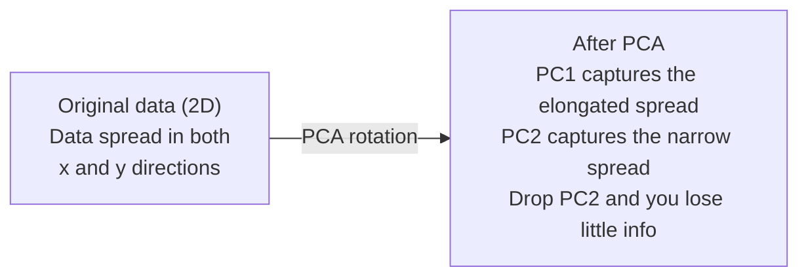

# Reduzir a dimensão

> Os dados de alta dimensão têm estrutura.

**Type:** Build
**Language:**Python
**Prerequisites:** Phase 1, Lessons 01 (Linear Algebra Intuition), 02 (Vectors, Matrices & Operations), 03 (Eigenvalues & Eigenvectors), 06 (Probability & Distributions)
**Time:** ~90 minutes

## Objetivos de aprendizagem

- Implementar PCA a partir do zero: dados centrais, calcular a matriz de covariância, composição própria e projeto
- Utilize o coeficiente de variância explicado e o método de cotovelo para escolher o número de componentes principais
- Comparar PCA, t-SNE e UMAP para visualizar os dígitos MNIST em 2D e explicar suas compensações
- Aplicar PCA do kernel com um kernel RBF para separar estruturas de dados não lineares que o PCA padrão não pode lidar

## O problema

Você tem um conjunto de dados com 784 características por amostra. Talvez sejam valores de pixels de dígitos manuscritos. Talvez sejam níveis de expressão genética. Talvez sejam sinais de comportamento do usuário. Você não pode visualizar 784 dimensões. Você não pode traçar-as. Nem sequer pode pensar nelas.

Mas a maioria dessas características 784 são redundantes. A informação real vive em uma superfície muito menor. Uma "7" manuscrita não precisa de 784 números independentes para descrevê-la.

A redução de dimensões encontra a superfície menor, toma os dados 784 e comprime-os para 2, 10 ou 50 dimensões, mantendo a estrutura que importa.

## O conceito

### A maldição da dimensionalidade

Os espaços de alta dimensão não são intuitivos.

**Distance becomes meaningless.**Em dimensões altas, a distância entre dois pontos aleatórios converge para o mesmo valor. Se cada ponto é aproximadamente a mesma distância de todos os outros pontos, a busca do vizinho mais próximo deixa de funcionar.

```
Dimension    Avg distance ratio (max/min between random points)
2            ~5.0
10           ~1.8
100          ~1.2
1000         ~1.02
```

**Volume concentrates in corners.**Um hipercubo unitário em dimensões d tem curvas 2^d. Em 100 dimensões, quase todo o volume está nos curvas, longe do centro.

**You need exponentially more data.**Para manter a mesma densidade de amostras em um espaço, passar de 2D para 20D significa que você precisa de 10×18 vezes mais dados. Você nunca tem o suficiente. Dimensões reduzidas traz a densidade de dados de volta para algo viável.

### PCA: encontrar as direções que importam

A análise de componentes principais (PCA) encontra os eixos ao longo dos quais os seus dados variam mais.

O algoritmo:

```
1. Center the data        (subtract the mean from each feature)
2. Compute covariance     (how features move together)
3. Eigendecomposition     (find the principal directions)
4. Sort by eigenvalue     (biggest variance first)
5. Project               (keep top k eigenvectors, drop the rest)
```

Por que a própria composição? A matriz de covariância é simétrica e semidefinida positiva. Seus próprios vetores são direções ortogonais no espaço de características. Os valores próprios dizem-lhe quanta variância cada direção capta. O próprio vetor com os maiores pontos de valor próprio ao longo da direção da variância máxima.



- **Before PCA:**A nuvem de dados está espalhada diagonalmente em ambos os eixos x e y
- **After PCA:**O sistema de coordenadas é rotado de modo que o PC1 se alinhe com a direcção da variância máxima (espandimento prolongado) e o PC2 se alinhe com a direcção da variância mínima (espandimento estreito).
- **Dimensionality reduction:**Deixando o PC2 projetar os dados para o PC1, perdendo muito pouca informação

### Relação de variância explicada

Cada componente principal capta uma fração da variância total.

```
Component    Eigenvalue    Explained ratio    Cumulative
PC1          4.73          0.473              0.473
PC2          2.51          0.251              0.724
PC3          1.12          0.112              0.836
PC4          0.89          0.089              0.925
...
```

Quando a variância explicada acumulativa atinge 0,95, você sabe que muitos componentes capturam 95% das informações.

### Escolha do número de componentes

Três estratégias:

1. **Threshold.**Mantenha componentes suficientes para explicar 90-95% da variação.
2. **Elbow method.**A trama explicou a variação por componente.
3. **Downstream performance.**Use o PCA como pré-processamento, varre o k e mede a precisão do seu modelo.

### T-SNE: preservar os bairros

A Integração de Vezinho Stocástico Distribuído (t-SNE) é projetada para visualização.

A intuição: no espaço original, calcular uma distribuição de probabilidade sobre pares de pontos com base em suas distâncias. pontos próximos obtêm alta probabilidade. pontos distantes obtêm baixa probabilidade. Então, encontrar um arranjo 2D onde a mesma distribuição de probabilidade ocorre. pontos que eram vizinhos em 784 dimensões permanecem vizinhos em 2D.

Propriedades-chave do t-SNE:
- Não linear, pode desenrolar variedades complexas que a PCA não pode.
- As corridas diferentes produzem layouts diferentes.
- O parâmetro de perplexidade controla quantos vizinhos devem ser considerados (intervalo típico: 5-50).
- As distâncias entre os aglomerados na saída não são significativas.
- Lenta em grandes conjuntos de dados.

### UMAP: estrutura global mais rápida e melhor

A aproximação e projeção de manifusão uniforme (UMAP) funciona de forma semelhante à t-SNE, mas com duas vantagens:
- Ele usa gráficos aproximados do vizinho mais próximo em vez de calcular todas as distâncias em pares.
- Melhor estrutura global: as posições relativas dos clusters na produção tendem a ser mais significativas do que na t-SNE.

UMAP constrói um gráfico ponderado em espaço de alta dimensão (a "representação topológica confusa") e, em seguida, encontra um layout de baixa dimensão que preserva este gráfico o melhor possível.

Parâmetros-chave:
- `n_neighbors`A definição de um sistema de construção local é mais ampla, mas não é necessária para a definição de um sistema de construção local.
- `min_dist`Os valores inferiores criam aglomerados mais densos.

### Quando utilizar qual

| Method | Use case | Preserves | Speed |
|--------|----------|-----------|-------|
| PCA | Preprocessing before training | Global variance | Fast (exact), works on millions of samples |
| PCA | Quick exploratory visualization | Linear structure | Fast |
| t-SNE | Publication-quality 2D plots | Local neighborhoods | Slow (< 10k samples ideal) |
| UMAP | 2D visualization at scale | Local + some global structure | Medium (handles millions) |
| PCA | Feature reduction for models | Variance-ranked features | Fast |
| t-SNE / UMAP | Understanding cluster structure | Cluster separation | Medium to slow |

Regra geral: utilizar PCA para pré-processamento e compressão de dados.

### PCA do núcleo

O PCA padrão encontra subespaços lineares. Ele gira o seu sistema de coordenadas e deixa cair eixos. Mas e se os dados estiverem em um variável não linear? Um círculo em 2D não pode ser separado por nenhuma linha.

O PCA do núcleo aplica o PCA em um espaço de características de alta dimensão induzido por uma função do núcleo, sem calcular explicitamente as coordenadas nesse espaço.

O algoritmo:
1. Calcule a matriz do kernel K onde K_ij = k(x_i, x_j)
2. Centrar a matriz do kernel no espaço de recursos
3. Eigendecompose a matriz do kernel centrado
4. Os vetores próprios superiores (escalados por 1/sqrt(eigenvalue)) são as projeções

Funções comuns do kernel:

| Kernel | Formula | Good for |
|--------|---------|----------|
| RBF (Gaussian) | exp(-gamma * \|\|x - y\|\|^2) | Most nonlinear data, smooth manifolds |
| Polynomial | (x . y + c)^d | Polynomial relationships |
| Sigmoid | tanh(alpha * x . y + c) | Neural network-like mappings |

Quando utilizar PCA do kernel versus PCA padrão:

| Criterion | Standard PCA | Kernel PCA |
|-----------|-------------|------------|
| Data structure | Linear subspace | Nonlinear manifold |
| Speed | O(min(n^2 d, d^2 n)) | O(n^2 d + n^3) |
| Interpretability | Components are linear combinations of features | Components lack direct feature interpretation |
| Scalability | Works on millions of samples | Kernel matrix is n x n, memory-limited |
| Reconstruction | Direct inverse transform | Requires pre-image approximation |

O exemplo clássico: círculos concêntricos em 2D. Dois anéis de pontos, um dentro do outro. PCA padrão projeta ambos na mesma linha - inútil para classificação. PCA kernel com um kernel RBF mapeia o círculo interno e o círculo externo em diferentes regiões, tornando-os linearmente separáveis.

### Erro de Reconstrução

Comprei 784 dimensões para 50.

Meter o erro de reconstrução:
1. Dados do projeto para dimensões k: X_reduzido = X @ W_k
2. Reconstruir: X_hat = X_reduzido @ W_k^T
3. MSE de cálculo: média (X - X_hat) ^2)

Para PCA, o erro de reconstrução tem uma relação clara com a variância explicada:

```
Reconstruction error = sum of eigenvalues NOT included
Total variance = sum of ALL eigenvalues
Fraction lost = (sum of dropped eigenvalues) / (sum of all eigenvalues)
```

A relação de variância explicada para cada componente é:

```
explained_ratio_k = eigenvalue_k / sum(all eigenvalues)
```

A traçação da variância explicada acumulativa contra o número de componentes dá-lhe a curva "cotovelo".
- A curva se aplania (retorno em diminuição)
- A variância acumulada ultrapassa o seu limiar (geralmente 0,90 ou 0,95)
- Planícies de desempenho de tarefas a jusante

O erro de reconstrução é útil além da escolha de k. Você pode usá-lo para a detecção de anomalias: amostras com alto erro de reconstrução são anormais que não se encaixam no subspaço aprendido. Esta é a base da detecção de anomalias baseada em PCA em sistemas de produção.

```figure
pca-axes
```

## Construí-lo

### Passo 1: PCA a partir do zero

```python
import numpy as np

class PCA:
    def __init__(self, n_components):
        self.n_components = n_components
        self.components = None
        self.mean = None
        self.eigenvalues = None
        self.explained_variance_ratio_ = None

    def fit(self, X):
        self.mean = np.mean(X, axis=0)
        X_centered = X - self.mean

        cov_matrix = np.cov(X_centered, rowvar=False)

        eigenvalues, eigenvectors = np.linalg.eigh(cov_matrix)

        sorted_idx = np.argsort(eigenvalues)[::-1]
        eigenvalues = eigenvalues[sorted_idx]
        eigenvectors = eigenvectors[:, sorted_idx]

        self.components = eigenvectors[:, :self.n_components].T
        self.eigenvalues = eigenvalues[:self.n_components]
        total_var = np.sum(eigenvalues)
        self.explained_variance_ratio_ = self.eigenvalues / total_var

        return self

    def transform(self, X):
        X_centered = X - self.mean
        return X_centered @ self.components.T

    def fit_transform(self, X):
        self.fit(X)
        return self.transform(X)
```

### Passo 2: Teste em dados sintéticos

```python
np.random.seed(42)
n_samples = 500

t = np.random.uniform(0, 2 * np.pi, n_samples)
x1 = 3 * np.cos(t) + np.random.normal(0, 0.2, n_samples)
x2 = 3 * np.sin(t) + np.random.normal(0, 0.2, n_samples)
x3 = 0.5 * x1 + 0.3 * x2 + np.random.normal(0, 0.1, n_samples)

X_synthetic = np.column_stack([x1, x2, x3])

pca = PCA(n_components=2)
X_reduced = pca.fit_transform(X_synthetic)

print(f"Original shape: {X_synthetic.shape}")
print(f"Reduced shape:  {X_reduced.shape}")
print(f"Explained variance ratios: {pca.explained_variance_ratio_}")
print(f"Total variance captured: {sum(pca.explained_variance_ratio_):.4f}")
```

### Passo 3: Números MNIST em 2D

```python
from sklearn.datasets import fetch_openml

mnist = fetch_openml("mnist_784", version=1, as_frame=False, parser="auto")
X_mnist = mnist.data[:5000].astype(float)
y_mnist = mnist.target[:5000].astype(int)

pca_mnist = PCA(n_components=50)
X_pca50 = pca_mnist.fit_transform(X_mnist)
print(f"50 components capture {sum(pca_mnist.explained_variance_ratio_):.2%} of variance")

pca_2d = PCA(n_components=2)
X_pca2d = pca_2d.fit_transform(X_mnist)
print(f"2 components capture {sum(pca_2d.explained_variance_ratio_):.2%} of variance")
```

### Passo 4: Compare com sklearn

```python
from sklearn.decomposition import PCA as SklearnPCA
from sklearn.manifold import TSNE

sklearn_pca = SklearnPCA(n_components=2)
X_sklearn_pca = sklearn_pca.fit_transform(X_mnist)

print(f"\nOur PCA explained variance:     {pca_2d.explained_variance_ratio_}")
print(f"Sklearn PCA explained variance: {sklearn_pca.explained_variance_ratio_}")

diff = np.abs(np.abs(X_pca2d) - np.abs(X_sklearn_pca))
print(f"Max absolute difference: {diff.max():.10f}")

tsne = TSNE(n_components=2, perplexity=30, random_state=42)
X_tsne = tsne.fit_transform(X_mnist)
print(f"\nt-SNE output shape: {X_tsne.shape}")
```

### Passo 5: Comparação UMAP

```python
try:
    from umap import UMAP

    reducer = UMAP(n_components=2, n_neighbors=15, min_dist=0.1, random_state=42)
    X_umap = reducer.fit_transform(X_mnist)
    print(f"UMAP output shape: {X_umap.shape}")
except ImportError:
    print("Install umap-learn: pip install umap-learn")
```

## Usá-lo

A PCA como pré-processamento antes de um classificador:

```python
from sklearn.decomposition import PCA as SklearnPCA
from sklearn.linear_model import LogisticRegression
from sklearn.model_selection import train_test_split
from sklearn.metrics import accuracy_score

X_train, X_test, y_train, y_test = train_test_split(
    X_mnist, y_mnist, test_size=0.2, random_state=42
)

results = {}
for k in [10, 30, 50, 100, 200]:
    pca_k = SklearnPCA(n_components=k)
    X_tr = pca_k.fit_transform(X_train)
    X_te = pca_k.transform(X_test)

    clf = LogisticRegression(max_iter=1000, random_state=42)
    clf.fit(X_tr, y_train)
    acc = accuracy_score(y_test, clf.predict(X_te))
    var_captured = sum(pca_k.explained_variance_ratio_)
    results[k] = (acc, var_captured)
    print(f"k={k:>3d}  accuracy={acc:.4f}  variance={var_captured:.4f}")
```

O plano de desempenho muito antes das dimensões 784.

## Envia-o

Esta lição produz:
- `outputs/skill-dimensionality-reduction.md`- habilidade para escolher a técnica de redução de dimensões adequada para uma determinada tarefa

## Exercícios

1. Modificar a classe PCA para suportar `inverse_transform`. Reconstruir os dígitos MNIST a partir de 10, 50 e 200 componentes. Imprimir o erro de reconstrução (diferença média quadrada do original) para cada um.

2. Exerça t-SNE no mesmo subconjunto MNIST com valores de perplexidade de 5, 30 e 100. Descreva como a saída muda.

3. Tomar um conjunto de dados com 50 características onde apenas 5 são informativas (gerar um com `sklearn.datasets.make_classification`) Aplicar PCA e verificar se a curva de variância explicada identifica corretamente que os dados são efetivamente 5D.

## Termos-chave

| Term | What people say | What it actually means |
|------|----------------|----------------------|
| Curse of dimensionality | "Too many features" | Distances, volumes, and data density all behave counterintuitively as dimensions grow. Models need exponentially more data to compensate. |
| PCA | "Reduce dimensions" | Rotate your coordinate system so the axes align with the directions of maximum variance, then drop the low-variance axes. |
| Principal component | "An important direction" | An eigenvector of the covariance matrix. The direction in feature space along which the data varies most. |
| Explained variance ratio | "How much info this component has" | The fraction of total variance captured by one principal component. Sum the top k ratios to see how much k components preserve. |
| Covariance matrix | "How features correlate" | A symmetric matrix where entry (i,j) measures how feature i and feature j move together. Diagonal entries are individual variances. |
| t-SNE | "That cluster plot" | A nonlinear method that maps high-dimensional data to 2D by preserving pairwise neighborhood probabilities. Good for visualization, not for preprocessing. |
| UMAP | "Faster t-SNE" | A nonlinear method based on topological data analysis. Preserves both local and some global structure. Scales better than t-SNE. |
| Perplexity | "A t-SNE knob" | Controls the effective number of neighbors each point considers. Low perplexity focuses on very local structure. High perplexity captures broader patterns. |
| Manifold | "The surface the data lives on" | A lower-dimensional surface embedded in a higher-dimensional space. A sheet of paper crumpled in 3D is a 2D manifold. |

## Mais leitura

- [A Tutorial on Principal Component Analysis](https://arxiv.org/abs/1404.1100)(Shlens) - derivação clara do PCA a partir do zero
- [How to Use t-SNE Effectively](https://distill.pub/2016/misread-tsne/)(Wattenberg et al.) - guia interativo sobre as armadilhas e as opções de parâmetros do t-SNE
- [UMAP documentation](https://umap-learn.readthedocs.io/)- orientações teóricas e práticas dos autores do UMAP
