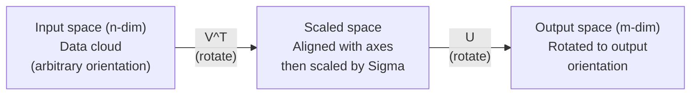
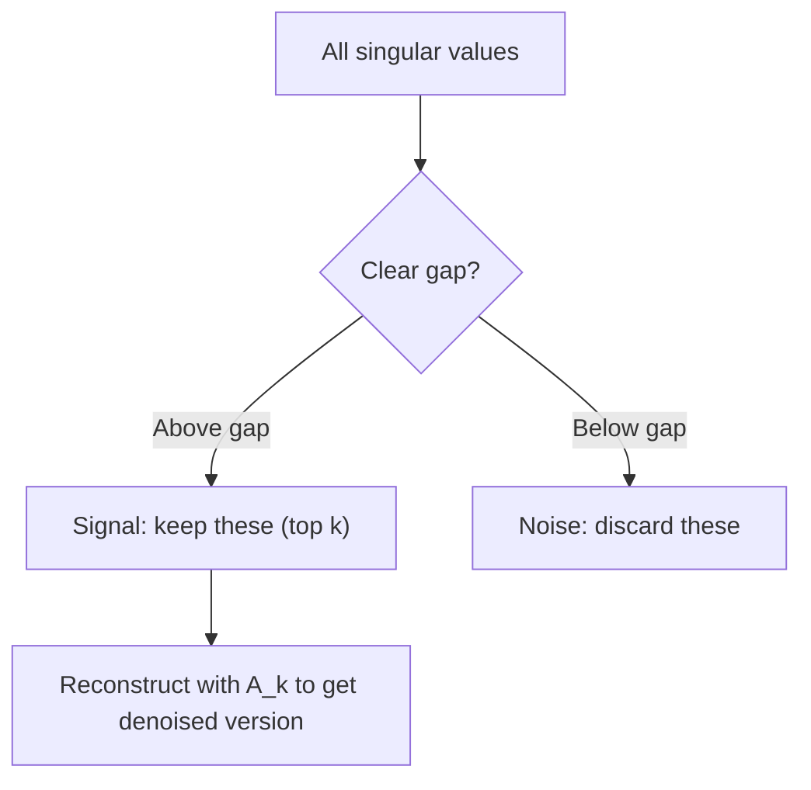

# Decompositividade de valores singulares

> O SVD é a faca do exército suíço da álgebra linear.

**Type:** Build
**Languages:** Python, Julia
**Prerequisites:** Phase 1, Lessons 01 (Linear Algebra Intuition), 02 (Vectors & Matrices Operations), 03 (Matrix Transformations)
**Time:** ~120 minutes

## Objetivos de aprendizagem

- Implementar SVD através da iteração de potência e explicar o significado geométrico de U, Sigma e V^T
- Aplicar SVD truncado para compressão de imagem e medir a relação de compressão versus erro de reconstrução
- Compute o pseudoinverso Moore-Penrose através de SVD para resolver sistemas de mínimos quadrados sobredeterminados
- Conectar SVD a PCA, sistemas de recomendação (fatores latentes) e Análise Semântica Latente na PNL

## O problema

Você tem uma matriz 1000x2000. Talvez seja uma classificação de filme do usuário. Talvez seja uma tabela de frequência de documento. Talvez seja os valores de pixels de uma imagem. Você precisa comprimi-la, denosá-la, encontrar estrutura oculta nela, ou resolver um sistema de mínimos quadrados com ela. A composição própria só funciona em matrizes quadradas. Mesmo assim, ela requer que a matriz tenha um conjunto completo de vetores próprios linearmente independentes.

O SVD funciona em qualquer matriz, qualquer forma, qualquer grau, nenhuma condição, decompõe a matriz em três fatores que revelam a geometria do que a matriz faz ao espaço. É a fatorização mais geral e mais útil em toda a álgebra linear.

## O conceito

### O que o SVD faz geométricamente

Cada matriz, independentemente da forma, realiza três operações em sequência: rotação, escala, rotação.

```
A = U * Sigma * V^T

      m x n     m x m    m x n    n x n
     (any)    (rotate)  (scale)  (rotate)
```

Dado qualquer matriz A, o SVD a contabiliza em:
- V^T gira vetores no espaço de entrada (n-dimensional)
- Escalas de sigma ao longo de cada eixo (estiradas ou compressadas)
- U rota o resultado no espaço de saída (m-dimensional)



Pensem assim. Você entrega a SVD uma matriz. Ela diz: "Esta matriz pega uma esfera de entradas, primeiro a gira por V^T, depois a estende em um elipsoide por Sigma, depois gira o elipsoide por U". Os valores singulares são os comprimentos dos eixos do elipsoide.

### A completa decomposição

Para uma matriz A com forma m x n:

```
A = U * Sigma * V^T

where:
  U     is m x m, orthogonal (U^T U = I)
  Sigma is m x n, diagonal (singular values on the diagonal)
  V     is n x n, orthogonal (V^T V = I)

The singular values sigma_1 >= sigma_2 >= ... >= sigma_r > 0
where r = rank(A)
```

As colunas de U são chamadas de vetores singulares esquerdo. As colunas de V são chamadas de vetores singulares direitos. As entradas diagonais de Sigma são chamadas de valores singulares. Eles são sempre não negativos e convencionalmente classificados em ordem decrescente.

### Vêctores singulares esquerdo, valores singulares, vectores singulares direito

Cada componente do SVD tem um significado geométrico distinto.

**Right singular vectors (columns of V):**Estes formam uma base ortonormal para o espaço de entrada (R^n). São as direções no espaço de entrada que a matriz mapeia para direções ortogonais no espaço de saída.

**Singular values (diagonal of Sigma):**Estes são os fatores de escala. o i-o valor singular diz-lhe o quanto a matriz estende vetores ao longo do i-o direito vector singular. um valor singular de zero significa que a matriz esmagou essa direção inteiramente.

**Left singular vectors (columns of U):**Estes formam uma base ortonormal para o espaço de saída (R^m). O i-o vector singular esquerdo é a direção no espaço de saída onde o i-o vector singular direito atinge (após escalar).

A relação entre eles:

```
A * v_i = sigma_i * u_i

The matrix A takes the i-th right singular vector v_i,
scales it by sigma_i, and maps it to the i-th left singular vector u_i.
```

Isto dá-lhe uma imagem coordenada por coordenada do que qualquer matriz faz.

### Forma de produto exterior

O SVD pode ser escrito como uma soma de matrizes de grau 1:

```
A = sigma_1 * u_1 * v_1^T + sigma_2 * u_2 * v_2^T + ... + sigma_r * u_r * v_r^T

Each term sigma_i * u_i * v_i^T is a rank-1 matrix (an outer product).
The full matrix is the sum of r such matrices, where r is the rank.
```

Esta forma é a base da aproximação de baixo grau. Cada termo adiciona uma camada de estrutura. O primeiro termo capta o padrão único mais importante. O segundo capta o próximo mais importante. E assim por diante. Truncando essa soma dá-lhe a melhor aproximação possível em qualquer grau dado.

```
Rank-1 approx:    A_1 = sigma_1 * u_1 * v_1^T
                  (captures the dominant pattern)

Rank-2 approx:    A_2 = sigma_1 * u_1 * v_1^T + sigma_2 * u_2 * v_2^T
                  (captures the two most important patterns)

Rank-k approx:    A_k = sum of top k terms
                  (optimal by the Eckart-Young theorem)
```

### Relação com a sua própria composição

Os valores singulares e vetores de A vêm diretamente dos valores próprios e vetores próprios de A^T A e A^T.

```
A^T A = V * Sigma^T * U^T * U * Sigma * V^T
      = V * Sigma^T * Sigma * V^T
      = V * D * V^T

where D = Sigma^T * Sigma is a diagonal matrix with sigma_i^2 on the diagonal.

So:
- The right singular vectors (V) are eigenvectors of A^T A
- The singular values squared (sigma_i^2) are eigenvalues of A^T A

Similarly:
A A^T = U * Sigma * V^T * V * Sigma^T * U^T
      = U * Sigma * Sigma^T * U^T

So:
- The left singular vectors (U) are eigenvectors of A A^T
- The eigenvalues of A A^T are also sigma_i^2
```

Esta conexão diz-te três coisas:
1. Os valores singulares são sempre reais e não negativos (são raízes quadradas de valores próprios de uma matriz semidefinida positiva).
2. Você poderia calcular SVD através da própria composição de A^T A, mas isso quadrata o número da condição e perde a precisão numérica.
3. Quando A é quadrado e semidefinido positivo simétrico, SVD e composição própria são a mesma coisa.

### SVD truncado: aproximação de baixo nível

O teorema de Eckart-Young-Mirsky afirma que a melhor aproximação de rango k a A (em ambos os Frobenius e norma espectral) é obtida mantendo apenas os valores singulares superiores k e seus vetores correspondentes:

```
A_k = U_k * Sigma_k * V_k^T

where:
  U_k     is m x k  (first k columns of U)
  Sigma_k is k x k  (top-left k x k block of Sigma)
  V_k     is n x k  (first k columns of V)

Approximation error = sigma_{k+1}  (in spectral norm)
                    = sqrt(sigma_{k+1}^2 + ... + sigma_r^2)  (in Frobenius norm)
```

Esta não é apenas uma aproximação "boa". É provavelmente a melhor aproximação possível de grau k. Nenhuma outra matriz de grau k é mais próxima de A.

| Component | Relative magnitude | Kept in rank-3 approx? |
|-----------|-------------------|------------------------|
| sigma_1 | Largest | Yes |
| sigma_2 | Large | Yes |
| sigma_3 | Medium-large | Yes |
| sigma_4 | Medium | No (error) |
| sigma_5 | Medium-small | No (error) |
| sigma_6 | Small | No (error) |
| sigma_7 | Very small | No (error) |
| sigma_8 | Tiny | No (error) |

Mantenha o top 3: A_3 capta os três maiores valores singulares. erro = valores restantes (sigma_4 até sigma_8).

Se os valores singulares se desmoronam rapidamente, um pequeno k captura a maior parte da matriz.

### Compressão de imagem com SVD

Uma imagem em escala de cinza é uma matriz de intensidades de píxeles. Uma imagem de 800x600 tem 480.000 valores.

```
Original image: 800 x 600 = 480,000 values

SVD with rank k:
  U_k:      800 x k values
  Sigma_k:  k values
  V_k:      600 x k values
  Total:    k * (800 + 600 + 1) = k * 1401 values

  k=10:   14,010 values   (2.9% of original)
  k=50:   70,050 values  (14.6% of original)
  k=100: 140,100 values  (29.2% of original)

  The compression ratio improves as k gets smaller,
  but visual quality degrades.
```

A principal ideia: imagens naturais têm valores singulares que se decompõem rapidamente. Os primeiros valores singulares capturam a estrutura ampla (formas, gradientes). Os últimos capturam detalhes finos e ruído. Truncando na posição 50 geralmente produz uma imagem que parece quase idêntica ao original, enquanto usa 85% menos armazenamento.

### SVD para sistemas de recomendação

O Prêmio Netflix tornou isto famoso.

```
             Movie1  Movie2  Movie3  Movie4  Movie5
  User1      [  5      ?       3       ?       1  ]
  User2      [  ?      4       ?       2       ?  ]
  User3      [  3      ?       5       ?       ?  ]
  User4      [  ?      ?       ?       4       3  ]

  ? = unknown rating
```

A ideia: esta matriz de classificações tem baixa classificação. Os usuários não têm gostos completamente independentes. Há um punhado de fatores latentes (ação vs drama, velho vs novo, cerebral vs visceral) que explicam a maioria das preferências.

O SVD na matriz de classificação (enchida) decompõe-a em:
- U: perfis de utilizador em espaço de fatores latentes
- Sigma: importância de cada fator latente
- V^T: perfis de cinema em espaço de fatores latentes

A classificação prevista de um usuário para um filme é o produto de pontos do seu perfil de usuário com o perfil do filme (pega por valores singulares). A aproximação de baixo nível preenche as entradas faltantes.

Na prática, você usa variantes como SVD incremental de Simon Funk ou ALS (alternando mínimos quadrados) que lidam diretamente com dados faltantes. Mas a ideia principal é a mesma: decomposição de fatores latentes através de SVD.

### SVD na PNL: Análise Semântica Latente

A Análise Semântica Latente (LSA), também chamada de Índice Semântico Latente (LSI), aplica o SVD a uma matriz de documento de termo.

```
             Doc1   Doc2   Doc3   Doc4
  "cat"      [  3      0      1      0  ]
  "dog"      [  2      0      0      1  ]
  "fish"     [  0      4      1      0  ]
  "pet"      [  1      1      1      1  ]
  "ocean"    [  0      3      0      0  ]

After SVD with rank k=2:

  Each document becomes a point in 2D "concept space."
  Each term becomes a point in the same 2D space.
  Documents about similar topics cluster together.
  Terms with similar meanings cluster together.

  "cat" and "dog" end up near each other (land pets).
  "fish" and "ocean" end up near each other (water concepts).
  Doc1 and Doc3 cluster if they share similar topics.
```

O LSA foi um dos primeiros métodos bem-sucedidos para capturar semântica semelhança a partir de texto bruto. Funciona porque termos sinônimos tendem a aparecer em documentos semelhantes, então o SVD os agrupa nas mesmas dimensões latentes.

### SVD para redução do ruído

Os dados ruidosos têm o sinal concentrado nos valores singulares superiores e o ruído espalhado por todos os valores singulares.

**Clean signal singular values:**

| Component | Magnitude | Type |
|-----------|-----------|------|
| sigma_1 | Very large | Signal |
| sigma_2 | Large | Signal |
| sigma_3 | Medium | Signal |
| sigma_4 | Near zero | Negligible |
| sigma_5 | Near zero | Negligible |

**Noisy signal singular values (noise adds to all):**

| Component | Magnitude | Type |
|-----------|-----------|------|
| sigma_1 | Very large | Signal |
| sigma_2 | Large | Signal |
| sigma_3 | Medium | Signal |
| sigma_4 | Small | Noise |
| sigma_5 | Small | Noise |
| sigma_6 | Small | Noise |
| sigma_7 | Small | Noise |



A SVD é uma forma de separar o sinal do ruído.

### Pseudoinversos através de SVD

O Moore-Penrose pseudoinverso A+ generaliza a inversão de matriz para matrizes não quadradas e singulares.

```
If A = U * Sigma * V^T, then:

A+ = V * Sigma+ * U^T

where Sigma+ is formed by:
  1. Transpose Sigma (swap rows and columns)
  2. Replace each non-zero diagonal entry sigma_i with 1/sigma_i
  3. Leave zeros as zeros

For A (m x n):      A+ is (n x m)
For Sigma (m x n):  Sigma+ is (n x m)
```

Se Ax = b não tem solução exata (sistema sobredeterminado), então x = A + b é a solução de menor quadrado (minimiza o AX - b)

```
Overdetermined system (more equations than unknowns):

  [1  1]         [3]
  [2  1] x   =   [5]       No exact solution exists.
  [3  1]         [6]

  x_ls = A+ b = V * Sigma+ * U^T * b

  This gives the x that minimizes the sum of squared residuals.
  Same result as the normal equations (A^T A)^(-1) A^T b,
  but numerically more stable.
```

### Benefícios da estabilidade numérica

Computação da própria composição de A^T A quadrado os valores singulares (valores próprios de A^T A são sigma_i^2).

```
Example:
  A has singular values [1000, 1, 0.001]
  Condition number of A: 1000 / 0.001 = 10^6

  A^T A has eigenvalues [10^6, 1, 10^{-6}]
  Condition number of A^T A: 10^6 / 10^{-6} = 10^{12}

  Computing SVD directly: works with condition number 10^6
  Computing via A^T A:     works with condition number 10^{12}
                           (6 extra digits of precision lost)
```

Os algoritmos modernos de SVD (bi-diagonalização Golub-Kahan) trabalham diretamente em A, nunca formando A^T A. É por isso que você deve sempre preferir `np.linalg.svd(A)`- Não .`np.linalg.eig(A.T @ A)`- Não .

### Conexão ao PCA

O PCA é SVD em dados centrados.

```
Given data matrix X (n_samples x n_features), centered (mean subtracted):

Covariance matrix: C = (1/(n-1)) * X^T X

PCA finds eigenvectors of C. But:

  X = U * Sigma * V^T    (SVD of X)

  X^T X = V * Sigma^2 * V^T

  C = (1/(n-1)) * V * Sigma^2 * V^T

So the principal components are exactly the right singular vectors V.
The explained variance for each component is sigma_i^2 / (n-1).

In sklearn, PCA is implemented using SVD, not eigendecomposition.
It is faster and more numerically stable.
```

Isto significa que tudo o que você aprendeu sobre a redução de dimensionalidade na lição 10 é SVD sob o capô.

```figure
svd-rank-reconstruction
```

## Construí-lo

### Passo 1: SVD a partir do zero usando iteração de potência

A ideia: para encontrar o maior valor singular e seus vetores, use a iteração de potência em A^T A (ou A A^T).

```python
import numpy as np

def power_iteration(M, num_iters=100):
    n = M.shape[1]
    v = np.random.randn(n)
    v = v / np.linalg.norm(v)

    for _ in range(num_iters):
        Mv = M @ v
        v = Mv / np.linalg.norm(Mv)

    eigenvalue = v @ M @ v
    return eigenvalue, v

def svd_from_scratch(A, k=None):
    m, n = A.shape
    if k is None:
        k = min(m, n)

    sigmas = []
    us = []
    vs = []

    A_residual = A.copy().astype(float)

    for _ in range(k):
        AtA = A_residual.T @ A_residual
        eigenvalue, v = power_iteration(AtA, num_iters=200)

        if eigenvalue < 1e-10:
            break

        sigma = np.sqrt(eigenvalue)
        u = A_residual @ v / sigma

        sigmas.append(sigma)
        us.append(u)
        vs.append(v)

        A_residual = A_residual - sigma * np.outer(u, v)

    U = np.column_stack(us) if us else np.empty((m, 0))
    S = np.array(sigmas)
    V = np.column_stack(vs) if vs else np.empty((n, 0))

    return U, S, V
```

### Passo 2: Teste e comparação com o NumPy

```python
np.random.seed(42)
A = np.random.randn(5, 4)

U_ours, S_ours, V_ours = svd_from_scratch(A)
U_np, S_np, Vt_np = np.linalg.svd(A, full_matrices=False)

print("Our singular values:", np.round(S_ours, 4))
print("NumPy singular values:", np.round(S_np, 4))

A_reconstructed = U_ours @ np.diag(S_ours) @ V_ours.T
print(f"Reconstruction error: {np.linalg.norm(A - A_reconstructed):.8f}")
```

### Passo 3: Demo de compressão de imagem

```python
def compress_image_svd(image_matrix, k):
    U, S, Vt = np.linalg.svd(image_matrix, full_matrices=False)
    compressed = U[:, :k] @ np.diag(S[:k]) @ Vt[:k, :]
    return compressed

image = np.random.seed(42)
rows, cols = 200, 300
image = np.random.randn(rows, cols)

for k in [1, 5, 10, 20, 50]:
    compressed = compress_image_svd(image, k)
    error = np.linalg.norm(image - compressed) / np.linalg.norm(image)
    original_size = rows * cols
    compressed_size = k * (rows + cols + 1)
    ratio = compressed_size / original_size
    print(f"k={k:>3d}  error={error:.4f}  storage={ratio:.1%}")
```

### Passo 4: Reduzir o ruído

```python
np.random.seed(42)
clean = np.outer(np.sin(np.linspace(0, 4*np.pi, 100)),
                 np.cos(np.linspace(0, 2*np.pi, 80)))
noise = 0.3 * np.random.randn(100, 80)
noisy = clean + noise

U, S, Vt = np.linalg.svd(noisy, full_matrices=False)
denoised = U[:, :5] @ np.diag(S[:5]) @ Vt[:5, :]

print(f"Noisy error:    {np.linalg.norm(noisy - clean):.4f}")
print(f"Denoised error: {np.linalg.norm(denoised - clean):.4f}")
print(f"Improvement:    {(1 - np.linalg.norm(denoised - clean) / np.linalg.norm(noisy - clean)):.1%}")
```

### Passo 5: Pseudoinversos

```python
A = np.array([[1, 1], [2, 1], [3, 1]], dtype=float)
b = np.array([3, 5, 6], dtype=float)

U, S, Vt = np.linalg.svd(A, full_matrices=False)
S_inv = np.diag(1.0 / S)
A_pinv = Vt.T @ S_inv @ U.T

x_svd = A_pinv @ b
x_lstsq = np.linalg.lstsq(A, b, rcond=None)[0]
x_pinv = np.linalg.pinv(A) @ b

print(f"SVD pseudoinverse solution:  {x_svd}")
print(f"np.linalg.lstsq solution:   {x_lstsq}")
print(f"np.linalg.pinv solution:    {x_pinv}")
```

## Usá-lo

Demos de trabalho completos estão em funcionamento .`code/svd.py`. Exerça-o para ver a SVD aplicada à compressão de imagem, sistemas de recomendação, análise semântica latente e redução de ruído.

```bash
python svd.py
```

A versão Julia em `code/svd.jl`demonstra os mesmos conceitos usando a língua nativa de Julia `svd()`função e `LinearAlgebra`- O pacote.

```bash
julia svd.jl
```

## Envia-o

Esta lição produz:
- `outputs/skill-svd.md`- uma habilidade para saber quando e como aplicar o SVD em projectos reais

## Exercícios

1. Implemente o SVD completo a partir do zero sem usar iteração de potência. Em vez disso, calcule a própria composição de A^T A para obter V e os valores singulares, em seguida, calcule U = A V Sigma^{-1}. Compare a precisão numérica com a sua versão de iteração de potência e com NumPy.

2. Carregue uma imagem em escala de cinza real (ou converta-a em escala de cinza). Compresse-a nas fileiras 1, 5, 10, 25, 50, 100. Para cada fileira, calcule a relação de compressão e o erro relativo. Encontre a fileira onde a imagem se torna visualmente aceitável.

3. Crie um pequeno sistema de recomendações. Crie uma matriz de classificações de filmes de usuários 10x8 com algumas entradas conhecidas. Encha entradas faltantes com meios de linha. Compute SVD e reconstruir uma aproximação de nível-3. Use a matriz reconstruída para prever as classificações faltantes. Verifique se as previsões são razoáveis.

4. Crie uma matriz de 100x50 documentos com 3 tópicos sintéticos. Cada tópico tem 5 termos associados. Adicione ruído. Aplique SVD e verifique que os 3 principais valores singulares são muito maiores do que os outros. Projete documentos no espaço latente 3D e verifique que os documentos do mesmo grupo de tópicos juntos.

5. Gerar uma matriz de baixo nível limpa (rango 3, tamanho 50x40) e adicionar ruído gaussiano em diferentes níveis (sigma = 0,1, 0,5, 1,0, 2.0). Para cada nível de ruído, encontrar a classificação de truncamento ideal varrendo k de 1 a 40 e medindo o erro de reconstrução contra a matriz limpa.

## Termos-chave

| Term | What people say | What it actually means |
|------|----------------|----------------------|
| SVD | "Factor any matrix" | Decompose A into U Sigma V^T where U and V are orthogonal and Sigma is diagonal with non-negative entries. Works for any matrix of any shape. |
| Singular value | "How important this component is" | The i-th diagonal entry of Sigma. Measures how much the matrix stretches along the i-th principal direction. Always non-negative, sorted in decreasing order. |
| Left singular vector | "Output direction" | A column of U. The direction in output space that the i-th right singular vector maps to (after scaling by sigma_i). |
| Right singular vector | "Input direction" | A column of V. The direction in input space that the matrix maps to the i-th left singular vector (after scaling by sigma_i). |
| Truncated SVD | "Low-rank approximation" | Keep only the top k singular values and their vectors. Produces the provably best rank-k approximation to the original matrix (Eckart-Young theorem). |
| Rank | "True dimensionality" | The number of non-zero singular values. Tells you how many independent directions the matrix actually uses. |
| Pseudoinverse | "Generalized inverse" | V Sigma+ U^T. Inverts non-zero singular values, leaves zeros as zeros. Solves least-squares problems for non-square or singular matrices. |
| Condition number | "How sensitive to errors" | sigma_max / sigma_min. A large condition number means small input changes cause large output changes. SVD reveals this directly. |
| Latent factor | "Hidden variable" | A dimension in the low-rank space discovered by SVD. In recommendations, a latent factor might correspond to genre preference. In NLP, it might correspond to a topic. |
| Frobenius norm | "Total matrix size" | Square root of the sum of squared entries. Equals the square root of the sum of squared singular values. Used to measure approximation error. |
| Eckart-Young theorem | "SVD gives the best compression" | For any target rank k, the truncated SVD minimizes the approximation error over all possible rank-k matrices. |
| Power iteration | "Find the biggest eigenvector" | Repeatedly multiply a random vector by the matrix and normalize. Converges to the eigenvector with the largest eigenvalue. The building block of many SVD algorithms. |

## Mais leitura

- [Gilbert Strang: Linear Algebra and Its Applications, Chapter 7](https://math.mit.edu/~gs/linearalgebra/)- tratamento completo da SVD com aplicações
- [3Blue1Brown: But what is the SVD?](https://www.youtube.com/watch?v=vSczTbgc8Rc)- Intuição geométrica para SVD
- [We Recommend a Singular Value Decomposition](https://www.ams.org/publicoutreach/feature-column/fcarc-svd)- visão geral acessível da Sociedade Americana de Matemática
- [Netflix Prize and Matrix Factorization](https://sifter.org/~simon/journal/20061211.html)- O post original do blog de Simon Funk sobre SVD para recomendações
- [Latent Semantic Analysis](https://en.wikipedia.org/wiki/Latent_semantic_analysis)- a aplicação original da PNL do SVD
- [Numerical Linear Algebra by Trefethen and Bau](https://people.maths.ox.ac.uk/trefethen/text.html)- o padrão ouro para a compreensão dos algoritmos SVD e das suas propriedades numéricas
