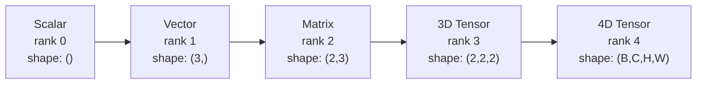
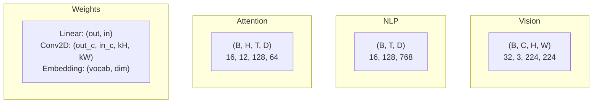
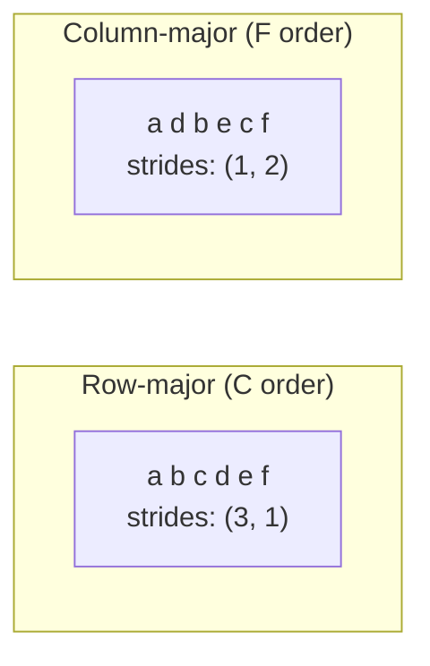
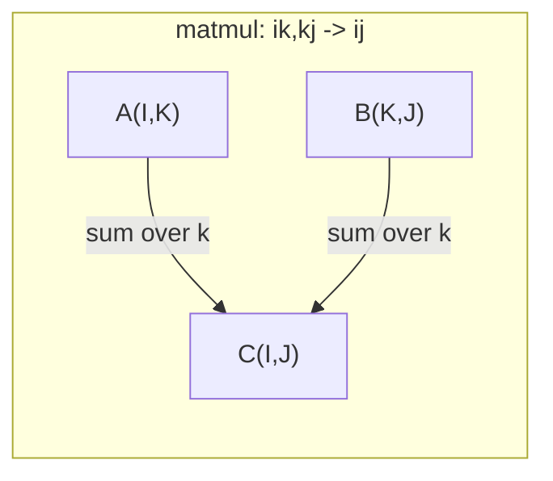

# Operações de tensão

> Tensores são a linguagem comum entre dados e aprendizagem profunda.

**Type:** Build
**Language:**Python
**Prerequisites:** Phase 1, Lessons 01 (Linear Algebra Intuition), 02 (Vectors, Matrices & Operations)
**Time:** ~90 minutes

## Objetivos de aprendizagem

- Implementar uma classe de tensor com formas, passos, remodelação, transposição e operações de elementos desde zero
- Aplicar regras de radiodifusão para operar em tensores de diferentes formas sem copiar dados
- Escreva expressões de einsum para produtos de pontos, multiplicidades de matriz, produtos externos e operações em lote
- Rastrear as formas exatas do tensor através de cada passo de atenção multi-cabeça

## O problema

Construímos um transformador, o passe para a frente parece limpo, e o executamos e conseguimos:`RuntimeError: mat1 and mat2 shapes cannot be multiplied (32x768 and 512x768)`Olhas para as formas, tentas a transposição.`Expected 4D input (got 3D input)`- Adiciona um "unpress", e outra coisa quebra.

Os erros de forma são o bug mais comum no código de aprendizado profundo. Não são conceitualmente difíceis - cada operação tem um contrato de forma - mas multiplicam-se rapidamente. Um transformador tem dezenas de remodelações, transposões e transmissões ligadas. Um eixo errado e as cascas de erro. Pior ainda, alguns erros de forma não lançam erros de todo. Eles produzem lixo silenciosamente, transmitindo ao longo da dimensão errada ou somando sobre o eixo errado.

Matrices gerenciam relações em pares entre dois conjuntos de coisas. dados reais não se encaixam em duas dimensões. um lote de 32 imagens RGB em 224x224 é um tensor 4D: `(32, 3, 224, 224)`A auto-atenção com 12 cabeças é também 4D:`(batch, heads, seq_len, head_dim)`É preciso uma estrutura de dados que se generalize para qualquer número de dimensões, com operações que compõem limposamente em todas elas.

## O conceito

### O que é um tensor

Um tensor é uma matriz multidimensional de números com um tipo de dados uniforme.**rank**(ou **order**Cada dimensão é uma**axis**- O .**shape**é um tuple que enumera o tamanho ao longo de cada eixo.



Elementos totais = produto de todos os tamanhos.`(2, 3, 4)`- É o que se passa .`2 * 3 * 4 = 24`elementos.

### Formas de tensão no aprendizado profundo

Diferentes tipos de dados mapeam para formas tensor específicas por convenção.



PyTorch usa NCHW (canal-first). TensorFlow é padrão para NHWC (canal-last). layouts incompatíveis causam desacelerações ou erros silenciosos.

### Como funciona o layout da memória

Uma matriz 2D na memória é uma sequência 1D de bytes. **Strides**Diz-lhe quantos elementos saltar para mover um passo ao longo de cada eixo.



Transpose não move dados, mas troca os passos, fazendo o tensor**non-contiguous**Os elementos de uma linha não estão mais adjacentes na memória.

### Regras de radiodifusão

A transmissão permite que você opere em tensores de diferentes formas sem copiar dados. Alinear formas a partir da direita. Duas dimensões são compatíveis quando são iguais ou uma é 1.

```
Tensor A:     (8, 1, 6, 1)
Tensor B:        (7, 1, 5)
Padded B:     (1, 7, 1, 5)
Result:       (8, 7, 6, 5)
```

### Einsum: a operação universal do tensor

A somação de Einstein marca cada eixo com uma letra. Os eixos na entrada, mas não a saída são somados. Os eixos em ambos são mantidos.



Padrões-chave: `i,i->`(produto ponto), `i,j->ij`(produto externo), `ii->`(traço), `ij->ji`(transposar), `bij,bjk->bik`(batch matmul), `bhtd,bhsd->bhts`(Pontos de atenção).

```figure
tensor-broadcast
```

## Construí-lo

O código vive em`code/tensors.py`Cada passo refere-se à aplicação.

### Passo 1: armazenamento de tensão e passos

Um tensor armazena uma lista plana de números mais metadados de forma.

```python
class Tensor:
    def __init__(self, data, shape=None):
        if isinstance(data, (list, tuple)):
            self._data, self._shape = self._flatten_nested(data)
        elif isinstance(data, np.ndarray):
            self._data = data.flatten().tolist()
            self._shape = tuple(data.shape)
        else:
            self._data = [data]
            self._shape = ()

        if shape is not None:
            total = reduce(lambda a, b: a * b, shape, 1)
            if total != len(self._data):
                raise ValueError(
                    f"Cannot reshape {len(self._data)} elements into shape {shape}"
                )
            self._shape = tuple(shape)

        self._strides = self._compute_strides(self._shape)

    @staticmethod
    def _compute_strides(shape):
        if len(shape) == 0:
            return ()
        strides = [1] * len(shape)
        for i in range(len(shape) - 2, -1, -1):
            strides[i] = strides[i + 1] * shape[i + 1]
        return tuple(strides)
```

Para a forma`(3, 4)`, os passos são`(4, 1)`-- saltar 4 elementos para avançar uma linha, saltar 1 elemento para avançar uma coluna.

### Passo 2: Refazer, apertar, desaprimir

Redescabe a forma sem mudar a ordem dos elementos. O número total de elementos deve permanecer o mesmo.`-1`para uma dimensão para inferir o seu tamanho.

```python
t = Tensor(list(range(12)), shape=(2, 6))
r = t.reshape((3, 4))
r = t.reshape((-1, 3))
```

Squeeze remove eixos de tamanho 1. Uncpress inserir um. Uncpressing é fundamental para a transmissão - um vector de viés`(D,)`adicionado a um lote `(B, T, D)`necessidades de não comprimir para `(1, 1, D)`- Não .

```python
t = Tensor(list(range(6)), shape=(1, 3, 1, 2))
s = t.squeeze()
v = Tensor([1, 2, 3])
u = v.unsqueeze(0)
```

### Passo 3: Transposar e permuta

Transpose swaps dois eixos, permutando todos os eixos, assim é como se converte entre NCHW e NHWC.

```python
mat = Tensor(list(range(6)), shape=(2, 3))
tr = mat.transpose(0, 1)

t4d = Tensor(list(range(24)), shape=(1, 2, 3, 4))
perm = t4d.permute((0, 2, 3, 1))
```

Depois de transpor ou permuta, o tensor não é contíguo na memória.`view`falhas em tensores não contiguais -- uso `reshape`ou ligar`.contiguous()`Primeiro, o meu.

### Passo 4: Operações e reduções por elementos

Opções de elementos (aditar, multiplicar, subtrair) aplicam-se de forma independente a cada elemento e preservam a forma.

```python
a = Tensor([[1, 2], [3, 4]])
b = Tensor([[10, 20], [30, 40]])
c = a + b
d = a * 2
s = a.sum(axis=0)
```

Uma média global de agrupamento em uma CNN: `(B, C, H, W).mean(axis=[2, 3])`produz `(B, C)`. Sequência média de agregação em PNL: `(B, T, D).mean(axis=1)`produz `(B, D)`- Não .

### Passo 5: Transmissão com NumPy

O `demo_broadcasting_numpy()`função em `tensors.py`mostra os padrões do núcleo.

```python
activations = np.random.randn(4, 3)
bias = np.array([0.1, 0.2, 0.3])
result = activations + bias

images = np.random.randn(2, 3, 4, 4)
scale = np.array([0.5, 1.0, 1.5]).reshape(1, 3, 1, 1)
result = images * scale

a = np.array([1, 2, 3]).reshape(-1, 1)
b = np.array([10, 20, 30, 40]).reshape(1, -1)
outer = a * b
```

Distância em pares através da radiodifusão: remodelação `(M, 2)`- Não .`(M, 1, 2)`E ...`(N, 2)`- Não .`(1, N, 2)`, subtrair, quadrado, somar ao longo do último eixo, tomar raiz quadrada. Resultado: `(M, N)`- Não .

### Passo 6: Operações de Einsum

O `demo_einsum()`E ...`demo_einsum_gallery()`Funções que atravessam todos os padrões comuns.

```python
a = np.array([1.0, 2.0, 3.0])
b = np.array([4.0, 5.0, 6.0])
dot = np.einsum("i,i->", a, b)

A = np.array([[1, 2], [3, 4], [5, 6]], dtype=float)
B = np.array([[7, 8, 9], [10, 11, 12]], dtype=float)
matmul = np.einsum("ik,kj->ij", A, B)

batch_A = np.random.randn(4, 3, 5)
batch_B = np.random.randn(4, 5, 2)
batch_mm = np.einsum("bij,bjk->bik", batch_A, batch_B)
```

O custo computacional de uma contracção é o produto de todos os tamanhos dos índices (conservados e somados).`bij,bjk->bik`com B=32, I=128, J=64, K=128: `32 * 128 * 64 * 128 = 33,554,432`multiplicadores adicionais.

### Passo 7: Mecanismo de atenção através do einsum

O `demo_attention_einsum()`A função implementa atenção de várias cabeças de ponta a ponta.

```python
B, H, T, D = 2, 4, 8, 16
E = H * D

X = np.random.randn(B, T, E)
W_q = np.random.randn(E, E) * 0.02

Q = np.einsum("bte,ek->btk", X, W_q)
Q = Q.reshape(B, T, H, D).transpose(0, 2, 1, 3)

scores = np.einsum("bhtd,bhsd->bhts", Q, K) / np.sqrt(D)
weights = softmax(scores, axis=-1)
attn_output = np.einsum("bhts,bhsd->bhtd", weights, V)

concat = attn_output.transpose(0, 2, 1, 3).reshape(B, T, E)
output = np.einsum("bte,ek->btk", concat, W_o)
```

Cada passo é uma operação tensora: projeção (matmul via einsum), divisão de cabeça (reformar + transpor), pontuações de atenção (batch matmul via einsum), soma ponderada (batch matmul via einsum), fusão de cabeça (transpor + reformar), projeção de saída (matmul via einsum).

## Usá-lo

### Scratch vs NumPy

| Operation | Scratch (Tensor class) | NumPy |
|---|---|---|
| Create | `Tensor([[1,2],[3,4]])` | `np.array([[1,2],[3,4]])` |
| Reshape | `t.reshape((3,4))` | `a.reshape(3,4)` |
| Transpose | `t.transpose(0,1)` | `a.T` or `a.transpose(0,1)` |
| Squeeze | `t.squeeze(0)` | `np.squeeze(a, 0)` |
| Sum | `t.sum(axis=0)` | `a.sum(axis=0)` |
| Einsum | N/A | `np.einsum("ij,jk->ik", a, b)` |

### Scratch vs PyTorch

```python
import torch

t = torch.tensor([[1, 2, 3], [4, 5, 6]], dtype=torch.float32)
t.shape
t.stride()
t.is_contiguous()

t.reshape(3, 2)
t.unsqueeze(0)
t.transpose(0, 1)
t.transpose(0, 1).contiguous()

torch.einsum("ik,kj->ij", A, B)
```

PyTorch adiciona autograd, suporte a GPU e kernels BLAS otimizados. A semântica de forma é idêntica. Se você entender a versão de arranque, os erros de forma PyTorch tornam-se legíveis.

### Cada camada de rede neural como uma operação tensor

| Operation | Tensor Form | Einsum |
|---|---|---|
| Linear layer | `Y = X @ W.T + b` | `"bd,od->bo"` + bias |
| Attention QKV | `Q = X @ W_q` | `"btd,dh->bth"` |
| Attention scores | `Q @ K.T / sqrt(d)` | `"bhtd,bhsd->bhts"` |
| Attention output | `softmax(scores) @ V` | `"bhts,bhsd->bhtd"` |
| Batch norm | `(X - mu) / sigma * gamma` | element-wise + broadcast |
| Softmax | `exp(x) / sum(exp(x))` | element-wise + reduction |

## Envia-o

Esta lição produz duas instruções reutilizáveis:

1. **`outputs/prompt-tensor-shapes.md`**-- Um prompt sistemático para depurar as desatividade de forma tensor. Inclui tabelas de decisão para cada operação comum (matmul, transmissão, gato, linear, Conv2d, BatchNorm, softmax) e uma tabela de busca de correção.

2. **`outputs/prompt-tensor-debugger.md`**-- Um passo a passo de depuração de instruções que você colar em qualquer assistente de IA quando um erro de forma está bloqueando você.

## Exercícios

1. **Easy -- Reshape round-trip.**Tome um tensor de forma .`(2, 3, 4)`- Refaça-o para o normal .`(6, 4)`, depois para `(24,)`, e depois de volta para `(2, 3, 4)`A ordem dos elementos de verificação é preservada em cada etapa, através da impressão dos dados planos.

2. **Medium -- Implement broadcasting.**Extender o `Tensor`classe com um `broadcast_to(shape)`método que amplia dimensões de tamanho 1 para corresponder a uma forma-alvo.`_elementwise_op`A transmissão automática antes de ser operada.`(3, 1)`E ...`(1, 4)`produção `(3, 4)`- Não .

3. **Hard -- Build einsum from scratch.**Implementar um sistema básico `einsum(subscripts, *tensors)`função que lida pelo menos com: produto ponto (`i,i->`), multiplicar matriz (`ij,jk->ik`), produto externo (`i,j->ij`), e transponder (`ij->ji`O resultado é comparado com o resultado de um estudo de um estudo de um estudo de um estudo de um estudo de um estudo de um estudo de um estudo de um estudo de um estudo de um estudo de um estudo de um estudo de um estudo de um estudo de um estudo de um estudo de um estudo de um estudo de um estudo de um estudo de um estudo de um estudo de um estudo de um estudo de um estudo de um estudo de um estudo de um estudo de um estudo de um estudo de um estudo de um estudo de um estudo de um estudo de um estudo de um estudo de um estudo de um estudo de um estudo de um estudo de um estudo de um estudo de um estudo de um estudo de um estudo de um estudo de um estudo de um estudo de um estudo de um estudo de um estudo de um estudo de um estudo de um estudo de um estudo de um estudo de um estudo de um estudo de um estudo de um estudo de um estudo de um estudo de um estudo de um estudo de um estudo de um estudo de um estudo de um estudo de um estudo de um estudo de um estudo de um estudo de um estudo de um estudo de um estudo de um estudo de um estudo de um estudo de um estudo de um estudo de um estudo de um estudo de um estudo de um estudo de um estudo de um estudo de um estudo de um estudo de um estudo de um estudo de um estudo de um estudo de um estudo de um estudo de um estudo de um estudo de um estudo de um estudo de um estudo de um estudo de um estudo de um estudo de um estudo de um estudo de um estudo de um estudo de um estudo de um estudo de um estudo de um estudo de um estudo de um estudo de um estudo de um estudo de um estudo de um estudo de um estudo de um estudo de um estudo de um estudo de um estudo de um estudo de um estudo de um estudo de um estudo de um estudo de um estudo de um estudo de um estudo de um estudo de um estudo de um estudo de um estudo de um estudo de um estudo de um estudo de um estudo de um estudo de um estudo de um estudo de um estudo de um estudo de um estudo de um estudo de um estudo de um estudo de um estudo de um estudo de um estudo de um estudo de um estudo de um estudo de um estudo de um sobre sobre sobre sobre sobre sobre sobre sobre o assunto.`np.einsum`- Não .

4. **Hard -- Attention shape tracker.**Escreva uma função que leva `batch_size`- Não .`seq_len`- Não .`embed_dim`, e `num_heads`As informações são fornecidas por meio de uma análise de dados e de uma análise de dados, de dados e de dados, de dados e de dados, de dados e de dados, de dados e de dados, de dados e de dados, de dados e de dados, de dados e de dados, de dados e de dados, de dados e de dados, de dados e de dados, de dados e de dados, de dados e de dados, de dados e de dados, de dados e de dados, de dados e de dados, de dados e de dados, de dados e de dados, de dados e de dados, de dados e de dados, de dados e de dados, de dados e de dados, de dados e de dados, de dados e de dados, de dados e de dados, de dados e de dados, de dados e de dados, de dados e de dados, de dados e de dados, de dados e de dados, de dados e de dados, de dados e de dados, de dados e de dados, de dados e de dados, de dados e de dados, de dados e de dados, de dados e de dados, de dados e de dados, de dados e de dados, de dados e de dados, de dados e de dados, de dados e de dados, de dados e de dados, de dados e de dados, de dados e de dados, de dados, de dados e de dados, de dados e de dados, de dados, de dados, de dados e de dados, de dados, de dados, de dados, de dados e de dados, de dados, de dados, de dados, de dados, de dados, de dados, de dados, de dados, de dados, de dados, de dados, de dados, de dados, de dados, de dados, de dados, de dados, de dados, de dados, de dados, de dados, de dados, de dados, de dados, de dados, de dados, de dados, de dados, de dados, de dados, de dados, de dados, de dados, de dados, de dados, de dados, de dados, de dados, de dados, de dados, de dados, de dados, de dados, de dados, de dados, de dados, de dados, de dados, de dados, de dados, de dados, de dados, de dados, de dados, de dados, de dados, de dados, de dados, de dados, de dados, de, de dados,`demo_attention_einsum()`- A saída.

## Termos-chave

| Term | What people say | What it actually means |
|---|---|---|
| Tensor | "A matrix but more dimensions" | A multi-dimensional array with uniform type and defined shape, strides, and operations |
| Rank | "The number of dimensions" | The number of axes. A matrix has rank 2, not rank equal to its matrix rank |
| Shape | "The size of the tensor" | A tuple listing the size along each axis. `(2, 3)` means 2 rows, 3 columns |
| Stride | "How memory is laid out" | The number of elements to skip to advance one position along each axis |
| Broadcasting | "It just works when shapes differ" | A strict set of rules: align from right, dimensions must be equal or one must be 1 |
| Contiguous | "The tensor is normal" | Elements stored sequentially in memory with no gaps or reordering from the logical layout |
| Einsum | "A fancy way to write matmul" | A general notation that expresses any tensor contraction, outer product, trace, or transpose in one line |
| View | "Same as reshape" | A tensor sharing the same memory buffer but with different shape/stride metadata. Fails on non-contiguous data |
| Contraction | "Summing over an index" | The general operation where a shared index between tensors is multiplied and summed, producing a lower-rank result |
| NCHW / NHWC | "PyTorch vs TensorFlow format" | Memory layout conventions for image tensors. NCHW puts channels before spatial dims, NHWC puts them after |

## Mais leitura

- [NumPy Broadcasting](https://numpy.org/doc/stable/user/basics.broadcasting.html)-- As regras canônicas com exemplos visuais
- [PyTorch Tensor Views](https://pytorch.org/docs/stable/tensor_view.html)- Quando as visualizações funcionam e quando copiam
- [einops](https://github.com/arogozhnikov/einops)- Uma biblioteca que torna a remodelação de tensores legível e segura
- [The Illustrated Transformer](https://jalammar.github.io/illustrated-transformer/)-- Visualiza as formas tensoriais fluindo através da atenção
- [Einstein Summation in NumPy](https://numpy.org/doc/stable/reference/generated/numpy.einsum.html)-- Documentação completa do einsum com exemplos
