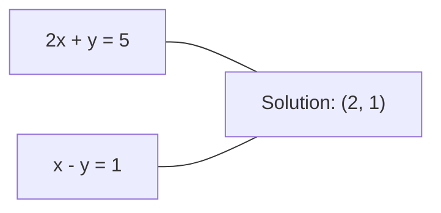
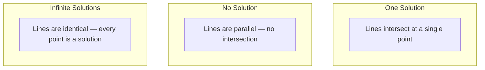

# Sistemas Lineares

> Resolver Ax = b é o problema mais antigo da matemática que ainda dirige a sua rede neural.

**Type:** Build
**Language:**Python
**Prerequisites:** Phase 1, Lessons 01 (Linear Algebra Intuition), 02 (Vectors & Matrices), 03 (Matrix Transformations)
**Time:** ~120 minutes

## Objetivos de aprendizagem

- Resolver Ax = b usando a eliminação de Gaussian com rotação parcial e substituição de volta
- Matriz de fatores com decomposições LU, QR e Cholesky e explicar quando cada uma é apropriada
- Derivar as equações normais para os mínimos quadrados e conectá-los à regressão linear e de cresta
- Diagnóstico de sistemas mal condicionados usando o número de condição e aplicar regularização para estabilizá-los

## O problema

Cada vez que você treina uma regressão linear, você resolve um sistema linear.`y = Wx + b`Quando você adiciona regularização, você modifica o sistema. Quando você usa processos de Gaussian, você faz uma matriz. Quando você inverte uma matriz de covariância para a distância de Mahalanobis, você resolve um sistema linear.

A equação Ax = b aparece em todos os lugares. A é uma matriz de coeficientes conhecidos. b é um vetor de saídas conhecidas. x é o vetor de desconhecidos que você quer encontrar. Na regressão linear, A é sua matriz de dados, b é seu vetor de destino e x é o vetor de peso. Todo o modelo se reduz a: encontrar x de tal forma que Ax esteja o mais próximo de b possível.

Esta lição constrói todos os principais métodos para resolver essa equação a partir do zero. Você entenderá por que alguns métodos são rápidos e outros são estáveis, por que alguns funcionam apenas para sistemas quadrados e outros lidam com sistemas sobredeterminados, e por que o número de condição de sua matriz determina se sua resposta significa alguma coisa.

## O conceito

### O que Ax = b significa geométricamente

Um sistema de equações lineares tem uma interpretação geométrica. Cada equação define um hiperplano. A solução é o ponto (ou conjunto de pontos) onde todos os hiperplanos se cruzam.

```
2x + y = 5          Two lines in 2D.
x - y  = 1          They intersect at x=2, y=1.
```



Podem acontecer três coisas:



Na forma de matriz, "uma solução" significa que A é invertível. "Nenhuma solução" significa que o sistema é inconsistente. "Soluções infinitas" significa que A tem um espaço nulo. A maioria dos problemas ML se enquadra na categoria "não há solução exata" porque você tem mais equações (pontos de dados) do que desconhecidos (parâmetros). É aí que menos quadrados entram.

### Imagens de coluna vs imagens de linha

Existem duas maneiras de ler Ax = b.

**Row picture.**Cada linha de A define uma equação. Cada equação é um hiperplano. A solução é onde todos eles se cruzam.

**Column picture.**Cada coluna de A é um vetor. A questão se torna: qual combinação linear das colunas de A produz b?

```
A = | 2  1 |    b = | 5 |
    | 1 -1 |        | 1 |

Row picture: solve 2x + y = 5 and x - y = 1 simultaneously.

Column picture: find x1, x2 such that:
  x1 * [2, 1] + x2 * [1, -1] = [5, 1]
  2 * [2, 1] + 1 * [1, -1] = [4+1, 2-1] = [5, 1]   check.
```

A imagem de coluna é mais fundamental. Se b estiver no espaço de coluna de A, o sistema tem uma solução. Se b não estiver, você encontrará o ponto mais próximo no espaço de coluna.

### Eliminação gaussiana

A eliminação de Gaussian transforma Ax = b em um sistema triangular superior Ux = c que você resolve pela substituição de volta. É o método mais direto.

O algoritmo:

```
1. For each column k (the pivot column):
   a. Find the largest entry in column k at or below row k (partial pivoting).
   b. Swap that row with row k.
   c. For each row i below k:
      - Compute multiplier m = A[i][k] / A[k][k]
      - Subtract m times row k from row i.
2. Back substitute: solve from the last equation upward.
```

Exemplo:

```
Original:
| 2  1  1 | 8 |       R2 = R2 - (2)R1     | 2  1   1 |  8 |
| 4  3  3 |20 |  -->  R3 = R3 - (1)R1 --> | 0  1   1 |  4 |
| 2  3  1 |12 |                            | 0  2   0 |  4 |

                       R3 = R3 - (2)R2     | 2  1   1 |  8 |
                                       --> | 0  1   1 |  4 |
                                           | 0  0  -2 | -4 |

Back substitute:
  -2 * x3 = -4    -->  x3 = 2
  x2 + 2  = 4     -->  x2 = 2
  2*x1 + 2 + 2 = 8 --> x1 = 2
```

A eliminação gaussiana custa operações O ((n^3). Para um sistema 1000x1000, isso é cerca de um bilhão de operações de ponto flutuante. Rápido, mas você pode fazer melhor se você precisar resolver vários sistemas com o mesmo A.

### Pivagem parcial: por que é importante

Sem pivotar, a eliminação gaussiana pode falhar ou produzir lixo. Se um elemento pivoto é zero, você divide por zero. Se é pequeno, você amplifica erros de arredondamento.

```
Bad pivot:                       With partial pivoting:
| 0.001  1 | 1.001 |            Swap rows first:
| 1      1 | 2     |            | 1      1 | 2     |
                                 | 0.001  1 | 1.001 |
m = 1/0.001 = 1000              m = 0.001/1 = 0.001
R2 = R2 - 1000*R1               R2 = R2 - 0.001*R1
| 0.001  1     | 1.001   |      | 1      1     | 2     |
| 0     -999   | -999.0  |      | 0      0.999 | 0.999 |

x2 = 1.000 (correct)            x2 = 1.000 (correct)
x1 = (1.001 - 1)/0.001          x1 = (2 - 1)/1 = 1.000 (correct)
   = 0.001/0.001 = 1.000        Stable because the multiplier is small.
```

Na aritmética de pontos flutuantes com precisão limitada, a versão não pivotada pode perder dígitos significativos.

### Descomposição de LU

A matriz de decomposição de LU A em uma matriz triangular inferior L e uma matriz triangular superior U: A = LU. A matriz L armazena os multiplicadores da eliminação de Gaussian. A matriz U é o resultado da eliminação.

```
A = L @ U

| 2  1  1 |   | 1  0  0 |   | 2  1   1 |
| 4  3  3 | = | 2  1  0 | @ | 0  1   1 |
| 2  3  1 |   | 1  2  1 |   | 0  0  -2 |
```

Porque, uma vez que você tem L e U, resolver Ax = b para qualquer novo b custa apenas O ((n^2):

```
Ax = b
LUx = b
Let y = Ux:
  Ly = b    (forward substitution, O(n^2))
  Ux = y    (back substitution, O(n^2))
```

O custo O ((n^3) é pago uma vez durante a factorization. Cada solução subsequente é O ((n^2). Se você precisa resolver 1000 sistemas com os mesmos vectores A mas diferentes b, LU economiza um fator de 1000/3 no trabalho total.

Com a rotação parcial, você obtém PA = LU onde P é uma matriz de permutação gravando os swaps de fila.

### Descomposição QR

Os fatores de decomposição QR A em uma matriz ortogonal Q e uma matriz triangular superior R: A = QR.

Uma matriz ortogonal tem a propriedade Q^T Q = I. Suas colunas são vetores ortônormais.

```
A = Q @ R

Q has orthonormal columns: Q^T Q = I
R is upper triangular

To solve Ax = b:
  QRx = b
  Rx = Q^T b    (just multiply by Q^T, no inversion needed)
  Back substitute to get x.
```

QR é numericamente mais estável do que LU para resolver problemas de mínimos quadrados.

```
Given columns a1, a2, ... of A:

q1 = a1 / ||a1||

q2 = a2 - (a2 . q1) * q1        (subtract projection onto q1)
q2 = q2 / ||q2||                (normalize)

q3 = a3 - (a3 . q1) * q1 - (a3 . q2) * q2
q3 = q3 / ||q3||

R[i][j] = qi . aj    for i <= j
```

Cada passo remove o componente ao longo de todos os vetores q anteriores, deixando apenas a nova direção ortogonais.

### Cholesky decomposição

Quando A é simétrica (A = A^T) e positiva definida (todos os valores próprios positivos), você pode fatorizá-la como A = L L^T onde L é triangular inferior.

```
A = L @ L^T

| 4  2 |   | 2  0 |   | 2  1 |
| 2  5 | = | 1  2 | @ | 0  2 |

L[i][i] = sqrt(A[i][i] - sum(L[i][k]^2 for k < i))
L[i][j] = (A[i][j] - sum(L[i][k]*L[j][k] for k < j)) / L[j][j]    for i > j
```

Cholesky é duas vezes mais rápido do que LU e requer metade do armazenamento.

- Matriz de covariância são semi-definidas positivas simétricas (definidas positivas com regularização).
- A matriz do núcleo nos processos de Gaussian é simétrica positiva definida.
- O Hessiano de uma função convexa no mínimo é simétrico positivo definido.
- A^T A é sempre semi-definida positiva simétrica.

Em processos de Gaussian, você faz a matriz do núcleo K com Cholesky, então resolve K alfa = y para obter a média preditiva. O fator Cholesky também lhe dá o log-determinante para a probabilidade marginal: log det(K) = 2 * soma(log(diag(L))).

### Quadrados mínimos: quando Ax = b não tem solução exata

Se A é m x n com m > n (mais equações do que desconhecidas), o sistema é sobredeterminado. Não há solução exata. Em vez disso, você minimiza o erro quadrado:

```
minimize ||Ax - b||^2

This is the sum of squared residuals:
  sum((A[i,:] @ x - b[i])^2 for i in range(m))
```

O minimizador satisfaz as equações normais:

```
A^T A x = A^T b
```

Derivação: expandir a Ax - b b b b b b b 2 = (Ax - b) ^ T (Ax - b) = x^T A^T A x - 2 x^T A^T b + b^T b. Tomar o gradiente em relação a x, definir para zero: 2 A^T A x - 2 A^T b = 0.

```
Original system (overdetermined, 4 equations, 2 unknowns):
| 1  1 |         | 3 |
| 1  2 | x     = | 5 |       No exact x satisfies all 4 equations.
| 1  3 |         | 6 |
| 1  4 |         | 8 |

Normal equations:
A^T A = | 4  10 |    A^T b = | 22 |
        | 10 30 |            | 63 |

Solve: x = [1.5, 1.7]

This is linear regression. x[0] is the intercept, x[1] is the slope.
```

### Equações normais = regressão linear

A conexão é exata. Na regressão linear, a matriz de dados X tem uma linha por amostra e uma coluna por característica. O vector-alvo y tem uma entrada por amostra. O vector de peso w satisfaz:

```
X^T X w = X^T y
w = (X^T X)^(-1) X^T y
```

Esta é a solução fechada para a regressão linear.`sklearn.linear_model.LinearRegression.fit()`computa esta (ou um equivalente através de QR ou SVD).

Adicione um termo de regularização lambda * I à matriz e você obtém regressão de cresta:

```
(X^T X + lambda * I) w = X^T y
w = (X^T X + lambda * I)^(-1) X^T y
```

A regularização torna a matriz melhor condicionada (mais fácil de inverter com precisão) e evita o sobreajuste reduzindo os pesos para zero. A matriz X^T X + lambda * I é sempre simétrica positiva definida quando lambda > 0, então você pode usar Cholesky para resolvê-la.

### Pseudoinversos (Moore-Penrose)

O pseudoinverso A+ generaliza a inversão de matriz para matrizes não quadradas e singulares.

```
x = A+ b

where A+ = V Sigma+ U^T    (computed via SVD)
```

Sigma+ é formado tomando o recíproco de cada valor singular não zero e transpondo o resultado.

```
A = U Sigma V^T        (SVD)

Sigma = | 5  0 |       Sigma+ = | 1/5  0  0 |
        | 0  2 |                | 0  1/2  0 |
        | 0  0 |

A+ = V Sigma+ U^T
```

O pseudoinverso dá a solução de mínimos mínimos quadrados.
- Uma solução: A + b dá.
- Nenhuma solução: A + b dá a solução de mínimos quadrados.
- Soluções infinitas: A+ b dá a solução com o menor número de soluções.

NumPy's `np.linalg.lstsq`E ...`np.linalg.pinv`Ambos usam o SVD internamente.

### Número de condição

O número de condição mede o quão sensível a solução é a pequenas mudanças na entrada.

```
kappa(A) = ||A|| * ||A^(-1)|| = sigma_max / sigma_min
```

onde sigma_max e sigma_min são os valores singulares maiores e menores.

```
Well-conditioned (kappa ~ 1):        Ill-conditioned (kappa ~ 10^15):
Small change in b -->                Small change in b -->
small change in x                    huge change in x

| 2  0 |   kappa = 2/1 = 2          | 1   1          |   kappa ~ 10^15
| 0  1 |   safe to solve            | 1   1+10^(-15) |   solution is garbage
```

Regras de execução:
- Kappa < 100: seguro, solução precisa.
- Kappa ~ 10^k: você perde cerca de k dígitos de precisão de sua aritmética de ponto flutuante.
- Kappa ~ 10^16 (para float64): a solução é sem sentido.

No ML, a mal-condicionamento ocorre quando as características são quase colineares. A regularização (adindo lambda * I) melhora o número de condição de sigma_max / sigma_min para (sigma_max + lambda) / (sigma_min + lambda).

### Métodos iterativos: gradiente conjugado

Para sistemas muito grandes e raros (milhões de desconhecidos), métodos diretos como LU ou Cholesky são muito caros.

O gradiente conjugado (CG) resolve Ax = b quando A é simétrico positivo definido. Ele encontra a solução exata em no máximo n iterações (em aritmética exata), mas normalmente converge muito mais rápido se os valores próprios de A são agrupados.

```
Algorithm sketch:
  x0 = initial guess (often zero)
  r0 = b - A x0           (residual)
  p0 = r0                 (search direction)

  For k = 0, 1, 2, ...:
    alpha = (rk . rk) / (pk . A pk)
    x_{k+1} = xk + alpha * pk
    r_{k+1} = rk - alpha * A pk
    beta = (r_{k+1} . r_{k+1}) / (rk . rk)
    p_{k+1} = r_{k+1} + beta * pk
    if ||r_{k+1}|| < tolerance: stop
```

CG é utilizado em:
- Optimização em larga escala (método Newton-CG)
- Resolver discretas de PDE
- Métodos do núcleo onde a matriz do núcleo é grande demais para factorizar
- Precondicionamento para outros solventes iterativos

A taxa de convergência depende do número de condições. Os sistemas melhor condicionados convergem mais rapidamente, o que é outra razão pela qual a regularização ajuda.

### O quadro completo: qual método quando

| Method | Requirements | Cost | Use case |
|--------|-------------|------|----------|
| Gaussian elimination | Square, nonsingular A | O(n^3) | One-off solve of a square system |
| LU decomposition | Square, nonsingular A | O(n^3) factor + O(n^2) solve | Multiple solves with the same A |
| QR decomposition | Any A (m >= n) | O(mn^2) | Least squares, numerically stable |
| Cholesky | Symmetric positive definite A | O(n^3/3) | Covariance matrices, Gaussian processes, ridge regression |
| Normal equations | Overdetermined (m > n) | O(mn^2 + n^3) | Linear regression (small n) |
| SVD / pseudoinverse | Any A | O(mn^2) | Rank-deficient systems, minimum-norm solutions |
| Conjugate gradient | Symmetric positive definite, sparse A | O(n * k * nnz) | Large sparse systems, k = iterations |

### Conexão com a ML

Cada método desta lição aparece na ML de produção:

**Linear regression.**A solução de forma fechada resolve as equações normais X^T X w = X^T y. Isso é feito através de Cholesky (se n é pequeno) ou QR (se a estabilidade numérica importa) ou SVD (se a matriz pode ser deficiente em grau).

**Ridge regression.**Adiciona lambda * I a X^T X. O sistema regularizado (X^T X + lambda * I) w = X^T y é sempre resolvivel através de Cholesky porque X^T X + lambda * I é simétrico positivo definido para lambda > 0.

**Gaussian processes.**A média preditiva requer resolver K alfa = y onde K é a matriz do kernel. A fatorização de Cholesky de K é a abordagem padrão.

**Neural network initialization.**A inicialização ortogonal usa a decomposição QR para criar matrizes de peso cujas colunas são ortônormais.

**Preconditioning.**Os optimizadores de grande escala usam Cholesky incompleto ou LU incompleto como pré-condições para os solventes de gradiente conjugados.

**Feature engineering.**O número de condição de X^T X diz-lhe se suas características são colineares.

```figure
linear-system-conditioning
```

## Construí-lo

### Passo 1: Eliminação gaussiana com rotação parcial

```python
import numpy as np

def gaussian_elimination(A, b):
    n = len(b)
    Ab = np.hstack([A.astype(float), b.reshape(-1, 1).astype(float)])

    for k in range(n):
        max_row = k + np.argmax(np.abs(Ab[k:, k]))
        Ab[[k, max_row]] = Ab[[max_row, k]]

        if abs(Ab[k, k]) < 1e-12:
            raise ValueError(f"Matrix is singular or nearly singular at pivot {k}")

        for i in range(k + 1, n):
            m = Ab[i, k] / Ab[k, k]
            Ab[i, k:] -= m * Ab[k, k:]

    x = np.zeros(n)
    for i in range(n - 1, -1, -1):
        x[i] = (Ab[i, -1] - Ab[i, i+1:n] @ x[i+1:n]) / Ab[i, i]

    return x
```

### Passo 2: decomposição da LU

```python
def lu_decompose(A):
    n = A.shape[0]
    L = np.eye(n)
    U = A.astype(float).copy()
    P = np.eye(n)

    for k in range(n):
        max_row = k + np.argmax(np.abs(U[k:, k]))
        if max_row != k:
            U[[k, max_row]] = U[[max_row, k]]
            P[[k, max_row]] = P[[max_row, k]]
            if k > 0:
                L[[k, max_row], :k] = L[[max_row, k], :k]

        for i in range(k + 1, n):
            L[i, k] = U[i, k] / U[k, k]
            U[i, k:] -= L[i, k] * U[k, k:]

    return P, L, U

def lu_solve(P, L, U, b):
    n = len(b)
    Pb = P @ b.astype(float)

    y = np.zeros(n)
    for i in range(n):
        y[i] = Pb[i] - L[i, :i] @ y[:i]

    x = np.zeros(n)
    for i in range(n - 1, -1, -1):
        x[i] = (y[i] - U[i, i+1:] @ x[i+1:]) / U[i, i]

    return x
```

### Passo 3: Decomposição de Cholesky

```python
def cholesky(A):
    n = A.shape[0]
    L = np.zeros_like(A, dtype=float)

    for i in range(n):
        for j in range(i + 1):
            s = A[i, j] - L[i, :j] @ L[j, :j]
            if i == j:
                if s <= 0:
                    raise ValueError("Matrix is not positive definite")
                L[i, j] = np.sqrt(s)
            else:
                L[i, j] = s / L[j, j]

    return L
```

### Passo 4: Quadrados mínimos através de equações normais

```python
def least_squares_normal(A, b):
    AtA = A.T @ A
    Atb = A.T @ b
    return gaussian_elimination(AtA, Atb)

def ridge_regression(A, b, lam):
    n = A.shape[1]
    AtA = A.T @ A + lam * np.eye(n)
    Atb = A.T @ b
    L = cholesky(AtA)
    y = np.zeros(n)
    for i in range(n):
        y[i] = (Atb[i] - L[i, :i] @ y[:i]) / L[i, i]
    x = np.zeros(n)
    for i in range(n - 1, -1, -1):
        x[i] = (y[i] - L.T[i, i+1:] @ x[i+1:]) / L.T[i, i]
    return x
```

### Passo 5: Número de condição

```python
def condition_number(A):
    U, S, Vt = np.linalg.svd(A)
    return S[0] / S[-1]
```

## Usá-lo

Colocando as peças juntas para regressão linear e regressão de cresta em dados reais:

```python
np.random.seed(42)
X_raw = np.random.randn(100, 3)
w_true = np.array([2.0, -1.0, 0.5])
y = X_raw @ w_true + np.random.randn(100) * 0.1

X = np.column_stack([np.ones(100), X_raw])

w_ols = least_squares_normal(X, y)
print(f"OLS weights (ours):    {w_ols}")

w_np = np.linalg.lstsq(X, y, rcond=None)[0]
print(f"OLS weights (numpy):   {w_np}")
print(f"Max difference: {np.max(np.abs(w_ols - w_np)):.2e}")

w_ridge = ridge_regression(X, y, lam=1.0)
print(f"Ridge weights (ours):  {w_ridge}")

from sklearn.linear_model import Ridge
ridge_sk = Ridge(alpha=1.0, fit_intercept=False)
ridge_sk.fit(X, y)
print(f"Ridge weights (sklearn): {ridge_sk.coef_}")
```

## Envia-o

Esta lição produz:
- `code/linear_systems.py`contendo implementações a partir do zero da eliminação de Gaussian, decomposição de LU, decomposição de Cholesky, mínimos quadrados e regressão de cresta
- Uma demonstração de trabalho de que as equações normais e a Regressão Linear de sklearn produzem os mesmos pesos

## Exercícios

1. Resolva o sistema .`[[1,2,3],[4,5,6],[7,8,10]] x = [6, 15, 27]`usando a sua eliminação Gaussian, o seu solvente LU, e `np.linalg.solve`Verifique se os três dão a mesma resposta dentro da tolerância de ponto flutuante.

2. Gerenar uma matriz aleatória X 50x5 e alvo y = X @ w_true + ruído. Resolver para w usando equações normais, QR (via `np.linalg.qr`), SVD (via `np.linalg.svd`), e `np.linalg.lstsq`Compare as quatro soluções, mensure o número de condição de X^T X e explique como isso afeta o método em que você confia.

3. Crie uma matriz quase singular fazendo duas colunas quase idênticas (por exemplo, coluna 2 = coluna 1 + 1e-10 * ruído). Calcule seu número de condição. Resolva Ax = b com e sem regularização (adjunto 0,01 * I). Comparar as soluções e resíduos. Explique por que a regularização ajuda.

4. Implementar o algoritmo de gradiente conjugado para uma matriz definida positiva simétrica aleatória 100x100. Conte quantas iterações é necessário para convergir para a tolerância 1e-8. Compare com o máximo teórico de n iterações.

5. Tempo do seu solvente Cholesky vs. seu solvente LU vs.`np.linalg.solve`Em matrizes definidas positivas simétricas de tamanho 10, 50, 200, 500.

## Termos-chave

| Term | What people say | What it actually means |
|------|----------------|----------------------|
| Linear system | "Solve for x" | A set of linear equations Ax = b. Finding x means finding the input that produces output b under transformation A. |
| Gaussian elimination | "Row reduce" | Systematically zero out entries below the diagonal using row operations, producing an upper triangular system solvable by back substitution. O(n^3). |
| Partial pivoting | "Swap rows for stability" | Before eliminating in column k, swap the row with the largest absolute value in that column to the pivot position. Prevents division by small numbers. |
| LU decomposition | "Factor into triangles" | Write A = LU where L is lower triangular (stores multipliers) and U is upper triangular (the eliminated matrix). Amortizes the O(n^3) cost over multiple solves. |
| QR decomposition | "Orthogonal factorization" | Write A = QR where Q has orthonormal columns and R is upper triangular. More stable than LU for least squares. |
| Cholesky decomposition | "Square root of a matrix" | For symmetric positive definite A, write A = LL^T. Half the cost of LU. Used for covariance matrices, kernel matrices, and ridge regression. |
| Least squares | "Best fit when exact is impossible" | Minimize the sum of squared residuals ||Ax - b||^2 when the system is overdetermined (more equations than unknowns). |
| Normal equations | "The calculus shortcut" | A^T A x = A^T b. Setting the gradient of ||Ax - b||^2 to zero. This IS the closed-form solution to linear regression. |
| Pseudoinverse | "Inversion for non-square matrices" | A+ = V Sigma+ U^T via SVD. Gives the minimum-norm least-squares solution for any matrix, square or rectangular, singular or not. |
| Condition number | "How trustworthy is this answer" | kappa = sigma_max / sigma_min. Measures sensitivity to input perturbations. Lose about log10(kappa) digits of precision. |
| Ridge regression | "Regularized least squares" | Solve (X^T X + lambda I) w = X^T y. Adding lambda I improves conditioning and shrinks weights toward zero. Prevents overfitting. |
| Conjugate gradient | "Iterative Ax=b for big matrices" | An iterative solver for symmetric positive definite systems. Converges in at most n steps. Practical for large sparse systems where factorization is too expensive. |
| Overdetermined system | "More data than parameters" | m > n in an m-by-n system. No exact solution exists. Least squares finds the best approximation. This is every regression problem. |
| Back substitution | "Solve from the bottom up" | Given an upper triangular system, solve the last equation first, then substitute backward. O(n^2). |
| Forward substitution | "Solve from the top down" | Given a lower triangular system, solve the first equation first, then substitute forward. O(n^2). Used in the L step of LU solves. |

## Mais leitura

- [MIT 18.06: Linear Algebra](https://ocw.mit.edu/courses/18-06-linear-algebra-spring-2010/)(Gilbert Strang) - o curso definitivo sobre sistemas lineares e factorizations de matriz
- [Numerical Linear Algebra](https://people.maths.ox.ac.uk/trefethen/text.html)(Trefethen & Bau) -- a referência padrão para entender a estabilidade numérica, condicionamento, e por que os algoritmos falham
- [Matrix Computations](https://www.cs.cornell.edu/cv/GolubVanLoan4/golubandvanloan.htm)(Golub & Van Loan) -- a referência enciclopédica para cada algoritmo de matriz
- [3Blue1Brown: Inverse Matrices](https://www.3blue1brown.com/lessons/inverse-matrices)-- intuição visual para o que resolver Ax = b significa geométricamente
