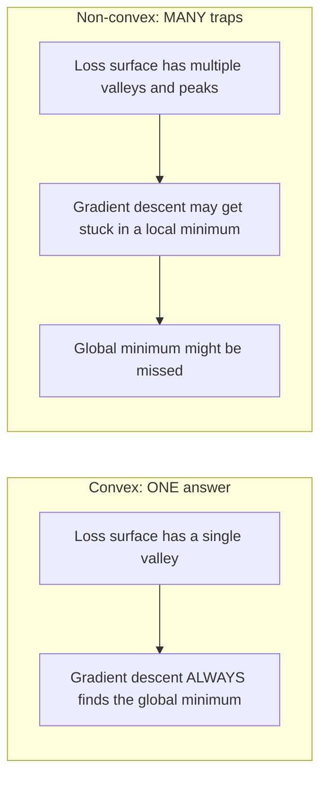
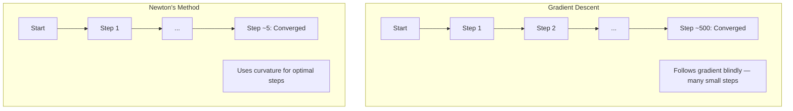
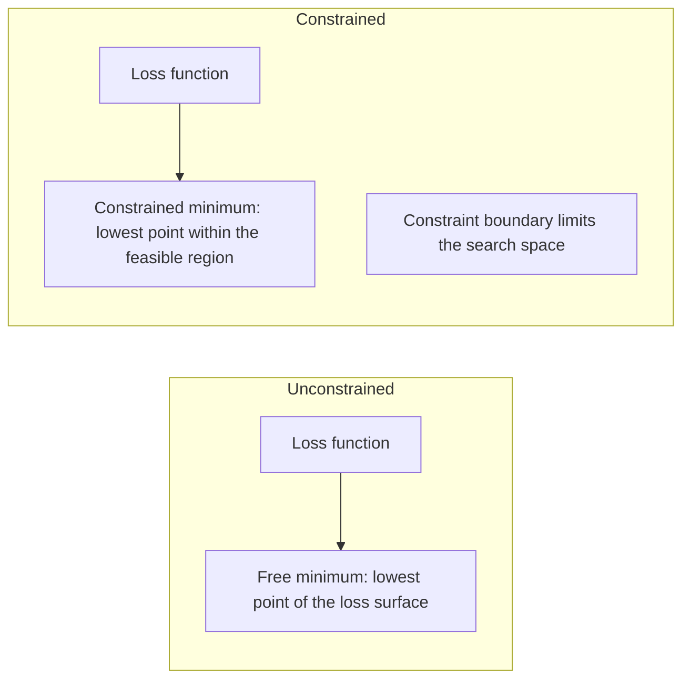
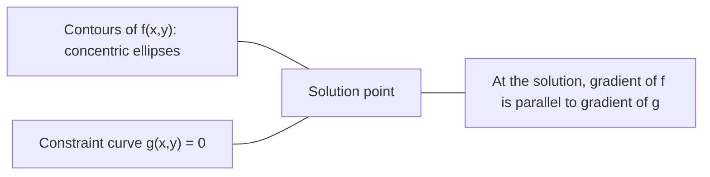

# Optimização convexa

> Os problemas convexos têm um vale, as redes neurais têm milhões, e saber a diferença importa.

**Type:** Build
**Language:**Python
**Prerequisites:** Phase 1, Lessons 04 (Calculus for ML), 08 (Optimization)
**Time:** ~90 minutes

## Objetivos de aprendizagem

- Teste se uma função é convexa usando a definição, a segunda derivada e os critérios de Hessian
- Implementar o método de Newton e comparar sua convergência quadrática contra a descida de gradiente
- Resolver problemas de otimização restritos usando multiplicadores de Lagrange e interpretar condições KKT
- Explicar por que as paisagens de perda de rede neural não são convexas, mas a SGD ainda encontra boas soluções

## O problema

A lição 08 ensinou-lhe descida de gradiente, impulso e Adão. Esses optimistas caminham descendo em qualquer superfície. Mas eles não têm garantias.

Mas muitos problemas no aprendizado de máquina são convexos. Regressão linear, regressão logística, SVMs, LASSO, regressão de crista. Para estes, existe algo mais forte: otimização com garantias matemáticas. Um problema convexo tem exatamente um vale. Qualquer algoritmo que caminhe para baixo vai atingir o mínimo global. Não é necessário reiniciar. Não há horários de taxa de aprendizagem. Não há oração.

Compreender a convexidade faz três coisas. Primeiro, ele diz quando o seu problema é fácil (convexo) versus difícil (não convexo). Segundo, ele lhe dá ferramentas mais rápidas como o método de Newton para problemas convexos. Terceiro, ele explica conceitos que aparecem em todo o ML: regularização como restrição, dualidade em SVMs, e por que o aprendizado profundo funciona apesar de violar todas as propriedades agradáveis que a convexidade lhe dá.

## O conceito

### Sete convexos

Um conjunto S é convexo se, para quaisquer dois pontos em S, o segmento de linha entre eles também se encontra inteiramente em S.

| Convex sets | Not convex |
|---|---|
| **Rectangle**: any two points inside can be connected by a line segment that stays inside | **Star/crescent shape**: a line between two interior points can pass outside the set |
| **Triangle**: same property holds for all interior points | **Donut/annulus**: the hole means some line segments leave the set |
| The line segment between any two points stays within the set | The line segment between some pairs of points exits the set |

Teste formal: para qualquer ponto x, y em S e qualquer t em [0, 1], o ponto tx + (1-t) y também está em S.

Exemplos de conjuntos convexos:
- Uma linha, um plano, todos os R^n
- Uma bola (círculo, esfera, hiperesfera)
- Um espaço de meia-fase: {x: a^T x <= b}
- A intersecção de qualquer número de conjuntos convexos

Exemplos de conjuntos não convexos:
- Um donut (annulus)
- A união de dois círculos desarticulados
- Qualquer conjunto com um "dent" ou "buraco"

### Funções convexas

Uma função f é convexa se o seu domínio é um conjunto convexo e para qualquer dois pontos x, y no seu domínio e qualquer t em [0, 1]:

```
f(tx + (1-t)y) <= t*f(x) + (1-t)*f(y)
```

Geometricamente: o segmento de linha entre quaisquer dois pontos no gráfico fica acima ou no gráfico.

| Property | Convex function | Non-convex function |
|---|---|---|
| **Line segment test** | The line between any two points on the graph lies **above or on** the curve | The line between some points on the graph dips **below** the curve |
| **Shape** | Single bowl/valley curving upward | Multiple peaks and valleys with mixed curvature |
| **Local minima** | Every local minimum is the global minimum | Multiple local minima may exist at different heights |

Funções convexas comuns:
- f ((x) = x^2 (parabola)
- f(x) = ↓x (valor absoluto)
- f(x) = e^x (exponencial)
- f(x) = max(0, x) (ReLU, embora linear em pedaços)
- f(x) = -log(x) para x > 0 (log negativo)
- Qualquer função linear f ((x) = a^T x + b (tanto convexa quanto côncava)

### Teste de convexidade

Três testes práticos, do mais fácil ao mais rigoroso.

**Test 1: Second derivative test (1D).**Se f'(x) >= 0 para todos os x, então f é convexa.

- F'''(x) = 2 >= 0.
- f''(x) = x^3: f''(x) = 6x. Negativo para x < 0. Não é convexo.
- F''(x) = e^x: f''(x) = e^x > 0.

**Test 2: Hessian test (multivariate).**Se a matriz hessiana H ((x) é semidefinita positiva para todos os x, então f é convexa.

**Test 3: Definition test.**Verifique a desigualdade f ((tx + (1-t) y) <= t * f ((x) + (1-t) * f ((y) diretamente. Útil para funções onde as derivadas são difíceis de calcular.

### Por que a convexidade é importante

O teorema central da otimização convexa:

**For a convex function, every local minimum is a global minimum.**

O algoritmo é garantido para convergir para a solução ideal.



Consequências:
- Não é preciso reiniciar aleatoriamente
- Não é necessário um ritmo de aprendizagem sofisticado
- É possível verificar a convergência (a taxa depende das propriedades da função)
- A solução é única (até regiões planas)

### Convexo vs não convexo em ML

| Problem | Convex? | Why |
|---------|---------|-----|
| Linear regression (MSE) | Yes | Loss is quadratic in weights |
| Logistic regression | Yes | Log-loss is convex in weights |
| SVM (hinge loss) | Yes | Maximum of linear functions |
| LASSO (L1 regression) | Yes | Sum of convex functions is convex |
| Ridge regression (L2) | Yes | Quadratic + quadratic = convex |
| Neural network (any loss) | No | Nonlinear activations create non-convex landscape |
| k-means clustering | No | Discrete assignment step |
| Matrix factorization | No | Product of unknowns |

Os modelos lineares com perdas convexas são convexas.

### A Matriz Hessiana

O Hessiano de uma função f: R^n -> R é a matriz n x n de derivadas parciais de segunda.

```
H[i][j] = d^2 f / (dx_i dx_j)
```

Para f ((x, y) = x^2 + 3xy + y^2:

```
df/dx = 2x + 3y       d^2f/dx^2 = 2      d^2f/dxdy = 3
df/dy = 3x + 2y       d^2f/dydx = 3      d^2f/dy^2 = 2

H = [ 2  3 ]
    [ 3  2 ]
```

O Hessiano fala-lhe sobre a curvatura:
- Valores próprios todos positivos: a função curva para cima em todas as direções (convexa nesse ponto)
- Valores próprios todos negativos: curvas para baixo em todas as direções (concavo, um local máximo)
- Sinais mistos: ponto de sela (curvas para cima em algumas direções, para baixo em outras)
- Valor próprio zero: plano nessa direcção (degenerado)

Para a convexidade, o Hessiano deve ser semidefinito positivo (todos os valores próprios >= 0) em todos os lugares, não apenas em um ponto.

### Método de Newton

A descida gradiente usa informações de primeira ordem (o gradiente). O método de Newton usa informações de segunda ordem (o Hessiano).

```
Update rule:
  x_new = x - H^(-1) * gradient

Compare to gradient descent:
  x_new = x - lr * gradient
```

O método de Newton substitui a taxa de aprendizagem escalar pelo Hessiano inverso.



Benefícios:
- Convergência quadrática próxima ao mínimo (quadrados de erro em cada passo)
- Não há taxa de aprendizagem para sintonizar
- Invariante de escala (funciona independentemente de como você parâmetre o problema)

Desvantagens:
- O cálculo do Hessian custa O  n^2) memória e O  n^3) para inverter
- Para uma rede neural com 1 milhão de pesos, isto é, 10^12 entradas e 10^18 operações
- Não prático para aprendizagem profunda

### Optimização limitada

Optimização sem restrições: minimizar f ((x) sobre todos os x.
Otimizamento restrito: minimizar f ((x) sujeito a restrições.

Os problemas reais têm limitações. Você quer minimizar os custos, mas o seu orçamento é limitado. Você quer minimizar os erros, mas a sua complexidade do modelo é limitada.



### Multiplicadores de lagrança

O método dos multiplicadores de Lagrange converte um problema restrito em um sem restrições.

Problema: minimizar f ((x) sujeito a g ((x) = 0.

Solução: introduzir uma nova variável (o lambda do multiplicador de Lagrange) e resolver o problema sem restrições:

```
L(x, lambda) = f(x) + lambda * g(x)
```

Na solução, o gradiente de L é zero:

```
dL/dx = df/dx + lambda * dg/dx = 0
dL/dlambda = g(x) = 0
```

Intuição geométrica: no mínimo restrito, o gradiente de f deve ser paralelo ao gradiente da restrição g. Se não forem paralelas, você pode se mover ao longo da superfície da restrição e reduzir f ainda mais.



Exemplo: minimizar f ((x,y) = x^2 + y^2 sujeito a x + y = 1.

```
L = x^2 + y^2 + lambda(x + y - 1)

dL/dx = 2x + lambda = 0  =>  x = -lambda/2
dL/dy = 2y + lambda = 0  =>  y = -lambda/2
dL/dlambda = x + y - 1 = 0

From first two: x = y
Substituting: 2x = 1, so x = y = 0.5, lambda = -1
```

O ponto mais próximo da linha x + y = 1 à origem é (0,5, 0,5).

### Condições da KKT

As condições Karush-Kuhn-Tucker estendem os multiplicadores de Lagrange a restrições de desigualdade.

Problema: minimizar f  x) sujeito a g  i  x) <= 0 para i = 1, ..., m.

As condições de KKT (necessárias para a otimização):

```
1. Stationarity:    df/dx + sum(lambda_i * dg_i/dx) = 0
2. Primal feasibility:  g_i(x) <= 0  for all i
3. Dual feasibility:    lambda_i >= 0  for all i
4. Complementary slackness:  lambda_i * g_i(x) = 0  for all i
```

A lenteza complementar é a principal noção: ou a restrição é ativa (g_i = 0, a solução fica na fronteira) ou o multiplicador é zero (a restrição não importa).

As condições KKT são fundamentais para os SVM. Os vetores de apoio são os pontos de dados onde a restrição é ativa (lambda > 0).

### Regularização como otimização limitada

A regularização L1 e L2 não são truques arbitrários, são problemas de otimização limitada disfarçados.

**L2 regularization (Ridge):**

```
minimize  Loss(w)  subject to  ||w||^2 <= t

Equivalent unconstrained form:
minimize  Loss(w) + lambda * ||w||^2
```

A restrição de desvio em desvio <= t define uma bola (círculo em 2D, esfera 3D).

**L1 regularization (LASSO):**

```
minimize  Loss(w)  subject to  ||w||_1 <= t

Equivalent unconstrained form:
minimize  Loss(w) + lambda * ||w||_1
```

A restrição de que não é necessário <= t define um diamante (quadrado rotativo em 2D).

| Property | L2 constraint (circle) | L1 constraint (diamond) |
|---|---|---|
| **Constraint shape** | Circle (sphere in higher dims) | Diamond (rotated square in 2D) |
| **Where loss contour touches** | Smooth boundary — any point on the circle | Corner — aligned with an axis |
| **Solution behavior** | Weights are small but nonzero | Some weights are exactly zero (sparse) |
| **Result** | Weight shrinkage | Feature selection |

Isso explica por que L1 produz modelos escassos (seleção de características) enquanto L2 apenas reduz os pesos. O diamante tem cantos alinhados com eixos. Os contornos de perda são mais propensos a tocar um canto, definindo um ou mais pesos exatamente a zero.

### Dualismo

Cada problema de otimização restrita (o primário) tem um problema companheiro (o duplo). Para os problemas convexos, o primário e o duplo têm o mesmo valor ideal.

A função dupla de Lagrange:

```
Primal: minimize f(x) subject to g(x) <= 0
Lagrangian: L(x, lambda) = f(x) + lambda * g(x)
Dual function: d(lambda) = min_x L(x, lambda)
Dual problem: maximize d(lambda) subject to lambda >= 0
```

Por que a dualidade é importante:
- O problema duplo é às vezes mais fácil de resolver do que o problema primário.
- Os SVM são resolvidos em sua forma dupla, onde o problema depende de produtos de pontos entre pontos de dados (activação do truque do kernel)
- O duplo fornece um limite inferior do óptimo primário, útil para verificar a qualidade da solução

Para os SVM especificamente:

```
Primal: find w, b that maximize the margin 2/||w|| subject to
        y_i(w^T x_i + b) >= 1 for all i

Dual:   maximize sum(alpha_i) - 0.5 * sum_ij(alpha_i * alpha_j * y_i * y_j * x_i^T x_j)
        subject to alpha_i >= 0 and sum(alpha_i * y_i) = 0

The dual only involves dot products x_i^T x_j.
Replace x_i^T x_j with K(x_i, x_j) to get the kernel trick.
```

### Por que o aprendizado profundo funciona apesar da não-convexidade

As funções de perda de rede neural são muito não convexas. Por todas as medidas clássicas, otimizá-las deve falhar. No entanto, a descida do gradiente estocástico encontra boas soluções de forma confiável. Vários fatores explicam isso.

**Most local minima are good enough.**Em espaços de alta dimensão, pontos críticos aleatórios (onde o gradiente é zero) são em grande parte pontos de sela, não mínimos locais. Os poucos mínimos locais que existem tendem a ter valores de perda próximos ao mínimo global. Ficar preso em um mínimo local terrível é extremamente improvável quando o espaço de parâmetros tem milhões de dimensões.

**Saddle points, not local minima, are the real obstacle.**Em uma função com n parâmetros, um ponto de sela tem uma mistura de direções de curvatura positiva e negativa. Para um ponto crítico aleatório em dimensões altas, a probabilidade de todos os n valores próprios serem positivos (mínimo local) é aproximadamente 2 ^ - n. Quase todos os pontos críticos são pontos de sela.

**Overparameterization smooths the landscape.**As redes com mais parâmetros do que os exemplos de treinamento têm superfícies de perda mais suaves e conectadas.

**Loss landscape structure:**

| Property | Low-dimensional space | High-dimensional space |
|---|---|---|
| **Landscape** | Many isolated peaks and valleys | Smoothly connected valleys |
| **Minima** | Many isolated local minima | Few bad local minima; most are near-optimal |
| **Navigation** | Hard to find global minimum | Many paths lead to good solutions |
| **Critical points** | Mix of local minima and saddle points | Overwhelmingly saddle points, not local minima |

**Stochastic noise acts as implicit regularization.**O SGD de mini-batch adiciona ruído que impede o estabelecimento em mínimos nítidos. mínimos nítidos superfiquem; mínimos planos generalizam. O ruído favorece a otimização em direção a regiões planas da paisagem de perda.

### Métodos de segunda ordem na prática

O método de Newton puro é impraticável para grandes modelos. Várias aproximações tornam a informação de segunda ordem útil.

**L-BFGS (Limited-memory BFGS):**Aproxima o Hessiano inverso usando as últimas diferenças de gradiente m. Requer memória O(mn em vez de O(n^2). Funciona bem para problemas com até ~ 10.000 parâmetros.

**Natural gradient:**Utiliza a matriz de informação Fisher (esperado Hessian da probabilidade de log) em vez do Hessian padrão. Isso explica a geometria das distribuições de probabilidade. K-FAC (Curvatura aproximada de Cronécker-Fatorado) aproxima a matriz Fisher como um produto de Cronécker, tornando-a prática para redes neurais.

**Hessian-free optimization:**Utiliza gradiente conjugado para resolver Hx = g sem nunca formar H. Só requer produtos de vetor Hessiano, que podem ser calculados em tempo O ((n) através de diferenciação automática.

**Diagonal approximations:**O segundo momento de Adam é uma aproximação diagonal da diagonal de Hessian. AdaHessian estende isso usando elementos diagonais de Hessian reais através do estimador de Hutchinson.

| Method | Memory | Per-step cost | When to use |
|--------|--------|--------------|-------------|
| Gradient descent | O(n) | O(n) | Baseline, large models |
| Newton's method | O(n^2) | O(n^3) | Small convex problems |
| L-BFGS | O(mn) | O(mn) | Medium convex problems |
| Adam | O(n) | O(n) | Deep learning default |
| K-FAC | O(n) | O(n) per layer | Research, large-batch training |

```figure
convex-vs-nonconvex
```

## Construí-lo

### Passo 1: Verificador de convexidade

Construir uma função que teste a convexidade empiricamente por meio de pontos de amostragem e verificação da definição.

```python
import random
import math

def check_convexity(f, dim, bounds=(-5, 5), samples=1000):
    violations = 0
    for _ in range(samples):
        x = [random.uniform(*bounds) for _ in range(dim)]
        y = [random.uniform(*bounds) for _ in range(dim)]
        t = random.uniform(0, 1)
        mid = [t * xi + (1 - t) * yi for xi, yi in zip(x, y)]
        lhs = f(mid)
        rhs = t * f(x) + (1 - t) * f(y)
        if lhs > rhs + 1e-10:
            violations += 1
    return violations == 0, violations
```

### Passo 2: Método de Newton para 2D

Implemente o método de Newton usando um Hessiano explícito.

```python
def newtons_method(f, grad_f, hessian_f, x0, steps=50, tol=1e-12):
    x = list(x0)
    history = [x[:]]
    for _ in range(steps):
        g = grad_f(x)
        H = hessian_f(x)
        det = H[0][0] * H[1][1] - H[0][1] * H[1][0]
        if abs(det) < 1e-15:
            break
        H_inv = [
            [H[1][1] / det, -H[0][1] / det],
            [-H[1][0] / det, H[0][0] / det],
        ]
        dx = [
            H_inv[0][0] * g[0] + H_inv[0][1] * g[1],
            H_inv[1][0] * g[0] + H_inv[1][1] * g[1],
        ]
        x = [x[0] - dx[0], x[1] - dx[1]]
        history.append(x[:])
        if sum(gi ** 2 for gi in g) < tol:
            break
    return history
```

### Passo 3: Solvente do multiplicador de lagrança

Resolver a otimização limitada usando a descida de gradiente no Lagrangiano.

```python
def lagrange_solve(f_grad, g_val, g_grad, x0, lr=0.01,
                   lr_lambda=0.01, steps=5000):
    x = list(x0)
    lam = 0.0
    history = []
    for _ in range(steps):
        fg = f_grad(x)
        gv = g_val(x)
        gg = g_grad(x)
        x = [
            xi - lr * (fgi + lam * ggi)
            for xi, fgi, ggi in zip(x, fg, gg)
        ]
        lam = lam + lr_lambda * gv
        history.append((x[:], lam, gv))
    return history
```

### Passo 4: Comparar o primeiro e o segundo

Execute a descida do gradiente e o método de Newton na mesma função quadrática.

```python
def quadratic(x):
    return 5 * x[0] ** 2 + x[1] ** 2

def quadratic_grad(x):
    return [10 * x[0], 2 * x[1]]

def quadratic_hessian(x):
    return [[10, 0], [0, 2]]
```

O método de Newton converge em 1 passo (é exato para quadrática). A descida gradual levará centenas de passos porque os valores próprios do Hessiano diferem por um fator de 5, criando um vale alongado.

## Usá-lo

A análise da convexidade aplica-se directamente na escolha de modelos e solventes ML.

Para problemas convexos (regressão logística, SVM, LASSO):
- Utilize solventes dedicados (liblinear, CVXPY, scipy.optimize.minimize com method='L-BFGS-B')
- Esperem uma solução global única
- Os métodos de segunda ordem são práticos e rápidos

Para problemas não convexos (redes neurais):
- Utilize métodos de primeira ordem (SGD, Adam)
- Aceitar que a solução depende da inicialização e aleatoriedade
- Usar o excesso de parametrização, ruído e horários de taxa de aprendizagem como regularização implícita
- Não perca tempo à procura do mínimo global.

```python
from scipy.optimize import minimize

result = minimize(
    fun=lambda w: sum((y - X @ w) ** 2) + 0.1 * sum(w ** 2),
    x0=np.zeros(d),
    method='L-BFGS-B',
    jac=lambda w: -2 * X.T @ (y - X @ w) + 0.2 * w,
)
```

Para SVMs, a dupla formulação permite usar o truque do núcleo:

```python
from sklearn.svm import SVC

svm = SVC(kernel='rbf', C=1.0)
svm.fit(X_train, y_train)
print(f"Support vectors: {svm.n_support_}")
```

## Exercícios

1. **Convexity gallery.**Teste estas funções para convexidade usando o comprovador: f(x) = x^4, f(x) = sin(x), f(x,y) = x^2 + y^2, f(x,y) = x*y, f(x) = max(x, 0). Explique por que cada resultado faz sentido.

2. **Newton vs gradient descent race.**Execute ambos os métodos em f ((x,y) = 50*x^2 + y^2 a partir do ponto de partida (10, 10). Quantas etapas cada um precisa para alcançar a perda < 1e-10? O que acontece com a descida de gradiente quando o número de condição (ratio do maior ao menor valor próprio hessiano) aumenta?

3. **Lagrange multiplier geometry.**Minimizar f ((x,y) = (x-3) ^ 2 + (y-3) ^ 2 sujeito a x + 2y = 4. Verificar a solução verificando que o gradiente de f é paralelo ao gradiente de g na solução.

4. **Regularization constraint.**Implementar a otimização com restrição L1: minimizar (x-3)^2 + (y-2)^2 sujeito a ≠x ≠x ≠y ≠ <= 1. Mostre que a solução tem uma coordenada igual a zero (sparidade da restrição de diamante).

5. **Hessian eigenvalue analysis.**Calcule o Hessiano da função Rosenbrock em (1,1) e em (-1,1). Calcule os valores próprios em ambos os pontos. O que os valores próprios lhe dizem sobre a curvatura no mínimo versus longe dele?

## Termos-chave

| Term | What it means |
|------|---------------|
| Convex set | A set where the line segment between any two points in the set stays inside the set |
| Convex function | A function where the line between any two points on its graph lies above or on the graph. Equivalently, Hessian is positive semidefinite everywhere |
| Local minimum | A point lower than all nearby points. For convex functions, every local minimum is the global minimum |
| Global minimum | The lowest point of a function over its entire domain |
| Hessian matrix | The matrix of all second partial derivatives. Encodes curvature information |
| Positive semidefinite | A matrix whose eigenvalues are all non-negative. The multidimensional analogue of "second derivative >= 0" |
| Condition number | Ratio of largest to smallest eigenvalue of the Hessian. High condition number means elongated valleys and slow gradient descent |
| Newton's method | Second-order optimizer that uses the inverse Hessian to determine step direction and size. Quadratic convergence near the minimum |
| Lagrange multiplier | A variable introduced to convert a constrained optimization problem into an unconstrained one |
| KKT conditions | Necessary conditions for optimality with inequality constraints. Generalize Lagrange multipliers |
| Complementary slackness | At the solution, either a constraint is active or its multiplier is zero. Never both nonzero |
| Duality | Every constrained problem has a companion dual problem. For convex problems, both have the same optimal value |
| Strong duality | Primal and dual optimal values are equal. Holds for convex problems satisfying Slater's condition |
| L-BFGS | Approximate second-order method that stores the last m gradient differences instead of the full Hessian |
| Saddle point | A point where the gradient is zero but it is a minimum in some directions and a maximum in others |
| Overparameterization | Using more parameters than training examples. Smooths the loss landscape and reduces bad local minima |

## Mais leitura

- [Boyd & Vandenberghe: Convex Optimization](https://web.stanford.edu/~boyd/cvxbook/)- o livro-texto padrão, disponível gratuitamente na Internet
- [Bottou, Curtis, Nocedal: Optimization Methods for Large-Scale Machine Learning (2018)](https://arxiv.org/abs/1606.04838)- ponte teoria da otimização convexa e prática de aprendizagem profunda
- [Choromanska et al.: The Loss Surfaces of Multilayer Networks (2015)](https://arxiv.org/abs/1412.0233)- porque as redes neurais não convexas não são tão ruins como parecem
- [Nocedal & Wright: Numerical Optimization](https://link.springer.com/book/10.1007/978-0-387-40065-5)- referência abrangente do método de Newton, L-BFGS, e otimização limitada
