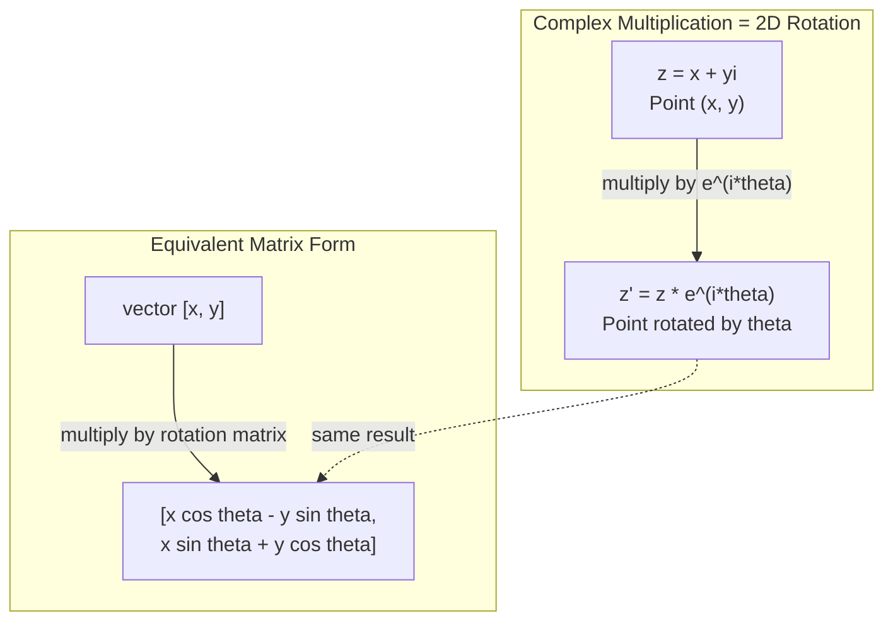
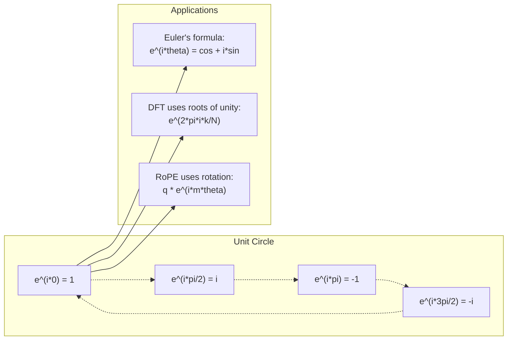

# Números complexos para IA

> A raiz quadrada de -1 não é imaginária, é a chave para rotações, frequências e metade do processamento de sinais.

**Type:** Learn
**Language:**Python
**Prerequisites:** Phase 1, Lessons 01-04 (linear algebra, calculus)
**Time:** ~60 minutes

## Objetivos de aprendizagem

- Realizar aritmética complexa (aditar, multiplicar, dividir, conjugar) em forma retangular e polar
- Aplicar a fórmula de Euler para converter entre exponenciais complexos e funções trigonometricas
- Implementar a Transforma Fourier Discreta usando raízes complexas de unidade
- Explicar como as rotações complexas são a base das codificações posicionais RoPE e sinusoidais em transformadores

## O problema

Abres um artigo sobre as transformações de Fourier e há`i`Olham para os codificadores de posição do transformador e veem`sin`E ...`cos`As partes reais e imaginárias de exponenciais complexos.

Os números complexos parecem abstratos. Um sistema de números construído na raiz quadrada de -1 parece um truque matemático. Mas não é um truque. É a linguagem natural das rotações e oscilações. Sempre que algo gira, vibra ou oscila, os números complexos são a ferramenta certa.

Sem entender números complexos, você não pode entender a Transformação de Fourier Discreta. Você não pode entender a FFT. Você não pode entender como RoPE (Rotary Position Embedding) funciona em modelos de linguagem modernos. Você não pode entender por que codificações posicionais sinusoidais no papel original Transformer usam as frequências que fazem.

Esta lição construi aritmética complexa a partir do zero, liga-a à geometria e mostra-lhe exatamente onde os números complexos aparecem na aprendizagem de máquina.

## O conceito

### O que é um número complexo?

Um número complexo tem duas partes: uma parte real e uma parte imaginária.

```
z = a + bi

where:
  a is the real part
  b is the imaginary part
  i is the imaginary unit, defined by i^2 = -1
```

É isso. Você estende a linha de números em um plano. Os números reais sentam-se em um eixo. Os números imaginários sentam-se no outro. Cada número complexo é um ponto neste plano.

### Aritmética complexa

**Addition.**Adicione as partes reais juntas, adicione as partes imaginárias juntas.

```
(a + bi) + (c + di) = (a + c) + (b + d)i

Example: (3 + 2i) + (1 + 4i) = 4 + 6i
```

**Multiplication.**Use a lei distributiva e lembre-se de que i^2 = -1.

```
(a + bi)(c + di) = ac + adi + bci + bdi^2
                 = ac + adi + bci - bd
                 = (ac - bd) + (ad + bc)i

Example: (3 + 2i)(1 + 4i) = 3 + 12i + 2i + 8i^2
                            = 3 + 14i - 8
                            = -5 + 14i
```

**Conjugate.**Vire o sinal da parte imaginária.

```
conjugate of (a + bi) = a - bi
```

O produto de um número complexo e seu conjugado é sempre real:

```
(a + bi)(a - bi) = a^2 + b^2
```

**Division.**Multiplicar o numerador e o denominador pelo conjugado do denominador.

```
(a + bi) / (c + di) = (a + bi)(c - di) / (c^2 + d^2)
```

Isso elimina a parte imaginária do denominador, dando-lhe um número complexo limpo.

### O plano complexo

O plano complexo mapeia cada número complexo para um ponto 2D. O eixo horizontal é o eixo real, o eixo vertical é o eixo imaginário.

```
z = 3 + 2i  corresponds to the point (3, 2)
z = -1 + 0i corresponds to the point (-1, 0) on the real axis
z = 0 + 4i  corresponds to the point (0, 4) on the imaginary axis
```

Um número complexo é simultaneamente um ponto e um vetor da origem. Esta interpretação dupla é o que torna os números complexos úteis para a geometria.

### Forma polar

Qualquer ponto no plano pode ser descrito pela sua distância da origem e o seu ângulo do eixo real positivo.

```
z = r * (cos(theta) + i*sin(theta))

where:
  r = |z| = sqrt(a^2 + b^2)     (magnitude, or modulus)
  theta = atan2(b, a)             (phase, or argument)
```

A forma retangular (a + bi) é boa para adição. A forma polar (r, theta) é boa para multiplicação.

**Multiplication in polar form.**Multiplicar as magnitudes, adicionar os ângulos.

```
z1 = r1 * e^(i*theta1)
z2 = r2 * e^(i*theta2)

z1 * z2 = (r1 * r2) * e^(i*(theta1 + theta2))
```

É por isso que os números complexos são perfeitos para rotações. Multiplicar por um número complexo com magnitude 1 é uma rotação pura.

### A fórmula de Euler

A ponte entre exponenciais complexos e trigonometria:

```
e^(i*theta) = cos(theta) + i*sin(theta)
```

Esta é a fórmula mais importante nesta lição.

```
e^(i*pi) = cos(pi) + i*sin(pi) = -1 + 0i = -1

Therefore: e^(i*pi) + 1 = 0
```

Cinco constantes fundamentais (e, i, pi, 1, 0) ligadas em uma equação.

### Por que a fórmula de Euler é importante para ML

A fórmula de Euler diz que`e^(i*theta)`A rotação total é a rotação total é a rotação total é a rotação total é a rotação total é a rotação total é a rotação total é a rotação total é a rotação total é a rotação total é a rotação total é a rotação total é a rotação total é a rotação total é a rotação total é a rotação total é a rotação total é a rotação total é a rotação total é a rotação total é a rotação total é a rotação total é a rotação total é a rotação total é a rotação total é a rotação total é a rotação total é a rotação total é a rotação total é a rotação total é a rotação total é a rotação total é a rotação total é a rotação total é a rotação total é a rotação total é a rotação total é a rotação total é a rotação total é a rotação total é a rotação total é a rotação total.

Isto significa que os exponenciais complexos são rotações.

### Conexão a rotações 2D

Multiplicando o número complexo (x + yi) por e^(i*theta) gira o ponto (x, y) por ângulo theta em torno da origem.

```
Rotation via complex multiplication:
  (x + yi) * (cos(theta) + i*sin(theta))
  = (x*cos(theta) - y*sin(theta)) + (x*sin(theta) + y*cos(theta))i

Rotation via matrix multiplication:
  [cos(theta)  -sin(theta)] [x]   [x*cos(theta) - y*sin(theta)]
  [sin(theta)   cos(theta)] [y] = [x*sin(theta) + y*cos(theta)]
```

Eles produzem resultados idênticos. Multiplicação complexa é rotação 2D. A matriz de rotação é apenas multiplicação complexa escrita em notação de matriz.



### Fámeros e sinais rotativos

Um complexo exponencial e^(i*omega*t) é um ponto que gira em torno do círculo unitário em frequência angular omega.

A parte real deste ponto de rotação é cosm * omega * t. A parte imaginária é sin * omega * t. Um sinal sinusoidal é a sombra de um número complexo rotativo.

```
e^(i*omega*t) = cos(omega*t) + i*sin(omega*t)

Real part:      cos(omega*t)    -- a cosine wave
Imaginary part: sin(omega*t)    -- a sine wave
```

Esta é a representação do fator. Em vez de rastrear uma onda sinusal movida, você rastreia uma seta que gira suavemente. As mudanças de fase se tornam offsets de ângulo. As mudanças de amplitude se tornam mudanças de magnitude. A adição de sinais se torna adição de vetores.

### Raízes da unidade

As raízes N-a da unidade são N pontos igualmente espaçados no círculo unitário:

```
w_k = e^(2*pi*i*k/N)    for k = 0, 1, 2, ..., N-1
```

Para N = 4, as raízes são: 1, i, -1, -i (os quatro pontos da bússola).
Para N = 8, você obtém os quatro pontos da bússola mais os quatro diagonais.

As raízes da unidade são a base da Transforma de Fourier Discreta.

### Conexão ao DFT

A Transforma Fourier Discreta de um sinal x[0], x[1], ..., x[N-1] é:

```
X[k] = sum_{n=0}^{N-1} x[n] * e^(-2*pi*i*k*n/N)
```

Cada X[k] mede o quanto o sinal correlaciona com a raiz k-th da unidade - um sinusoide complexo na frequência k. O DFT quebra um sinal em N fases rotativas e diz-lhe a amplitude e fase de cada uma.

### Porque não sou imaginário

A palavra "imaginária" é um acidente histórico. Descartes usou-a de forma desrespeitosa. Mas i não é mais imaginário do que os números negativos eram quando as pessoas os rejeitaram pela primeira vez. Os números negativos respondem "o que subtraímos de 5 de 3 para obter?" A unidade imaginária responde "o que você quadrada para obter -1?"

Mais útil: i é um operador de rotação de 90 graus. Multiplicar um número real por i uma vez, você gira 90 graus para o eixo imaginário. Multiplicar por i novamente (i^2), você gira mais 90 graus - agora você está apontando na direção real negativa. É por isso que i^2 = -1. Não é misterioso. É uma meia-volta construída a partir de duas quartas-volta.

É por isso que os números complexos estão em toda a engenharia. Qualquer coisa que gira - ondas eletromagnéticas, estados quânticos, oscilações de sinal, codificações posicionais - é naturalmente descrita por números complexos.

### Exponenciais complexos vs funções trigonometricas

Antes da fórmula de Euler, os engenheiros escreveram sinais como A*cos(omega*t + phi) - amplitude A, frequência omega, fase phi. Isso funciona, mas torna a aritmética dolorosa. Adicionar dois cosinos com fases diferentes requer identidades trigonômétricas.

Com exponenciais complexos, o mesmo sinal é A*e^(i*(omega*t + phi)). Adicionar dois sinais é apenas adicionar dois números complexos. Multiplicar (modular) é apenas multiplicar magnitudes e adicionar ângulos. As mudanças de fase se tornam adições de ângulo.

O campo inteiro de processamento de sinais mudou para notação exponencial complexa porque a matemática é mais limpa. O "sinal real" é sempre apenas a parte real da representação complexa. A parte imaginária é levada junto como contabilidade, fazendo com que toda a álgebra funcione naturalmente.

### Conexão a transformadores

**Sinusoidal positional encodings**(papel original de transformador):

```
PE(pos, 2i) = sin(pos / 10000^(2i/d))
PE(pos, 2i+1) = cos(pos / 10000^(2i/d))
```

Os pares de pecados e cos são as partes reais e imaginárias de exponenciais complexos em diferentes frequências. Cada frequência fornece uma "resolução" diferente para a posição de codificação. As frequências baixas mudam lentamente (posição grosseira). As frequências altas mudam rapidamente (posição fina). Juntas dão a cada posição uma impressão digital de frequência única.

**RoPE (Rotary Position Embedding)**A atenção é calculada usando esses vetores rotativos, tornando o modelo sensível à posição relativa através da multiplicação complexa.

| Operation | Algebraic Form | Geometric Meaning |
|-----------|---------------|-------------------|
| Addition | (a+c) + (b+d)i | Vector addition in the plane |
| Multiplication | (ac-bd) + (ad+bc)i | Rotate and scale |
| Conjugate | a - bi | Reflect over real axis |
| Magnitude | sqrt(a^2 + b^2) | Distance from origin |
| Phase | atan2(b, a) | Angle from positive real axis |
| Division | multiply by conjugate | Reverse rotation and rescale |
| Power | r^n * e^(i*n*theta) | Rotate n times, scale by r^n |



```figure
roots-of-unity
```

## Construí-lo

### Passo 1: Classe complexa

Construir uma classe de números complexos que suporta a aritmética, magnitude, fase e conversão entre formas retangulares e polares.

```python
import math

class Complex:
    def __init__(self, real, imag=0.0):
        self.real = real
        self.imag = imag

    def __add__(self, other):
        return Complex(self.real + other.real, self.imag + other.imag)

    def __mul__(self, other):
        r = self.real * other.real - self.imag * other.imag
        i = self.real * other.imag + self.imag * other.real
        return Complex(r, i)

    def __truediv__(self, other):
        denom = other.real ** 2 + other.imag ** 2
        r = (self.real * other.real + self.imag * other.imag) / denom
        i = (self.imag * other.real - self.real * other.imag) / denom
        return Complex(r, i)

    def magnitude(self):
        return math.sqrt(self.real ** 2 + self.imag ** 2)

    def phase(self):
        return math.atan2(self.imag, self.real)

    def conjugate(self):
        return Complex(self.real, -self.imag)
```

### Passo 2: Conversão polar e fórmula de Euler

```python
def to_polar(z):
    return z.magnitude(), z.phase()

def from_polar(r, theta):
    return Complex(r * math.cos(theta), r * math.sin(theta))

def euler(theta):
    return Complex(math.cos(theta), math.sin(theta))
```

Verificar: `euler(theta).magnitude()`Deve ser sempre 1.0. `euler(0)`deve dar (1, 0). `euler(pi)`deve dar (-1, 0).

### Passo 3: rotação

Rotar um ponto (x, y) por ângulo theta é uma multiplicação complexa:

```python
point = Complex(3, 4)
rotated = point * euler(math.pi / 4)
```

A magnitude permanece a mesma, só o ângulo muda.

### Passo 4: DFT da aritmética complexa

```python
def dft(signal):
    N = len(signal)
    result = []
    for k in range(N):
        total = Complex(0, 0)
        for n in range(N):
            angle = -2 * math.pi * k * n / N
            total = total + Complex(signal[n], 0) * euler(angle)
        result.append(total)
    return result
```

Esta é a O(N^2) DFT. Cada saída X[k] é a soma das amostras de sinal multiplicadas por raízes de unidade.

### Passo 5: DFT inverso

O DFT inverso reconstrui o sinal original a partir de seu espectro. As únicas mudanças do DFT para a frente: inverte o sinal no exponente e divide por N.

```python
def idft(spectrum):
    N = len(spectrum)
    result = []
    for n in range(N):
        total = Complex(0, 0)
        for k in range(N):
            angle = 2 * math.pi * k * n / N
            total = total + spectrum[k] * euler(angle)
        result.append(Complex(total.real / N, total.imag / N))
    return result
```

Aplique DFT, depois IDFT, e você retorna o sinal original à precisão da máquina.

### Passo 6: Raízes da unidade

```python
def roots_of_unity(N):
    return [euler(2 * math.pi * k / N) for k in range(N)]
```

Verificar duas propriedades:
- Cada raiz tem magnitude exatamente 1.
- A soma de todas as raízes N é zero (eles são anulados por simetria).

Estas propriedades são o que torna o DFT invertível. As raízes da unidade formam uma base ortogonais para o domínio de frequência.

## Usá-lo

Python tem suporte integrado a números complexos.`j`representa a unidade imaginária.

```python
z = 3 + 2j
w = 1 + 4j

print(z + w)
print(z * w)
print(abs(z))

import cmath
print(cmath.phase(z))
print(cmath.exp(1j * cmath.pi))
```

Para matrizes, numpy lida com números complexos nativamente:

```python
import numpy as np

z = np.array([1+2j, 3+4j, 5+6j])
print(np.abs(z))
print(np.angle(z))
print(np.conj(z))
print(np.real(z))
print(np.imag(z))

signal = np.sin(2 * np.pi * 5 * np.linspace(0, 1, 128))
spectrum = np.fft.fft(signal)
freqs = np.fft.fftfreq(128, d=1/128)
```

## Envia-o

Corra .`code/complex_numbers.py`para gerar `outputs/skill-complex-arithmetic.md`- Não .

## Exercícios

1. **Complex arithmetic by hand.**Calcule (2 + 3i) * (4 - i) e verifique com o código. Então, calcule (5 + 2i) / (1 - 3i). Desenhe ambos os resultados no plano complexo e verifique se a multiplicação girou e escalaram o primeiro número.

2. **Rotation sequence.**Comece com o ponto (1, 0). Multiplica por e^(i*pi/6) doze vezes. Verifique se você volta a (1, 0) após 12 multiplicações. Imprima as coordenadas em cada passo e confirme que eles rastream um regular de 12 gons.

3. **DFT of a known signal.**Crie um sinal que seja a soma dos sin ((2 * pi * 3 * t) e 0,5 * sin ((2 * pi * 7 * t) amostragados em 32 pontos. Exerça o seu DFT. Verifique se o espectro de magnitude tem picos em frequências 3 e 7, com o pico em 7 sendo metade da altura do pico em 3.

4. **Roots of unity visualization.**Calcule as 8a raízes da unidade. Verifique se somam a zero. Verifique se multiplicar qualquer raiz pela raiz primitiva e^(2*pi*i/8) dá a próxima raiz.

5. **Rotation matrix equivalence.**Para 10 ângulos aleatórios e 10 pontos aleatórios, verifique se a multiplicação complexa dá o mesmo resultado que a multiplicação de matriz-vector com a matriz de rotação 2x2.

## Termos-chave

| Term | What it means |
|------|---------------|
| Complex number | A number a + bi where a is the real part, b is the imaginary part, and i^2 = -1 |
| Imaginary unit | The number i, defined by i^2 = -1. Not imaginary in the philosophical sense -- it is a rotation operator |
| Complex plane | The 2D plane where the x-axis is real and the y-axis is imaginary. Also called the Argand plane |
| Magnitude (modulus) | The distance from the origin: sqrt(a^2 + b^2). Written as \|z\| |
| Phase (argument) | The angle from the positive real axis: atan2(b, a). Written as arg(z) |
| Conjugate | The mirror image across the real axis: conjugate of a + bi is a - bi |
| Polar form | Expressing z as r * e^(i*theta) instead of a + bi. Makes multiplication easy |
| Euler's formula | e^(i*theta) = cos(theta) + i*sin(theta). Connects exponentials to trigonometry |
| Phasor | A rotating complex number e^(i*omega*t) representing a sinusoidal signal |
| Roots of unity | The N complex numbers e^(2*pi*i*k/N) for k = 0 to N-1. N equally spaced points on the unit circle |
| DFT | Discrete Fourier Transform. Decomposes a signal into complex sinusoidal components using roots of unity |
| RoPE | Rotary Position Embedding. Uses complex multiplication to encode relative position in transformer attention |

## Mais leitura

- [Visual Introduction to Euler's Formula](https://betterexplained.com/articles/intuitive-understanding-of-eulers-formula/)- construi intuição geométrica sem notação pesada
- [Su et al.: RoFormer (2021)](https://arxiv.org/abs/2104.09864)- o papel que introduz a rotativa de posições de inserção com rotações complexas
- [Vaswani et al.: Attention Is All You Need (2017)](https://arxiv.org/abs/1706.03762)- o papel transformador original com codificações posicionais sinusoidais
- [3Blue1Brown: Euler's formula with introductory group theory](https://www.youtube.com/watch?v=mvmuCPvRoWQ)- explicação visual do porquê de e^(i*pi) = -1
- [Needham: Visual Complex Analysis](https://global.oup.com/academic/product/visual-complex-analysis-9780198534464)- o melhor tratamento visual de números complexos, cheio de conhecimentos geométricos
- [Strang: Introduction to Linear Algebra, Ch. 10](https://math.mit.edu/~gs/linearalgebra/)- números complexos no contexto da álgebra linear e dos valores próprios
