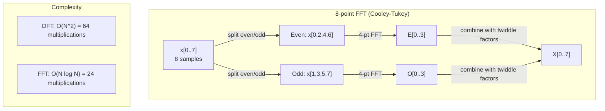
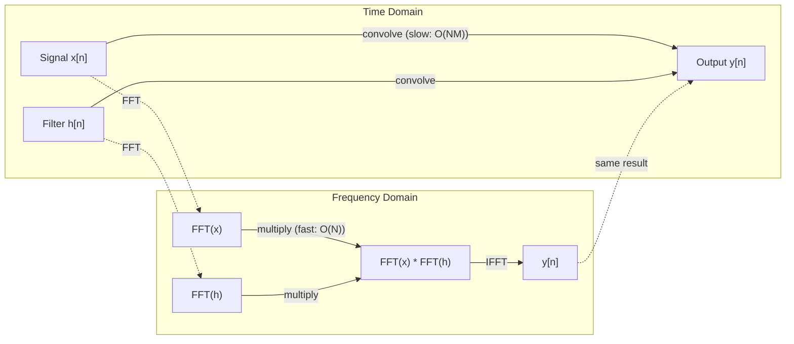

# A Transformação de Fourier

> Cada sinal é uma soma de ondas sinusais.

**Type:** Build
**Language:**Python
**Prerequisites:** Phase 1, Lessons 01-04, 19 (complex numbers)
**Time:** ~90 minutes

## Objetivos de aprendizagem

- Implementar o DFT a partir do zero e verificá-lo contra o O(N log N) Cooley-Tukey FFT
- Interpreta os coeficientes de frequência: extrair amplitude, fase e espectro de potência de um sinal
- Aplicar o teorema de convolução para realizar convolução através da multiplicação FFT
- Conectar a decomposição de frequência de Fourier para transformar codificadores posicionais e camadas de convolução CNN

## O problema

Uma gravação de áudio é uma sequência de medições de pressão ao longo do tempo. Um preço de ação é uma sequência de valores ao longo de dias. Uma imagem é uma grade de intensidades de pixels sobre o espaço. Todos estes são dados no domínio do tempo (ou domínio do espaço). Você vê valores mudando em algum índice.

Mas muitos padrões são invisíveis no domínio do tempo. Este sinal de áudio é um tom puro ou um acorde? Este preço das ações tem um ciclo semanal? Esta imagem tem uma textura repetitiva? Estas perguntas são sobre o conteúdo de frequência, e o domínio do tempo o oculta.

A transformação de Fourier converte dados do domínio do tempo para o domínio da frequência. Ele pega um sinal e o decompõe em ondas sinusais de diferentes frequências. Cada onda sinusa tem uma amplitude (quão forte é) e uma fase (onde começa).

Isto é importante para a ML porque o pensamento do domínio de frequência aparece em todos os lugares. As redes neurais convolucionais executam convolução, que é multiplicação no domínio de frequência. Os codificadores posicionais transformadores usam a decomposição de frequência para representar a posição. Os modelos de áudio (reconhecimento de fala, geração de música) operam em espectrogramas - representações de frequência do som. Os modelos de séries temporais procuram padrões periódicos. Entender a transformação de Fourier dá-lhe o vocabulário para trabalhar com todos estes.

## O conceito

### A definição de DFT

Dadas as amostras N x[0], x[1], ..., x[N-1], a Transforma de Fourier Discreta produz N coeficientes de frequência X[0], X[1], ..., X[N-1]:

```
X[k] = sum_{n=0}^{N-1} x[n] * e^(-2*pi*i*k*n/N)

for k = 0, 1, ..., N-1
```

Cada X [k] é um número complexo. Sua magnitude. X [k] que lhe diz a amplitude da frequência k. Seu ângulo de fase ((X [k]) diz-lhe o offset de fase dessa frequência.

A principal ideia:`e^(-2*pi*i*k*n/N)`O DFT calcula a correlação entre o sinal e cada uma das frequências de espaço igual N. Se o sinal contém energia na frequência k, a correlação é grande.

### O que significa cada coeficiente

**X[0]: the DC component.**Esta é a soma de todas as amostras -- proporcional à média. Representa a constante (frequência zero) de compensação do sinal.

```
X[0] = sum_{n=0}^{N-1} x[n] * e^0 = sum of all samples
```

**X[k] for 1 <= k <= N/2: positive frequencies.**X[k] representa os ciclos de frequência k por amostras N. A frequência mais alta k significa frequência mais alta (oscillação mais rápida).

**X[N/2]: the Nyquist frequency.**A maior frequência que podemos representar com amostras N. acima disso, obtemos aliasing -- frequências altas mascaradas como baixas.

**X[k] for N/2 < k < N: negative frequencies.**Para sinais de valor real, X[N-k] = conj(X[k]). As frequências negativas são imagens espelhadas das positivas. É por isso que a informação útil está nos primeiros coeficientes N/2 + 1.

### DFT inverso

O DFT inverso reconstitui o sinal original a partir dos seus coeficientes de frequência:

```
x[n] = (1/N) * sum_{k=0}^{N-1} X[k] * e^(2*pi*i*k*n/N)

for n = 0, 1, ..., N-1
```

As únicas diferenças do DFT para frente: o sinal no exponente é positivo (não negativo), e há um fator de normalização 1/N.

O DFT inverso é uma reconstrução perfeita. Não há informação perdida. Você pode ir de domínio de tempo para domínio de frequência e de volta sem qualquer erro. O DFT é uma mudança de base - ele reexprime a mesma informação em um sistema de coordenadas diferente.

### A FFT: a acelerar

O DFT definido acima é O ((N^2): para cada um dos coeficientes de saída N, você soma sobre amostras de entrada N. Para N = 1 milhão, isto é 10^12 operações.

A Transforma de Fourier Rápida (FFT) calcula o mesmo resultado em O  N log N. Para N = 1 milhão, isso é cerca de 20 milhões de operações em vez de um trilhão.

O algoritmo Cooley-Tukey (o FFT mais comum) funciona dividindo e conquistando:

1. Dividir o sinal em amostras indexadas e paradas.
2. Calcule o DFT de cada metade de forma recorrente.
3. Combinar as duas DFTs de meia dimensão usando "fatores de dupla" e^(-2*pi*i*k/N).

```
X[k] = E[k] + e^(-2*pi*i*k/N) * O[k]          for k = 0, ..., N/2 - 1
X[k + N/2] = E[k] - e^(-2*pi*i*k/N) * O[k]    for k = 0, ..., N/2 - 1

where E = DFT of even-indexed samples
      O = DFT of odd-indexed samples
```

A simetria significa que cada nível de recursão faz O(N) funcionar, e há níveis log2(N).



O FFT exige que o comprimento do sinal seja de 2 potências. Na prática, os sinais são empurrados a zero para a próxima potência de 2.

### Análise espectral

O **power spectrum**É X [k]^2 - a magnitude quadrada de cada coeficiente de frequência.

O **phase spectrum**é ângulo ((X[k]) -- o offset de fase de cada frequência. Para a maioria das tarefas de análise, você se importa com o espectro de potência e ignora a fase.

```
Power at frequency k:  P[k] = |X[k]|^2 = X[k].real^2 + X[k].imag^2
Phase at frequency k:  phi[k] = atan2(X[k].imag, X[k].real)
```

### Resolução de frequência

A resolução de frequência do DFT depende do número de amostras N e da taxa de amostragem fs.

```
Frequency of bin k:      f_k = k * fs / N
Frequency resolution:    delta_f = fs / N
Maximum frequency:       f_max = fs / 2  (Nyquist)
```

Para resolver duas frequências próximas, é preciso mais amostras. Para capturar frequências altas, é preciso uma taxa de amostragem mais alta.

### O teorema da convolução

Este é um dos resultados mais importantes no processamento de sinais e diretamente relevante para as emissoras de televisão.

**Convolution in the time domain equals pointwise multiplication in the frequency domain.**

```
x * h = IFFT(FFT(x) . FFT(h))

where * is convolution and . is element-wise multiplication
```

Por que isso importa:

- A convolução direta de dois sinais de comprimento N e M realiza operações O(N*M).
- A convolução baseada em FFT toma O(N log N): transforma ambos, multiplica, transforma de volta.
- Para núcleos grandes, a convolução FFT é dramaticamente mais rápida.
- É exatamente o que acontece nas camadas convolucionais com grandes campos receptivos.

Nota: o DFT calcula a convulsão circular (o sinal envolve-se). Para a convulsão linear (sem envolvimento), pad zero ambos os sinais para comprimento N + M - 1 antes da computação.



### Janela

O DFT assume que o sinal é periódico - trata as amostras N como um período de um sinal infinitamente repetitivo. Se o sinal não começar e terminar no mesmo valor, isso cria uma descontinuidade na fronteira, que aparece como conteúdo de alta frequência falso.

A janela reduz a fuga diminuindo o sinal para zero em ambas as extremidades antes de calcular o DFT.

Janela comum:

| Window | Shape | Main lobe width | Side lobe level | Use case |
|--------|-------|----------------|-----------------|----------|
| Rectangular | Flat (no window) | Narrowest | Highest (-13 dB) | When signal is exactly periodic in N samples |
| Hann | Raised cosine | Moderate | Low (-31 dB) | General purpose spectral analysis |
| Hamming | Modified cosine | Moderate | Lower (-42 dB) | Audio processing, speech analysis |
| Blackman | Triple cosine | Wide | Very low (-58 dB) | When side lobe suppression is critical |

```
Hann window:    w[n] = 0.5 * (1 - cos(2*pi*n / (N-1)))
Hamming window: w[n] = 0.54 - 0.46 * cos(2*pi*n / (N-1))
```

Aplicar a janela multiplicando-a por elemento com o sinal antes do DFT: `X = DFT(x * w)`- Não .

### Propriedades DFT

| Property | Time Domain | Frequency Domain |
|----------|-------------|-----------------|
| Linearity | a*x + b*y | a*X + b*Y |
| Time shift | x[n - k] | X[f] * e^(-2*pi*i*f*k/N) |
| Frequency shift | x[n] * e^(2*pi*i*f0*n/N) | X[f - f0] |
| Convolution | x * h | X * H (pointwise) |
| Multiplication | x * h (pointwise) | X * H (circular convolution, scaled by 1/N) |
| Parseval's theorem | sum \|x[n]\|^2 | (1/N) * sum \|X[k]\|^2 |
| Conjugate symmetry (real input) | x[n] real | X[k] = conj(X[N-k]) |

O teorema de Parseval diz que a energia total é a mesma em ambos os domínios.

### Conexão a codificações posicionais

O Transformer original usa codificações posicionais sinusoidais:

```
PE(pos, 2i)   = sin(pos / 10000^(2i/d_model))
PE(pos, 2i+1) = cos(pos / 10000^(2i/d_model))
```

Cada par de dimensões (2i, 2i+1) oscila em uma frequência diferente. As frequências são espaçadas geométricamente de alta (dimensão 0,1) para baixa (última dimensão). Isso dá a cada posição um padrão único em todas as bandas de frequência - semelhante à forma como os coeficientes de Fourier identificam um sinal de forma única.

As principais propriedades que isto fornece:

- **Uniqueness:**Não há duas posições com a mesma codificação.
- **Bounded values:**O pecado e o cos estão sempre em [-1, 1].
- **Relative position:**A codificação da posição p+k pode ser expressa como uma função linear da codificação na posição p. O modelo pode aprender a atender a posições relativas.

### Conexão com as CNNs

Uma camada de convolução aplica um filtro aprendido (núcleo) à entrada deslizando-o através do sinal ou imagem.

Pelo teorema da convolução, isto é equivalente a:
1. FFT a entrada
2. FFT o núcleo
3. Multiplicar no domínio de frequência
4. Se o resultado for

As implementações padrão da CNN usam convolução direta (mais rápida para pequenos kernels 3x3). Mas para kernels grandes ou convolução global, as abordagens baseadas em FFT são significativamente mais rápidas. Algumas arquiteturas (como FNet) substituem a atenção inteiramente por FFT, alcançando precisão competitiva com O(N log N) em vez de complexidade O(N^2).

### Espectogramas e a Transforma Fourier de Curto Tempo

Um único FFT dá-lhe o conteúdo de frequência de todo o sinal, mas não lhe diz nada sobre quando essas frequências ocorrem.

A Transformação de Fourier de Tempo Curto (STFT) resolve isso computação de FFTs em janelas sobrepostas do sinal. O resultado é um espectrograma: uma representação 2D com tempo em um eixo e frequência no outro. A intensidade em cada ponto mostra a energia na frequência naquele momento.

```
STFT procedure:
1. Choose a window size (e.g., 1024 samples)
2. Choose a hop size (e.g., 256 samples -- 75% overlap)
3. For each window position:
   a. Extract the windowed segment
   b. Apply a Hann/Hamming window
   c. Compute FFT
   d. Store the magnitude spectrum as one column of the spectrogram
```

Os espectrogramas são a representação padrão de entrada para modelos de áudio ML. Os modelos de reconhecimento de fala (Whisper, DeepSpeech) operam em espectrogramas mel - espectrogramas com frequências mapeadas na escala mel, que melhor se encaixa na percepção de pitch humana.

### Aliasing

Se um sinal contém frequências acima de fs/2 (a frequência de Nyquist), a amostragem a taxa fs criará cópias alias. Um sinal de 90 Hz amostragado a 100 Hz parece idêntico a um sinal de 10 Hz. Não há forma de distinguir-los das amostras sozinhas.

```
Example:
  True signal: 90 Hz sine wave
  Sampling rate: 100 Hz
  Apparent frequency: 100 - 90 = 10 Hz

  The samples from the 90 Hz signal at 100 Hz sampling rate
  are identical to the samples from a 10 Hz signal.
  No amount of math can recover the original 90 Hz.
```

É por isso que os conversores analógicos para digitais incluem filtros anti-aliasing que removem as frequências acima de Nyquist antes da amostragem.

### A colcha zero não aumenta a resolução

Um equívoco comum: empolgar um sinal antes de FFT melhora a resolução de frequência. Não. O empolgar zero interpola entre os recipientes de frequência existentes, dando-lhe um espectro mais liso. Mas não pode revelar detalhes de frequência que não estavam presentes nas amostras originais.

A resolução de frequência verdadeira depende apenas do tempo de observação T = N / fs. Para resolver duas frequências separadas por delta_f, você precisa de pelo menos T = 1 / delta_f segundos de dados. Nenhuma quantidade de empate zero altera esse limite fundamental.

```figure
fourier-synthesis
```

## Construí-lo

### Passo 1: DFT a partir do zero

O O ((N^2) DFT segue directamente da definição.

```python
import math

class Complex:
    ...

def dft(x):
    N = len(x)
    result = []
    for k in range(N):
        total = Complex(0, 0)
        for n in range(N):
            angle = -2 * math.pi * k * n / N
            w = Complex(math.cos(angle), math.sin(angle))
            xn = x[n] if isinstance(x[n], Complex) else Complex(x[n])
            total = total + xn * w
        result.append(total)
    return result
```

### Passo 2: DFT inverso

A mesma estrutura, exponente positivo, dividido por N.

```python
def idft(X):
    N = len(X)
    result = []
    for n in range(N):
        total = Complex(0, 0)
        for k in range(N):
            angle = 2 * math.pi * k * n / N
            w = Complex(math.cos(angle), math.sin(angle))
            total = total + X[k] * w
        result.append(Complex(total.real / N, total.imag / N))
    return result
```

### Passo 3: FFT (Cooley-Tukey)

O FFT recorrente requer poder de 2 comprimento. Dividido em par e ímpar, recorrente, combinar com fatores de torcida.

```python
def fft(x):
    N = len(x)
    if N <= 1:
        return [x[0] if isinstance(x[0], Complex) else Complex(x[0])]
    if N % 2 != 0:
        return dft(x)

    even = fft([x[i] for i in range(0, N, 2)])
    odd = fft([x[i] for i in range(1, N, 2)])

    result = [Complex(0)] * N
    for k in range(N // 2):
        angle = -2 * math.pi * k / N
        twiddle = Complex(math.cos(angle), math.sin(angle))
        t = twiddle * odd[k]
        result[k] = even[k] + t
        result[k + N // 2] = even[k] - t
    return result
```

### Passo 4: Auxiliares de análise espectral

```python
def power_spectrum(X):
    return [xk.real ** 2 + xk.imag ** 2 for xk in X]

def convolve_fft(x, h):
    N = len(x) + len(h) - 1
    padded_N = 1
    while padded_N < N:
        padded_N *= 2

    x_padded = x + [0.0] * (padded_N - len(x))
    h_padded = h + [0.0] * (padded_N - len(h))

    X = fft(x_padded)
    H = fft(h_padded)

    Y = [xk * hk for xk, hk in zip(X, H)]

    y = idft(Y)
    return [y[n].real for n in range(N)]
```

## Usá-lo

Para o trabalho real, use o FFT da numpy, que é apoiado por bibliotecas C altamente otimizadas.

```python
import numpy as np

signal = np.sin(2 * np.pi * 5 * np.arange(256) / 256)
spectrum = np.fft.fft(signal)
freqs = np.fft.fftfreq(256, d=1/256)

power = np.abs(spectrum) ** 2

positive_freqs = freqs[:len(freqs)//2]
positive_power = power[:len(power)//2]
```

Para análise espectral mais avançada e para análise de janelas:

```python
from scipy.signal import windows, stft

window = windows.hann(256)
windowed = signal * window
spectrum = np.fft.fft(windowed)
```

Para convulsão:

```python
from scipy.signal import fftconvolve

result = fftconvolve(signal, kernel, mode='full')
```

Para os espectrogramas:

```python
from scipy.signal import stft

frequencies, times, Zxx = stft(signal, fs=sample_rate, nperseg=256)
spectrogram = np.abs(Zxx) ** 2
```

A matriz do espectrograma tem forma (n_frequências, n_time_frames). Cada coluna é o espectro de potência em uma janela de tempo.

## Envia-o

Corra .`code/fourier.py`para gerar `outputs/prompt-spectral-analyzer.md`- Não .

## Exercícios

1. **Pure tone identification.**Crie um sinal com uma única onda sinusal em uma freqüência desconhecida (entre 1 e 50 Hz), amostragem a 128 Hz por 1 segundo. Use o seu DFT para identificar a frequência. Verifique as correspondências da resposta. Agora adicione ruído gaussiano com desvio padrão 0,5 e repita. Como o ruído afeta o espectro?

2. **FFT vs DFT verification.**Gerar um sinal aleatório de comprimento 64. Calcule tanto DFT (O(N^2)) quanto FFT. Verifique se todos os coeficientes correspondem a dentro de 1e-10. Tempo ambas as funções em sinais de comprimento 256, 512, 1024, e 2048.

3. **Convolution theorem proof by example.**Crie o sinal x = [1, 2, 3, 4, 0, 0, 0, 0] e filtre h = [1, 1, 1, 0, 0, 0, 0, 0]. Calcule sua convolução circular diretamente (loop aninhado). Em seguida, compute-o através de FFT (transformação, multiplicação, transformação inversa). Verifique a correspondência dos resultados. Agora, faça a convolução linear com pad zero apropriadamente.

4. **Windowing effects.**Crie um sinal que seja a soma de duas ondas sinusais a 10 Hz e 12 Hz (muito perto). Mostre a 128 Hz por 1 segundo. Calcule o espectro de potência sem janela, janela Hann e janela Hamming. Qual janela torna mais fácil distinguir os dois picos? Por quê?

5. **Positional encoding analysis.**Gerar as codificações posicionais sinusoidais para d_model = 128 e max_pos = 512. Para cada par de posições (p1, p2), calcular o produto de pontos de suas codificações. Mostrar que o produto de pontos depende apenas de p1 - p2, não das posições absolutas. O que acontece com o produto de pontos à medida que a distância aumenta?

## Termos-chave

| Term | What it means |
|------|---------------|
| DFT (Discrete Fourier Transform) | Converts N time-domain samples into N frequency-domain coefficients. Each coefficient is the correlation with a complex sinusoid at that frequency |
| FFT (Fast Fourier Transform) | An O(N log N) algorithm to compute the DFT. The Cooley-Tukey algorithm splits even/odd indices recursively |
| Inverse DFT | Reconstructs the time-domain signal from frequency coefficients. Same formula as DFT with flipped exponent sign and 1/N scaling |
| Frequency bin | Each index k in the DFT output represents frequency k*fs/N Hz. The "bin" is the discrete frequency slot |
| DC component | X[0], the zero-frequency coefficient. Proportional to the signal mean |
| Nyquist frequency | fs/2, the maximum frequency representable at sampling rate fs. Frequencies above this alias |
| Power spectrum | \|X[k]\|^2, the squared magnitude of each frequency coefficient. Shows energy distribution across frequencies |
| Phase spectrum | angle(X[k]), the phase offset of each frequency component. Often ignored in analysis |
| Spectral leakage | Spurious frequency content caused by treating a non-periodic signal as periodic. Reduced by windowing |
| Window function | A tapering function (Hann, Hamming, Blackman) applied before DFT to reduce spectral leakage |
| Twiddle factor | The complex exponential e^(-2*pi*i*k/N) used to combine sub-DFTs in the FFT butterfly computation |
| Convolution theorem | Convolution in time domain equals pointwise multiplication in frequency domain. Fundamental to signal processing and CNNs |
| Circular convolution | Convolution where the signal wraps around. This is what the DFT naturally computes |
| Linear convolution | Standard convolution without wraparound. Achieved by zero-padding before DFT |
| Parseval's theorem | Total energy is preserved through the Fourier transform. sum \|x[n]\|^2 = (1/N) sum \|X[k]\|^2 |
| Aliasing | When frequencies above Nyquist appear as lower frequencies due to insufficient sampling rate |

## Mais leitura

- [Cooley & Tukey: An Algorithm for the Machine Calculation of Complex Fourier Series (1965)](https://www.ams.org/journals/mcom/1965-19-090/S0025-5718-1965-0178586-1/)- o papel original da FFT que mudou a computação
- [3Blue1Brown: But what is the Fourier Transform?](https://www.youtube.com/watch?v=spUNpyF58BY)- a melhor introdução visual às transformações de Fourier
- [Lee-Thorp et al.: FNet: Mixing Tokens with Fourier Transforms (2021)](https://arxiv.org/abs/2105.03824)- substitui a auto-atenção pela FFT nos transformadores
- [Smith: The Scientist and Engineer's Guide to Digital Signal Processing](http://www.dspguide.com/)- livro de texto online gratuito que abrange em profundidade a FFT, a análise das janelas e os espectros
- [Vaswani et al.: Attention Is All You Need (2017)](https://arxiv.org/abs/1706.03762)- codificadores posicionais sinusoidais derivados da decomposição de frequência de Fourier
- [Radford et al.: Whisper (2022)](https://arxiv.org/abs/2212.04356)- reconhecimento de voz utilizando espectrogramas mel como representação de entrada
