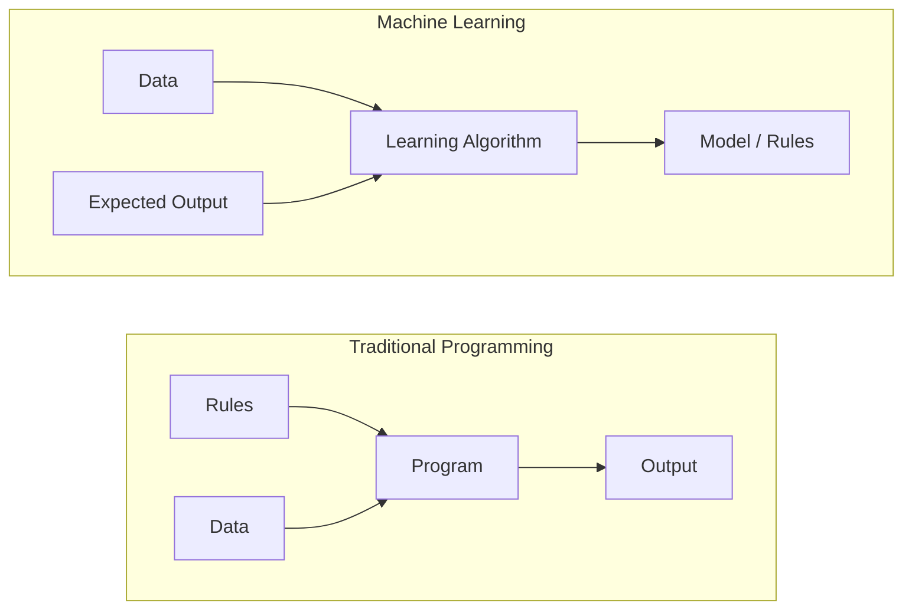
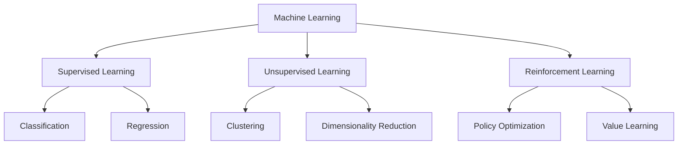
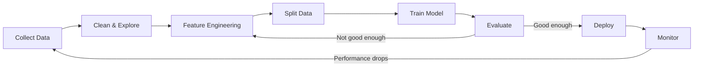
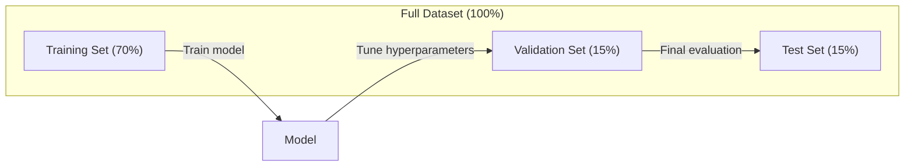
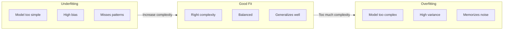
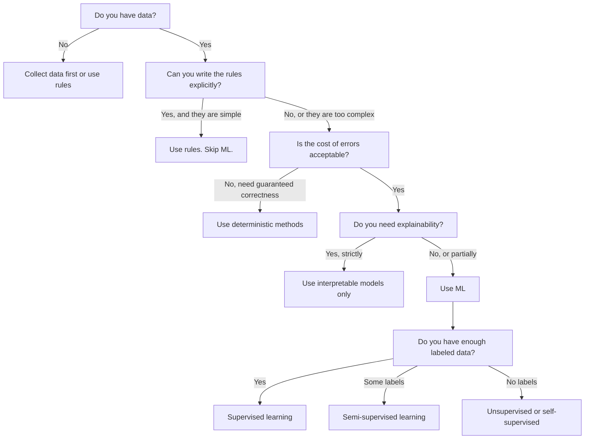

# O que é aprendizado automático

> A aprendizagem automática está a ensinar os computadores a encontrar padrões em dados em vez de escrever regras à mão.

**Type:** Learn
**Languages:** Python
**Prerequisites:** Phase 1 (Math Foundations)
**Time:** ~45 minutes

## Objetivos de aprendizagem

- Explique a diferença entre aprendizagem supervisionada, não supervisionada e reforço e identifique qual tipo se aplica a um determinado problema
- Implementar um classificador centróide mais próximo a partir do zero e avaliá-lo em relação a uma linha de base aleatória
- Distinguir entre as tarefas de classificação e regressão e selecionar a função de perda adequada para cada
- Avaliação de se um determinado problema empresarial é adequado para a ML ou melhor resolvido com regras deterministas

## O problema

Se você quiser criar um filtro de spam. A abordagem tradicional: sentar-se e escrever centenas de regras. "Se o e-mail contém 'DONOS GRATIS', marque-o como spam. Se tem mais de 3 marcas de exclamação, marque-o como spam". Você passa semanas escrevendo regras. Então os spammers mudam sua redação. Suas regras quebram. Você escreve mais regras. O ciclo nunca termina.

O aprendizado de máquina inverte isso. Em vez de escrever regras, você dá ao computador milhares de e-mails rotulados ("spam" ou "não spam") e deixa que ele descubra as regras por conta própria. O computador encontra padrões que você nunca teria pensado. Quando os spammers mudam de tática, você se retraina em novos dados em vez de reescrever código.

Esta mudança das "regras de programação" para "aprender a partir de dados" é o núcleo do aprendizado de máquina.

## O conceito

### Aprender com dados, não com regras

A programação tradicional e a aprendizagem automática resolvem problemas em direções opostas.



Programação tradicional: você escreve as regras. O programa as aplica aos dados para produzir saída.

Aprendizagem automática: fornece dados e resultados esperados. O algoritmo descobre as regras.

O "modelo" que resulta do treinamento é as regras, codificadas como números (pesos, parâmetros).

### Os três tipos de aprendizado de máquina



**Supervised Learning**O modelo aprende a mapear entradas para saídas.
- "Aqui estão 10 mil fotos com rótulos de gato ou cão.
- "Aqui estão as características e os preços da casa.

**Unsupervised Learning**O modelo encontra estrutura por si só.
- "Aqui estão 10 mil histórias de compras dos clientes.
- "Aqui estão 1.000 pontos de dados dimensionados, reduzindo-os a 2 dimensões, mantendo a estrutura".

**Reinforcement Learning**O agente adota uma estratégia (política) para maximizar a recompensa total.
- "Jogue este jogo. +1 para ganhar, -1 para perder.
- "Controlem este braço robótico. +1 para pegar o objeto, -0,01 por cada segundo desperdiçado".

A maioria do que você vai construir na prática usa aprendizagem supervisionada. A aprendizagem não supervisionada é comum para pré-processamento e exploração.

### Além dos Três Grandes

As três categorias acima são limpas, mas a ML do mundo real muitas vezes borra as linhas.

**Semi-supervised learning**O que é um sistema de medicação que usa um pequeno conjunto de dados etiquetados e um grande conjunto de dados não etiquetados.

- **Label propagation:**Construir um gráfico que conecte pontos de dados semelhantes.
- **Pseudo-labeling:**Treinar um modelo com os dados rotulados, usá-lo para prever os rótulos para dados não rotulados, depois retrainar em tudo.
- **Consistency regularization:**O modelo deve dar a mesma previsão para uma entrada e uma versão ligeiramente perturbada dessa entrada.

**Self-supervised learning**O modelo cria a sua própria tarefa de previsão a partir da estrutura dos dados.

- **Masked language modeling (BERT):**Esconde 15% das palavras numa frase, treine o modelo a prever as palavras que faltam.
- **Contrastive learning (SimCLR):**Tome uma imagem, crie duas versões aumentadas e treine o modelo a reconhecer que vieram da mesma imagem enquanto as distingue das versões aumentadas de outras imagens.
- **Next-token prediction (GPT):**Previnha a próxima palavra dada a todas as palavras anteriores.

Estas não são categorias separadas das três grandes. São estratégias que combinam ideias supervisionadas e não supervisionadas. A aprendizagem auto-supervisionada é tecnicamente supervisionada (o modelo prevê algo), mas os rótulos são gerados automaticamente, não por humanos.

### Classificação vs Regressão

Estas são as duas principais tarefas de aprendizagem supervisionada.

| Aspect | Classification | Regression |
|--------|---------------|------------|
| Output | Discrete categories | Continuous numbers |
| Example | "Is this email spam?" | "What will the house price be?" |
| Output space | {cat, dog, bird} | Any real number |
| Loss function | Cross-entropy, accuracy | Mean squared error, MAE |
| Decision | Boundaries between classes | A curve that fits the data |

A classificação responde a "qual categoria?" a regressão responde a "quanta?"

Alguns problemas podem ser enquadrados de qualquer maneira. Predicionar se uma ação sobe ou cai é classificação.

### O fluxo de trabalho do ML

Todos os projetos de aprendizado de máquina seguem o mesmo pipeline, independentemente do algoritmo.



**Collect Data**A maior quantidade de dados é quase sempre melhor, mas a qualidade é mais importante do que a quantidade.

**Clean & Explore**A análise de dados e de dados é feita através de um processo de análise de dados e de dados.

**Feature Engineering**Transformar dados brutos em recursos que o modelo pode usar. Transformar datas em dias da semana. Normalizar colunas numéricas. Encodar variáveis categorias. Boas características importam mais do que algoritmos fanáticos.

**Split Data**A formação do modelo é baseada em dados de formação, os hiperparametros são ajustados em dados de validação e os resultados finais são relatados em dados de teste.

**Train Model**O algoritmo ajusta os parâmetros internos para minimizar uma função de perda.

**Evaluate**Se o desempenho não for aceitável, volte e experimente diferentes características, algoritmos ou hiperparâmetros.

**Deploy**: Colocar o modelo em produção, onde ele faz previsões sobre novos dados.

**Monitor**A distribuição de dados muda (drift de dados) e os modelos degradam. Quando o desempenho cai, retrain.

### Treinamento, validação e testes divididos

Este é o conceito mais importante que os iniciantes cometem errado. Você deve avaliar o seu modelo com dados que nunca viu durante o treinamento.



| Split | Purpose | When used | Typical size |
|-------|---------|-----------|-------------|
| Training | Model learns from this data | During training | 60-80% |
| Validation | Tune hyperparameters, compare models | After each training run | 10-20% |
| Test | Final unbiased performance estimate | Once, at the very end | 10-20% |

O conjunto de testes é sagrado. Você olha para ele exatamente uma vez. Se você continuar ajustando seu modelo com base no desempenho do teste, você está treinando efetivamente no conjunto de testes e seus números relatados não têm significado.

Para pequenos conjuntos de dados, use a validação cruzada k-fold: divida os dados em k partes, treine em partes k-1, valida na parte restante, gire e obtenha resultados médios.

### O super-ajustamento vs. o sub-ajustamento



**Underfitting**O modelo é muito simples para capturar os padrões nos dados. Uma linha reta tentando encaixar uma relação curva. O erro de treinamento é alto. O erro de teste é alto.

**Overfitting**O modelo é muito complexo e memorizará os dados do treinamento, incluindo o ruído. Uma curva de movimento que passa por todos os pontos de treinamento, mas falha em novos dados. O erro do treinamento é baixo. O erro do teste é alto.

**Good fit**O modelo capta padrões reais sem memorizar ruído.

Sinais de sobreajuste:
- A precisão do treinamento é muito maior do que a precisão da validação
- O modelo tem um bom desempenho em dados de formação, mas mal em dados novos
- A adição de mais dados de formação melhora o desempenho (o modelo era memorizar, não aprender)

Fixas para sobre-equipamento:
- Obtenha mais dados de treinamento
- Reduzir a complexidade do modelo (menos parâmetros, arquitetura mais simples)
- Regularização (adjunto a penalidade para pesos grandes)
- Desistência (descentralização aleatória de neurônios durante o treino)
- Paragem precoce (parar o treinamento quando o erro de validação começar a aumentar)

Reparadores para subconjuntos:
- Usar um modelo mais complexo
- Adicionar mais recursos
- Reduzir a regularização
- Trem mais tempo

### O desvio de variações

Este é o quadro matemático por trás do sobreajuste e do subajuste.

**Bias**O modelo linear tem um alto viés quando a relação verdadeira é não linear.

**Variance**O modelo com alta variação dá previsões muito diferentes quando treinado em diferentes subconjuntos de dados.

| Model complexity | Bias | Variance | Result |
|-----------------|------|----------|--------|
| Too low (linear model for curved data) | High | Low | Underfitting |
| Just right | Medium | Medium | Good generalization |
| Too high (degree-20 polynomial for 10 points) | Low | High | Overfitting |

Erro total = Bias^2 + Variância + Ruído irredutível

Não se pode reduzir o ruído irredutível (é aleatoriedade nos próprios dados).

### Não há teorema do almoço livre

Não há um único algoritmo que funcione melhor para cada problema. Um algoritmo que funciona bem em uma classe de problemas vai funcionar mal em outra. É por isso que os cientistas de dados tentam múltiplos algoritmos e comparam os resultados.

Na prática, a escolha depende de:
- Quantos dados você tem
- Quantas características há
- Se a relação é linear ou não linear
- Se você precisa de interpretação
- Quanto computação você pode pagar

### Quando não usar aprendizado de máquina

A ML é poderosa, mas nem sempre a ferramenta certa.

**Do not use ML when:**

- **Rules are simple and well-defined.**Calculo fiscal, algoritmos de classificação, conversões de unidades. Se você pode escrever a lógica em algumas declarações de se, um modelo adiciona complexidade sem benefício.
- **You have no data or very little data.**O ML precisa de exemplos para aprender. Com 10 pontos de dados, não se pode treinar nada significativo.
- **The cost of being wrong is catastrophic and you need guaranteed correctness.**Calculo médico da dose, controle do reator nuclear, verificação criptográfica. modelos ML são probabilísticos. às vezes eles vão ser errados. Se "às vezes errado" é inaceitável, use métodos deterministas.
- **A lookup table or heuristic solves the problem.**Se um limiar ou tabela simples cobrir 99% dos casos, a adição de ML aumenta o custo de manutenção sem melhorias significativas.
- **You cannot explain the decision and explainability is required.**As indústrias reguladas (empréstimos, seguros, justiça penal) às vezes exigem que cada decisão seja totalmente explicável.
- **The problem changes faster than you can retrain.**Se as regras mudarem diariamente e a reformulação demorar uma semana, o modelo é sempre antiquado.

Use este gráfico de fluxo de decisão:



```figure
f3-learning-boundary
```

## Construí-lo

O código está em `code/ml_intro.py`Implementa um classificador centróide mais próximo do zero, o algoritmo ML mais simples possível.

### Passo 1: Classificador de centróides mais próximo a partir de zero

O classificador centróide mais próximo calcula o centro (médio) de cada classe nos dados de treinamento. Para prever, atribui cada novo ponto à classe cujo centro é mais próximo.

```python
class NearestCentroid:
    def fit(self, X, y):
        self.classes = np.unique(y)
        self.centroids = np.array([
            X[y == c].mean(axis=0) for c in self.classes
        ])

    def predict(self, X):
        distances = np.array([
            np.sqrt(((X - c) ** 2).sum(axis=1))
            for c in self.centroids
        ])
        return self.classes[distances.argmin(axis=0)]
```

O Fit calcula dois meios, o Predict calcula distâncias, não há descida de gradiente, nenhuma iteração, nenhum hiperparâmetro.

### Passo 2: Treinar dados sintéticos

Nós geramos um conjunto de dados de classificação 2D com duas classes que se sobrepõem ligeiramente.

```python
rng = np.random.RandomState(42)
X_class0 = rng.randn(100, 2) + np.array([1.0, 1.0])
X_class1 = rng.randn(100, 2) + np.array([-1.0, -1.0])
X = np.vstack([X_class0, X_class1])
y = np.array([0] * 100 + [1] * 100)
```

### Passo 3: Comparar com um ponto de partida

Cada modelo ML deve ser comparado com uma linha de base trivial. Aqui, a linha de base prevê uma classe aleatória. Se o seu modelo ML não vence adivinhações aleatórias, algo está errado.

```python
baseline_preds = rng.choice([0, 1], size=len(y_test))
baseline_acc = np.mean(baseline_preds == y_test)
```

O classificador centróide deve ter uma precisão de 90% ou mais neste conjunto de dados limpo.

### Por que isso importa

O classificador centróide mais próximo é trivialmente simples. Não tem hiperparâmetros, nenhuma iteração, nenhuma descida de gradiente.

1. **Learn**Uma representação dos dados de formação (os centroides)
2. **Predict**sobre novos dados utilizando essa representação (distância mais próxima)
3. **Evaluate**contra uma linha de base (divinhação aleatória)

Todos os algoritmos de ML, desde a regressão logística até transformadores, seguem este mesmo padrão de três passos. A representação fica mais complexa, mas o fluxo de trabalho permanece o mesmo.

### Passo 4: O que o Classificador Centroid não pode fazer

O classificador centróide mais próximo assume que cada classe forma uma única mancha.

- As classes têm múltiplos aglomerados (por exemplo, o dígito "1" pode ser escrito de várias maneiras diferentes)
- O limite de decisão não é linear (por exemplo, uma classe envolve outra)
- As características têm escalas muito diferentes (a distância é dominada pela característica de maior escala)

Estas limitações motivam todos os outros algoritmos que você aprenderá. Os vizinhos mais próximos de K lidam com múltiplos aglomerados. As árvores de decisão lidam com limites não lineares. A escalagem de características corrige o problema de escala. Cada lição se baseia nas limitações do anterior.

## Usá-lo

sklearn fornece `NearestCentroid`e geradores de dados sintéticos:

```python
from sklearn.neighbors import NearestCentroid
from sklearn.datasets import make_classification
from sklearn.model_selection import train_test_split

X, y = make_classification(
    n_samples=500, n_features=2, n_redundant=0,
    n_clusters_per_class=1, random_state=42
)
X_train, X_test, y_train, y_test = train_test_split(X, y, test_size=0.3)

clf = NearestCentroid()
clf.fit(X_train, y_train)
print(f"Accuracy: {clf.score(X_test, y_test):.3f}")
```

## Envia-o

Esta lição produz`outputs/prompt-ml-problem-framer.md`- um prompt que transforma problemas de negócios vagues em tarefas de inteligência artificial concretas. Dê uma descrição do problema ("queremos reduzir o churn" ou "previr a demanda para o próximo trimestre") e ele identifica o tipo de aprendizagem, define o objetivo de previsão, lista características dos candidatos, escolhe uma métrica de sucesso, estabelece uma linha de base e sinaliza armadilhas como vazamento de dados ou desequilíbrio de classe. Use-o no início de qualquer projeto de ML para evitar construir a coisa errada.

## Termos-chave

| Term | What people say | What it actually means |
|------|----------------|----------------------|
| Model | "The AI" | A mathematical function with learnable parameters that maps inputs to outputs |
| Training | "Teaching the AI" | Running an optimization algorithm to adjust model parameters so predictions match known outputs |
| Feature | "An input column" | A measurable property of the data that the model uses to make predictions |
| Label | "The answer" | The known output for a training example, used to compute the error signal |
| Hyperparameter | "A setting you tweak" | A parameter set before training that controls the learning process (learning rate, number of layers) |
| Loss function | "How wrong the model is" | A function that measures the gap between predicted and actual outputs, which training tries to minimize |
| Overfitting | "It memorized the test" | The model learned training-specific noise instead of general patterns, so it fails on new data |
| Underfitting | "It didn't learn anything" | The model is too simple to capture the real patterns in the data |
| Generalization | "It works on new data" | The model's ability to make accurate predictions on data it was not trained on |
| Cross-validation | "Testing on different chunks" | Repeatedly splitting data into train/test folds and averaging results, giving a more robust performance estimate |
| Regularization | "Keeping weights small" | Adding a penalty term to the loss function that discourages overly complex models |
| Data drift | "The world changed" | The statistical distribution of incoming data shifts over time, degrading model performance |

## Exercícios

1. Tome qualquer conjunto de dados (por exemplo, Iris, Titanic). Divida-o 70/15/15 em trem/validação/teste. Explique por que não deve ajustar os hiperparâmetros no conjunto de teste.
2. Lembre-se de três problemas reais: para cada um, identifique se é uma classificação, regressão ou agrupamento, e se é supervisionado ou não.
3. Um modelo obtém 99% de precisão nos dados de treinamento, mas 60% nos dados de teste.

## Mais leitura

- [An Introduction to Statistical Learning](https://www.statlearning.com/)- livro de texto gratuito que abrange todos os métodos clássicos de ML com exemplos práticos
- [Google's Machine Learning Crash Course](https://developers.google.com/machine-learning/crash-course)- introdução visual concisa aos conceitos de ML
- [Scikit-learn User Guide](https://scikit-learn.org/stable/user_guide.html)- a referência prática para a implementação de ML em Python
