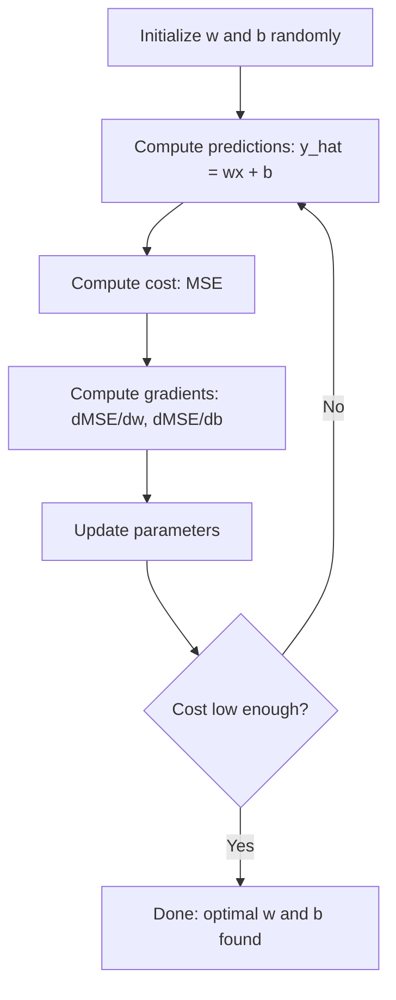

# Regressão linear

> A regressão linear traça a melhor linha reta através dos seus dados. É o "mundo de olá" do aprendizado de máquina.

**Type:** Build
**Languages:** Python
**Prerequisites:** Phase 1 (Linear Algebra, Calculus, Optimization), Phase 2 Lesson 1
**Time:** ~90 minutes

## Objetivos de aprendizagem

- Derivar as regras de atualização de descida de gradiente para o erro quadrado médio e implementar regressão linear a partir do zero
- Comparar a descida de gradiente e a equação normal em termos de complexidade computacional e quando usar cada
- Construir um modelo de regressão linear múltipla com padronização de características e interpretar os pesos aprendidos
- Explique como a regressão de Ridge (regularizar L2) impede o sobreajuste por penalização de pesos grandes

## O problema

Você tem dados: tamanhos de casas e seus preços de venda. Você quer prever o preço de uma casa nova dada o seu tamanho. Você pode olhar para ele em um gráfico de disperso, mas você precisa de uma fórmula. Você precisa de uma linha que melhor se encaixa nos dados para que você possa conectar qualquer tamanho e obter uma previsão de preço.

A regressão linear dá-lhe essa linha. O mais importante, ela introduz todo o ciclo de treinamento de ML: definir um modelo, definir uma função de custo, otimizar os parâmetros. Todo algoritmo ML segue esse mesmo padrão. Dominar aqui com o caso mais simples, e você vai reconhecê-lo em todos os lugares.

Não se trata apenas de problemas simples. A regressão linear é usada em sistemas de produção para previsão de demanda, análise de testes A/B, modelagem financeira e como linha de base para cada tarefa de regressão.

## O conceito

### O Modelo

A regressão linear assume uma relação linear entre entrada (x) e saída (y):

```
y = wx + b
```

- `w`(peso/inclinação): quanto a y muda quando x aumenta em 1
- `b`(bias/intercepção): o valor de y quando x = 0

Para entradas múltiplas (funções), este se estende a:

```
y = w1*x1 + w2*x2 + ... + wn*xn + b
```

Ou em forma vetorial: `y = w^T * x + b`

O objetivo: encontrar os valores de w e b que tornem o y previsto o mais próximo possível do y real em todos os exemplos de treinamento.

### A função custo (erro quadrado médio)

Como medir "o mais próximo possível"? Você precisa de um único número que capte o quão errados suas previsões são. A escolha mais comum é o erro médio quadrado (MSE):

```
MSE = (1/n) * sum((y_predicted - y_actual)^2)
```

Por que quadrado? Duas razões. Primeiro, penaliza erros grandes mais do que pequenos erros (um erro de 10 é 100 vezes pior do que um erro de 1, não 10x). Segundo, a função quadrada é lisa e diferenciável em todos os lugares, o que torna a otimização direta.

A função custo cria uma superfície. Para um único peso w e bias b, a superfície MSE parece uma tigela (um paraboloide convexo).

### Descenso gradual

A descida gradual encontra o fundo da tigela, fazendo passos para baixo.



Os gradientes dizem duas coisas: qual a direção para mover cada parâmetro e quanto mover.

Para MSE com y_hat = wx + b:

```
dMSE/dw = (2/n) * sum((y_hat - y) * x)
dMSE/db = (2/n) * sum(y_hat - y)
```

A regra de actualização:

```
w = w - learning_rate * dMSE/dw
b = b - learning_rate * dMSE/db
```

A taxa de aprendizagem controla o tamanho do passo. Muito grande: você ultrapassa o mínimo e diverge. Muito pequeno: o treinamento leva para sempre. Valores iniciais típicos: 0,01, 0,001 ou 0,0001.

### A Equação Normal (Solução de Forma Fechada)

Para regressão linear especificamente, há uma fórmula direta que dá os pesos ótimos sem qualquer iteração:

```
w = (X^T * X)^(-1) * X^T * y
```

Isso inverte uma matriz para resolver para w em um passo. Funciona perfeitamente para pequenos conjuntos de dados. Para grandes conjuntos de dados (milhões de linhas ou milhares de características), a descida de gradiente é preferida porque a inversão da matriz é O(n^3) no número de características.

### Regressão Linear Multipla

Com múltiplas características, o modelo se torna:

```
y = w1*x1 + w2*x2 + ... + wn*xn + b
```

Tudo funciona da mesma forma: MSE é a função de custo, descida de gradiente atualiza todos os pesos simultaneamente. A única diferença é que você está montando um hiperplano em vez de uma linha.

A escalação de características importa aqui. Se uma característica varia de 0 a 1 e outra varia de 0 a 1.000.000, a descida de gradiente vai ter dificuldade porque a superfície de custo se alongua.

### Regressão polinômica

E se a relação não for linear? Você ainda pode usar regressão linear criando características polinômias:

```
y = w1*x + w2*x^2 + w3*x^3 + b
```

Isto ainda é regressão "linear" porque o modelo é linear nos pesos (w1, w2, w3).

Polinômios de grau superior podem caber curvas mais complexas, mas correm o risco de sobreajustar. Um polinômio de grau 10 passará por todos os pontos de um conjunto de dados de 10 pontos, mas prevê mal sobre novos dados.

### R-Correção quadrada

O MSE diz-lhe o quão errado você está, mas o número depende da escala de y. R-quadrado (R^2) dá uma medida independente da escala:

```
R^2 = 1 - (sum of squared residuals) / (sum of squared deviations from mean)
    = 1 - SS_res / SS_tot
```

- R^2 = 1,0: previsões perfeitas
- R^2 = 0,0: o modelo não é melhor do que prever a média cada vez
- R^2 < 0,0: o modelo é pior do que prever a média

### Previsão de regularização (regressão de Ridge)

Quando você tem muitos recursos, o modelo pode overfit atribuindo grandes pesos.

```
Cost = MSE + lambda * sum(w_i^2)
```

O termo penalidade desencoraja grandes pesos. O lambda hiperparâmetro controla a troca: lambda mais alta significa pesos menores e mais regularização. Isto é abordado em profundidade em uma lição posterior.

```figure
linear-regression-fit
```

## Construí-lo

### Passo 1: Gerenciar dados de amostra

```python
import random
import math

random.seed(42)

TRUE_W = 3.0
TRUE_B = 7.0
N_SAMPLES = 100

X = [random.uniform(0, 10) for _ in range(N_SAMPLES)]
y = [TRUE_W * x + TRUE_B + random.gauss(0, 2.0) for x in X]

print(f"Generated {N_SAMPLES} samples")
print(f"True relationship: y = {TRUE_W}x + {TRUE_B} (+ noise)")
print(f"First 5 points: {[(round(X[i], 2), round(y[i], 2)) for i in range(5)]}")
```

### Passo 2: Regressão linear a partir do zero com descida de gradiente

```python
class LinearRegression:
    def __init__(self, learning_rate=0.01):
        self.w = 0.0
        self.b = 0.0
        self.lr = learning_rate
        self.cost_history = []

    def predict(self, X):
        return [self.w * x + self.b for x in X]

    def compute_cost(self, X, y):
        predictions = self.predict(X)
        n = len(y)
        cost = sum((pred - actual) ** 2 for pred, actual in zip(predictions, y)) / n
        return cost

    def compute_gradients(self, X, y):
        predictions = self.predict(X)
        n = len(y)
        dw = (2 / n) * sum((pred - actual) * x for pred, actual, x in zip(predictions, y, X))
        db = (2 / n) * sum(pred - actual for pred, actual in zip(predictions, y))
        return dw, db

    def fit(self, X, y, epochs=1000, print_every=200):
        for epoch in range(epochs):
            dw, db = self.compute_gradients(X, y)
            self.w -= self.lr * dw
            self.b -= self.lr * db
            cost = self.compute_cost(X, y)
            self.cost_history.append(cost)
            if epoch % print_every == 0:
                print(f"  Epoch {epoch:4d} | Cost: {cost:.4f} | w: {self.w:.4f} | b: {self.b:.4f}")
        return self

    def r_squared(self, X, y):
        predictions = self.predict(X)
        y_mean = sum(y) / len(y)
        ss_res = sum((actual - pred) ** 2 for actual, pred in zip(y, predictions))
        ss_tot = sum((actual - y_mean) ** 2 for actual in y)
        return 1 - (ss_res / ss_tot)


print("=== Training Linear Regression (Gradient Descent) ===")
model = LinearRegression(learning_rate=0.005)
model.fit(X, y, epochs=1000, print_every=200)
print(f"\nLearned: y = {model.w:.4f}x + {model.b:.4f}")
print(f"True:    y = {TRUE_W}x + {TRUE_B}")
print(f"R-squared: {model.r_squared(X, y):.4f}")
```

### Passo 3: Equação normal (solução de forma fechada)

```python
class LinearRegressionNormal:
    def __init__(self):
        self.w = 0.0
        self.b = 0.0

    def fit(self, X, y):
        n = len(X)
        x_mean = sum(X) / n
        y_mean = sum(y) / n
        numerator = sum((X[i] - x_mean) * (y[i] - y_mean) for i in range(n))
        denominator = sum((X[i] - x_mean) ** 2 for i in range(n))
        self.w = numerator / denominator
        self.b = y_mean - self.w * x_mean
        return self

    def predict(self, X):
        return [self.w * x + self.b for x in X]

    def r_squared(self, X, y):
        predictions = self.predict(X)
        y_mean = sum(y) / len(y)
        ss_res = sum((actual - pred) ** 2 for actual, pred in zip(y, predictions))
        ss_tot = sum((actual - y_mean) ** 2 for actual in y)
        return 1 - (ss_res / ss_tot)


print("\n=== Normal Equation (Closed-Form) ===")
model_normal = LinearRegressionNormal()
model_normal.fit(X, y)
print(f"Learned: y = {model_normal.w:.4f}x + {model_normal.b:.4f}")
print(f"R-squared: {model_normal.r_squared(X, y):.4f}")
```

### Passo 4: Regressão linear múltipla

```python
class MultipleLinearRegression:
    def __init__(self, n_features, learning_rate=0.01):
        self.weights = [0.0] * n_features
        self.bias = 0.0
        self.lr = learning_rate
        self.cost_history = []

    def predict_single(self, x):
        return sum(w * xi for w, xi in zip(self.weights, x)) + self.bias

    def predict(self, X):
        return [self.predict_single(x) for x in X]

    def compute_cost(self, X, y):
        predictions = self.predict(X)
        n = len(y)
        return sum((pred - actual) ** 2 for pred, actual in zip(predictions, y)) / n

    def fit(self, X, y, epochs=1000, print_every=200):
        n = len(y)
        n_features = len(X[0])
        for epoch in range(epochs):
            predictions = self.predict(X)
            errors = [pred - actual for pred, actual in zip(predictions, y)]
            for j in range(n_features):
                grad = (2 / n) * sum(errors[i] * X[i][j] for i in range(n))
                self.weights[j] -= self.lr * grad
            grad_b = (2 / n) * sum(errors)
            self.bias -= self.lr * grad_b
            cost = self.compute_cost(X, y)
            self.cost_history.append(cost)
            if epoch % print_every == 0:
                print(f"  Epoch {epoch:4d} | Cost: {cost:.4f}")
        return self

    def r_squared(self, X, y):
        predictions = self.predict(X)
        y_mean = sum(y) / len(y)
        ss_res = sum((actual - pred) ** 2 for actual, pred in zip(y, predictions))
        ss_tot = sum((actual - y_mean) ** 2 for actual in y)
        return 1 - (ss_res / ss_tot)


random.seed(42)
N = 100
X_multi = []
y_multi = []
for _ in range(N):
    size = random.uniform(500, 3000)
    bedrooms = random.randint(1, 5)
    age = random.uniform(0, 50)
    price = 50 * size + 10000 * bedrooms - 1000 * age + 50000 + random.gauss(0, 20000)
    X_multi.append([size, bedrooms, age])
    y_multi.append(price)


def standardize(X):
    n_features = len(X[0])
    means = [sum(X[i][j] for i in range(len(X))) / len(X) for j in range(n_features)]
    stds = []
    for j in range(n_features):
        variance = sum((X[i][j] - means[j]) ** 2 for i in range(len(X))) / len(X)
        stds.append(variance ** 0.5)
    X_scaled = []
    for i in range(len(X)):
        row = [(X[i][j] - means[j]) / stds[j] if stds[j] > 0 else 0 for j in range(n_features)]
        X_scaled.append(row)
    return X_scaled, means, stds


y_mean_val = sum(y_multi) / len(y_multi)
y_std_val = (sum((yi - y_mean_val) ** 2 for yi in y_multi) / len(y_multi)) ** 0.5
y_scaled = [(yi - y_mean_val) / y_std_val for yi in y_multi]

X_scaled, x_means, x_stds = standardize(X_multi)

print("\n=== Multiple Linear Regression (3 features) ===")
print("Features: house size, bedrooms, age")
multi_model = MultipleLinearRegression(n_features=3, learning_rate=0.01)
multi_model.fit(X_scaled, y_scaled, epochs=1000, print_every=200)

print(f"\nWeights (standardized): {[round(w, 4) for w in multi_model.weights]}")
print(f"Bias (standardized): {multi_model.bias:.4f}")
print(f"R-squared: {multi_model.r_squared(X_scaled, y_scaled):.4f}")
```

### Passo 5: Regressão polinômica

```python
class PolynomialRegression:
    def __init__(self, degree, learning_rate=0.01):
        self.degree = degree
        self.weights = [0.0] * degree
        self.bias = 0.0
        self.lr = learning_rate

    def make_features(self, X):
        return [[x ** (d + 1) for d in range(self.degree)] for x in X]

    def predict(self, X):
        features = self.make_features(X)
        return [sum(w * f for w, f in zip(self.weights, row)) + self.bias for row in features]

    def fit(self, X, y, epochs=1000, print_every=200):
        features = self.make_features(X)
        n = len(y)
        for epoch in range(epochs):
            predictions = [sum(w * f for w, f in zip(self.weights, row)) + self.bias for row in features]
            errors = [pred - actual for pred, actual in zip(predictions, y)]
            for j in range(self.degree):
                grad = (2 / n) * sum(errors[i] * features[i][j] for i in range(n))
                self.weights[j] -= self.lr * grad
            grad_b = (2 / n) * sum(errors)
            self.bias -= self.lr * grad_b
            if epoch % print_every == 0:
                cost = sum(e ** 2 for e in errors) / n
                print(f"  Epoch {epoch:4d} | Cost: {cost:.6f}")
        return self

    def r_squared(self, X, y):
        predictions = self.predict(X)
        y_mean = sum(y) / len(y)
        ss_res = sum((actual - pred) ** 2 for actual, pred in zip(y, predictions))
        ss_tot = sum((actual - y_mean) ** 2 for actual in y)
        return 1 - (ss_res / ss_tot)


random.seed(42)
X_poly = [x / 10.0 for x in range(0, 50)]
y_poly = [0.5 * x ** 2 - 2 * x + 3 + random.gauss(0, 1.0) for x in X_poly]

x_max = max(abs(x) for x in X_poly)
X_poly_norm = [x / x_max for x in X_poly]
y_poly_mean = sum(y_poly) / len(y_poly)
y_poly_std = (sum((yi - y_poly_mean) ** 2 for yi in y_poly) / len(y_poly)) ** 0.5
y_poly_norm = [(yi - y_poly_mean) / y_poly_std for yi in y_poly]

print("\n=== Polynomial Regression (degree 2 vs degree 5) ===")
print("True relationship: y = 0.5x^2 - 2x + 3")

print("\nDegree 2:")
poly2 = PolynomialRegression(degree=2, learning_rate=0.1)
poly2.fit(X_poly_norm, y_poly_norm, epochs=2000, print_every=500)
print(f"  R-squared: {poly2.r_squared(X_poly_norm, y_poly_norm):.4f}")

print("\nDegree 5:")
poly5 = PolynomialRegression(degree=5, learning_rate=0.1)
poly5.fit(X_poly_norm, y_poly_norm, epochs=2000, print_every=500)
print(f"  R-squared: {poly5.r_squared(X_poly_norm, y_poly_norm):.4f}")

print("\nDegree 2 fits the true curve well. Degree 5 fits training data slightly better")
print("but risks overfitting on new data.")
```

### Passo 6: Regressão de escala (regularizar L2)

```python
class RidgeRegression:
    def __init__(self, n_features, learning_rate=0.01, alpha=1.0):
        self.weights = [0.0] * n_features
        self.bias = 0.0
        self.lr = learning_rate
        self.alpha = alpha

    def predict_single(self, x):
        return sum(w * xi for w, xi in zip(self.weights, x)) + self.bias

    def predict(self, X):
        return [self.predict_single(x) for x in X]

    def fit(self, X, y, epochs=1000, print_every=200):
        n = len(y)
        n_features = len(X[0])
        for epoch in range(epochs):
            predictions = self.predict(X)
            errors = [pred - actual for pred, actual in zip(predictions, y)]
            mse = sum(e ** 2 for e in errors) / n
            reg_term = self.alpha * sum(w ** 2 for w in self.weights)
            cost = mse + reg_term
            for j in range(n_features):
                grad = (2 / n) * sum(errors[i] * X[i][j] for i in range(n))
                grad += 2 * self.alpha * self.weights[j]
                self.weights[j] -= self.lr * grad
            grad_b = (2 / n) * sum(errors)
            self.bias -= self.lr * grad_b
            if epoch % print_every == 0:
                print(f"  Epoch {epoch:4d} | Cost: {cost:.4f} | L2 penalty: {reg_term:.4f}")
        return self


print("\n=== Ridge Regression (L2 Regularization) ===")
print("Same data as multiple regression, with alpha=0.1")
ridge = RidgeRegression(n_features=3, learning_rate=0.01, alpha=0.1)
ridge.fit(X_scaled, y_scaled, epochs=1000, print_every=200)
print(f"\nRidge weights: {[round(w, 4) for w in ridge.weights]}")
print(f"Plain weights: {[round(w, 4) for w in multi_model.weights]}")
print("Ridge weights are smaller (shrunk toward zero) due to the L2 penalty.")
```

## Usá-lo

Agora a mesma coisa com o scikit-learn, que é o que você vai realmente usar na produção.

```python
from sklearn.linear_model import LinearRegression as SklearnLR
from sklearn.linear_model import Ridge
from sklearn.preprocessing import PolynomialFeatures, StandardScaler
from sklearn.model_selection import train_test_split
from sklearn.metrics import mean_squared_error, r2_score
import numpy as np

np.random.seed(42)
X_sk = np.random.uniform(0, 10, (100, 1))
y_sk = 3.0 * X_sk.squeeze() + 7.0 + np.random.normal(0, 2.0, 100)

X_train, X_test, y_train, y_test = train_test_split(X_sk, y_sk, test_size=0.2, random_state=42)

lr = SklearnLR()
lr.fit(X_train, y_train)
y_pred = lr.predict(X_test)

print("=== Scikit-learn Linear Regression ===")
print(f"Coefficient (w): {lr.coef_[0]:.4f}")
print(f"Intercept (b): {lr.intercept_:.4f}")
print(f"R-squared (test): {r2_score(y_test, y_pred):.4f}")
print(f"MSE (test): {mean_squared_error(y_test, y_pred):.4f}")

poly = PolynomialFeatures(degree=2, include_bias=False)
X_poly_sk = poly.fit_transform(X_train)
X_poly_test = poly.transform(X_test)

lr_poly = SklearnLR()
lr_poly.fit(X_poly_sk, y_train)
print(f"\nPolynomial degree 2 R-squared: {r2_score(y_test, lr_poly.predict(X_poly_test)):.4f}")

scaler = StandardScaler()
X_train_scaled = scaler.fit_transform(X_train)
X_test_scaled = scaler.transform(X_test)

ridge = Ridge(alpha=1.0)
ridge.fit(X_train_scaled, y_train)
print(f"Ridge R-squared: {r2_score(y_test, ridge.predict(X_test_scaled)):.4f}")
print(f"Ridge coefficient: {ridge.coef_[0]:.4f}")
```

A sua implementação desde o zero e a scikit-learn produzem os mesmos resultados. A diferença: scikit-learn lida com casos de borda, estabilidade numérica e otimização de desempenho. Use a biblioteca para produção. Use a versão do zero para entender o que está acontecendo.

## Envia-o

Esta lição produz:
- `outputs/skill-regression.md`- habilidade para escolher a abordagem de regressão correta com base no problema

## Exercícios

1. Implementar descida de gradiente de lote, descida de gradiente estocástico (SGD) e descida de gradiente de mini lote. Compare a velocidade de convergência no mesmo conjunto de dados. Qual converge mais rápido? Qual tem a curva de custo mais suave?
2. Gerar dados a partir de uma função cúbica (y = ax^3 + bx^2 + cx + d + ruído). Polinômios de graus 1, 3 e 10. Compare treinamento R^2 e teste R^2.
3. Implementar a regressão de Lasso (regularização L1: penalidade * soma alfa em direção = i i i i i i i i)). Treinar os dados de habitação de várias características. Comparar quais pesos vão para zero vs Ridge. Por que L1 produz soluções escassas enquanto L2 não?

## Termos-chave

| Term | What people say | What it actually means |
|------|----------------|----------------------|
| Linear regression | "Draw a line through data" | Find weight w and bias b that minimize the sum of squared differences between wx+b and actual y values |
| Cost function | "How bad the model is" | A function that maps model parameters to a single number measuring prediction error, which optimization minimizes |
| Mean squared error | "Average of squared errors" | (1/n) * sum of (predicted - actual)^2, penalizing large errors disproportionately |
| Gradient descent | "Walk downhill" | Iteratively adjust parameters in the direction that reduces the cost function, using partial derivatives |
| Learning rate | "Step size" | A scalar that controls how much parameters change per gradient descent step |
| Normal equation | "Solve it directly" | The closed-form solution w = (X^T X)^-1 X^T y that gives optimal weights without iteration |
| R-squared | "How good the fit is" | The fraction of variance in y explained by the model, ranging from negative infinity to 1.0 |
| Feature scaling | "Make features comparable" | Transforming features to similar ranges (e.g., zero mean, unit variance) so gradient descent converges faster |
| Regularization | "Penalize complexity" | Adding a term to the cost function that shrinks weights, preventing overfitting |
| Ridge regression | "L2 regularization" | Linear regression with a penalty of lambda * sum(w_i^2) added to MSE |
| Polynomial regression | "Fitting curves with linear math" | Linear regression on polynomial features (x, x^2, x^3, ...), still linear in the weights |
| Overfitting | "Memorizing training data" | Using a model so complex that it fits noise in training data and fails on new data |

## Mais leitura

- [An Introduction to Statistical Learning (ISLR)](https://www.statlearning.com/)-- PDF gratuito, os capítulos 3 e 6 cobrem regressão linear e regularização com exemplos práticos de R
- [The Elements of Statistical Learning (ESL)](https://hastie.su.domains/ElemStatLearn/)-- PDF gratuito, o companheiro mais matemático da ISLR com tratamento mais profundo da cresta e lasso
- [Stanford CS229 Lecture Notes on Linear Regression](https://cs229.stanford.edu/main_notes.pdf)-- As notas de Andrew Ng derivando a equação normal e descida de gradiente dos primeiros princípios
- [scikit-learn LinearRegression documentation](https://scikit-learn.org/stable/modules/linear_model.html)-- referência prática para LinearRegression, Ridge, Lasso e ElasticNet com exemplos de código
