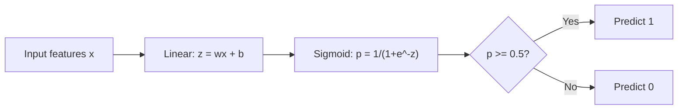
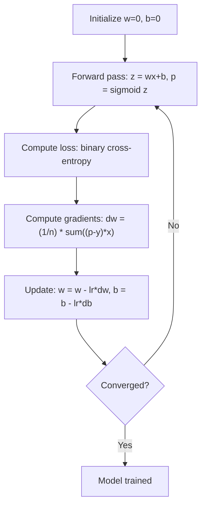

# Regressão logística

> A regressão logística dobra uma linha reta em uma curva S para responder a perguntas de sim ou não com probabilidades.

**Type:** Build
**Languages:** Python
**Prerequisites:** Phase 2 Lesson 1-2 (What Is ML, Linear Regression)
**Time:** ~90 minutes

## Objetivos de aprendizagem

- Implementar regressão logística a partir do zero usando a função sigmoide e a perda binária de entropia cruzada
- Computação e interpretação de precisão, recall, pontuação F1 e matriz de confusão para classificação binária
- Explicar por que a MSE não consegue classificar e por que a entropia binária transversal produz uma superfície de custos convexa
- Construir um modelo de regressão softmax para classificação multi-classe e avaliar as compensações de ajuste de limiar

## O problema

Você quer prever se um tumor é maligno ou benigno, dado seu tamanho. Você tenta regressão linear. Ele produz números como 0,3 ou 1,7 ou -0,5. O que significam? 1,7 é "muito maligno"? -0,5 é "muito benigno"? Regressão linear produz números ilimitados. Classificação precisa de probabilidades limitadas entre 0 e 1, e uma decisão clara: sim ou não.

A regressão logística resolve isso. Ele toma a mesma combinação linear (wx + b) e passa-a através da função sigmoide, que esmagam qualquer número na faixa (0, 1). A saída é uma probabilidade. Você define um limiar (geralmente 0,5) e toma uma decisão.

Este é um dos algoritmos mais utilizados na prática. Apesar de seu nome, a regressão logística é um algoritmo de classificação, não um algoritmo de regressão. O nome vem da função logística (sigmoide) que usa.

## O conceito

### Por que a regressão linear falha em classificação

Imagine prever a passagem/falha (1/0) com base nas horas de estudo.

```
hours:  1   2   3   4   5   6   7   8   9   10
actual: 0   0   0   0   1   1   1   1   1   1
```

Um ajuste linear pode produzir previsões como -0,2 na hora 1 e 1,3 na hora 10. Estes valores não são probabilidades. Eles vão abaixo de 0 e acima de 1.

A classificação requer uma função que:
- Valores de saída entre 0 e 1 (probabilidades)
- Cria uma transição acentuada (um limite de decisão)
- Não é distorcida por valores fora do limite

### A função sigmoide

A função sigmoide faz exatamente isto:

```
sigmoid(z) = 1 / (1 + e^(-z))
```

Propriedades:
- Quando z é grande e positivo, sigmoid(z) aproxima-se de 1
- Quando z é grande e negativo, sigmoid(z) aproxima-se de 0
- Quando z = 0, sigmoid(z) = 0,5
- A saída é sempre entre 0 e 1
- A função é suave e diferenciável em todos os lugares

A derivada tem uma forma conveniente: sigmoid'(z) = sigmoid(z) * (1 - sigmoid(z)). Isso torna a computação de gradientes eficiente.

### Regressão logística = Modelo linear + Sigmoide

O modelo calcula z = wx + b (o mesmo que a regressão linear), e aplica sigmoide:



A saída p é interpretada como P ((y=1\x), a probabilidade de que a entrada pertença à classe 1. O limite de decisão é onde wx + b = 0, o que faz a saída sigmoide exatamente 0,5.

### Perda de entropia cruzada binária

Não se pode usar MSE para regressão logística. O MSE com um sigmoide cria uma superfície de custos não convexa com muitos mínimos locais.

```
Loss = -(1/n) * sum(y * log(p) + (1-y) * log(1-p))
```

Por que isto funciona:
- Quando y=1 e p é próximo de 1: log(1) = 0, então a perda é próxima de 0 (correto, baixo custo)
- Quando y=1 e p está perto de 0: log(0) se aproxima do infinito negativo, então a perda é enorme (erro, alto custo)
- Quando y=0 e p está perto de 0: log(1) = 0, então a perda está perto de 0 (correto, baixo custo)
- Quando y=0 e p está perto de 1: log(0) se aproxima do infinito negativo, então a perda é enorme (erro, alto custo)

Esta função de perda é convexa para regressão logística, garantindo um único mínimo global.

### Descenso gradual para a Regressão Logística

Os gradientes para a entropia binária cruzada com sigmoide têm uma forma limpa:

```
dL/dw = (1/n) * sum((p - y) * x)
dL/db = (1/n) * sum(p - y)
```

Estes parecem idênticos aos gradientes de regressão linear. A diferença é que p = sigmoid(wx + b) em vez de p = wx + b. O sigmoid introduz a não linearidade, mas a regra de atualização do gradiente permanece a mesma.



### O limite da decisão

Para uma entrada 2D (dois elementos), o limite de decisão é a linha em que:

```
w1*x1 + w2*x2 + b = 0
```

Os pontos de um lado são classificados como 1, os pontos do outro lado como 0. A regressão logística sempre produz um limite de decisão linear. Se você precisar de um limite curvo, adicione características polinômias ou use um modelo não linear.

### Classificação de classes múltiplas com Softmax

A regressão logística binária lida com duas classes. Para as classes k, use a função softmax:

```
softmax(z_i) = e^(z_i) / sum(e^(z_j) for all j)
```

Cada classe tem seu próprio vetor de peso. O modelo calcula uma pontuação z_i para cada classe, em seguida, softmax converte as pontuações em probabilidades que somam a 1.

A função de perda torna-se entropia cruzada categórica:

```
Loss = -(1/n) * sum(sum(y_k * log(p_k)))
```

onde y_k é 1 para a classe verdadeira e 0 para todas as outras (coding one-hot).

### Metricas de avaliação

Para um conjunto de dados com 95% negativo e 5% positivo, um modelo que sempre prevê negativo obtém 95% de precisão, mas é inútil.

**Confusion Matrix**- Não .

| | Predicted Positive | Predicted Negative |
|---|---|---|
| Actually Positive | True Positive (TP) | False Negative (FN) |
| Actually Negative | False Positive (FP) | True Negative (TN) |

**Precision**De todos os positivos previstos, quantos são realmente positivos?
```
Precision = TP / (TP + FP)
```

**Recall**(Sensibilidade): De todos os positivos reais, quantos capturamos?
```
Recall = TP / (TP + FN)
```

**F1 Score**Intervalo de precisão e de recall: equilibra ambas as métricas.
```
F1 = 2 * (Precision * Recall) / (Precision + Recall)
```

Quando priorizar:
- **Precision**: quando os falsos positivos são caros (filtro de spam, não quer bloquear e-mails legítimos)
- **Recall**: quando os falsos negativos são caros (exame de detecção do cancro, não se quer perder um tumor)
- **F1**Quando você precisa de uma única métrica equilibrada

```figure
logistic-sigmoid
```

## Construí-lo

### Passo 1: Função Sigmoid e geração de dados

```python
import random
import math

def sigmoid(z):
    z = max(-500, min(500, z))
    return 1.0 / (1.0 + math.exp(-z))


random.seed(42)
N = 200
X = []
y = []

for _ in range(N // 2):
    X.append([random.gauss(2, 1), random.gauss(2, 1)])
    y.append(0)

for _ in range(N // 2):
    X.append([random.gauss(5, 1), random.gauss(5, 1)])
    y.append(1)

combined = list(zip(X, y))
random.shuffle(combined)
X, y = zip(*combined)
X = list(X)
y = list(y)

print(f"Generated {N} samples (2 classes, 2 features)")
print(f"Class 0 center: (2, 2), Class 1 center: (5, 5)")
print(f"First 5 samples:")
for i in range(5):
    print(f"  Features: [{X[i][0]:.2f}, {X[i][1]:.2f}], Label: {y[i]}")
```

### Passo 2: Regressão logística a partir do zero

```python
class LogisticRegression:
    def __init__(self, n_features, learning_rate=0.01):
        self.weights = [0.0] * n_features
        self.bias = 0.0
        self.lr = learning_rate
        self.loss_history = []

    def predict_proba(self, x):
        z = sum(w * xi for w, xi in zip(self.weights, x)) + self.bias
        return sigmoid(z)

    def predict(self, x, threshold=0.5):
        return 1 if self.predict_proba(x) >= threshold else 0

    def compute_loss(self, X, y):
        n = len(y)
        total = 0.0
        for i in range(n):
            p = self.predict_proba(X[i])
            p = max(1e-15, min(1 - 1e-15, p))
            total += y[i] * math.log(p) + (1 - y[i]) * math.log(1 - p)
        return -total / n

    def fit(self, X, y, epochs=1000, print_every=200):
        n = len(y)
        n_features = len(X[0])
        for epoch in range(epochs):
            dw = [0.0] * n_features
            db = 0.0
            for i in range(n):
                p = self.predict_proba(X[i])
                error = p - y[i]
                for j in range(n_features):
                    dw[j] += error * X[i][j]
                db += error
            for j in range(n_features):
                self.weights[j] -= self.lr * (dw[j] / n)
            self.bias -= self.lr * (db / n)
            loss = self.compute_loss(X, y)
            self.loss_history.append(loss)
            if epoch % print_every == 0:
                print(f"  Epoch {epoch:4d} | Loss: {loss:.4f} | w: [{self.weights[0]:.3f}, {self.weights[1]:.3f}] | b: {self.bias:.3f}")
        return self

    def accuracy(self, X, y):
        correct = sum(1 for i in range(len(y)) if self.predict(X[i]) == y[i])
        return correct / len(y)


split = int(0.8 * N)
X_train, X_test = X[:split], X[split:]
y_train, y_test = y[:split], y[split:]

print("\n=== Training Logistic Regression ===")
model = LogisticRegression(n_features=2, learning_rate=0.1)
model.fit(X_train, y_train, epochs=1000, print_every=200)

print(f"\nTrain accuracy: {model.accuracy(X_train, y_train):.4f}")
print(f"Test accuracy:  {model.accuracy(X_test, y_test):.4f}")
print(f"Weights: [{model.weights[0]:.4f}, {model.weights[1]:.4f}]")
print(f"Bias: {model.bias:.4f}")
```

### Passo 3: Matriz de confusão e métricas a partir do zero

```python
class ClassificationMetrics:
    def __init__(self, y_true, y_pred):
        self.tp = sum(1 for t, p in zip(y_true, y_pred) if t == 1 and p == 1)
        self.tn = sum(1 for t, p in zip(y_true, y_pred) if t == 0 and p == 0)
        self.fp = sum(1 for t, p in zip(y_true, y_pred) if t == 0 and p == 1)
        self.fn = sum(1 for t, p in zip(y_true, y_pred) if t == 1 and p == 0)

    def accuracy(self):
        total = self.tp + self.tn + self.fp + self.fn
        return (self.tp + self.tn) / total if total > 0 else 0

    def precision(self):
        denom = self.tp + self.fp
        return self.tp / denom if denom > 0 else 0

    def recall(self):
        denom = self.tp + self.fn
        return self.tp / denom if denom > 0 else 0

    def f1(self):
        p = self.precision()
        r = self.recall()
        return 2 * p * r / (p + r) if (p + r) > 0 else 0

    def print_confusion_matrix(self):
        print(f"\n  Confusion Matrix:")
        print(f"                  Predicted")
        print(f"                  Pos   Neg")
        print(f"  Actual Pos     {self.tp:4d}  {self.fn:4d}")
        print(f"  Actual Neg     {self.fp:4d}  {self.tn:4d}")

    def print_report(self):
        self.print_confusion_matrix()
        print(f"\n  Accuracy:  {self.accuracy():.4f}")
        print(f"  Precision: {self.precision():.4f}")
        print(f"  Recall:    {self.recall():.4f}")
        print(f"  F1 Score:  {self.f1():.4f}")


y_pred_test = [model.predict(x) for x in X_test]
print("\n=== Classification Report (Test Set) ===")
metrics = ClassificationMetrics(y_test, y_pred_test)
metrics.print_report()
```

### Passo 4: Análise de limites de decisão

```python
print("\n=== Decision Boundary ===")
w1, w2 = model.weights
b = model.bias
print(f"Decision boundary: {w1:.4f}*x1 + {w2:.4f}*x2 + {b:.4f} = 0")
if abs(w2) > 1e-10:
    print(f"Solved for x2:     x2 = {-w1/w2:.4f}*x1 + {-b/w2:.4f}")

print("\nSample predictions near the boundary:")
test_points = [
    [3.0, 3.0],
    [3.5, 3.5],
    [4.0, 4.0],
    [2.5, 2.5],
    [5.0, 5.0],
]
for point in test_points:
    prob = model.predict_proba(point)
    pred = model.predict(point)
    print(f"  [{point[0]}, {point[1]}] -> prob={prob:.4f}, class={pred}")
```

### Passo 5: Multi-classe com softmax

```python
class SoftmaxRegression:
    def __init__(self, n_features, n_classes, learning_rate=0.01):
        self.n_features = n_features
        self.n_classes = n_classes
        self.lr = learning_rate
        self.weights = [[0.0] * n_features for _ in range(n_classes)]
        self.biases = [0.0] * n_classes

    def softmax(self, scores):
        max_score = max(scores)
        exp_scores = [math.exp(s - max_score) for s in scores]
        total = sum(exp_scores)
        return [e / total for e in exp_scores]

    def predict_proba(self, x):
        scores = [
            sum(self.weights[k][j] * x[j] for j in range(self.n_features)) + self.biases[k]
            for k in range(self.n_classes)
        ]
        return self.softmax(scores)

    def predict(self, x):
        probs = self.predict_proba(x)
        return probs.index(max(probs))

    def fit(self, X, y, epochs=1000, print_every=200):
        n = len(y)
        for epoch in range(epochs):
            grad_w = [[0.0] * self.n_features for _ in range(self.n_classes)]
            grad_b = [0.0] * self.n_classes
            total_loss = 0.0
            for i in range(n):
                probs = self.predict_proba(X[i])
                for k in range(self.n_classes):
                    target = 1.0 if y[i] == k else 0.0
                    error = probs[k] - target
                    for j in range(self.n_features):
                        grad_w[k][j] += error * X[i][j]
                    grad_b[k] += error
                true_prob = max(probs[y[i]], 1e-15)
                total_loss -= math.log(true_prob)
            for k in range(self.n_classes):
                for j in range(self.n_features):
                    self.weights[k][j] -= self.lr * (grad_w[k][j] / n)
                self.biases[k] -= self.lr * (grad_b[k] / n)
            if epoch % print_every == 0:
                print(f"  Epoch {epoch:4d} | Loss: {total_loss / n:.4f}")
        return self

    def accuracy(self, X, y):
        correct = sum(1 for i in range(len(y)) if self.predict(X[i]) == y[i])
        return correct / len(y)


random.seed(42)
X_3class = []
y_3class = []

centers = [(1, 1), (5, 1), (3, 5)]
for label, (cx, cy) in enumerate(centers):
    for _ in range(50):
        X_3class.append([random.gauss(cx, 0.8), random.gauss(cy, 0.8)])
        y_3class.append(label)

combined = list(zip(X_3class, y_3class))
random.shuffle(combined)
X_3class, y_3class = zip(*combined)
X_3class = list(X_3class)
y_3class = list(y_3class)

split_3 = int(0.8 * len(X_3class))
X_train_3 = X_3class[:split_3]
y_train_3 = y_3class[:split_3]
X_test_3 = X_3class[split_3:]
y_test_3 = y_3class[split_3:]

print("\n=== Multi-class Softmax Regression (3 classes) ===")
softmax_model = SoftmaxRegression(n_features=2, n_classes=3, learning_rate=0.1)
softmax_model.fit(X_train_3, y_train_3, epochs=1000, print_every=200)
print(f"\nTrain accuracy: {softmax_model.accuracy(X_train_3, y_train_3):.4f}")
print(f"Test accuracy:  {softmax_model.accuracy(X_test_3, y_test_3):.4f}")

print("\nSample predictions:")
for i in range(5):
    probs = softmax_model.predict_proba(X_test_3[i])
    pred = softmax_model.predict(X_test_3[i])
    print(f"  True: {y_test_3[i]}, Predicted: {pred}, Probs: [{', '.join(f'{p:.3f}' for p in probs)}]")
```

### Passo 6: Ajuste de limiar

```python
print("\n=== Threshold Tuning ===")
print("Default threshold: 0.5. Adjusting the threshold trades precision for recall.\n")

thresholds = [0.3, 0.4, 0.5, 0.6, 0.7]
print(f"{'Threshold':>10} {'Accuracy':>10} {'Precision':>10} {'Recall':>10} {'F1':>10}")
print("-" * 52)

for t in thresholds:
    y_pred_t = [1 if model.predict_proba(x) >= t else 0 for x in X_test]
    m = ClassificationMetrics(y_test, y_pred_t)
    print(f"{t:>10.1f} {m.accuracy():>10.4f} {m.precision():>10.4f} {m.recall():>10.4f} {m.f1():>10.4f}")
```

## Usá-lo

Agora, a mesma coisa com o aprendizado de escobilha.

```python
from sklearn.linear_model import LogisticRegression as SklearnLR
from sklearn.metrics import accuracy_score, precision_score, recall_score, f1_score
from sklearn.metrics import confusion_matrix, classification_report
from sklearn.model_selection import train_test_split
from sklearn.preprocessing import StandardScaler
import numpy as np

np.random.seed(42)
X_0 = np.random.randn(100, 2) + [2, 2]
X_1 = np.random.randn(100, 2) + [5, 5]
X_sk = np.vstack([X_0, X_1])
y_sk = np.array([0] * 100 + [1] * 100)

X_tr, X_te, y_tr, y_te = train_test_split(X_sk, y_sk, test_size=0.2, random_state=42)

scaler = StandardScaler()
X_tr_sc = scaler.fit_transform(X_tr)
X_te_sc = scaler.transform(X_te)

lr = SklearnLR()
lr.fit(X_tr_sc, y_tr)
y_pred = lr.predict(X_te_sc)

print("=== Scikit-learn Logistic Regression ===")
print(f"Accuracy:  {accuracy_score(y_te, y_pred):.4f}")
print(f"Precision: {precision_score(y_te, y_pred):.4f}")
print(f"Recall:    {recall_score(y_te, y_pred):.4f}")
print(f"F1:        {f1_score(y_te, y_pred):.4f}")
print(f"\nConfusion Matrix:\n{confusion_matrix(y_te, y_pred)}")
print(f"\nClassification Report:\n{classification_report(y_te, y_pred)}")
```

A sua implementação do zero produz o mesmo limite de decisão e métricas. Scikit-learn adiciona opções de resolvedores (liblinear, lbfgs, saga), regularização automática, estratégias de várias classes (one-vs-rest, multinomia), e otimizações de estabilidade numérica.

## Envia-o

Esta lição produz:
- `code/logistic_regression.py`- regressão logística a partir do zero com métricas

## Exercícios

1. Gerar um conjunto de dados que NÃO é linearmente separável (por exemplo, dois círculos concêntricos). Treinar regressão logística e observar sua falha. Depois adicionar características polinômias (x1^2, x2^2, x1*x2) e treinar novamente. Mostrar que a precisão melhora.
2. Implementar uma matriz de confusão multi-classe para o modelo softmax de 3 classes. Computação por classe de precisão e recall. Qual classe é mais difícil de classificar?
3. Construir uma curva ROC a partir do zero. Para 100 valores de limiar de 0 a 1, calcular a taxa positiva verdadeira e a taxa positiva falsa. Calcular a AUC (área abaixo da curva) usando a regra trapezoidal.

## Termos-chave

| Term | What people say | What it actually means |
|------|----------------|----------------------|
| Logistic regression | "Regression for classification" | A linear model followed by a sigmoid function that outputs class probabilities |
| Sigmoid function | "The S-curve" | The function 1/(1+e^(-z)) that maps any real number to the range (0, 1) |
| Binary cross-entropy | "Log loss" | The loss function -[y*log(p) + (1-y)*log(1-p)] that penalizes confident wrong predictions severely |
| Decision boundary | "The dividing line" | The surface where the model's output probability equals 0.5, separating predicted classes |
| Softmax | "Multi-class sigmoid" | A function that converts a vector of scores into probabilities that sum to 1 |
| Precision | "How many selected are relevant" | TP / (TP + FP), the fraction of positive predictions that are actually positive |
| Recall | "How many relevant are selected" | TP / (TP + FN), the fraction of actual positives that the model correctly identifies |
| F1 score | "Balanced accuracy" | The harmonic mean of precision and recall: 2*P*R / (P+R) |
| Confusion matrix | "The error breakdown" | A table showing TP, TN, FP, FN counts for each class pair |
| Threshold | "The cutoff" | The probability value above which the model predicts class 1 (default 0.5, tunable) |
| One-hot encoding | "Binary columns for categories" | Representing class k as a vector of zeros with a 1 at position k |
| Categorical cross-entropy | "Multi-class log loss" | The extension of binary cross-entropy to k classes using one-hot encoded labels |
